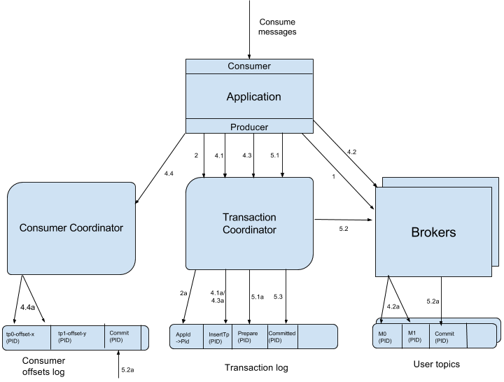

## Kafka通识篇
[TOC]

### Kafka简介

Kafka是由Apache软件基金会开发的一个开源流处理平台，由Scala和Java编写。kafka的诞生，是为了解决linkedin的数据管道问题，起初linkedin采用了ActiveMQ来进行数据交换，大约是在2010年前后，那时的ActiveMQ还远远无法满足linkedin对数据传递系统的要求，经常由于各种缺陷而导致消息阻塞或者服务无法正常访问，为了能够解决这个问题，linkedin决定研发自己的消息传递系统，当时linkedin的首席架构师jay kreps便开始组织团队进行消息传递系统的研发；kafka的架构师jay kreps对于kafka的名称由来是这样讲的，由于jay kreps非常喜欢franz kafka,并且觉得kafka这个名字很酷，因此取了个和消息传递系统完全不相干的名称kafka，该名字并没有特别的含义。这就是Kafka的来源。

Kafka主要包括三个核心功能：

1.发布 & 订阅功能，类似于一个消息系统，读写流式的数据.

2.数据处理功能，编写可扩展的应用程序，用于实时事件响应的场景

3.数据存储功能，将流式数据存储在一个分布式、有副本的、高可用的集群。

### Kafka的使用场景

在官网中，Kafka有以下几个使用场景：

#### 1.消息传递

Kafka 很好地替代了传统的message broker（消息代理）。 Message brokers 可用于各种场合（如将数据生成器与数据处理解耦，缓冲未处理的消息等）。 与大多数消息系统相比，Kafka拥有更好的吞吐量、内置分区、具有复制和容错的功能，这使它成为一个非常理想的大型消息处理应用。

根据我们的经验，通常消息传递使用较低的吞吐量，但可能要求较低的端到端延迟，Kafka提供强大的持久性来满足这一要求。在这方面，Kafka 可以与传统的消息传递系统（ [RabbitMQ](https://www.rabbitmq.com/)）相媲美。

#### 2.跟踪网站活动

Kafka 的初始用例是将用户活动跟踪管道重建为一组实时发布-订阅源。 这意味着网站活动（浏览网页、搜索或其他的用户操作）将被发布到中心topic，其中每个活动类型有一个topic。 这些订阅源提供一系列用例，包括实时处理、实时监视、对加载到Hadoop或离线数据仓库系统的数据进行离线处理和报告等。

#### 3.日志聚合

日志聚合系统通常从服务器收集物理日志文件，并将其置于一个中心系统（可能是文件服务器或HDFS）进行处理。 Kafka 从这些日志文件中提取信息，并将其抽象为一个更加清晰的消息流。 这样可以实现更低的延迟处理且易于支持多个数据源及分布式数据的消耗。 与Scribe或Flume等以日志为中心的系统相比，Kafka具备同样出色的性能、更强的耐用性（因为复制功能）和更低的端到端延迟。

#### 4.应用指标监控

Kafka 通常用于监控数据。这涉及到从分布式应用程序中汇总数据，然后生成可操作的集中数据源。例如应用数据的监控：CPU、内存、磁盘、网络的使用情况。

#### 5.流处理

许多Kafka用户通过管道来处理数据，有多个阶段： 从Kafka topic中消费原始输入数据，然后聚合，修饰或通过其他方式转化为新的topic， 以供进一步消费或处理。 例如，一个推荐新闻文章的处理管道可以从RSS订阅源抓取文章内容并将其发布到“文章”topic; 然后对这个内容进行标准化或者重复的内容， 并将处理完的文章内容发布到新的topic; 最终它会尝试将这些内容推荐给用户。 在Apache Kafka中，[Kafka Streams](https://kafka.apachecn.org/documentation/streams) 可以用来执行上述的数据处理，它是一个轻量但功能强大的流处理库。

### Kafka架构分析

在一套kafka架构中有多个Producer，多个Broker,多个Consumer，每个Producer可以对应多个Topic，每个Consumer只能对应一个ConsumerGroup。整个Kafka架构对应一个ZK集群，通过ZK管理集群配置，选举Leader，以及在consumer group发生变化时进行rebalance。

#### 生产端Producer

　　消息生产者，向Broker发送消息的客户端。生产者可以批量发送消息，以此来提高发送效率。

#### Broker

　　消息中间件处理节点，一个Kafka节点就是一个broker，一个或者多个Broker可以组成一个Kafka集群。生产者和消费者都需要跟这个broker建立一个连接后，才可以实现消息的收发。与RabbitMQ的broker类似。

#### 主题Topic

　　主题，Kafka根据topic对消息进行归类，发布到Kafka集群的每条消息都需要指定一个topic，消费者从该topic中进行消费。一个生产者可以发送到多个topic，一个消费者可以从多个topic中获取数据。类似于RabbitMQ的queue的概念。

#### 分区Partition

　　如果一个topic中的消息太多，会存在并发负载的问题，所有的客户端都是在操作同一个topic，在高并发的场景下性能会大大降低。如何解决呢？于是有了partition的概念。

​	partition物理上的概念，一个topic可以分为多个partition，每个partition内部是有序的。partition的思想就是分片的思想。每个partition都是一个物理目录。跟RabbitMQ不同的是，Partition里面的消息被读取之后不会被删除，同一批消息在一个Partition中顺序写入，以此来保障Kafka高吞吐量。

#### 副本Replication

​	数据存储在partition的磁盘上。如果这台挂了，磁盘损坏了怎么办呢？于是就有了replication。replication副本的本质思想就是冗余。将一份数据分在不同的Broker上进行存储，一旦一个出现了问题，可以切换到另一个Broker上。

如图，将一个topic的partition分别在不同的broker上做副本。其中副本是有leader和follower之分的。生产者和消费者都是针对leader进行操作的。这个leader与follower是由zookeeper进行管理的。

#### 消费端Consumer

　　消息消费者，从Broker读取消息的客户端。是通过消费端的Pull模式拉取消息。

#### 消费组ConsumerGroup

　　如果一个Consumer处理不过来了，我们再增加几个Consumer来帮助它消费处理，这样就组成了一个Consumer Group。每个Consumer属于一个特定的Consumer Group，一条消息可以发送到多个不同的Consumer Group，但是一个Consumer Group中只能有一个Consumer能够消费该消息。

#### Consumer Offset

我们前面提到partition里的消息是顺序写入的，被读取之后不会被删除。如果消费者挂了或者下次读取想要接着上次的位置读取消息，怎么办呢？

我们可以对消息进行编号，用来标识一条唯一的消息。这个标志就叫做offset，中文叫做偏移量。offset记录着下一条将要发送给consumer的消息序号。这个数据是保存在kafka服务端。

#### Segment

我们前文也提到了，partition中的消息数据是顺序写入到一个后缀.log的文件里面。如果一直写，会造成文件越来越大，这时候要检索数据的效率必然会降低，那该如何解决呢？提高性能的唯一方案就是——分片。所以把partition再做一个切分，切分出来的单位就叫做segment。

每个segment都至少有一个数据文件和2个索引文件。其中:

> .log是日志文件
>
> .index 偏移量索引文件
>
> .timeindex 时间戳索引文件

那么什么时候触发文件分片呢？有三种方式：

> 一种是文件大小达到了规定值(默认1G)，
>
> 第二种是根据消息的最大时间戳，和当前系统时间戳的差值达到了规定值(默认168小时)。
>
> 除此之外，如果offset索引文件或者timestamp索引文件达到了一定的大小(默认10M)，也会对segment进行拆分。

### Kafka特性分析

#### 1. kafka高性能设计

kafka的高性能表现在以下几个层面：

1.架构层面，由于对topic做了分区，理论上可以无限横向拓展，从而提高kafka性能

2.存储层面，对日志进行磁盘顺序读写，普通的机械磁盘，顺序访问速率也接近了内存的随机访问速率。

3.批量写入

但是写入性能随着写入的量的增大也会变成随机写入。这时候kafka又提供了批量写入，即生产端批量发送。以此来减少对磁盘的随机读写。由于每一个partition都是一个顺序的磁盘文件，所以也是为什么不建议kafka有大量partition的原因。

4.检索策略

首先是将partition的日志文件进行分块segment，以减少文件检索的复杂度，其次再segment基础上有index的索引设计。index索引使用的是稀疏索引和时间戳索引两种方式来提供更快捷的检索。

5.网络模型

Kafka中存在大量的网络数据持久化到磁盘（Producer到Broker）和磁盘文件通过网络发送（Broker到Consumer）的过程。这一过程的性能直接影响Kafka的整体吞吐量。kafka基于sendfile和transferTo实现零拷贝，整个过程只有两次上下文切换，因此大大提高了性能。

6.异步处理

Kafka基本上是没有阻塞操作的，调用发送方法会立即返回，等待buffer满了以后交给轮询线程，发送和接收消息，复制数据也是都是通过NetworkClient封装的poll方式。

#### 2. Kafka高可用设计

kafka的高可用表现在以下几个层面：

1.架构设计

​	通过多个broker集群模式的设计，在架构上保证服务的高可用性。

2.topic分区设计

​	一个topic的消息进行数据的分区，将不同的分区数据分别在不同的broker上进行数据的复制备份来实现高可用。

3.文件存储机制  

​	通过将数据持久化到磁盘，来保证消息的持久性。数据已经持久化，即便集群发生宕机，服务重新恢复后还可以保证消息的正确处理。

#### 3.Kafka消息丢失问题

kafka在**生产端发送消息** 和 **消费端消费消息** 时都可能会丢失一些消息

生产者在发送消息时，会有一个ack机制，当ack=0 或者 ack=1时，都可能会丢消息。

**acks=0**：表示producer不需要等待任何broker确认收到消息的回复，就可以继续发送下一条消息。性能最高，但是最容易丢消息。大数据统计报表场景，对性能要求很高，对数据丢失不敏感的情况可以用这种。

**acks=1**：至少要等待leader已经成功将数据写入本地log，但是不需要等待所有follower是否成功写入。就可以继续发送下一条消息。这种情况下，如果follower没有成功备份数据，而此时leader又挂掉，则消息会丢失。

**acks=-1或all**：这意味着leader需要等待所有备份(min.insync.replicas配置的备份个数)都成功写入日志，这种策略会保证只要有一个备份存活就不会丢失数据。这是最强的数据保证。

消费端消息丢失，最**主要体现在消费端offset的自动提交**，如果开启了自动提交，万一消费到数据还没处理完，此时你consumer直接宕机了，未处理完的数据 丢失了，下次也消费不到了，因为offset已经提交完毕，下次会从offset出开始消费新消息。解决办法是采用消费端的**手动提交**。

#### 4.消息重复

消息的重复消费在生产端和消费端都可能发生，下面一一讲解：

4.1 生产端消息重复发送

发送消息如果配置了重试机制，比如由于网络波动，生产者未得到broker收到了消息的响应，就会触发重试机制，3秒后再次发送此消息。broker之前已经收到过这个消息，但生产者由于触发了重试机制，就导致了消息的重复发送。

kafka新版本已经在broker中保证了接收消息的幂等性，只需在生产者加上参数 props.put(“enable.idempotence”, true) 即可，默认是false不开启。这样就在broker服务端实现了消息的去重复。

4.2 消费端消息重复消费

对于消费端消息的重复消费问题，如果消费端拉取了一部分数据，消费完毕后，准备执行手动提交（或自动提交）时，消费者挂掉了！此时offset还未提交呢，那么当服务重启时，还是会拉取相同的一批数据重复处理！造成消息重复消费。

无论是生产者还是消费者的重复消息，一般都会在消费端卡死，做**幂等**性处理。

#### 5.顺序消息

顺序消息的概念就是消费者消费到的顺序与生产者发送消息的顺序是一致的。由于Kafka的topic是分区的，所以不能保证其顺序性。但是如果不分区，只有一个消费者。就可以保证在一个分区内有序。但也仅限于消费端消费消息的有序性，无法保证生产者发送消息有序。举个例子：

> 如果发送端配置了重试机制，kafka不会等之前那条消息完全发送成功才去发送下一条消息，这样可能会出现，发送了1，2，3条消息，第一条超时了，后面两条发送成功，再重试发送第1条消息，这时消息在broker端的顺序就是2，3，1了。发送端消息发送已经乱序，到了消费端消费时，自然无法保证顺序！

如果一定要保证生产-消费全链路消息有序，发送端需要同步发送，ack回调不能设置为0。且只能有一个分区，一个消费者进行消费，但这样明显对Kafka的性能有折损。那么如何在多个分区中保证消息顺序和消息处理效率呢？答案是在消费端处理。

消费端在拉消息时使用ConutdownLunch来记录一组有序消息的个数。如果达到个数，说明已拉取到完整的一组有序消息。然后在消费端根据消息序号进行排序，消费端将排好序的消息发到内存队列(可以搞多个)，一个内存队列开启一个线程顺序处理消息。即可最大程度上既保证顺序又保证效率！

#### 6.事务消息

事务具有ACID属性，为什么需要生产者事务消息呢？举个例子，如果需要一组消息要么全部成功，要么一个不能成功，应该怎么做？

生产者事务引入了一个全局唯一的TransactionId，将Procedure获得的PID和TransactionID绑定，这样Procedure重启后就可以获得当前正在进行事务的PID。为了管理Transaction，Kafka引入了新组件Transaction Coordinator。Procedure就是和Transaction Coordinator交互获得TransactionID对应的任务状态。Transaction Coordinator还负责将事务写入kafka内部的一个topic，这样即使整个服务重启，由于事务状态得到保存，正在进行的事务状态可以得到回复，从而继续进行。

可以看出这是最常见的两阶段提交方式完成的分布式事务。

