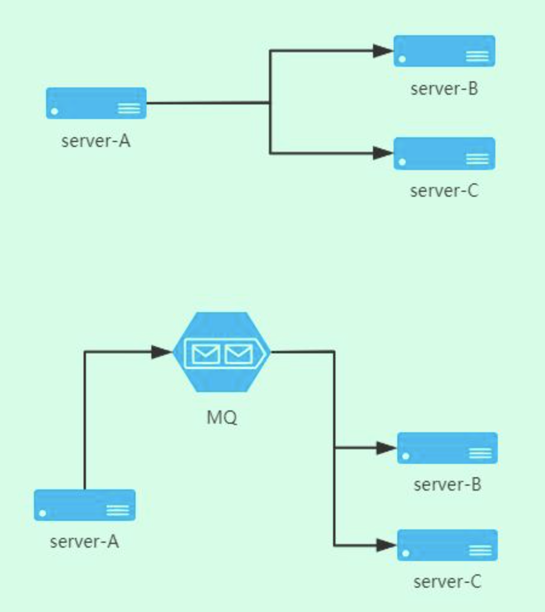
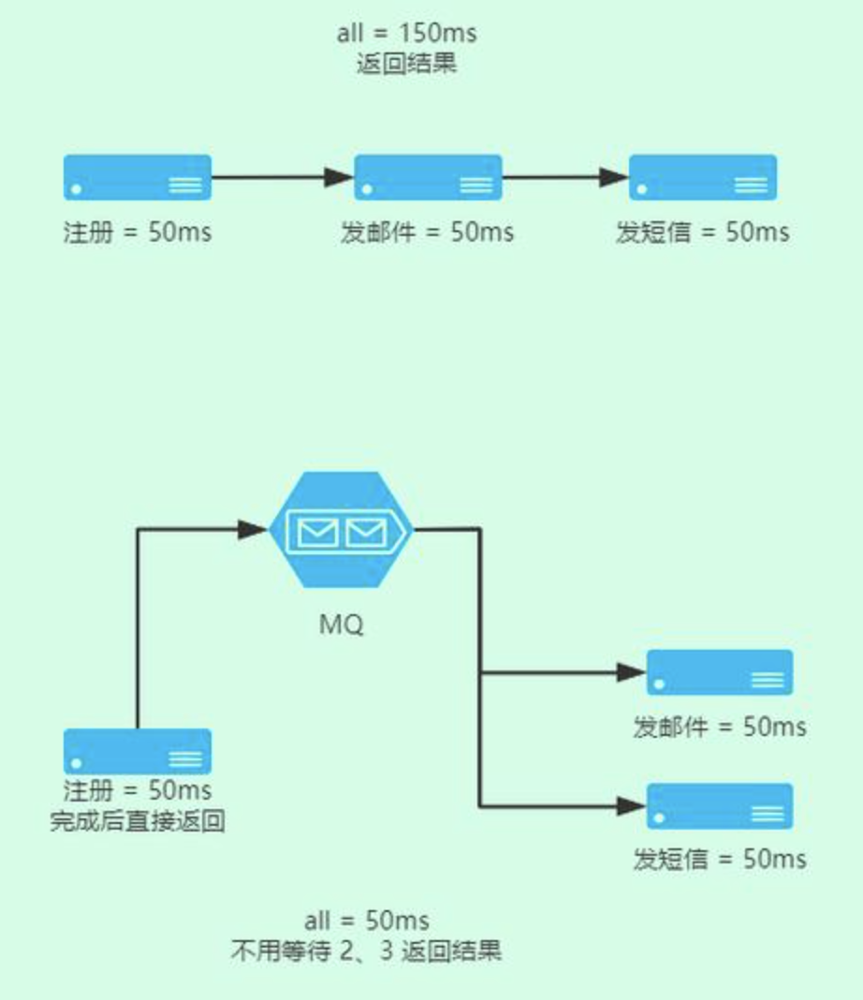
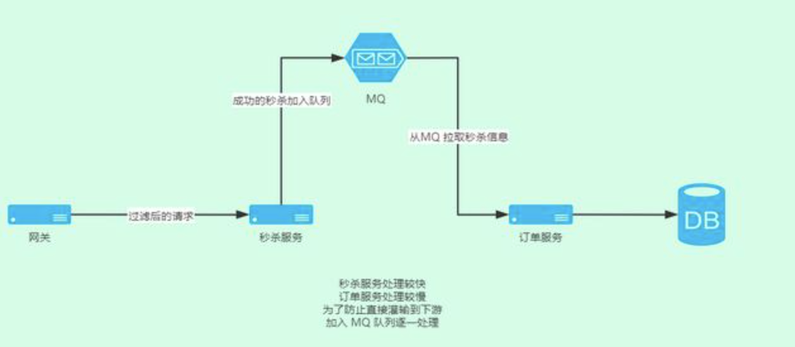
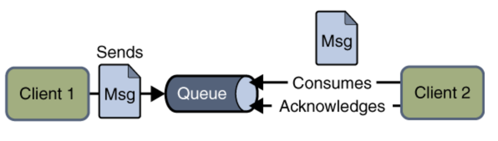
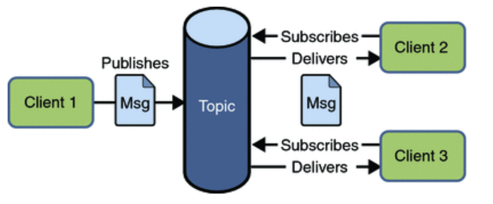
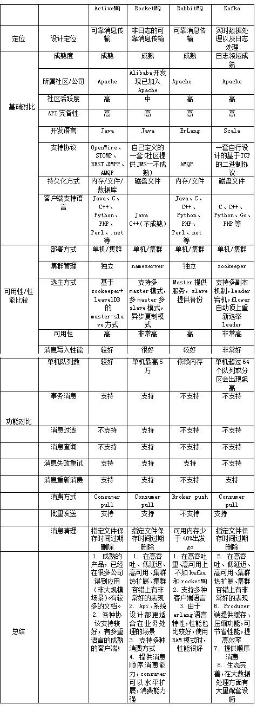

# MQ-基础篇

[TOC]

前文我们讲到了分布式事务可以通过MQ(消息队列)的半消息来实现，除此之外在分布式系统中我们大量的场景会用到MQ，比如微信朋友圈里你点赞一条信息，你的共同点赞的好友就会收到一个消息通知等。那么MQ都有哪些使用场景呢？

### MQ 的作用

#### 1.应用解耦

如图所示，第一种 B和C 都直接依赖 A 服务，那么如果 A 中的接口修改，B和C 都要跟着做修改，耦合度高。 第二种，通过 MQ 来作为中间件收发消息，B和C 只依赖收到的消息而不是具体的接口，这样即使 A 服务修改或者增加其他服务，都只要订阅MQ就行。这样一来，应用是不是更解耦了？

#### 2.异步处理

如图可见，我在 A 服务用户注册完成后，就直接返回了，这个时候 MQ 用来发送异步处理消息，B和C 服务分别处理。A 不用等待 B、C 的返回结果 ，这样用户体验就是只有 50ms 等待时间。而在邮件、短信这个阶段，因为网络延迟原因，用户可以接受一定时间的等待。这样通过异步处理的方式，就提高了系统的吞吐量。

#### 3.流量削锋

将上游处理的较快的任务，加入到队列处理，下游逐一消费队列，直到所有队列消费完成。 假如秒杀服务处理请求数：1000/s，下游订单服务处理请求书：10/s，为了不给下游订单服务造成压力，秒杀后的信息发送到队列，订单服务就可以从容淡定的每秒处理十个，而不是直接塞 1000 个请求也不管人家愿意不愿意，是不是保护了订单服务不至于宕机？

怎么样，到这里是不是感觉到了MQ是不是很有用？那如何实现一个MQ呢？早就有前人为我们抽象出了一些模型，我们只需要照着葫芦画瓢。

### MQ的规范

#### 1. JMS规范

 通常而言提到JMS（Java Message Service）实际上是指JMS API。JMS是由Sun公司早期提出的消息标准，旨在为java应用提供统一的消息操作，包括create、send、receive等。JMS已经成为Java Enterprise Edition的一部分。用于在两个应用程序之间，或分布式系统中发送消息（发送消息的时候，接收者不需要在线），进行异步通信。

JMS通常包含如下一些角色：                  

| 名称                    | 描述                                                         |
| ----------------------- | ------------------------------------------------------------ |
| JMS provider            | 实现了JMS接口的消息中间件，如ActiveMQ                        |
| JMS client              | 生产或者消费消息的应用                                       |
| JMS producer/publisher  | JMS消息生产者                                                |
| JMS consumer/subscriber | JMS消息消费者                                                |
| JMS message             | 消息，在各个JMS client传输的对象；                           |
| JMS queue               | Provider存放等待被消费的消息的地方                           |
| JMS topic               | 一种提供多个订阅者消费消息的一种机制；在MQ中常常被提到，topic模式。 |

 看到这些角色的名称我们很熟悉，没错常见的消息队列，大部分都实现了JMS API，可以担任JMS provider的角色，如ActiveMQ，Redis以及RabbitMQ等。

#### 2. JMS常用模型：

##### 1.P2P（Point to Point）点对点模式

P2P模式包含三个角色：**消息队列(Queue)**，**发送者(Sender)**，**接收者(Receiver)**。

每个消息都被发送到一个特定的队列，接收者从队列中获取消息。队列保留着消息，直到他们被消费或超时。

P2P的特点：

- 每个消息只有一个消费者（Consumer）(即一旦被消费，消息就不再在消息队列中)
- 发送者和接收者之间在时间上没有依赖性，也就是说当发送者发送了消息之后，不管接收者有没有正在运行，它不会影响到消息被发送到队列
- 接收者在成功接收消息之后需向队列应答成功

##### 2.Publish/Subscribe(Pub/Sub) 发布订阅模式

Pub/Sub模式包含三个角色：**主题（Topic）**，**发布者（Publisher）**，**订阅者（Subscriber）**。

多个发布者将消息发送到Topic,系统将这些消息传递给多个订阅者。

Pub/Sub的特点：

- 每个消息可以有多个消费者
- 发布者和订阅者之间有时间上的依赖性。针对某个主题（Topic）的订阅者，它必须创建一个订阅之后，才能消费发布者的消息
- 为了消费消息，订阅者必须保持运行的状态

#### AMQP协议

同样的，涉及到消息中间件也需要对AMQP协议有一定的了解，什么是AMQP协议？

高级消息队列协议 AMQP（advanced message queuing protocol）是一个提供统一消息服务的应用层标准协议，基于此协议的客户端与消息中间件可传递消息，并不受客户端/中间件不同产品，不同开发语言条件的限制。

AMQP中的常见角色：

| 名称         | 描述                                                         |
| ------------ | ------------------------------------------------------------ |
| Broker       | 接收和分发消息的应用，RabbitMQ Server就是Message Broker      |
| Virtual host | AMQP的基本组件划分到一个虚拟的分组中                         |
| Connection   | publisher／consumer和broker之间的TCP连接                     |
| Channel      | Channel作为轻量级的Connection极大减少了操作系统建立TCP connection的开销 |
| Exchange     | message到达broker的交换机，根据分发规则，匹配查询表中的routing key，分发消息到queue中去 |
| Queue        | 消息最终被送到这里等待consumer取走。                         |
| Binding      | exchange和queue之间的虚拟连接，binding中可以包含routing key。 |

AMQP模型的工作流程如下：

1、消息(Message) 被发布者 (publisher) 发送给交换机(exchange)，交换机常常被比喻成邮局或者邮箱，

2、然后交换机将收到的消息根据路由规则分发给绑定的队列(queue)，

3、最后AMQP代理会将消息投递给订阅此队列的消费者，或者消费者按照需求从队列中拉取消息。

如下图所示：

从图上可以看出AMQP协议有一个很核心的思想：

> 生产者和消息者隔离，生产者从不直接将消息发送给队列。生产者通常不知道是否一个消息会被发送到队列中，只是将消息发送到一个交换机。先由 Exchange 来接收，然后 Exchange 按照特定的路由规则转发到 Queue 进行存储。

那么为什么不直接发送到Queue呢？

架构设计的核心就是——分层，通过Exchange层的代理，可以实现非常灵活的Queue的分配。

AMQP提供四种不同类型的Exchange

- Direct：当消息的routing key 与 binding 的 routing key 直接匹配，消息路由到该队列
- Topic:   当消息routing key 与 binding 的 routing key 符合通配符匹配，消息路由到该队列	
- Fanout： 任何消息直接匹配到所有队列上
- Headers:  当消息参数表中的头信息和值都与 binding参数表中匹配的话，消息路由到该队列

关于AMQP的其他组件的详细介绍，我们之后在RabbitMQ中详细描述。

##### 总结一下

|              | JMS                                                          | AMQP                                                         |
| ------------ | ------------------------------------------------------------ | ------------------------------------------------------------ |
| 定义         | Java api                                                     | Wire-protocol                                                |
| 跨语言       | 否                                                           | 是                                                           |
| 跨平台       | 否                                                           | 是                                                           |
| 模型         | Peer-2-Peer、Pub/sub                                         | direct exchange、fanout exchange、topic change、headers exchange |
| 支持消息类型 | 多种消息类型： TextMessage
MapMessage
BytesMessage
StreamMessage
ObjectMessage
Message （只有消息头和属性） | byte[] 当实际应用时，有复杂的消息，可以将消息序列化后发送。 |
| 综合评价     | JMS 定义了JAVA API层面的标准；在java体系中，多个client均可以通过JMS进行交互，不需要应用修改代码，但是其对跨平台的支持较差； | AMQP定义了wire-level层的协议标准；天然具有跨平台、跨语言特性。 |

### 常见MQ对比

那我们常用的MQ有哪些呢？目前使用最多的有RocketMQ、RabbitMQ和Kafka。我们如何去选择使用哪个MQ呢？我们就需要了解MQ之间的区别。如下图所示：

上图取自网络，部分描述可能有误，仅供参考！后文我们会逐步深入分析常用MQ的原理。

