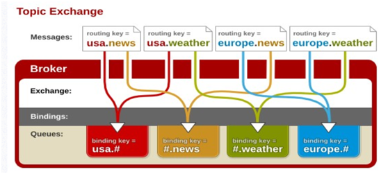

## RabbitMQ 通识篇
[TOC]

RabbitMQ 是一个由 Erlang 语言开发的 AMQP 的开源实现。Erlang是为电话交换机编写的语言，天然对分布式和高并发支持良好。

### RabbitMQ特点

RabbitMQ 最初起源于金融系统，用于在分布式系统中存储转发消息，在易用性、扩展性、高可用性等方面表现非常优异。具体有以下特点：

1. 可靠性（Reliability）

   消息服务的可靠性是MQ的基础，RabbitMQ 使用一些机制来保证可靠性，如持久化、传输确认、发布确认等。

2. 灵活的路由（Flexible Routing）

   在消息进入队列之前，通过 Exchange 来路由消息的。对于典型的路由功能，RabbitMQ 已经提供了一些内置的 Exchange 来实现。针对更复杂的路由功能，可以将多个 Exchange 绑定在一起，也通过插件机制实现自己的 Exchange，下文会有详细的描述。

3. 消息集群（Clustering）

   多个 RabbitMQ 服务器可以组成一个集群，形成一个逻辑 Broker ，从而提高服务的可用性。

4. 高可用（Highly Available Queues）

   队列可以在集群中的机器上进行镜像，使得在部分节点出问题的情况下队列仍然可用，从而提高服务的可用性。

5. 多种协议（Multi-protocol）

   RabbitMQ 支持多种消息队列协议，比如 STOMP、MQTT 等等，应用场景丰富。

6. 多语言客户端（Many Clients）

   RabbitMQ 几乎支持所有常用语言，比如 Java、.NET、Ruby 等等，使用便捷，提升易用性。

7. 管理界面（Management UI）

   RabbitMQ 提供了一个易用的用户界面，使得用户可以监控和管理消息 Broker 的许多方面，从而减小系统的运维成本，提升运维能力。

8. 跟踪机制（Tracing）

    如果消息异常，RabbitMQ 提供了消息跟踪机制，使用者可以找出发生了什么，便于排查问题。

9. 插件机制（Plugin System）

    RabbitMQ 提供了许多插件，来从多方面进行扩展，也可以编写自己的插件。

### RabbitMQ工作模型

AMQP协议上文已经有过简要介绍，其最本质就是如下图所示：

接下来就着重介绍一下各个组件的功能。

#### 1.Broker

我们知道如果要使用RabbitMQ，必须先要安装一个RabbitMQ服务。这个服务就是**Broker**，中文叫做代理，因为MQ服务器帮我们对消息做了存储和转发。一般情况下为了保证服务的高可用，需要多个Broker。

#### 2.Connection

无论生产者或是服务者都需要与Broker建立连接，这个连接就是Connection，它是一个TCP的长连接。

#### 3.Channel

为了节省服务器资源，避免建立太多的长连接，我们需要复用连接。于是就有了Channel的概念。我们可以在保持的TCP长连接里面去创建和释放Channel，从而减少资源的消耗。其中Channel是相互隔离的，不能共享。

#### 4.Queue

连接到Broker以后，就可以收发消息了。在Broker上有一个对象用来存储消息，在RabbitMQ里就是Queue。实际上消息是存储在数据库里的，叫做Mnesia。

Queue是生产者与消费者的纽带，生产者发送的消息到达队列，在队列中存储，消费者从队列中消费消息。

#### 5.Consumer

Consumer是消费者，消费者如何消费消息呢？是主动从Broker上拉取呢？还是被动等Broker推过来呢？RabbitMQ实现了这两种方式。

一种是Pull模式，即每隔一段时间获取一次消息，消息的实时性会有所降低，单同时消费的主动权在消费端，消费端可以根据自身情况什么时候去Pull。

另一种方式Push模式，即生产者发送消息后，Broker就马上推送给消费者，消息保存在客户端，实时性要求高，但是如果消费端消费不过来就会造成消息积压。

我们想象一下如果生产者的消息会发送到多个队列，这时候如果使用push的方式是不是需要多次push，这样无疑增加了生产者的成本。那如何处理呢？于是就又了Exchange。

#### 6.Exchange

通过Exchange不管有多少个队列需要接收消息，我们都只需发送到Exchange就OK了，由它来根据具体的绑定规则分发到具体的队列。那如何绑定具体的队列呢？Exchange提供了不通的绑定方式，具体如下：

##### 1.direct

一个队列与直连交换机绑定，需要指定一个明确的绑定键(binding key)。

生产者发送消息时会携带一个路由键(routing key)

当消息的路由键与某个队列的绑定键完全匹配时，这条消息才会从交换机路由到这个队列上。

直接类型的交换机适用于一些业务用途明确的消息，使用明确的绑定键，就可以创建一个直连类型的交换机。

##### 2.fanout

广播类型的交换机与队列绑定时不需要指定的绑定键。因此生产者发送消息到广播类型的交换机上，也不需要携带路由键。消息到达交换机时，所有与之绑定的队列都会收到相同的消息。

广播类型的消息适用于一些通用的业务消息。比如用户登录了，需要监听用户登录的系统自己监听就OK了。

##### 3.topic

一个队列与Topic类型的交换机绑定时，可以绑定键中使用通配符，其中支持：

> ‘#’ 代表0个或者多个单词
>
> ‘*’ 代表不多于一个单词

具体语法类似于正则匹配，符合匹配规则的则发送到队列，否则不发送。

主题类型的交换机适用于一些根据业务主体或者消息等级过滤消息的场景，比如一个订单状态，有的关注订单下单状态，有的关注订单派单状态，有的关注订单完成状态等。下游的业务系统根据自己关心你的状态设置不通的绑定键去接收消息就OK了。

##### 4.headers

将消息中的headers与该Exchange相关联的所有Binging中的参数进行匹配，如果匹配上了，则发送到该Binding对应的Queue中。性能方面比后者查很多，所以在实际项目中用的很少。

#### 8.vhost

如果我们只搭建了一套RabbitMQ机器，有多个用户想使用。首先在一个Broker上大家规范好自己的Exchange、Queue、RoutingKey也OK。不过这样会很难维护，因为你不知道别人有没有用过这个Queue和RoutingKey。那该怎么办呢？仔搭建一套服务器？显然不行！所以就有了vhost的概念，可以理解为虚拟主机、虚拟空间。其实就是通过vhost将环境做到了隔离。除此之外还可以提高硬件资源的利用率。RabbitMQ有一个默认的vhost，就是“/”。

### RabbitMQ高级特性

#### 1.消息如何保障100%的投递成功？

要保证消息能100%成功，分为这4个步骤：

1. 保障消息的生产者成功发出
2. 保障MQ服务端的成功接收
3. 发送端收到MQ服务端（Broker）确认应答

如果没有受到确认应答怎么办？所以还需要第4步：

  4.完善的消息进行补偿机制

那具体怎么做呢：

##### 方案一：	消息落库，对消息状态进行打标

在发送消息的时候，需要将消息持久化到数据库中，并给这个消息设置一个状态（未发送、发送中、到达）。当消息状态发生了变化，需要对消息做一个变更。针对没有到达的消息做一个轮训操作，重新发送。对轮训次数也需要做一个限制3-5次。确保消息能够成功的发送。

这种方案对数据有两次入库，一次业务数据入库，一次消息入库。这样对数据的入库是一个瓶颈。其实我们只需要对业务进行入库。除此之外，在极端情况下会出现重复发送情况，比如第一次发送后一直没有接收到响应，这时候补偿任务扫描到没有响应重新发送，而这时候收到了第一次发送的响应。

##### 方案二：消息的延迟投递,做二次确认,回调检查

具体内容如下图：

step1:业务消息入库成功后，第一次消息发送。

step2:同样在消息入库成功后，发送第二次消息，这两条消息是同时发送的。第二条消息是延迟检查，可以设置2min、5min 延迟发送。

step3:消费端监听指定队列。

step4:消费端处理完消息后，内部生成新的消息send confirm。投递到MQ Broker。

step5: Callback Service 回调服务监听MQ Broker,如果收到Downstream service发送的消息，则可以确定消息发送成功，执行消息存储到MSG DB。

step6：Check Detail检查监听step2延迟投递的消息。此时两个监听的队列不是同一个，5分钟后，Callback service收到消息，检查MSG DB。如果发现之前的消息已经投递成功，则不需要做其他事情。如果检查发现失败，则Callback 进行补偿，主动发送RPC 通信。通知上游生产端重新发送消息。

这样做的目的：少做了一次DB存储。关注点并不是百分百的投递成功，而是性能。

#### 2.如何保证消息幂等

幂等（idempotent、idempotence）是一个数学与计算机学概念。简单的来说就是**一个操作多次执行产生的结果与一次执行产生的结果一致**。

在高并发的情况下，会有大量的消息到达MQ，消费端需要监听大量的消息。这样的情况下，难免会出现消息的重复投递，网络闪断等等。如果不去做幂等，则会出现消息的重复消费。消费端实现幂等性，就意味着，我们的消息永远不会被消费多次，即使我们收到了多条一样的消息，也只会执行一次。

##### 方案一：唯一ID+指纹码机制

唯一ID + 指纹吗机制，利用数据库主键去重，保证唯一性！

- 好处：实现简单
- 坏处：高并发下有数据库写入的性能瓶颈

##### 方案二：Redis 原子特性实现

最简单使用Redis的自增。

- 好处：实现简单，实现唯一ID
- 坏处：引入新的组件，可靠性方案需要保障

#### 3.如何实现延时消息

比如淘宝里下单之后，15分钟未支付则订单会自动关闭，如何实现呢？这就涉及到延时消息了。我们在下单之后创建一个15分钟的延时消息，到15分钟后再收到一个订单关闭的消息处理订单关闭的逻辑即可。

那么如何实现一个延时消息呢？这里就要提到RabbitMQ里的死信队列(Dead Letter Queue)了。

##### 死信队列

队列有一个消息过期的属性，通过这个设置这个属性，超过了指定时间的消息将会被丢弃。就像过期的密码将会失效一样。这个属性就是：x-messaage-ttl。所有的队列中的消息超时后未被消费都会过期。这样的范围比较大，有没有更细粒度的超时设置呢？所以就有了消息的过期属性，可以真的具体消息设置过期时间。

有了过期时间，过期后要怎么处理呢？直接丢弃？默认情况下是直接丢弃，只是我们再也消费不到。如果我们还想之后消费呢？显然不能丢弃。那怎么处理呢？于是就有了**死信队列**！可以理解为一个容器，将过期的消息都遣送到这个容器中。

队列在创建的时候可以指定一个死信交换机DLX(Dead Letter Exchange)。死信交换机绑定的队列称为死信队列DLQ(Dead Letter Queue)，路由到DLQ之后，我们就可以消费了。其实DLX、DLQ与普通的交换机、队列没有任何区别。

整个过程如下：

通过设置原始队列或者消息的过期时间，然后不对原始队列进行消费，到达时间后原始队列的消息过期后，会发送到死信队列。通过消费死信队列中的消息，来执行响应的处理，这样就达到了数据延时任务的效果。

#### 4.消费端限流

rabbitmq 服务器上有上万条未处理的消息，我们随便打开一个消费者的客户端，会出现下面的情况， 巨量的消息瞬间全部推送过来，但是我们的单个客户端无法同时处理这么多数据，这时候就需要在消费端进行限流操作，以此来保障消费端服务的稳定性。

RabbitMq 提供了一种qos(服务质量保证) 功能， 即在非自动确认消息的前提下，如果一定数目的消息（通过基于consume或者channel设置Qos 的值）未被确认前，不进行消费新的消息。如果是在限流的情况下，一定不能设置自动签收，autoAck = false; 一定要手动的进行消费。如果自动签收，就达不到限流的效果了。

