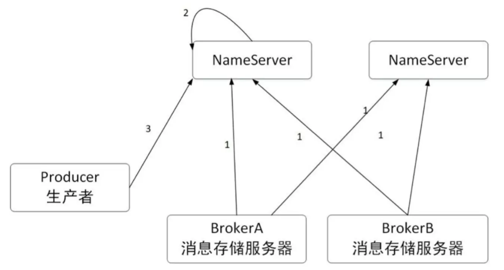
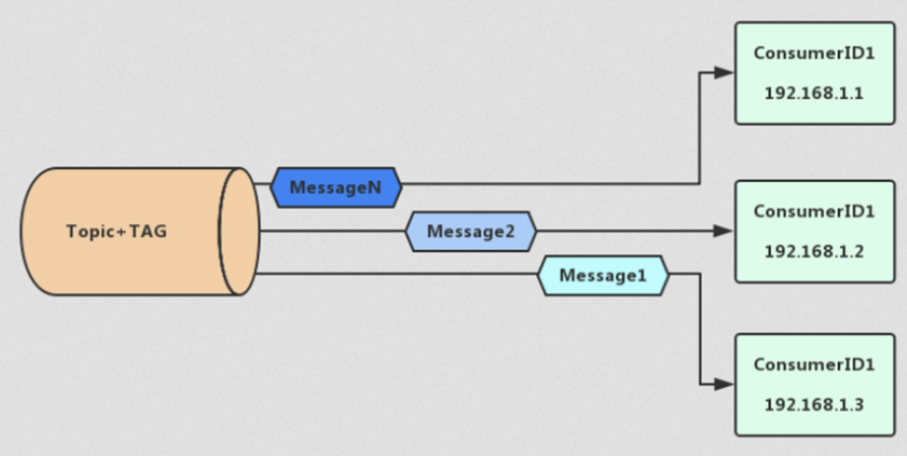
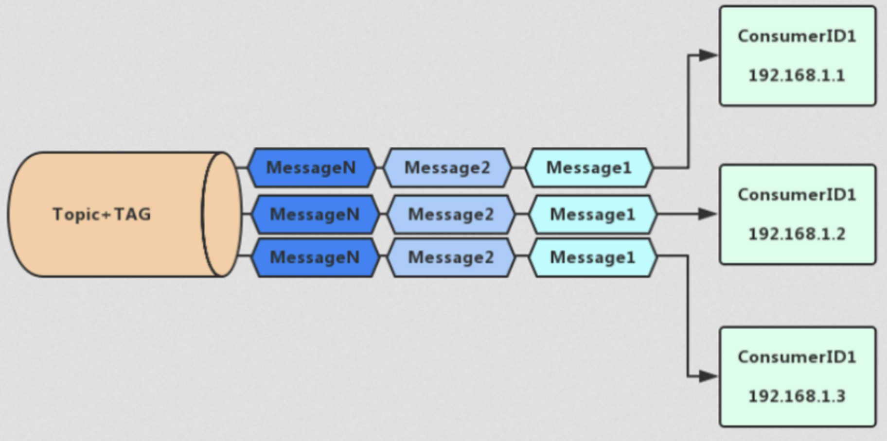
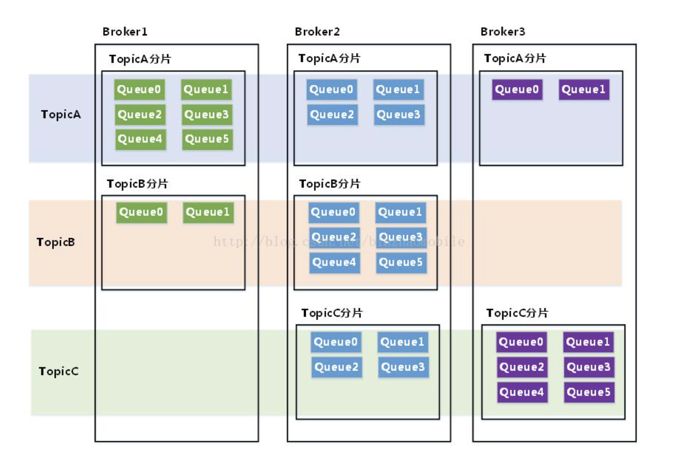
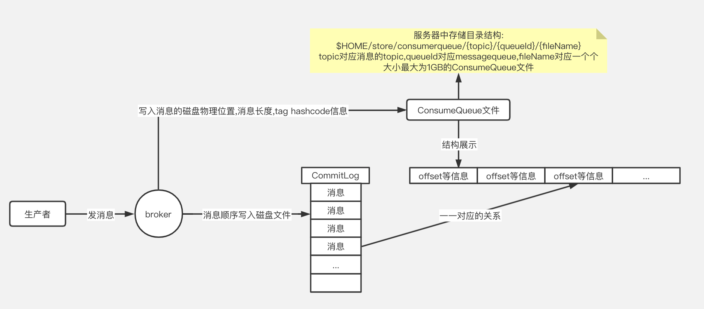
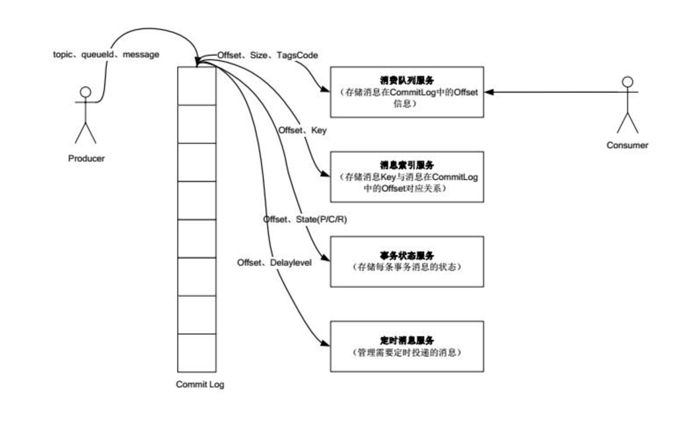
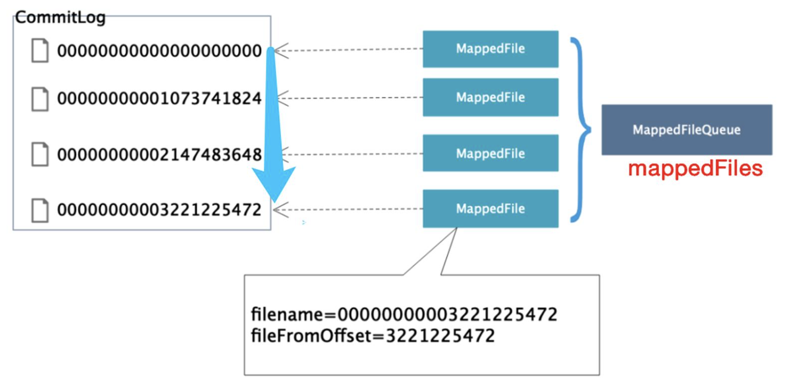
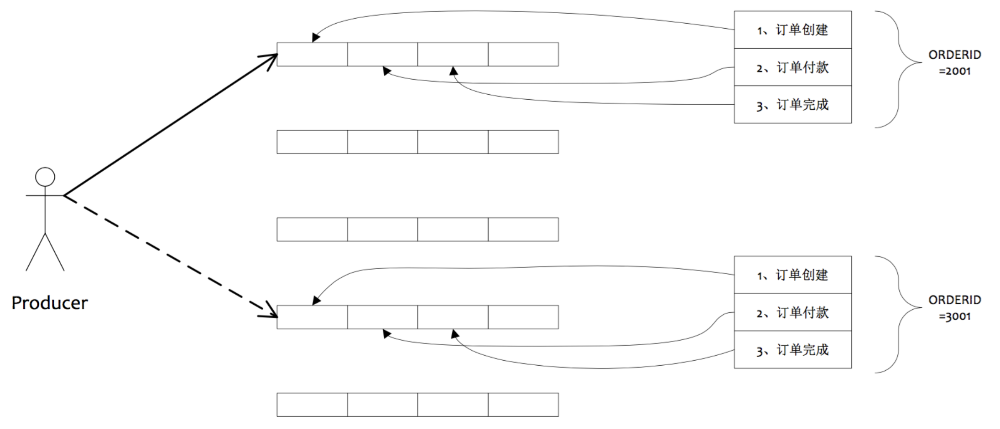
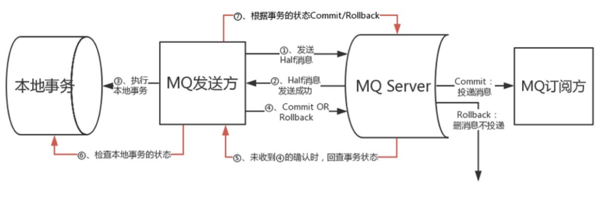
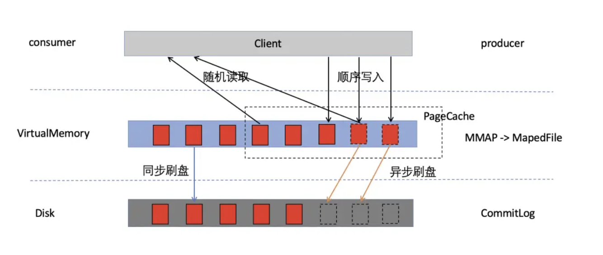

# MQ-基础篇

[TOC]

RocketMQ最初叫MetaQ，就是参考Kafka用java语言写了MetaQ。MetaQ发展到了3.0版本，并抽象出了通用的消息引擎 RocketMQ。 2012年对 RocketMQ 进行了开源 。RocketMQ已经经历了多年双十一的洗礼，在可用性、 可靠性以 及稳定性等方面都有出色的表现。2017年成为Apache基金会的顶级项目。随着阿里云的发展， 阿里消息中间件基于 RocketMQ推出了 Aliware MQ。它是RocketMQ的商业版。

RocketMQ目前支持Java、C、C++、Python、Go四种语言。

### RocketMQ架构分析


从整个架构上，可以看出和Kafka的架构非常类似。无非就是将ZK替换成了NameServer。这里我们简要介绍一下各个组件。


#### 1.Broker

RocketMQ服务叫做Broker。Broker主要负责消息的存储、投递和查询以及服务高可用保证。和Kafka的实现是一样的，为了提高RocketMQ的性能可以做分片存储，为了提高服务的可用性也可以做副本存储，集群部署。

Broker包含了以下几个重要子模块：

1. Remoting Module：整个Broker的实体，负责处理来自clients端的请求。
2. Client Manager：负责管理客户端(Producer/Consumer)和维护Consumer的Topic订阅信息
3. Store Service：提供方便简单的API接口处理消息存储到物理硬盘和查询功能。
4. HA Service：高可用服务，提供Master Broker 和 Slave Broker之间的数据同步功能。
5. Index Service：根据特定的Message key对投递到Broker的消息进行索引服务，以提供消息的快速查询。


#### 2.NameServer

当不同的消息存储在不同的Broker上，生产者和消费者对Broker的选取是一个非常重要的问题。生产者发送消息应该发送到哪个Broker呢？消费者接收消息应该从哪个Broker获取消息呢？如果Broker增加了或减少了，消费者和生产者又如何知道呢？在Kafka中使用Zookeeper做为注册中心，而在RocketMQ中使用的就是自己的NameServer组件。




所有的Broker节点都会注册到NameServer。Producer节点会从那个NameServer查找路由。

**为什么使用NameServer，而不是用Zookeeper呢？**

事实上，在RocketMQ的早期版本，即MetaQ 1.x和MetaQ 2.x阶段，也是依赖Zookeeper的。但MetaQ 3.x（即RocketMQ）却去掉了ZooKeeper依赖，转而采用自己的NameServer。那是因为RocketMQ的架构设计变了，只需要一个轻量级的元数据服务器就足够了，只需要保持最终一致，而不需要Zookeeper这样的强一致性解决方案。这就是CAP原理中，CP和AP的选型的理论基础。

一方面可以提高可用性，另一方面可以简化中间件的依赖，从而减少运维成本，何乐而不为呢？

**那么NameServer是如何工作的呢？**

##### 2.1 路由注册

在Broker节点在启动的时候，轮训NameServer列表，与每个NameServer节点建立长连接，发起注册请求。NameServer内部会维护一个Broker表，用来动态存储Broker的信息。

Broker节点为了证明自己是存活的，会将最新的信息上报给NameServer，然后每隔30秒向NameServer发送心跳包，心跳包中包含 BrokerId、Broker地址、Broker名称、Broker所属集群名称等等，然后NameServer接收到心跳包后，会更新时间戳，记录这个Broker的最新存活时间。

NameServer在处理心跳包的时候，存在多个Broker同时操作一张Broker表，为了防止并发修改Broker表导致不安全，路由注册操作引入了ReadWriteLock读写锁，这个设计亮点允许多个消息生产者并发读，保证了消息发送时的高并发，但是同一时刻NameServer只能处理一个Broker心跳包，多个心跳包串行处理。这也是读写锁的经典使用场景，即读多写少。 

##### 2.2 路由剔除

如果Broker关闭，则会与NameServer断开长连接，Netty的通道关闭监听器会监听到连接断开事件，然后会将这个Broker信息剔除掉。异常情况下NameServer中有一个定时任务，每隔10秒扫描一下Broker表，如果某个Broker的心跳包最新时间戳距离当前时间超多120秒，也会判定Broker失效并将其移除。

##### 2.3 路由发现

路由发现是客户端的行为，这里的客户端主要说的是生产者和消费者。具体来说：

- 对于生产者，可以发送消息到多个Topic，因此一般是在发送第一条消息时，才会根据Topic获取从NameServer获取路由信息。
- 对于消费者，订阅的Topic一般是固定的，所在在启动时就会拉取。

那么如果在过程中路由有变更了怎么办呢？如：Broker集群新增了节点，节点宕机或者Queue的数量发生了变化。细心的读者注意到，前面讲解NameServer在路由注册或者路由剔除过程中，并不会主动推送会客户端的，这意味着，需要由客户端拉取主题的最新路由信息。RocketMQ客户端提供了定时拉取Topic最新路由信息的机制。

如果说一个Broker挂了，在这个时候，客户端缓存旧的路由信息，发送消息和接收小修都会失败。那这该如何处理呢？所以就有了消息重试机制。

##### 生产者重试机制

在RocketMQ中，有三种消息类型：普通消息、普通有序消息、严格有序消息。

- 普通消息：消息是无序的，任意发送发送哪一个队列都可以。
- 普通有序消息：同一类消息(例如某个用户的消息)总是发送到同一个队列，在异常情况下，也可以发送到其他队列。
- 严格有序消息：消息必须被发送到同一个队列，即使在异常情况下，也不允许发送到其他队列。

接下来就一起来看下每种消息类型的消息如何重试。

###### 普通消息重试

对于普通消息，消息发送默认采用round-robin机制来选择发送到哪一个队列，如果发送失败，默认重试2次。由于之前发送失败的Queue必然位于某个Broker上，在重试过程中，这个失败的Broker上的Queue都不会选择。这里主要是考虑，既然发送到这个Broker上某个Queue失败了，那么发送到这个Broker上的其他Queue失败的可能性依然很大,所以干脆直接选择其他Broker。

这时候如果有另一个消息，发送到另一个broker上也失败了。这时候轮训到这个可用的broker再发送消息，肯定也会失败。这种尝试在某些程度上是没有意义的，那如何规避呢？所以就有了MQ错误策略：

- 失败隔离：即发送消息到某个broker失败之后，将其进行隔离，优先从其他正常的broker中进行选择
- 延迟隔离：优先发送消息到延迟比较小的broker

这样通过重试就能保证消息普通消息发送的100%送达。

**那么对于普通有序消息，和严格有序消息，rocketmq为什么默认不进行重试呢？**

答案很简单，这些消息只能发送某个特定的Broker上的某个特定的Queue中，如果发送失败，重试失败的可能依然很大，所以默认不进行重试。那该如何处理呢？答案是：用户手动重试！

###### 普通有序消息失败情况下的短暂无序

为了保证消息的有序送达，业务需要实现MessageQueueSelector接口。这个接口到的select方法接收一个List<MessageQueue>类型参数，也就是当前Topic下的队列集合，生产者客户端在发送消息之前会回调这个接口。为了保证消息的有序。可以采取一些策略，例如：发送的是一个用户的消息，先计算pos=user_id%mqs.size()，之后mqs.get(pos)获得对应的队列。因此在正常情况下，一个用户的消息总是有序的。

但是如果路由信息刷新了，比如Broker宕机了，或者又恢复了等情况，这个Broker上队列就会从List集合中移除。此时按照相同的方式选择队列，就会选择到其他队列上，造成了无序。但是这个无序是很短暂的，因为之后同一个用户的信息，都会发送到同一个新的队列上。

###### 严格有序消息的重试

对于严格有序消息，由于直接指定了一个MessageQueue。如果这个MessageQueue所在的Broker宕机了，那么之后的重试必然都失败，只有无限重试，直到成功，在某些程度上没有意义的。因此非必要的情况下，是不建议使用严格有序消息的。 

#### 3. 生产者Producer

生产者用于发送消息，会定时从NameServer上拉取路由信息，然后根据路由信息与指定的Broker建立TCP长连接，从而将消息发送到Broker中。支持批量发送。

#### 4. 消费者Consumer

消息的消费者，通过NameServer集群获取Topic的路由信息，连接到对应的Broker上消费消息。逻辑一致的Consumer可以组成Consumer Group。与Kafka是一样的。

消费者有两种消费方式：一种是集群消费(轮训方式)，一种是广播消费(全部消费)。

**集群消费：**一条消息只要被关注该topic和tag的集群只消费一次就行（如果有多个集群(每个集群（group）里有多台机器)都关注了这个topic和tag，则每个集群都挑随机一个机器消费一次）。



**广播消费**：MQ 会将每条消息推送给集群内所有订阅该topic和tag的客户端，保证消息至少被每台机器消费一次（若有多个集群都关注这个topic和tag，则每个集群的每个机器都消费一次）。



从消费模型来看，RocketMQ支持pull和push两种模式。

pull的实现方式也有两种，一种是普通的轮训polling，不管服务端数据有无更新客户端每隔定长时间请求拉取一次数据。这种方式会造成大量的资源浪费，且会有一定时间的延时。

另外一种方式是长轮训，如果客户端发起Long Polling，如果服务端没有相关数据，就hold住请求，直到服务端有数据产生了，或者设置一个超时时长，超时后才会返回。返回后客户端又会发起下一次的Long Polling。长轮训解决了资源浪费以及实时性的问题。但是服务器在挂起的时候比较消耗内存。

push模式，是在Broker推送给Consumer。RocketMQ的push模式实际上是基于pull模式实现的，只不过在pull模式上封装了一层。

#### 5. Topic

Topic将消息按照主题做划分，跟Kafka不同的是在RocketMQ中，Topic只是一个逻辑概念，消息不是按照Topic存储的。实际上在每个Broker上以queue的形式保存，也就是说每个Topic在Broker上会划分成几个逻辑队列，每个逻辑队列保存一部分消息数据，但是保存的消息数据实际上不是真正的消息数据，而是指向commit log的消息索引。



每个broker上的角色是等同的，没有主从之分，也就是说每个broker上面的queue保存了该topic下一部分消息，注意是一部分而不是全量消息。

#### 6. Message Queue

为了在生产者与消费者之间进行数据传递，在RocketMQ中虚拟出了一个Message Queue的概念。MQ是无限长的数组，一条消息进来下标就会涨1，下标就是 offset，消息在某个 MessageQueue 里的位置，通过 offset 的值可以定位到这条消息，或者指示 Consumer 从这条消息开始向后处理。

生产者在将消息发送到topic的时候，也会记录到一个Message Queue。

```java
public interface MessageQueueSelector {
    MessageQueue select(final List<MessageQueue> mqs, final Message msg, final Object arg);
}
 
public class MessageQueue {
	private String topic;
	private String brokerName;
	private int queueId;
}
```

消费的时候，Consumer会从Message上拉取消息。

#### 7. Consumer Queue

由于RocketMQ是基于主题topic的订阅模式，消息消费是针对主题进行的。Consumer即可根据ConsumeQueue来查找待消费的消息。在kafka中是通过consummer的offset来记录消费记录的。

其中，ConsumeQueue（逻辑消费队列）作为消费消息的索引，保存了指定Topic下的队列消息在CommitLog中的起始物理偏移量offset，消息大小size和消息Tag的HashCode值。它是CommitLog的一个映射。



1. 通过broker保存的offset（offsetTable.offset json文件中保存的ConsumerQueue的下标）可以在ConsumeQueue中获取消息，从而快速的定位到commitLog的消息位置
2. 过滤tag是也是通过遍历ConsumeQueue来实现的（先比较hash(tag)符合条件的再到consumer比较tag原文）
3. 并且ConsumeQueue还能保存于操作系统的PageCache进行缓存提升检索性能

#### 8. CommitLog

我们知道Kafka中是每个partition中有个.log文件用来存储message数据，在RocketMQ中也有个类似的文件：commitlog。



每个文件的默认1G =1024 * 1024 * 1024，commitlog 的文件名 fileName，名字长度为20位，左边补零，剩余为起始偏移量；比如 00000000000000000000 代表了第一个文件，起始偏移量为0，文件大小为1G=1 073 741 824 Byte；当这个文件满了，第二个文件名字为00000000001073741824，起始偏移量为1073741824，消息存储的时候会顺序写入文件，当文件满了则写入下一个文件。



由于commitlog是顺序写，所以写入性能非常高。且避免了Kafka多Partition随机写的问题。设计的很是巧妙！

**总结一下：**

Broker 里面一个 Topic 里面有多个 MesssageQueue，每个 MessageQueue 对应一个 ConsumeQueue，ConsumeQueue 里面记录的是消息在 CommitLog 里面的物理存储地址。

### RocketMQ高级特性

#### 1、顺序消息

RocketMQ可以严格的保证消息有序。但这个顺序，不是全局顺序，只是分区（queue）顺序。要全局顺序只能一个分区。非顺序的原因，是因为发送消息的时候，消息发送默认是会采用轮询的方式发送到不通的queue（分区）。而消费端消费的时候，是会分配到多个queue的，多个queue是同时拉取提交消费。如果是轮询的生产者，加上同时的多线程读取，自然不能保证顺序。

如果把一个分区顺序投放在同一个分区里面，RocketMQ的确是能保证FIFO的。

那么要做到顺序消息，应该怎么实现呢——把消息确保投递到同一条queue。

如何实现呢，就是通过上文提到的MessageQueue；

```java
producer.send(msg, new MessageQueueSelector() {
                @Override
                public MessageQueue select(List<MessageQueue> mqs, Message msg, Object arg) {
                    Long id = (Long) arg;  //根据订单id选择发送queue
                    long index = id % mqs.size();
                    return mqs.get((int) index);
                }
            }, orderList.get(i).getOrderId());//订单id
```

发送时有序，接收（消费）时也要有序，才能保证顺序消费。MessageListenerOrderly能够保证顺序消费。

```java
new MessageListenerOrderly() {
 
            Random random = new Random();
 
            @Override
            public ConsumeOrderlyStatus consumeMessage(List<MessageExt> msgs, ConsumeOrderlyContext context) {
                context.setAutoCommit(true);
                System.out.print(Thread.currentThread().getName() + " Receive New Messages: " );
                for (MessageExt msg: msgs) {
                    System.out.println(msg + ", content:" + new String(msg.getBody()));
                }
                try {
                    //模拟业务逻辑处理中...
                    TimeUnit.SECONDS.sleep(random.nextInt(10));
                } catch (Exception e) {
                    e.printStackTrace();
                }
                return ConsumeOrderlyStatus.SUCCESS;
            }
        }

```


rocketmq的顺序消息需要满足2点：

1.Producer端保证发送消息有序，且发送到同一个队列。
2.consumer端保证消费同一个队列。



#### 2、事务消息

RocketMQ事务消息解决的问题：解决本地事务执行与消息发送的原子性问题。这里界限一定要明白，是确保MQ生产端正确无误地将消息发送出来，没有多发，也不会漏发。但至于发送后消费端有没有正常的消费掉（如上面提及的第三种情况，钱正常扣了，消息也发了，但下游消费出问题导致积分不对），这种异常场景将由MQ消息消费失败重试机制来保证，不在此次的讨论范围内。

RocketMQ事务消息通过异步确保方式，保证事务的最终一致性。设计流程上借鉴两阶段提交理论，流程图如下：



1. 应用模块遇到要发送事务消息的场景时，先发送prepare消息给MQ。
2. prepare消息发送成功后，应用模块执行数据库事务（本地事务）。
3. 根据数据库事务执行的结果，再返回Commit或Rollback给MQ。
4. 如果是Commit，MQ把消息下发给Consumer端，如果是Rollback，直接删掉prepare消息。
5. 第3步的执行结果如果没响应，或是超时的，启动定时任务回查事务状态（最多重试15次，超过了默认丢弃此消息），处理结果同第4步。
6. MQ消费的成功机制由MQ自己保证。

事务消息不支持定时和批量，为了避免一个消息被多次检查，导致半数队列消息堆积，RocketMQ限制了单个消息的默认检查次数为15次，通过修改broker配置文件中的`transactionCheckMax`参数进行调整。

事务消息有一下状态：

> TransactionStatus.CommitTransaction
> 提交事务，允许消费者消费这个消息
> TransactionStatus. RollbackTransaction
> 回滚事务，消息将会被删除或不再允许消费
> Transaction Status.Unknown
> 中间状态，MQ需要重新检查来确定状态

#### 3、延时消息

延迟消息是指生产者发送消息后，不能立刻被消费者消费，需要等待指定的时间后才可以被消费。比如用户下了一个订单之后，需要在指定时间内(例如30分钟)进行支付，在到期之前可以发送一个消息提醒用户进行支付。	

我们知道RocketMQ实现了延迟队列，仅支持18个固定的时间段，默认的配置是messageDelayLevel=1s 5s 10s 30s 1m 2m 3m 4m 5m 6m 7m 8m 9m 10m 20m 30m 1h 2h，分别代表延迟level1-level18。它是怎么实现的呢？

> 1 所有的延迟消息到达broker后，会存放到SCHEDULE_TOPIC_XXX的topic下(这个topic比较特殊，对客户端是不可见的，包括使用rocketmq-console，也查不到这个topic)
>
> 2 SCHEDULE_TOPIC_XXX这个topic下存在18个队列，每个队列中存放的消息都是同一个延迟级别消息
>
> 3 broker端启动了一个timer和timerTask的任务，定时从此topic下拉取数据，如果延迟时间到了，就会把此消息发送到指定的topic下，完成延迟消息。

如果我们要实现level1-level18之外任意时间的延时任务呢？其实道理是一样的，自定义一个topic，topic里存在任意一个时间长度的队列，通过timerTask去拉取数据。

#### 4.消息可靠性分析

##### 4.1 Producer消息可靠性

producer端防止消息发送失败，可以采用同步阻塞式的发送（也就是发送同步消息），同步的检查Brocker返回的状态是否持久化成功，发送超时或者失败，则会默认重试2次，rocker选择了确保消息一定发送成功，但有可能发生重复投递。

如果是异步发送消息，会有一个回调接口，当brocker存储成功或者失败的时候，也可以在这里根据返回状态来决定是否需要重试（当然这个是需要我们自己来实现的）

##### 4.2 Broker消息可靠性

RocketMQ一般都是先把消息写到PageCache中，然后再持久化到磁盘上，数据从pagecache刷新到磁盘有两种方式，同步和异步。

**同步刷盘方式**：消息写入内存的 PageCache后，立刻通知刷盘线程刷盘，然后等待刷盘完成，刷盘线程执行完成后唤醒等待的线程，返回消息写成功的状态。这种方式可以保证数据绝对安全，但是吞吐量不大。

**异步刷盘方式（默认）**：消息写入到内存的 PageCache中，就立刻给客户端返回写操作成功，当 PageCache中的消息积累到一定的量时，触发一次写操作，将 PageCache中的消息写入到磁盘中。这种方式吞吐量大，性能高，但是 PageCache中的数据可能丢失，不能保证数据绝对的安全。



##### 4.3 Consmer端消息可靠性

Cousmer端默认是消息之后自动返回消费成功确认ack,但是这时如果我们的程序执行失败了，数据不就丢失了吗？所以我们可以将自动提交（AutoCommit）消费响应，设置为在代码中手动提交，只有真正消费成功之后再通知brocker消费成功，然后更新消费唯一offset或者删除brocker中的消息。从而保证高Consumer端的消息的可靠性。

###### 消息重试

如果Consumer处理失败了会怎么办呢？会按照不同的messageDelayLevel时间进行再次消费，时间分级从秒到小时，最长时间为2个小时后再次进行消费重试，如果消费满16次之后还是未能消费成功，则不再重试，会将消息发送到死信队列，从而保证消息存储的可靠性。

###### 死信队列

进入死信队列之后怎么办呢？未能成功消费的消息，消息队列并不会立刻将消息丢弃，而是将消息发送到死信队列，其名称是在原队列名称前加%DLQ%，如果消息最终进入了死信队列，则可以通过RocketMQ提供的相关接口从死信队列获取到相应的消息，保证了消息消费的可靠性。

###### 消息回溯

如果消息已经消费成功，但是消费业务逻辑有问题，现在需要重新消费我们如何处理呢？这就需要用到消息回溯。

Broker存储端在向Consumer消费端投递成功消息后，消息仍然需要保留。重新消费一般是按照时间维度，例如由于Consumer系统故障，恢复后需要重新消费1小时前的数据。RocketMQ Broker提供了一种机制，可以按照时间维度来回退消费进度，这样就可以保证只要发送成功的消息，只要消息没有过期，消息始终是可以消费到的。


