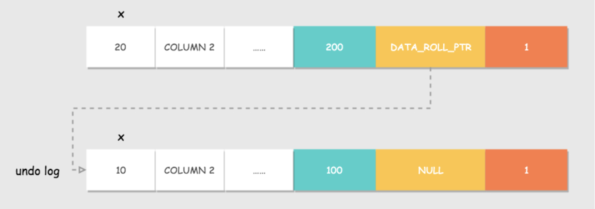
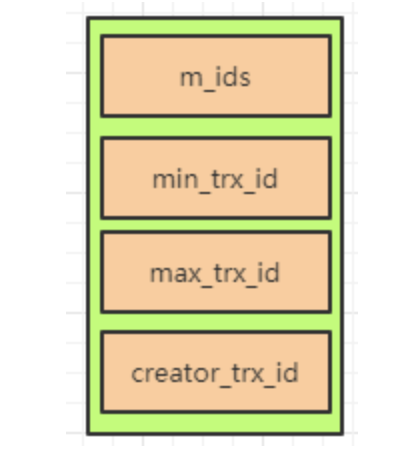
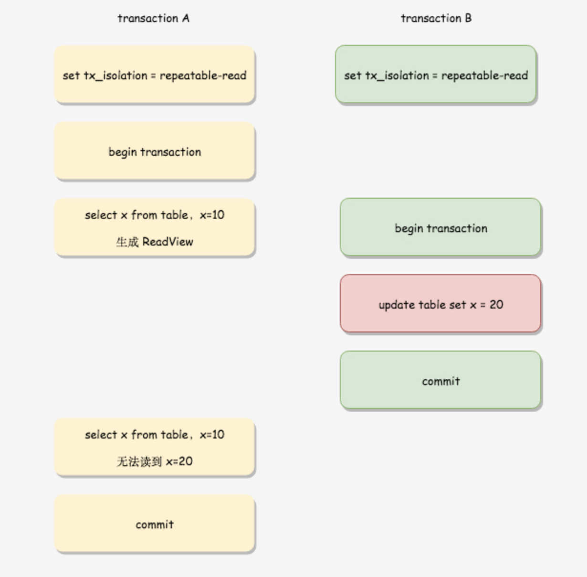
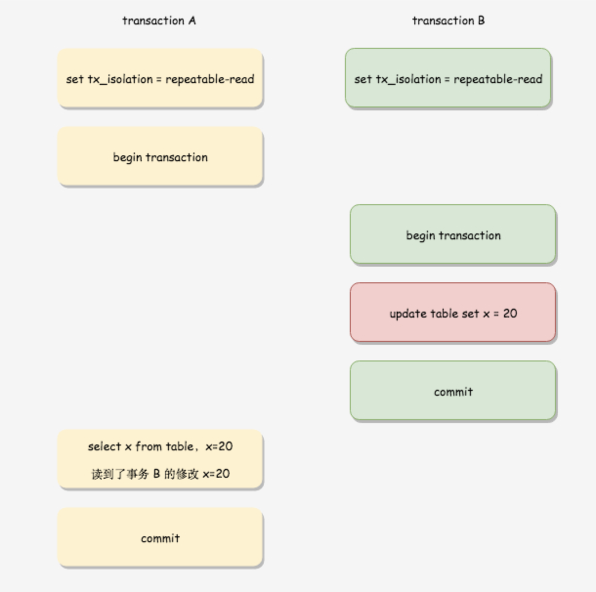
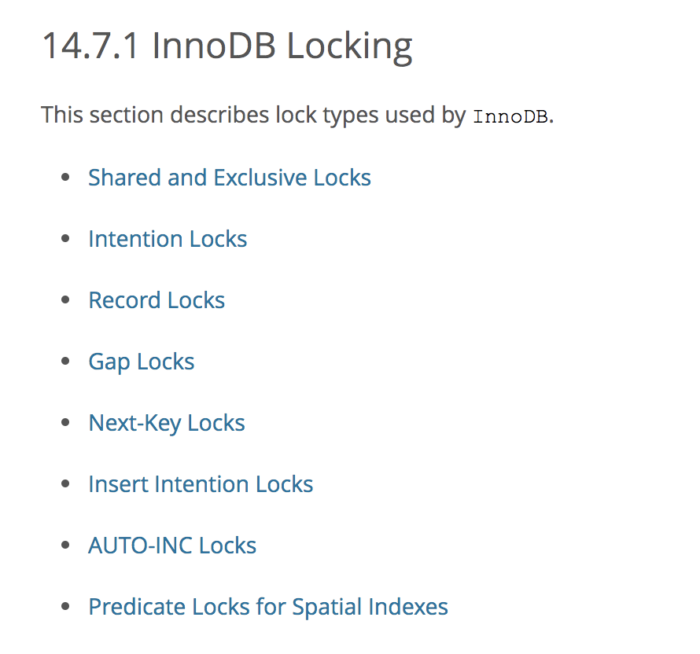
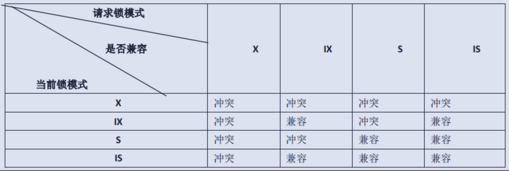
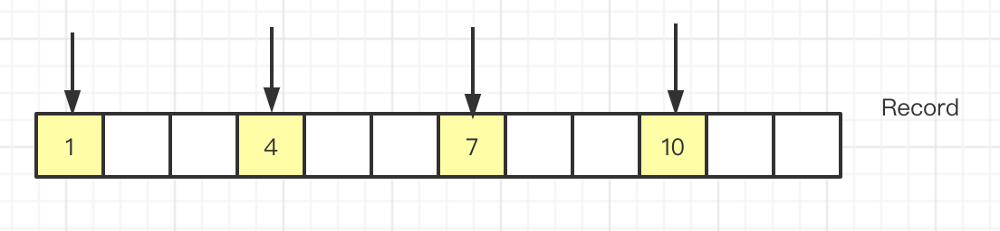
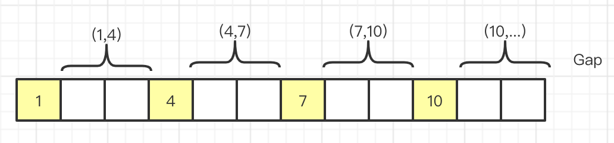
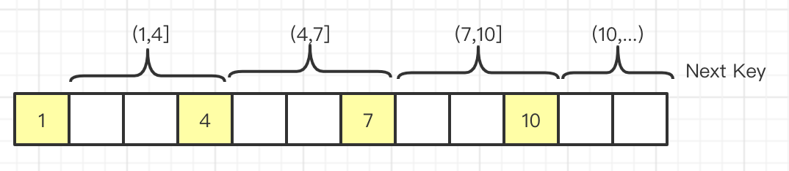

# MySQL事务通识篇

[TOC]

前一篇我们介绍，InnoDB的存储架构，也介绍了更新流程。既然数据有更新，我们如何保证事务呢？今天我们就来分析一下InnoDB的事务是如何实现的。

### 1、什么是事务？

#### 1.1 定义

维基百科的定义：事务是数据库管理系统执行过程中的一个逻辑单位，由一个有限的数据库操作序列构成。

这里面包含两个关键点，第一个是逻辑单位，意味着是最小的操作单元，是不可再分的；第二个是它可能包含一个或者一系列的DML语句，包括insert、delete、update等。

#### 1.2 举例

某人要在商店使用银行卡购买100元的东西，当中至少包括两个操作：

1. 该人账户减少100元
2. 商店账户增加100元

数据库管理系统就是要确保以上两个操作（整个“事务”）都能完成，或一起取消；否则就会出现100元平白消失或出现的情况。

在现实世界中大家可能无感知，但是在计算机世界里失败的风险还是非常高的。比如操作错误、比如磁盘损坏、比如系统异常。为了避免这种情况的发生，需要实现将数据库状态恢复到一致状态的功能，这就是事务的产生的原因。


#### 1.3 事务的特性

数据库事务拥有以下四个特性，习惯上被称之为**ACID特性**。

- **原子性（Atomicity）**：事务作为一个整体被执行，包含在其中的对数据库的操作要么全部被执行，要么都不执行；不能出现上文例子中的，一个转钱了，一个没有收到的情况。
- **一致性（Consistency）**：事务应确保数据库的状态从一个一致状态转变为另一个一致状态，*一致状态*的含义是数据库中的数据应满足完整性约束；比如不能出现转了100，对方收到了50的情况。
- **隔离性（Isolation）**：多个事务并发执行时，一个事务的执行不应影响其他事务的执行；比如上面的例子中还有第三个人也给商店转了100，商店同时收到两个100后，还是100。
- **持久性（Durability）**：已被提交的事务对数据库的修改应该永久保存在数据库中；比如上面的例子中转账完成后系统意外宕机了，恢复后发现都没有转。

#### 1.4 哪些存储引擎支持事务

从上文我们得知事务是包含4个特性的，并不是所有的数据库或者所有的存储引擎都支持事务，它是作为一个特性存在的。在MySQL里只有InnoDB支持事务，也是它在5.7之后成为默认的存储引擎的一个重要原因。我们下文会慢慢介绍。

### 2.InnoDB如何实现事务？

事务的4大特性，InnoDB是如何实现的呢？接下来咱们一起来分析一下。

原子性：在InnoDB中是通过undo log来实现的，它记录了数据修改之前的值，一旦发生异常，它就可以用undo log来实现回滚操作；

一致性：通过数据库自身的一致性约束：比如主键必须唯一，字段长度符合要求，字段类型符合要求，字段值符合要求等；通过用户自定义一致性约束：比如用户减少的金额，必须等于商家增加的金额。

持久性：在InnoDB的存储架构中，大家还记得redo log和double wite buffer吗？我们操作数据库的时候，会先写到内存的buffer pool里面，同时记录redo log，如果在刷盘之前出现了异常，在重启后可以读取到redo log的内容，写入到磁盘，这样就保障了数据的持久性。但是如果恢复之前数据页本身有破坏呢？所以又有了double wite buffer来进行双写缓冲，以此来保障数据页本身没有被破坏。参考：[SQL92标准](https://www.toutiao.com/i6942140065174929933)

隔离性：所谓的隔离，是指在并发的情况下做到隔离，如何做到隔离呢，我们下文慢慢介绍。

### 3.事务并发问题

并发的时候，往往情况比较复杂。我们想象一下，有两个事务A和B，同时并发。

#### 3.1 脏读

1.事务B更新年龄18

2.事务A读取数据库信息，年龄是18

3.事务B回滚


这时候如果事务A读取的了18，这种情况下合理吗？

这种情况就叫做**脏读**：读取到其他事务未提交的数据。

#### 3.2 不可重复读

1.事务A先读取数据，年龄为16

2.事务B跟新数据，年龄为18

3.事务B提交

4.事务A再读取数据，年龄为18


事务A连续两次读取的数据竟然不一样，这种情况你能接受吗？

这种情况就叫做**不可重复读**：在同一个事务中两次读取的数据不一致。

#### 3.3 幻读

1.事务A读取年龄大于15的数据，发现有1条记录

2.事务B插入一条记录，并提交

3.事务A再读取年龄大于15的数据，发现有2条记录


事务A就好像出现了幻觉一样，这种情况合理吗？

这就叫做**幻读**：在同一个事务中两次读取到的数据量不一致。一般幻读出现在范围查询。

很多人容易搞混不可重复读和幻读，确实这两者有些相似。但**不可重复读重点在于update和delete，而幻读的重点在于insert**。

天呢，这么多问题该如何取舍呢？到底怎么算合理的呢？

#### 3.4事务隔离级别

于是就有一些好事之人，定了一些标准去解决这些问题，其中 [SQL92标准](http://www.contrib.andrew.cmu.edu/~shadow/sql/sql1992.txt)就定义了面对这些问题，如果抉择的标准：


里面有四个隔离级别，上面的P1、P2、P3代表的是上问介绍的并发的三个问题。Possib代表可能，Not Possible代表不可能。

翻译一下：


##### 1.未提交读

未提交读（READ UNCOMMITTED）是最低的隔离级别。允许“脏读”（dirty reads），事务可以看到其他事务“尚未提交”的修改。

##### 2.提交读

在提交读（READ COMMITTED）级别中，一个事务只能读取到其他事务已提交的数据，不能读取到其他事务未提交的数据，它解决了脏读的问题，但是还是会出现不可重复读和幻读的问题。

##### 3.可重复读

在可重复读（REPEATABLE READS）隔离级别中，也就是说在同一个事务里多次读取同样的数据结果是一样的，但是范围查询的幻读还是有可能出现的。

##### 4.可串行化

可串行化（SERIALIZABLE）是最高的隔离级别。在这个过程中，所有的事物都是串行的，这就和并发没有关系了，这就不存在任何并发的问题了。所以解决了所有问题。

事务的隔离级别越高，并发读越低。

#### InnoDB对隔离级别的支持

对于可重复读级别，脏读，不可重复读，幻读在innodb引擎不会出现


InnoDB支持四种隔离级别，InnoDB的默认隔离级别是可重复读，且可重复读InnoDb可以避免幻读。这样就避免了并发的问题，又比串行化提升了并发度，所以InnoDB选择的默认隔离级别就是可重复读。

至于InnoDb在可重复读的级别下为什么不会产生幻读，我们下文慢慢分析！

### 4.InnoDB 隔离的实现原理

我们惯常的解决并发问题，如何解决呢？加锁(悲观锁)、或者CAS(乐观锁)？在解决事务并发问题的思路类似，总体来说，有两个方案。

#### 4.1 LBCC(基于锁的并发控制)

如果通过锁来实现事务隔离，一个事务读取的时候不允许其他事务的修改，那么就意味着不支持并发的读写操作，而我们的大多数应用都是读多写少的情况，这样岂不是会大大影响我们的操作效率？

所以我们有了第二种方案。

#### 4.2 MVCC(多版本并发控制)

MVCC的实现没有固定的规范，每个数据库都会有不同的实现方式，这里讨论的是InnoDB的MVCC。

MVCC的实现：

在InnoDB中，会在每行数据后添加两个额外的隐藏的值来实现MVCC，这两个值一个记录这行数据何时被创建（创建事务ID），另外一个记录这行数据何时过期（回滚指针）。 

**DB_ROW_ID：**

行标识（隐藏单调自增 `ID`），大小为 `6` 字节，如果表没有主键，`InnoDB` 会自动生成一个隐藏主键，因此会出现这个列。另外，每条记录的头信息（`record header`）里都有一个专门的 `bit`（`deleted_flag`）来表示当前记录是否已经被删除。

**DB_TRX_ID：** 

记录最近更新这条行记录的`事务 ID`，大小为 `6` 个字节

**DB_ROLL_PTR：**

表示指向该行回滚段`（rollback segment）`的指针，大小为 `7` 个字节，`InnoDB` 便是通过这个指针找到之前版本的数据。该行记录上所有旧版本，在 `undo` 中都通过链表的形式组织。


有了这个数据结构之后，那么它是实现逻辑是什么样的呢？

我们来举个例子：

事务 `A` 对值 `x` 进行更新之后，该行即产生一个新版本和旧版本。假设之前插入该行的事务 `ID` 为 `100`，事务 `A` 的 `ID` 为 `200`，该行的隐藏主键为 `1`。如图所示：



事务 `A` 的操作过程为：

1. 对 `DB_ROW_ID = 1` 的这行记录加排他锁
2. 把该行原本的值拷贝到 `undo log` 中，`DB_TRX_ID` 和 `DB_ROLL_PTR` 都不动
3. 修改该行的值这时产生一个新版本，更新 `DATA_TRX_ID` 为修改记录的事务 `ID`，将 `DATA_ROLL_PTR` 指向刚刚拷贝到 `undo log` 链中的旧版本记录，这样就能通过 `DB_ROLL_PTR` 找到这条记录的历史版本。如果对同一行记录执行连续的 `UPDATE`，`Undo Log` 会组成一个链表，遍历这个链表可以看到这条记录的变迁
4. 记录 `redo log`，包括 `undo log` 中的修改

那么 `INSERT` 和 `DELETE` 会怎么做呢？其实相比 `UPDATE` 这二者很简单，`INSERT` 会产生一条新纪录，它的 `DATA_TRX_ID` 为当前插入记录的事务 `ID`；`DELETE` 某条记录时可看成是一种特殊的 `UPDATE`，其实是软删，真正执行删除操作会在 `commit` 时，`DATA_TRX_ID` 则记录下删除该记录的事务 `ID`。

写的问题通过这种机制可以解决，那如何保证读的正确呢？

在 `RU` 隔离级别下，直接读取版本的最新记录就 OK，对于 `SERIALIZABLE` 隔离级别，则是通过加锁互斥来访问数据，因此不需要 `MVCC` 的帮助。因此 `MVCC` 运行在 `RC` 和 `RR` 这两个隔离级别下，当 `InnoDB` 隔离级别设置为二者其一时，在 `SELECT` 数据时就会用到版本链。`InnoDB` 为了解决这个问题，设计了 `ReadView`（可读视图）的概念。

`ReadView`的数据结构是什么样的呢？



**creator_trx_id:**

​	当前事务`id`

**m_ids:**

​	所有事务的事务`id`

**min_trx_id:**

​	`m_ids`里最小的事务`id`值

**max_trx_id:**

​	最大事务`id`

有了这个数据结构之后，事务判断可见性的规则是这样的：

- 如果被访问版本的`trx_id`属性值与`ReadView`中的`creator_trx_id`值相同，意味着当前事务在访问它自己修改过的记录，所以该版本可以被当前事务访问。
- 如果被访问版本的`trx_id`属性值小于`ReadView`中的`min_trx_id`值，表明生成该版本的事务在当前事务生成`ReadView`前已经提交，所以该版本可以被当前事务访问。
- 如果被访问版本的`trx_id`属性值大于或等于`ReadView`中的`max_trx_id`值，表明生成该版本的事务在当前事务生成`ReadView`后才开启，所以该版本不可以被当前事务访问。
- 如果被访问版本的`trx_id`属性值在`ReadView`的`min_trx_id`和`max_trx_id`之间，那就需要判断一下`trx_id`属性值是不是在`m_ids`列表中，如果在，说明创建`ReadView`时生成该版本的事务还是活跃的，该版本不可以被访问；如果不在，说明创建`ReadView`时生成该版本的事务已经被提交，该版本可以被访问。

如果某个版本的数据对当前事务不可见的话，那就顺着版本链找到下一个版本的数据，继续按照上边的步骤判断可见性，依此类推，直到版本链中的最后一个版本。如果最后一个版本也不可见的话，那么就意味着该条记录对该事务完全不可见，查询结果就不包含该记录。

举个例子：

事务 `A` 第一条 `SELECT` 语句在事务 `B` 更新数据前，因此生成的 `ReadView` 在事务 `A` 过程中不发生变化，即使事务 `B` 在事务 `A` 之前提交，但是事务 `A` 第二条查询语句依旧无法读到事务 `B` 的修改。如下图所示：



事务 `A` 的第一条 `SELECT` 语句在事务 `B` 的修改提交之后，因此可以读到事务 `B` 的修改。**但是注意，如果事务 A 的第一条 SELECT 语句查询时，事务 B 还未提交，那么事务 A 也查不到事务 B 的修改。**



大家可以想象一下，在`READ COMMITTED` 读已提交的情况下，即使采用了 MVCC 方式也会出现幻读，如果我们同时开启事务A 和 事务B， 现在事务A 中进行某个条件的查询，读取的时候采用排他锁，在事务B 中增加一条符合该条件范围的数据，并提交，然后事务A中再查询该条件范围的数据，就会发现结果集中多了一条数据，这样便出现了幻读。

在MySQL中，`READ COMMITTED`和`REPEATABLE READ`隔离级别的的一个非常大的区别就是它们生成ReadView的时机不同。

- READ COMMITTED —— 每次读取数据前都生成一个ReadView
- REPEATABLE READ —— 在第一次读取数据时生成一个ReadView

到这里关于InnoDB的MVCC的介绍基本就结束了。MVCC的实现没有固定的规范，每个数据库都会有不同的实现方式。

那`REPEATABLE READ`是怎么保证只有一个ReadView的呢？必然是通过锁实现的！

#### 4.3 InnoDB 锁分析

在《前言篇》我们已经介绍过了存储引擎的主要区别，其中一点就是MyISAM是表级锁，而InnoDB支持行级锁。表锁和行锁的区别在哪里呢？

> 锁定粒度：表锁 > 行锁
>
> 加锁效率：表锁 > 行锁
>
> 冲突概率：表锁 > 行锁
>
> 并发性能：表锁 < 行锁

可以看到，表锁除了在效率上有优势之外，在其他维度都没有优势。

那InnoDB都支持哪些锁呢？

##### 4.4 [InnoDB锁类型](https://dev.mysql.com/doc/refman/5.7/en/innodb-locking.html)



我们看到一共分为8个大类，其中

[Shared and Exclusive Locks](https://dev.mysql.com/doc/refman/5.7/en/innodb-locking.html#innodb-shared-exclusive-locks)共享排他锁是行级锁的基本模式，

[Intention Locks](https://dev.mysql.com/doc/refman/5.7/en/innodb-locking.html#innodb-intention-locks)意向锁是表锁的基本模式；

[Record Locks](https://dev.mysql.com/doc/refman/5.7/en/innodb-locking.html#innodb-record-locks)行锁、[Gap Locks](https://dev.mysql.com/doc/refman/5.7/en/innodb-locking.html#innodb-gap-locks)间隙锁、[Next-Key Locks](https://dev.mysql.com/doc/refman/5.7/en/innodb-locking.html#innodb-next-key-locks)临键锁是具体的锁实现的算法；

[Insert Intention Locks](https://dev.mysql.com/doc/refman/5.7/en/innodb-locking.html#innodb-insert-intention-locks)插入意图锁是在行插入之前通过INSERT操作设置的一种特殊间隙锁；

[AUTO-INC Locks](https://dev.mysql.com/doc/refman/5.7/en/innodb-locking.html#innodb-auto-inc-locks)自增锁是事务插入到具有AUTO_INCREMENT列的表时的一种特殊表级锁。当一个事务将值插入表时，必须获取自增锁，以便获取自增列的值；

[Predicate Locks for Spatial Indexes](https://dev.mysql.com/doc/refman/5.7/en/innodb-locking.html#innodb-predicate-locks)是5.7版本中新增的一个数据类型的索引的锁。

**行级锁：**

​	共享锁：S锁，允许事务读一行数据，也可以称之为读锁；

​	排他锁：X锁，允许事务删除或更新一行数据，也可以称之为写锁。

X锁与任何的锁都不兼容，而S锁仅和S锁兼容。


注意：行锁实际上是索引记录锁，对索引记录的锁定。即使表没有建立索引，InnoDB也会创建一个隐藏的聚簇索引，并使用此索引进行记录锁定。

###### 表级锁：

​	意向锁：锁定是表级锁定，标识事务稍后对表中的行做哪种类型的锁定(共享或独占)。

​	意向共享锁(IS)：事务想要获得一张表中某几行的共享锁，也就是说我们给几行数据加共享锁之前，数据库会给这个表加上意向共享锁；反过来如果表有了意向共享锁，说明这个表的数据加了共享锁；
​	意向排他锁(IX)：事务想要获得一张表中某几行的排他锁，也就是说我们给几行数据加排他锁之前，数据库会给这个表加上意向排他锁；反过来如果表有了意向排他锁，说明这个表的数据加了排他锁。

注意：意向锁只会阻塞表级别的锁（如LOCK TABLES请求的表锁），并不会阻塞行级锁（如行级X锁）。



那么这个锁存在的意义是什么呢？

我们想象一下，如果没有意向锁的话，我们准备给一张表加锁的时候，我们会怎么做？我们会判断这个表里的数据有没有其他事务在锁定，如果有的话则不能被锁定。这时候我们需要整个表的索引去检索，加锁效率是不是很低。

如果有了意向锁，我们只需要判断这个表有没有意向锁就OK了。如果没有就可以加锁成功。

这就像我们园区里的停车位，进门处就有一个指示牌，提示着有没有停车位，如果有的话则可以将车开进去的思路类似。而不需要车开进去转了一圈没有找到停车位再出来。

###### 行级锁

​	行锁的以下三种算法

**Record Lock(行锁)**：单个行记录上的锁。



Record Lock总是会去锁住索引记录，如果InnoDB存储引擎表建立的时候没有设置任何一个索引，这时InnoDB存储引擎会使用隐式的主键来进行锁定

**Gap Lock(间隙锁)**：锁定一个范围，但不包含记录本身。



当我们用范围条件而不是相等条件检索数据，并请求共享或排他锁时，InnoDB会给符合条件的已有数据记录的索引加锁，对于键值在条件范围内但并不存在的记录。这样就解决了事务并发的幻读问题。

因为query执行过程中通过范围查找的话，他会锁定争个范围内所有的索引键值，即使这个键值并不存在。间隙锁有一个致命的弱点，就是当锁定一个范围键值之后，即使某些不存在的键值也会被无辜的锁定，而造成锁定的时候无法插入锁定键值范围内任何数据。在某些场景下这可能会对性能造成很大的危害。

**Next-Key Lock(临键锁)**：锁定记录以及记录前一个间隙



在`Repeatable Read`隔离级别下，Next-key Lock 算法是默认的行记录锁定算法。

注意：

> 1. 只有通过索引条件检索数据时，InnoDB才会使用行级锁，否则会使用表级锁(索引失效，行锁变表锁)
> 2. 即使是访问不同行的记录，如果使用的是相同的索引键，会发生锁冲突
> 3. 如果数据表建有多个索引时，可以通过不同的索引锁定不同的行

到这里我们再来梳理一下，InnoDB是如何`Repeatable Read`是如何避免幻读的应该清楚了吧。对，就是通过Next-Key将一段数据上锁，这时候如果有插入发现有锁然后阻塞，这样就能保证原有的读取的数据不会产生幻读。

###### 其他锁

**插入意向锁（Insert Intention Lock）**

​	插入意图锁是在行插入之前通过INSERT操作设置的一种特殊间隙锁。

注意：

多个事务插入同一个间隙的不同位置，他们并不会冲突。 假设存在索引记录，其值分别为4和7。单独的事务分别尝试插入值5和6，在获得插入行的排他锁之前，每个事务都使用插入意图锁来锁定4和7之间的间隙， 但他们不会互相阻塞。

**自增锁**

自增锁是事务插入到具有AUTO_INCREMENT列的表时的一种特殊表级锁。当一个事务将值插入表时，必须获取自增锁，以便获取自增列的值。
innodb_autoinc_lock_mode参数可以控制 auto-increment 锁定的算法。有兴趣的同学可以深入了解。

##### 死锁

​	指两个或者多个事务在同一资源上相互占用，并请求锁定对方占用的资源，从而导致恶性循环的现象。

**死锁的条件**

1. 互斥条件：一个资源每次只能被一个进程使用
2. 请求与保持条件：一个进程因请求资源而阻塞时，对已获得的资源保持不放
3. 不剥夺条件：进程已获得的资源，在没有使用完之前，不能强行剥夺
4. 循环等待条件：多个进程之间形成的一种互相循环等待的资源的关系

**死锁的解决**

1. 查看死锁：show engine innodb status 
2. 自动检测机制，超时自动回滚代价较小的事务（innodb_lock_wait_timeout 默认50s）
3. 人为解决，kill阻塞进程（show processlist）
4. wait for graph 等待图（主动检测）

**锁的操作**

常用配置：

- 设置超时时间参数innodb_lock_wait_timeout，
- 将参数 innodb_deadlock_detect 设置为 on，发起死锁检测，当发现死锁后，主动回滚死锁链条中的某一个事务，让其它事务得以继续执行。

除了配置，还有一些常用命令：

```sql
SELECT * FROM table_name WHERE ... FOR UPDATE； //对读取的行记录加一个X锁
SELECT * FROM table_name WHERE ... LOCK IN SHARE MODE;  //对读取的行记录加一个S锁
lock table tbl_name read;// 对表加读锁
lock table tbl_name write; //对表加写锁
flush tables with read lock;//全局锁加锁命令
unlock tables; //释放锁
show status like 'innodb_row_lock%';//查询InnoDB行锁争用情况
show status like 'table%';//查看表锁
```

**如何避免**

1. 加锁顺序一致，尽可能一次性锁定所需的数据行
2. 尽量基于primary（主键）或unique key更新数据
3. 单次操作数据量不宜过多，涉及表尽量少
4. 减少表上索引，减少锁定资源
5. 尽量使用较低的隔离级别
6. 尽量使用相同条件访问数据，这样可以避免间隙锁对并发的插入影响
7. 精心设计索引，尽量使用索引访问数据
8. 借助相关工具：pt-deadlock-logger

#### 4.5 隔离级别总结

我们分析完原理之后，再回过头来总结一下各个隔离级别是如何实现的。


1、Read Uncommitted：

​	不加锁

​	问题：脏读、不可重复读、幻读

2、Read Committed：

​	普通的select 快照读，底层是MVCC，MVCC的底层是undo log + ReadView

​	加锁的select使用的是Record锁

​	问题：不可重复读、幻读

3、Repeatable Read：

​	普通的select 快照读，底层是MVCC；

​	加锁的select、update、delete使用的是 当前读，底层实现的是Next-Key；

​	问题：无

4、Serializable：

​	所有的Select都会转化为 Select …… in share model，update、delete会互斥。

​	问题：无


