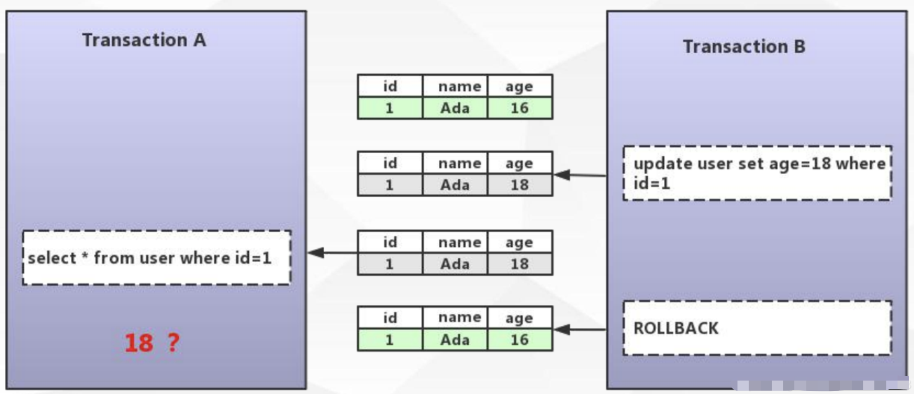
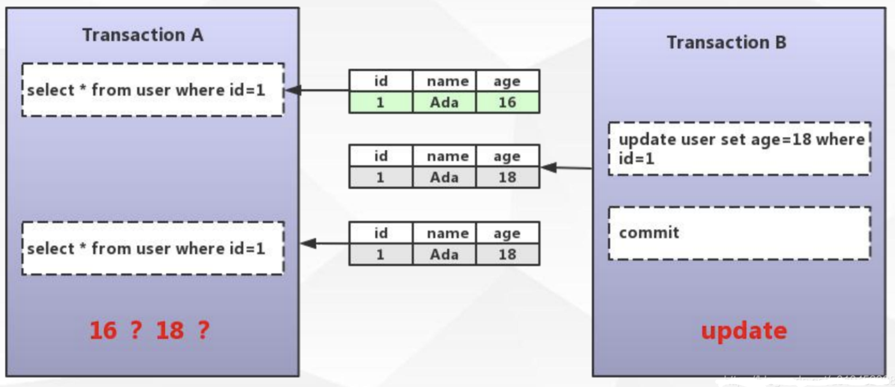
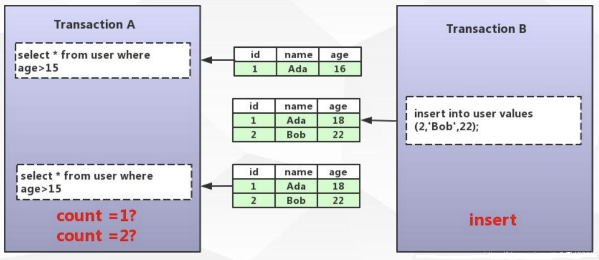
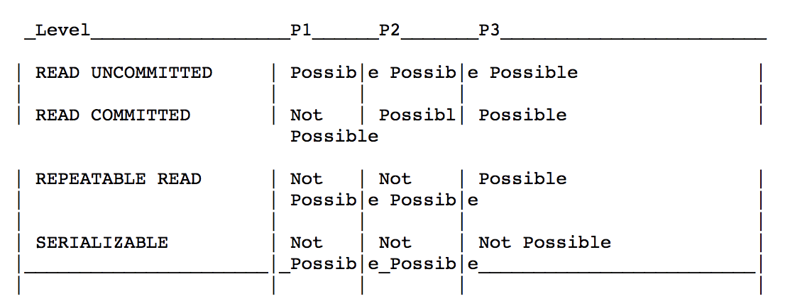
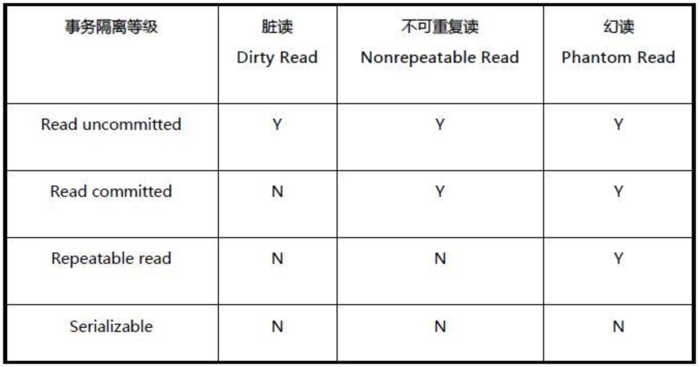
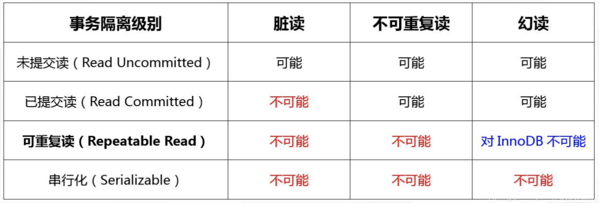

# Innodb事务原理篇

[TOC]

前一篇我们介绍，InnoDB的存储架构，也介绍了更新流程。既然数据有更新，我们如何保证事务呢？今天我们就来分析一下InnoDB的事务是如何实现的。

### 1、什么是事务？

#### 1.1 定义

维基百科的定义：事务是数据库管理系统执行过程中的一个逻辑单位，由一个有限的数据库操作序列构成。

这里面包含两个关键点，第一个是逻辑单位，意味着是最小的操作单元，是不可再分的；第二个是它可能包含一个或者一系列的DML语句，包括insert、delete、update等。

#### 1.2 举例

某人要在商店使用银行卡购买100元的东西，当中至少包括两个操作：

1. 该人账户减少100元
2. 商店账户增加100元

数据库管理系统就是要确保以上两个操作（整个“事务”）都能完成，或一起取消；否则就会出现100元平白消失或出现的情况。

在现实世界中大家可能无感知，但是在计算机世界里失败的风险还是非常高的。比如操作错误、比如磁盘损坏、比如系统异常。为了避免这种情况的发生，需要实现将数据库状态恢复到一致状态的功能，这就是事务的产生的原因。

#### 1.3 事务的特性

数据库事务拥有以下四个特性，习惯上被称之为**ACID特性**。

- **原子性（Atomicity）**：事务作为一个整体被执行，包含在其中的对数据库的操作要么全部被执行，要么都不执行；不能出现上文例子中的，一个转钱了，一个没有收到的情况。
- **一致性（Consistency）**：事务应确保数据库的状态从一个一致状态转变为另一个一致状态，*一致状态*的含义是数据库中的数据应满足完整性约束；比如不能出现转了100，对方收到了50的情况。
- **隔离性（Isolation）**：多个事务并发执行时，一个事务的执行不应影响其他事务的执行；比如上面的例子中还有第三个人也给商店转了100，商店同时收到两个100后，还是100。
- **持久性（Durability）**：已被提交的事务对数据库的修改应该永久保存在数据库中；比如上面的例子中转账完成后系统意外宕机了，恢复后发现都没有转。

#### 1.4 哪些存储引擎支持事务

从上文我们得知事务是包含4个特性的，并不是所有的数据库或者所有的存储引擎都支持事务，它是作为一个特性存在的。在MySQL里只有InnoDB支持事务，也是它在5.7之后成为默认的存储引擎的一个重要原因。我们下文会慢慢介绍。

### 2.InnoDB如何实现事务？

事务的4大特性，InnoDB是如何实现的呢？接下来咱们一起来分析一下。

原子性：在InnoDB中是通过undo log来实现的，它记录了数据修改之前的值，一旦发生异常，它就可以用undo log来实现回滚操作；

一致性：通过数据库自身的一致性约束：比如主键必须唯一，字段长度符合要求，字段类型符合要求，字段值符合要求等；通过用户自定义一致性约束：比如用户减少的金额，必须等于商家增加的金额。

持久性：在InnoDB的存储架构中，大家还记得redo log和double wite buffer吗？我们操作数据库的时候，会先写到内存的buffer pool里面，同时记录redo log，如果在刷盘之前出现了异常，在重启后可以读取到redo log的内容，写入到磁盘，这样就保障了数据的持久性。但是如果恢复之前数据页本身有破坏呢？所以又有了double wite buffer来进行双写缓冲，以此来保障数据页本身没有被破坏。参考：[SQL92标准](https://www.toutiao.com/i6942140065174929933)

隔离性：所谓的隔离，是指在并发的情况下做到隔离，如何做到隔离呢，我们下文慢慢介绍。

### 3.事务并发问题

并发的时候，往往情况比较复杂。我们想象一下，有两个事务A和B，同时并发。

#### 3.1 脏读

1.事务B更新年龄18

2.事务A读取数据库信息，年龄是18

3.事务B回滚

这时候如果事务A读取的了18，这种情况下合理吗？

这种情况就叫做**脏读**：读取到其他事务未提交的数据。

#### 3.2 不可重复读

1.事务A先读取数据，年龄为16

2.事务B跟新数据，年龄为18

3.事务B提交

4.事务A再读取数据，年龄为18

事务A连续两次读取的数据竟然不一样，这种情况你能接受吗？

这种情况就叫做**不可重复读**：在同一个事务中两次读取的数据不一致。

#### 3.3 幻读

1.事务A读取年龄大于15的数据，发现有1条记录

2.事务B插入一条记录，并提交

3.事务A再读取年龄大于15的数据，发现有2条记录

事务A就好像出现了幻觉一样，这种情况合理吗？

这就叫做**幻读**：在同一个事务中两次读取到的数据量不一致。一般幻读出现在范围查询。

很多人容易搞混不可重复读和幻读，确实这两者有些相似。但**不可重复读重点在于update和delete，而幻读的重点在于insert**。

天呢，这么多问题该如何取舍呢？到底怎么算合理的呢？

#### 3.4事务隔离级别

于是就有一些好事之人，定了一些标准去解决这些问题，其中 [SQL92标准](http://www.contrib.andrew.cmu.edu/~shadow/sql/sql1992.txt)就定义了面对这些问题，如果抉择的标准：

里面有四个隔离级别，上面的P1、P2、P3代表的是上问介绍的并发的三个问题。Possib代表可能，Not Possible代表不可能。

翻译一下：

##### 1.未提交读

未提交读（READ UNCOMMITTED）是最低的隔离级别。允许“脏读”（dirty reads），事务可以看到其他事务“尚未提交”的修改。

##### 2.提交读

在提交读（READ COMMITTED）级别中，一个事务只能读取到其他事务已提交的数据，不能读取到其他事务未提交的数据，它解决了脏读的问题，但是还是会出现不可重复读和幻读的问题。

##### 3.可重复读

在可重复读（REPEATABLE READS）隔离级别中，也就是说在同一个事务里多次读取同样的数据结果是一样的，但是范围查询的幻读还是有可能出现的。

##### 4.可串行化

可串行化（SERIALIZABLE）是最高的隔离级别。在这个过程中，所有的事物都是串行的，这就和并发没有关系了，这就不存在任何并发的问题了。所以解决了所有问题。

事务的隔离级别越高，并发读越低。

#### InnoDB对隔离级别的支持

对于可重复读级别，脏读，不可重复读，幻读在innodb引擎不会出现

InnoDB支持四种隔离级别，InnoDB的默认隔离级别是可重复读，且可重复读InnoDb可以避免幻读。这样就避免了并发的问题，又比串行化提升了并发度，所以InnoDB选择的默认隔离级别就是可重复读。

### 4.InnoDB 隔离的实现原理

我们惯常的解决并发问题，如何解决呢？加锁(悲观锁)、或者CAS(乐观锁)？在解决事务并发问题的思路类似，总体来说，有两个方案。

#### 4.1 LBCC(基于锁的并发控制)

如果通过锁来实现事务隔离，一个事务读取的时候不允许其他事务的修改，那么就意味着不支持并发的读写操作，而我们的大多数应用都是读多写少的情况，这样岂不是会大大影响我们的操作效率？

再说了我们通过锁怎么实现呢？大家可以脑补一下，不可重复读的原因是，在读提交的隔离机制中，只对update和insert，delete加锁，而对select读操作未进行加锁；而幻读的原因就是，在可重复读的隔离机制中，会对select，update，insert，delete加锁，所以当某个事务读取某个范围内的记录时，innodb存储引擎会对符合条件的记录行进行上锁，而另外一个事务又在该范围内insert插入了新的记录，当之前的事务再次读取该范围时,还是会产生幻行；如果使用锁机制来实现这两种隔离级别，在可重复读中，该sql第一次读取到数据后，就将这些数据加锁，其它事务无法修改这些数据，就可以实现可重复读了。但这种方法却无法锁住insert的数据，所以当事务A先前读取了数据，或者修改了全部数据，事务B还是可以insert数据提交，这时事务A就会发现莫名其妙多了一条之前没有的数据，这就是幻读。太复杂了！！！

所以我们有了第二种方案。

#### 4.2 MVCC(多版本并发控制)

MVCC的实现没有固定的规范，每个数据库都会有不同的实现方式，这里讨论的是InnoDB的MVCC。

MVCC的实现：

在InnoDB中，会在每行数据后添加两个额外的隐藏的值来实现MVCC，这两个值一个记录这行数据何时被创建（创建事务ID），另外一个记录这行数据何时过期（回滚指针）。 

**DB_TRX_ID(6字节)：** 它是最近一次更新或者插入或者删除该行数据的事务ID(若是删除，则该行有一个删除位更新为已删除。但并不是真正的进行物理删除，当InnoDB丢弃为删除而编写的更新撤消日志记录时，它才会物理删除相应的行及其索引记录。此删除操作称为清除，速度非常快)

**DB_ROLL_PTR(7字节)**： 回滚指针，指向当前记录行的undo log信息(指向该数据的前一个版本数据)。

