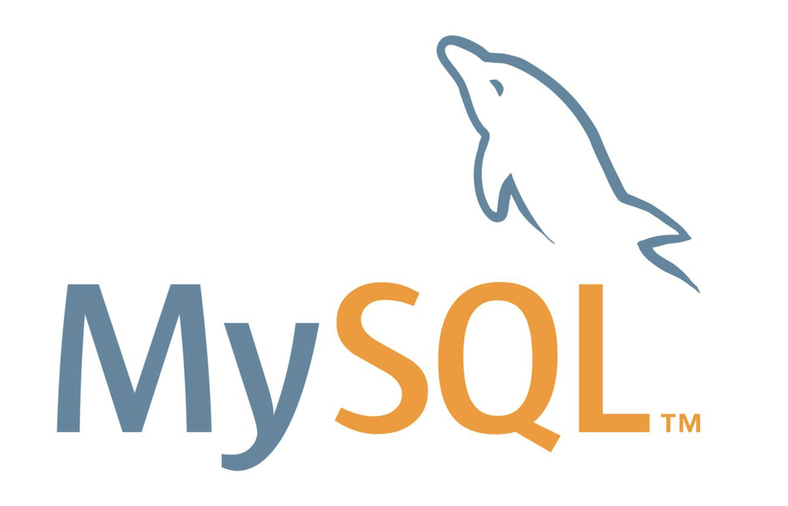
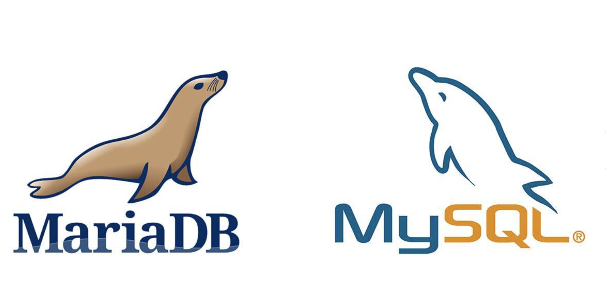
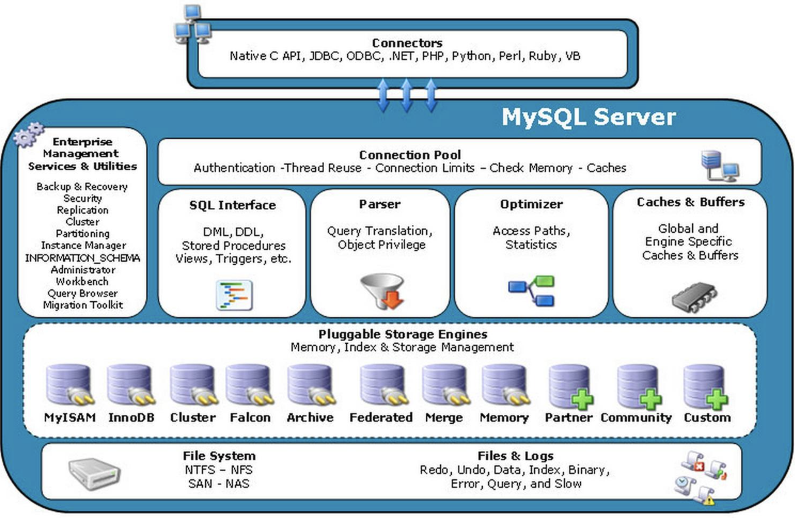

# MySQL前言篇

[TOC]

今天起，开始深入学习一下，全球最流行的数据库——MySQL。

我们在学习Redis的时候第一篇，已经讲解了数据库的分类，其中MySQL是属于关系型数据库的一种。关系型数据库的优缺点分析就不在这赘述了。详情可参阅：

### MySQL来源

MySQL是一种开放源代码的关系型数据库管理系统。由于其**体积小**、**速度快**、总体拥有**成本低**，尤其是**开放源码**这一特点，让中小型企业减少不少成本。

其实MySQL最初的出发点是用mSQL和他们自己的快速低级例程(ISAM)去连接表格。不管怎样，在经过一些测试后，开发者得出结论：mSQL的速度或灵活性不足以满足要求。这导致了为数据库提供了新的SQL接口，这样，这个API被设计成允许为用于mSQL而写的第三方代码更容易移植到MySQL。

MySQL名称的起源不明。一直以来，我们的基本目录以及大量库和工具均采用了前缀“my”。不过，共同创办人Monty Widenius的女儿名字也叫“My”。时至今日，MySQL名称的起源仍是一个迷。

### MySQL发展史

1996年，mysql 1.0发布

2000年，ISAM升级为MyISAM存储引擎，MySQL开源

2003年，MySQL4.0发布，集成了InnoDB存储引擎

2005年，MySQL5.0发布，提供了视图、存储过程等功能

2008年，MySQK AB公司被Sun公司收购

2009年，Oracle收购了Sun公司，进入了Oracle MySQL时代

2010年，MySQL5.5发布，InnoDB成为了默认的存储引擎

2013年，MySQL5.6发布，相当于MySQL的6.0版本

2015年，MySQL5.7发布，相当于MySQL的7.0版本

2016年，Mysql发布了8.0.0版本

Oracle，大家都知道，是那个很贵很贵的数据库Oracle的公司。被Oracle公司收购后，MySQL会不会也商业化？MySQL的创始人Michael Widenius也有同样的担心，但是不同的是我们只能祈求Oracle有一些道德，而Michael Widenius已经开始主动出击，他以MySQL为基础，开启了另一个分支计划——MariaDB。弱者只能祈求，强者才会出击！

#### MySQL与MariaDB对比

二者都是出自一个人的杰作，因其与MySQL保持着高度的兼容性，相应的版本可以直接替换。

1、MariaDB发展趋势和更新频率

毕竟基于MySQL创始人领衔开发的MariaDB数据库，知道MySQL数据库存在的弱点所在，然后提供更好的兼容性和扩展性，我们基本上完全可以将MySQL数据库建议到MariaDB数据库中，而且MariaDB发展速度和升级速度远远优先。

2、MySQL封闭且发展缓慢

由于MySQL在被收购之后更新速度与性能的优化非常的缓慢，而且是闭源的，完全没有Oracle之外的人参与进来，很多需要解决的问题都没有升级进去，反之很多公司虽然也有利用自己开发的分支MYSQL版本。

3、MariaDB的特点和优势

MariaDB基于事务的Maria存储引擎，替换了MySQL的MyISAM存储引擎，它使用了Percona的 XtraDB，InnoDB的变体，MariaDB默认的存储引擎是Aria，Aria可以支持事务，但是默认情况下没有打开事务支持，因为事务支持对性能会有影响。MariaDB是一个采用Maria存储引擎的MySQL分支版本，是由原来 MySQL 的作者Michael Widenius创办的公司所开发的免费开源的数据库。

4、MariaDB与MySQL性能对比

这个直观的区别在于MariaDB能够快速的查询和处理数据，且占用资源相对是少于MySQL数据库的，而且在运行速度、以及支持对 Unicode 的排序问题优于MySQL数据库。

### 什么是MySQL

#### MySQL官方描述

1、**MySQL is a database management system.**

​	MySQL是一个数据库管理系统

2、**MySQL databases are relational.**

​	MySQL数据库是关系型的

3、**MySQL software is Open Source.**

​	MySQL软件是开源的

4、**The MySQL Database Server is very fast, reliable, scalable, and easy to use.**

​	MySQL数据库服务器非常快速、可靠、可扩展且易于使用

5、**MySQL Server works in client/server or embedded systems.**

​	MySQL服务器适用于客户机/服务器或嵌入式系统

6、**A large amount of contributed MySQL software is available.**

​	提供了大量可用的MySQL软件

说了这么多优点，它究竟是如何做到的呢？我们一起来看一下MySQL的官方架构图。

#### MySQL架构图

##### 1、连接层

Connectors组件，是MySQL向外提供的交互组件，如java,.net,php等语言可以通过该组件来操作SQL语句，实现与SQL的交互。

##### 2、管理服务组件和工具组件

提供对MySQL的集成管理，如备份(Backup),恢复(Recovery),安全管理(Security)等

##### 3、连接池

负责监听对客户端向MySQL Server端的各种请求，接收请求，转发请求到目标模块。每个成功连接MySQL Server的客户请求都会被创建或分配一个线程，该线程负责客户端与MySQL Server端的通信，接收客户端发送的命令，传递服务端的结果信息等。

##### 4、SQL接口

接收用户SQL命令，如DML,DDL和存储过程等，并将最终结果返回给用户。

##### 5、查询分析器

首先分析SQL命令语法的合法性，并尝试将SQL命令分解成数据结构，若分解失败，则提示SQL语句不合理。

##### 6、优化器

对SQL命令按照标准流程进行优化分析。它使用的是“选取-投影-联接”策略进行查询。

##### 7、缓存

查询缓存，如果查询缓存有命中的查询结果，查询语句就可以直接去查询缓存中取数据。

##### 8、MySQL存储引擎

MySQL存储引擎在MySQL中扮演重要角色，其作比较重要作用，管理表创建，数据检索，索引创建等。

##### 9、文件存储

实际存储MySQL 数据库文件和一些日志文件等的系统，如Linux，Unix,Windows等。

这么复杂而完善的架构设计，那么我们真正执行一条SQL的时候，是如何执行的呢？下篇文章做详细描述！

### 总结一下

通过上面的描述，你认为作为一个数据库最核心的两点内容是什么？笔者认为以下两点：

> 1、存储：如何保证数据存储安全？
>
> ​	从上面的MySQL架构图中可以看到，在存储上做了很多工作，比如使用不同的文件系统：NFS、NAS等，以及记录各种日志文件：Redo、Undo、BinLog等。
>
> 2、检索：如何保证查询效率高？
>
> ​	从上面的MySQL架构图中可以看到，在检索上也做了很多工作，比如分析器、优化器、缓存、存储引擎、索引等。

当然除此之外的易用性(安装部署、使用、客户端)、高性能(连接池)、安全性(Security、Cluster、Replication、Recovery)以及可拓展型(存储引擎)等也是一款软件能不能流行起来的很重要的原因。

