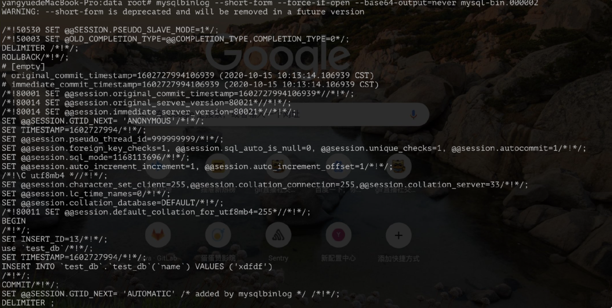

# MySQL日志篇

[TOC]

今天我们介绍一下MySQL中特别重要的一项内容——日志！

MySQL中日志有很多，我们前文提到的redo log、undo log、以及今天要提到的binlog。

### Binlog

Binlog顾名思义：二进制日志，Binlog 记录所有的 DDL 和 DML 语句(除了数据查询语句SELECT、SHOW等)，以 Event 的形式记录，同时记录语句执行时间。

日志我们一般用来做什么？追踪过程！没错Binlog也是，只是Binlog不止是用来追踪过程呢，主要用来：

1. 数据恢复

   因为 Binlog 详细记录了所有修改数据的 SQL，当某一时刻的数据误操作而导致出问题，或者数据库宕机数据丢失，那么可以根据 Binlog 来回放历史数据。

2. 主从复制

   想要做多机备份的业务，可以去监听当前写库的 Binlog 日志，同步写库的所有更改（下一节会详细介绍）。

那既然它这么强大，那就看一下它是如何工作的。

#### 开启Binlog

Binlog 日志功能默认是开启的，线上情况下 Binlog 日志的增长速度是很快的，在 MySQL 的配置文件 `my.cnf` 中提供一些参数来对 Binlog 进行设置。

```shell
设置此参数表示启用binlog功能，并制定二进制日志的存储目录
log-bin=/home/mysql/binlog/
#mysql-bin.*日志文件最大字节（单位：字节）
#设置最大100MB
max_binlog_size=104857600

#设置了只保留7天BINLOG（单位：天）
expire_logs_days = 7

#binlog日志只记录指定库的更新
#binlog-do-db=db_name

#binlog日志不记录指定库的更新
#binlog-ignore-db=db_name

#写缓冲多少次，刷一次磁盘，默认0
sync_binlog=0
```

这里详细介绍一下这些参数：

**max_binlog_size**：Binlog 最大和默认值是 1G。但是在极端情况下使用大型事务的时候， 因为一个事务被写入到文件中，而不是在文件之间分割，二进制日志文件可能会变得更大。

**sync_binlog**： Binlog 日志的更新频率。默认 0 。

​	0:表示该操作由操作系统根据自身负载自行决定多久写一次磁盘，

​	1:表示每一条事务提交都会立刻写盘，

​	n:表示 n 个事务提交才会写盘。

开启binlog后，MySQL 会把用户对所有数据库的内容和结构的修改情况记入 `mysql-bin.n` 文件

#### 查看Binlog

查看binlog文件

```shell
show binary logs; #查看binlog列表
show master status; #查看最新的binlog

mysql> show binary logs;
+------------------+-----------+-----------+
| Log_name         | File_size | Encrypted |
+------------------+-----------+-----------+
| mysql-bin.000001 |       179 | No        |
| mysql-bin.000002 |       156 | No        |
+------------------+-----------+-----------+
2 rows in set (0.00 sec)
```

这里可以看到有多个binlog文件，多个文件是怎么生成的呢？

如何查看binlog呢？

- 服务器已启动或重新启动
- 服务器刷新日志。
- 当前日志文件的大小达到上文的`max_binlog_size`。

当您要重新处理日志中的语句以进行恢复操作时，如何查看Binlog内容呢？可以使用**mysqlbinlog**实用程序显示二进制日志文件的内容。

```shell
shell> mysqlbinlog log_file | mysql -h server_name
```

**mysqlbinlog**也可用于在副本上显示日志文件的内容，因为它们是使用与二进制日志文件相同的格式编写的。

查看结果如图所示：



可以看出具体的SQL语句。

#### Binlog 日志格式

针对不同的使用场景，Binlog 也提供了可定制化的服务，提供了三种模式来提供不同详细程度的日志内容。

- Statement 模式：基于 SQL 语句的日志记录(statement-based replication-SBR)，基于SQL语句从源到副本的传播。

  **优点：**不需要记录每一行的变化，减少了binlog日志量，节约了IO，提高性能。(相比row能节约多少性能与日志量，这个取决于应用的SQL情况，正常同一条记录修改或者插入row格式所产生的日志量还小于Statement产生的日志量，但是考虑到如果带条件的update操作，以及整表删除，alter表等操作，ROW格式会产生大量日志，因此在考虑是否使用ROW格式日志时应该跟据应用的实际情况，其所产生的日志量会增加多少，以及带来的IO性能问题。)

  **缺点：**由于记录的只是执行语句，为了这些语句能在slave上正确运行，因此还必须记录每条语句在执行的时候的一些相关信息，以保证所有语句能在slave得到和在master端执行时候相同 的结果。另外mysql 的复制,像一些特定函数功能，slave可与master上要保持一致会有很多相关问题(如sleep()函数， last_insert_id()，以及user-defined functions(udf)会出现问题).


  使用以下函数的语句也无法被复制：

  ​	* LOAD_FILE()

  ​	* UUID()

  ​	* USER()

  ​	* FOUND_ROWS()

  ​	* SYSDATE() (除非启动时启用了 --sysdate-is-now 选项)

  同时在INSERT ...SELECT 会产生比 RBR 更多的行级锁

- Row 模式(默认)：基于行的日志记录(row-based replication-RBR)，源将事件写入二进制日志，以指示各个表行受到的影响。

  **优点：** binlog中可以不记录执行的sql语句的上下文相关的信息，仅需要记录那一条记录被修改成什么了。所以rowlevel的日志内容会非常清楚的记录下每一行数据修改的细节。而且不会出现某些特定情况下的存储过程，或function，以及trigger的调用和触发无法被正确复制的问题;

  **缺点:**所有的执行的语句当记录到日志中的时候，都将以每行记录的修改来记录，这样可能会产生大量的日志内容,比如一条update语句，修改多条记录，则binlog中每一条修改都会有记录，这样造成binlog日志量会很大，特别是当执行alter table之类的语句的时候，由于表结构修改，每条记录都发生改变，那么该表每一条记录都会记录到日志中。

- Mixed 模式：混合模式日志记录(mixed-based replication-MBR)，对于混合日志记录，默认情况下使用基于语句的日志记录，但是在某些情况下，日志记录模式会自动切换为基于行，比如：在确定给定的语句对于基于语句的复制是否安全时，MySQL确定是否可以保证可以使用基于语句的日志记录来复制该语句。如果MySQL无法做出此保证，它将标记该语句为潜在不可靠的对象并发出警告，以语句格式登录该语句可能并不安全。

查询当前 Binlog 日志使用格式：

```shell
mysql> show global variables like '%binlog_format%';
+---------------------------------+---------+
| Variable_name                   | Value   |
+---------------------------------+---------+
| binlog_format                   | MIXED   |
| default_week_format             | 0       |
| information_schema_stats_expiry | 86400   |
| innodb_default_row_format       | dynamic |
| require_row_format              | OFF     |
+---------------------------------+---------+
5 rows in set (0.01 sec)
```

#### Binlog压缩

Binlog虽然已经是二进制文件了，但是由于Binlog用于网络间传输以实现主从同步，所以能不能进一步压缩呢？

从MySQL 8.0.20开始，可以在MySQL服务器实例上启用二进制日志事务压缩。启用二进制日志事务压缩后，将使用zstd算法压缩事务有效负载，然后将其作为单个事件（a `Transaction_payload_event`）写入服务器的二进制日志文件 。

使用`binlog_transaction_compression` 启用二进制日志事务压缩 ；

使用`binlog_transaction_compression_level_zstd`设置用于压缩的zstd算法的级别。此值确定压缩工作量，从1（最小工作量）到22（最大工作量）。随着压缩级别的增加，压缩率也会增加，这会减少事务有效负载所需的存储空间和网络带宽。

谁不是压缩的越小越好呢？你想象一下压缩需不需要资源消耗？当然需要，数据压缩所需的工作量也增加了，占用了时间以及主节点服务器上的CPU和内存资源。

### 慢日志查询

MySQL的慢查询日志是MySQL提供的一种日志记录，它用来记录在MySQL中响应时间超过阀值的语句，具体指运行时间超过long_query_time值的SQL，则会被记录到慢查询日志中。long_query_time的默认值为10，意思是运行10S以上的语句。

默认情况下，Mysql数据库并不启动慢查询日志，需要我们手动来设置这个参数，当然，如果不是调优需要的话，一般不建议启动该参数，因为开启慢查询日志会或多或少带来一定的性能影响。

慢查询日志支持将日志记录写入文件，也支持将日志记录写入数据库表。

#### 慢查询日志配置项

```shell
mysql> show variables like '%query%';
+------------------------------+--------------------------------+
| Variable_name                | Value                                            |
+------------------------------+--------------------------------+
| binlog_rows_query_log_events | OFF                                              |
| ft_query_expansion_limit     | 20                                               |
| have_query_cache             | NO                                               |
| long_query_time              | 10.000000                                        |
| query_alloc_block_size       | 8192                                             |
| query_prealloc_size          | 8192                                             |
| slow_query_log               | OFF                                              |
| slow_query_log_file          | /usr/local/mysql/data/seandeMacBook-Pro-slow.log |
+------------------------------+--------------------------------+
8 rows in set (0.00 sec)
```

其中需要关注的配置项为：

1.slow_query_log：该配置项是决定是否开启慢日志查询功能，配置的值有ON或者OFF。

2.slow_query_log_file：该配置项是慢日志查询的记录文件,需要手动创建。

3.long_query_time：该配置项是设置慢日志查询的时间阈值，当超过这个阈值时，慢日志才会被记录.配置的值有0(任何的sql语句都记录下来)，或者>0(具体的阈值).该配置项是以秒为单位的，并且可以设置为小数。

4.log-queries-not-using-indexes：该配置项是为了记录未使用到索引的sql语句。

#### 慢查询日志配置

1、配置文件配置：

```shell
slow_query_log=ON
slow_query_log_file=/usr/local/mysql/var/localhost-slow.log
long_query_time=0
log-queries-not-using-indexes = 1
// 配置好后，重启mysql服务
```

2、命令配置

```shell
// 这里就简单些一个配置项就行了，其他的配置项均按照此方法配置
mysql> set slow_query_log=ON;
// 如果执行失败，可能是由于没有添加global

mysql> set global slow_query_log=ON;
```

#### 慢查询日志记录查看

如果启用了慢查询日志并将`FILE`其选择为输出目标，则写入日志的每个语句都以一行开头，该行以`#`字符开头 并具有以下字段（所有字段都在一行上）：

- Query_time: *duration*

  语句执行时间，以秒为单位。

- Lock_time: *duration*

  获取锁的时间（以秒为单位）。

- Rows_sent: *N*

  发送给客户端的行数。

- Rows_examined:

  服务器层检查的行数（不计算存储引擎内部的任何处理）。

#### 慢查询日志分析工具

在生产环境中，如果要手工分析日志，查找、分析SQL，显然是个体力活，MySQL提供了日志分析工具mysqldumpslow。

```shell
mysqldumpslow --help
```

常用方式：

```shell
# 得到返回记录集最多的10个SQL
mysqldumpslow -s r -t 10 /var/lib/mysql/localhost-slow.log
# 得到访问次数最多的10个SQL
mysqldumpslow -s C -t 10 /var/lib/mysql/localhost-slow.log
# 得到按照时间排序的前10条里面含有左连接的查询语句
mysqldumpslow -s t -t 10 -g "left join" /var/lib/mysql/localhost-slow.log
# 另外建议在使用这些命令时结合|和more使用，否则有可能出现爆屏情况
mysqldumpslow -s r -t 10 /var/lib/mysql/localhost-slow.log | more
```


### 总结一下

redo log和 binlog都是记录数据操作记录的，他们有哪些区别呢？

- redo log是属于innoDB层面，binlog属于MySQL Server层面的，这样在数据库用别的存储引擎时可以达到一致性的要求。
- redo log是物理日志，记录该数据页更新的内容；binlog是逻辑日志，记录的是这个更新语句的原始逻辑
- redo log是循环写，日志空间大小固定；binlog是追加写，是指一份写到一定大小的时候会更换下一个文件，不会覆盖。
- binlog可以作为恢复数据使用，主从复制搭建，redo log作为异常宕机或者介质故障后的数据恢复使用。


