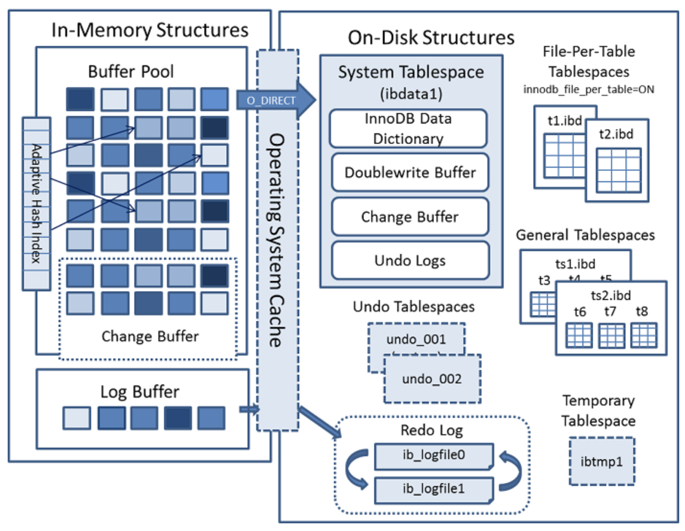
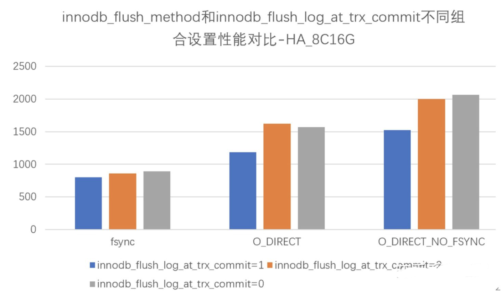
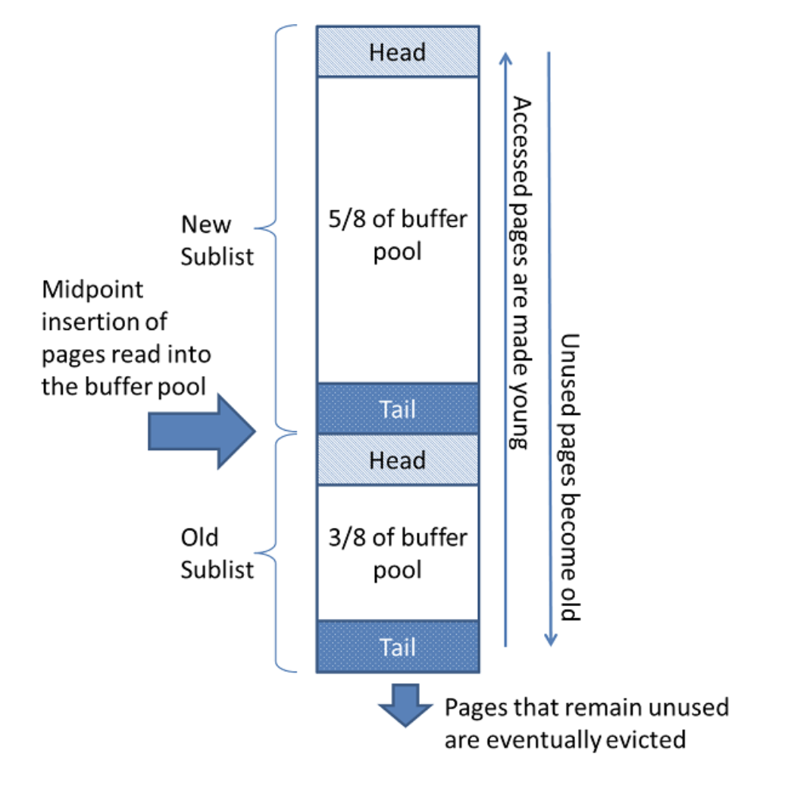
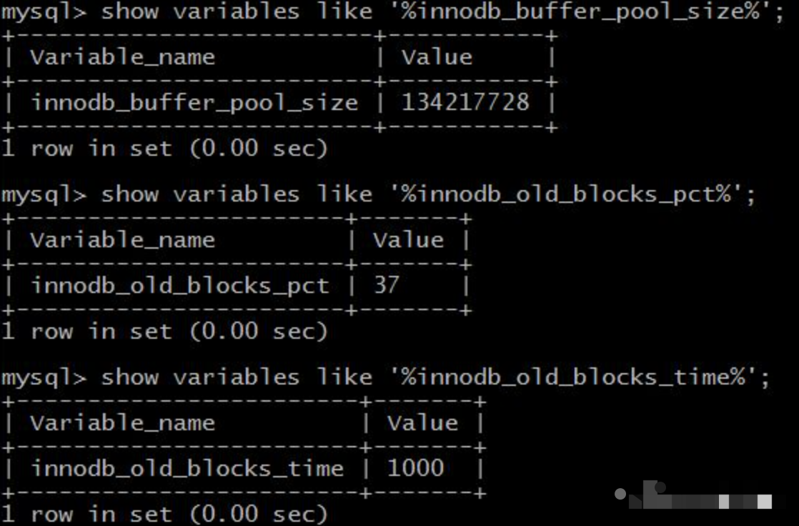
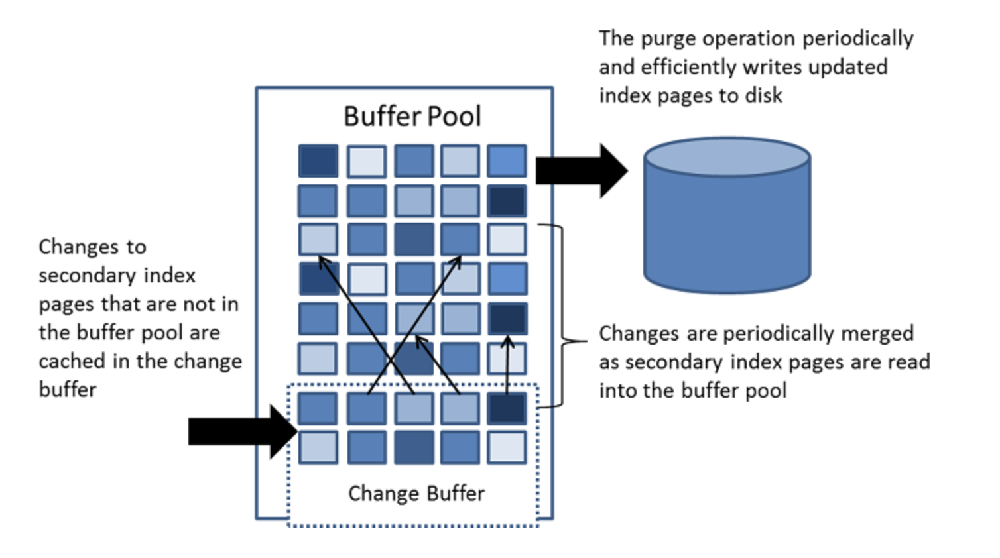
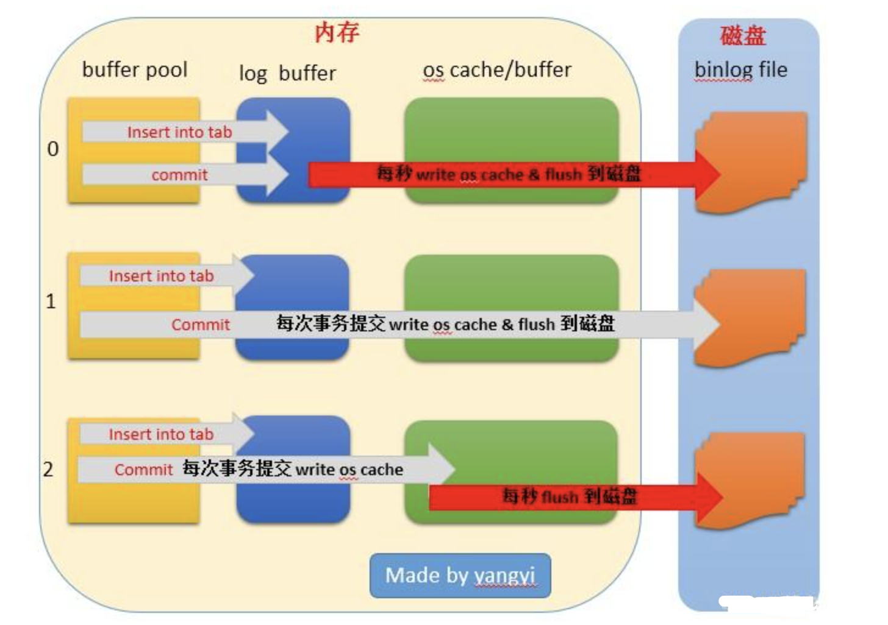

# MySQL-Innodb篇

[TOC]

上文我们介绍了一条查询的SQL是如何执行的了，一条更新的SQL是如何执行的呢？

在数据库里，我们说的update操作其实包括了更新、插入和删除。更新流程和查询流程有什么不同呢？

其实，仔细回顾一下，也需要连接，也需要语法解析与预处理，也需要执行流程、也会根据不同的存储引擎去执行。似乎没有什么不同。

而他们的唯一区别就在于如何进行更新！接下来我们就以默认的存储引擎InnoDB来做一些详细的分析学习。

### InnoDB 架构分析

首先我们先来看一下InnoDB的架构图：



可以看到InnoDB的存储结构有几个个大块：

> 内存结构：In-Memory Structures，这一层在MySQL服务进程内
>
> OS Cache：OperatingSystem Cache，这一层属于内核态内存
>
> 磁盘结构：On-Disk Structures，这一层在文件系统上

而这三块之间的交互分两类：

1、直接O_DIRECT存储，

2、通过OS Cache存储



该参数从fsync到O_DIRECT再到O_DIRECT_NO_FSYNC，性能分别有明显的提升。

关于图中的innodb_flush_log_at_trx_commit参数，我们下文会有介绍。

接下来我们介绍InnoDB中的核心组件：

#### 内存结构

##### Buffer Pool

首先，对于InnoDB存储引擎来说，数据都是放在磁盘上的，存储引擎要操作数据必须先把磁盘里面的数据加载到内存里面才可以操作。大家想象一下，是不是类似于内存我们需要多少数据，就一次从磁盘加载多少到内存呢？

大家都知道磁盘I/O的读写相对于内存的操作来说是很慢的。如果我们需要的数据分布在磁盘的不同位置，那就有可能我们需要多次磁盘I/O操作。

这时候我们怎么解决呢？操作系统中有一个预读取的概念，不知道大家知道不知道。在存储引擎里也有同样的概念。也就是说当磁盘的一块数据被读取的时候，会将它附近的位置也读取出来，以防附近位置再读取时从再从磁盘里读取，通常都遵循“集中读写”的原则，使用一些数据，大概率会使用附近的数据，这就是所谓的“局部性原理”。

操作系统里有一个页的概念，每次读取读取一页，而存储引擎中也是有同样的理念。操作系统的页的大小一般是4K，而在InnoDB的存储引擎里面，这个最小单位默认示16K。

到这里总结一下，InnoDB在读取数据的时候，会每次从磁盘里读取一页(16K)的数据，以减少磁盘I/O。

大家知道数据库的是个高频的操作，每次都要从磁盘读取到内存也是一个特别耗资源的事情，有没有什么办法可以进一步提高效率呢？

所以就有了**Buffer Pool**(内存缓冲区)！

读取数据的时候，先判断这个区域里面有没有数据，如果有直接读取，如果没有再从磁盘读取，读取后放在这个内存缓冲区里。

修改数据的时候，也是先写到这个区域，而不是直接写到磁盘。这样的话如果有新的读取还是从这个区域内读取，不会造成读取错误的情况。

那这里就还存在一个问题了，如果的数据可磁盘的数据会存在不一致的情况呀。这种不一致的时候我们称为**脏页**。那么脏页怎么处理呢？

InnoDB里面有专门的后台线程把Buffer Pool的数据写入到磁盘，每隔一段时间就一次性地把多个修改写入磁盘，这个动作就叫做**刷脏**。这样就会把数据持久化到磁盘上。

内存缓冲区，其实质也是内存。内存的空间毕竟是有限的，那缓冲区的内容也是有限的，如何管理与淘汰缓冲池，使得性能最大化呢？我们之前介绍Redis的时候，也介绍过Redis的内存淘汰机制。最容易想到的，就是LRU(Least recently used)。而传统的LRU就是通过一个固定长度的链表的方式实现，将最近访问的添加在链表头部，尾部的被淘汰。而这样会有以下几点缺点：

1、预读失效：提前把页放入了缓冲池，但最终MySQL并没有从页中读取数据，称为预读失效。

2、缓冲池污染：当某一个SQL语句，要批量扫描大量数据时，可能导致把缓冲池的所有页都替换出去，导致大量热数据被换出，MySQL性能急剧下降，这种情况叫缓冲池污染。

**预读失效**

要解决优化预读失效，思路是：

1. 让预读失败的页，停留在缓冲池LRU里的时间尽可能短；
2. 让真正被读取的页，才挪到缓冲池LRU的头部。

让真正被读取的热数据留在缓冲池里的时间尽可能长。

具体的方法是：

1、将数据分为两部分新生代和老年代；

2、新老生代收尾相连，即：新生代的尾(tail)连接着老生代的头(head)；

3、新页（例如被预读的页）加入缓冲池时，只加入到老生代头部，如果数据真正被读取（预读成功），才会加入到新生代的头部，如果数据没有被读取，则会比新生代里的“热数据页”更早被淘汰出缓冲池。



**缓存污染**

当某一个SQL语句，要批量扫描大量数据时，可能导致把缓冲池的所有页都替换出去，导致大量热数据被换出。怎么解决这类大量数据导致的缓冲池污染问题呢？

MySQL缓冲池加入了一个“老生代停留时间窗口”的机制：

1. 假设T=老生代停留时间窗口；
2. 插入老生代头部的页，即使立刻被访问，并不会立刻放入新生代头部；
3. 只有满足被访问并且在老生代停留时间大于T，才会被放入新生代头部。

而这个T如何设置呢？



总结一下：Buffer Pool就是为了提高读写效率的一个缓存，而缓存通过自定义的LFU算法实现缓存的最大利用率。

##### Change Buffer

Change Buffer 是 Buffer Pool 中的一部分，顾名思义，就是更改的缓冲区！

对表执行 INSERT，UPDATE和 DELETE操作时， 索引列的值（尤其是secondary keys的值）通常按未排序顺序排列，需要大量I/O才能使二级索引更新。Change Buffer会缓存这个更新当相关页面不在Buffer Pool中，从而磁盘上的相关页面不会立即被读避免了昂贵的I / O操作。当页面加载到缓冲池中时，将合并缓冲的更改，稍后将更新的页面刷新到磁盘。该InnoDB主线程在服务器几乎空闲时以及在慢速关闭期间合并缓冲的更改 。以此来减少二级索引的随机IO。





change buffer相关配置：


##### Adaptive Hash Index

自适应哈希索引(Adaptive Hash Index)，使InnoDB平台看起来更像一个内存数据库，且不牺牲任何事务特性或可靠性。

首先我们思考一下 AHI 是为了解决什么问题：

- 随着 MySQL 单表数据量增大，（尽管 B+ 树算法极好地控制了树的层数）索引 B+ 树的层数会逐渐增多；
- 随着索引树层数增多，检索某一个数据页需要沿着 B+ 树从上往下逐层定位，时间成本就会上升；
- 为解决检索成本问题，MySQL 就想到使用某一种缓存结构：根据某个检索条件，直接查询到对应的数据页，跳过逐层定位的步骤。这种缓存结构就是 AHI。

AHI 在实现上就是一个哈希表：从某个检索条件到某个数据页的哈希表，仿佛并不复杂，但其中的关窍在于哈希表**不能太大**（哈希表维护本身就有成本，哈希表太大则成本会高于收益），**又不能太小**（太小则缓存命中率太低，没有任何收益）。

这就是 AHI中＂自适应＂的用途：建立一个＂不大不小刚刚好＂的哈希表。那如何进行自适应呢？要满足以下几个条件：

> 1、索引树要被使用足够多次
>
> 2、该索引树上的某个检索条件要被经常使用
>
> 3、该索引树上的某个数据页要被经常使用

##### Log Buffer

我们知道，数据库的操作都会写入到日志，如果每次直接写入磁盘会太频繁。

日志缓冲区用于保存要写入磁盘上的日志文件的数据。 日志缓冲区大小由innodb_log_buffer_size变量定义。 默认大小为16MB。 日志缓冲区的内容会根据innodb_flush_log_at_trx_commit变量定期刷新到磁盘。 较大的日志缓冲区使大型事务可以运行，而无需在事务提交之前将重做日志数据写入磁盘。 因此，如果您有更新、插入或删除许多行的事务，则增加日志缓冲区的大小可以节省磁盘I/O。

而innodb_flush_log_at_trx_commit参数设置代表：

> 如果innodb_flush_log_at_trx_commit设置为0，log buffer将每秒一次地写入log file中，并且log file的flush(刷到磁盘)操作同时进行.该模式下，在事务提交的时候，不会主动触发写入磁盘的操作。
>
> 如果innodb_flush_log_at_trx_commit设置为1，每次事务提交时MySQL都会把log buffer的数据写入log file，并且flush(刷到磁盘)中去。
>
> 如果innodb_flush_log_at_trx_commit设置为2，每次事务提交时MySQL都会把log buffer的数据写入log file.但是flush(刷到磁盘)操作并不会同时进行。该模式下,MySQL会每秒执行一次 flush(刷到磁盘)操作。

如下图所示：



#### 磁盘结构

##### system tablespaces

除了存储表数据之外，InnoDB也支持查找表元信息，存储和检索MVCC信息以兑现服从ACID和事务隔离性等原则。它包含几种类型的InnoDB对象信息。

**InnoDB数据字典**

在系统tablespace中的存储区域，由系统内部表（供mysql服务器使用的表）和对象元数据（表，索引，列信息）组成

**Doublewrite buffer**

InnoDB的页和操作系统的页大小不一致，InnoDB页面大小为16K，操作系统为4K，InnoDB的页写入到磁盘时，一个页需要分4次写入。如果写入页的数据到磁盘时发生了宕机，可能会出现只有一部分写入成功了，这种情况就叫做部分写失效，可能会造成数据丢失。

业务会说我们有redo log呀，不可以恢复吗？如果这个页本身已经损坏了，用它来做恢复是没有意义的。所以在对于应用redo log之前，需要一个页的副本。如果出现了页的失效，就用页的副本来还原这个页，然后再用redo log进行恢复。这个页的副本就叫 double write，以此来保证数据页的可靠性。

**change buffer**

同内存里的change buffer

**undo logs**

undo logs记录的是事务发生之前的数据状态，分为insert undo log和update undo log。如果修改数据出现了异常，可以用undo log来回滚。innodb引擎的隔离级别实现与undo log有重大关联。我们下一篇会介绍。

默认情况下，所有的表共享一个系统表空间。

##### file-per-table tablespaces

顾名思义，这个是每个表独占的空间。存放表的索引和数据，维护起来更加灵活。

##### general tablespaces

一般表空间是共享的,由create tablespace语法创建的表空间.它与系统表空间类似,存放可供多表使用的共享数据。它具备先天的使用优势，如在完整生命周期内将表空间的数据加载至内存，则可减少类似单文件表空间的频繁io开销。

##### temporary tablespaces

包含两个级别:会话级别的临时表空间和全局的临时表空间。

会话级临时表空间每次使用时会从一个临时表空间池中取出并和session进行attach,默认情况下,server启动时会创建一个拥有10个临时表空间的池供使用,当会话释放时,它持有的临时表空间会被清空并还池。

全局级临时表空间用于存放对于用户创建的临时表的变更回滚段.在server关闭或放弃了全局级临时表空间的初始化操作时销毁,在server每次启动时重建。

##### redo logs

我们知道，由于刷脏不是实时的，如果Buffer Pool里面的脏页面还没有刷入磁盘数据库就宕机了，这些数据就丢失了，怎么办呢？

为了避免这个问题，所以内存的数据必须要有一个持久化的措施。InnoDB把所有对页面的修改操作专门写入一个日志文件。如果还未同步到磁盘的数据，数据库在启动的时候，会从这个日志文件进行恢复操作。而这个日志文件就是磁盘的redo log。

同样是写入磁盘，为什么不直接写入数据，还要写入日志呢？岂不是多此一举？

这就涉及到磁盘的顺序写和随机写的问题了。在这里感兴趣的可以自己查一下，以后有机会再做操作系统硬件方面的介绍。

我们知道磁盘的顺序I/O的性能是非常高的，是不差于内存的随机I/O的。因此先把修改写入日志文件，在保证了内存数据安全的情况下，可以延迟刷盘时机，进而提升性能。

> innodb_log_file_size ：每个文件大小，默认48M
>
> innodb_log_file_in_group : 文件数量，默认为2，这两个文件的使用是"环形方式",这意味着可以交替重用

redo log特点：

1、是InnoDB存储引擎实现的，并不是所有存储引擎都有；

2、不是记录修改后的状态，而是记录某个数据页上做了什么修改；

3、大小是固定的，一旦满了就会触发buffer pool到磁盘的同步；

##### undo logs tablespaces

默认存放在系统表空间，而undo表空间就是存放了可用于回滚事务的undo log。

### 后台线程

了解了InnoDB的整个架构之后，我们可以明确的之后，InnoDB中有很多异步的后台线程负责数据的持久化，包括：

- master thread：
  - 核心的后台线程，主要负责将缓冲池中的数据异步刷新到磁盘，保证数据的一致性，包括脏页的刷新、合并插入缓冲、undo页的回收等。
  - Master thread在主循环中，分两大部分操作，每秒钟的操作和每10秒钟的操作：
    - **每秒一次的操作包括：**
      1、日志缓冲刷新到磁盘，即使这个事务还没有提交（总是），这点解释了为什么再大的事务commit时都很快；
      2、合并插入缓冲（可能），合并插入并不是每秒都发生，InnoDB会判断当前一秒内发生的IO次数是否小于5，如果是，则系统认为当前的IO压力很小，可以执行合并插入缓冲的操作。
      3、至多刷新100个InnoDB的缓冲池的脏页到磁盘（可能），这个刷新100个脏页也不是每秒都在做。
    - **每10秒一次的操作包括：**
      1、刷新100个脏页到磁盘（可能）；
      2、合并至多5个插入缓冲（总是）；
      3、将日志缓冲刷新到磁盘（总是）；
      4、删除无用的undo页（总是）；
      5、产生一个检查点（checkpoing）；
- IO thread
  - 主要负责IO请求的回掉处理。分别为write、read、insert buffer和log IO thread。线程数量可以通过参数进行调整。5.6以后的版本可以通过innodb_write_io_threads和innodb_read_io_threads来限制读写线程，而在5.6版本以前，只有一个参数innodb_file_io_threads来控制读写总线程数。
- purge thread：用来回收undo 页；
  - 负责回收已经使用并分配的undo页，purge操作默认是由master thread中完成的，为了减轻master thread的工作，提高cpu使用率以及提升存储引擎的性能。用户可以在参数文件中添加如下命令来启动独立的purge thread。
    innodb_purge_threads=1
    从innodb1.2版本开始，可以指定多个innodb_purge_threads来进一步加快和提高undo回收速度。
- page cleaner thread：
  - 执行脏页刷新操作。讲脏页刷盘。

### 更新过程

大概介绍了InnoDB的架构之后，我们来一起梳理一下更新的流程。

```sql
update t_user set name='itliwei' where id = 1
```

整个过程如下：

1. 事务开启；
2. 从内存(buffer pool)或磁盘(data file)取到包含这个数据的数据页，返回给Server；
3. Server的执行器修改数据页的这一行数据；
4. 记录name = 'XXX'(原来的名字)到undo log；
5. 记录name='itliwei'到redo log；
6. 调用存储引擎的接口，记录数据页面到change buffer；
7. 事务提交。

到此，更新流程就介绍完毕了。

数据库的已用，是建立在无数先贤的辛苦劳作之上的，致敬！


