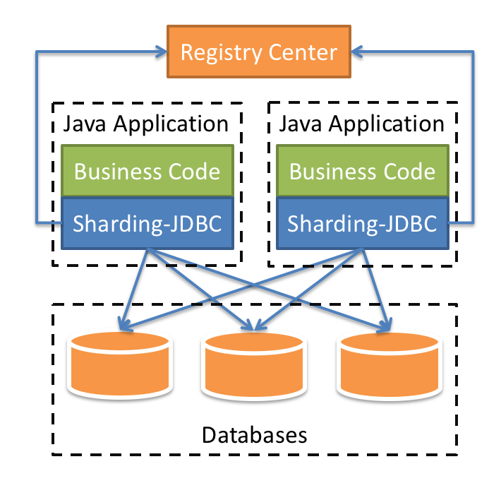

# MySQL架构篇

[TOC]

我们前文介绍了MySQL的基本原理和工作模式之后，我们今天来学习一下MySQL的生产架构应该怎么做。

我们知道，随着互联网的发展与普及数据量的增多，数据库的数据量以及读写操作量会越来越大。我们往往会面临几个问题：

> 问题一：读写压力大怎么办？
>
> 问题二：服务器宕机了怎么办？

任何架构的高可用的本质就是——冗余！解决上面问题的方案也是一样的。我们把一份数据存储多份。其中每一份都可以用于读，其中一份出错了，可以去读令一份。这样就解决了上述的问题。但是MySQL是如何实现数据冗余的呢？这里就不得不提到数据库的**主从同步**了。

> 问题三：数据量大怎么办？

任何架构的可拓展性的本质就是——分片！解决数据量大的方案就是如此。把一份大的数据分成多个小份存储，每次读的时候从各个小份读取汇总在一起。MySQL如何实现数据分片呢？这里就不得不说**分库分表**。

### 主从同步

#### 主从同步概念

主从复制是指数据可以从一个数据库服务器主节点复制到一个或多个从节点。

MySQL 默认采用异步复制方式，这样从节点不用一直访问主服务器来更新自己的数据，数据的更新可以在远程连接上进行，从节点可以复制主数据库中的所有数据库或者特定的数据库，或者特定的表。

#### 主从同步的主要用途

##### 读写分离：

在开发工作中，有时候会遇见某个sql 语句需要锁表，导致暂时不能使用读的服务，这样就会影响现有业务，使用主从复制，让主库负责写，从库负责读，这样，即使主库出现了锁表的情景，通过读从库也可以保证业务的正常运作。

##### 高可用：

当数据库系统中某个节点发生故障时，可以将其他节点切换为主节点，从而保障系统正常。

##### 数据备份

数据存储在多个机器，从而做到数据的备份。

#### 主从同步的形式

##### 一主一从

##### 一主多从

一主一从和一主多从是最常见的主从架构，实施起来简单并且有效，不仅可以实现高可用，还能读写分离，进而提升集群的并发能力。

##### 多主一从

多主一从可以将多个数据库备份到一台存储性能比较好的服务器上。真实场景中很少使用。

##### 双主复制

双主复制，也就是互做主从复制，每个master既是master，又是另外一台服务器的slave。这样任何一方所做的变更，都会通过复制应用到另外一方的数据库中。

##### 级联复制

如果从节点很多的情况下，都连接主节点会损耗一些性能用于数据同步，这样会影响主节点的性能。所以就有了级联复制模式，部分slave的数据同步不连接主节点，而是连接从节点。这样不仅可以缓解主节点的压力，并且对数据一致性没有负面影响。

#### 主从同步原理

主从同步复制有以下几种方式：

（1）同步复制，master的变化，必须等待slave-1,slave-2,...,slave-n完成后才能返回。

​	优点：可以保障数据的一致性；

​	缺点：由于同步过程有延迟，会导致吞吐量低，性能差。

（2）异步复制，master只需要完成自己的数据库操作即可，至于slaves是否收到二进制日志，是否完成操作，不用关心。MYSQL的默认设置。

​	优点：性能上不受影响；

​	缺点：主从数据有延迟，不同步。

（3）半同步复制，master只保证slaves中的一个操作成功，就返回，其他slave不管。这个功能，是由google为MYSQL引入的。

​	这是一个中和的方式，在性能和数据一致性方面做了一些妥协。

MySQL主从复制涉及到三个线程，一个运行在主节点（log dump thread），其余两个(I/O thread, SQL thread)运行在从节点

整个过程如下：

​	1：主库db的更新事件(update、insert、delete)被写到binlog；

​	2：从库发起连接，连接到主库；

​	3：此时主库创建一个binlog dump thread，把binlog的内容发送到从库；

​	4：从库启动之后，创建一个I/O线程，读取主库传过来的binlog内容并写入到relay log；

​	5：还会创建一个SQL线程，从relay log里面读取内容，将更新内容写入到slave的数据库。

通过这个执行步骤，我们可以大概知道这几个线程分别是干什么用的。这里再总结一下：

**主节点 binary log dump 线程**：

当从节点连接主节点时，主节点会创建一个log dump 线程，用于发送bin-log的内容。在读取bin-log中的操作时，此线程会对主节点上的bin-log加锁，当读取完成，甚至在发送给从节点之前，锁会被释放。如果有多个从节点连接，就需要多个线程。

**从节点I/O线程**：

当从节点上执行 start slave 命令之后，从节点会创建一个I/O线程用来连接主节点，请求主库中更新的bin-log。I/O线程接收到主节点binlog dump 进程发来的更新之后，保存在本地relay-log中。

**从节点SQL线程**：

SQL线程负责读取relay log中的内容，解析成具体的操作并执行，最终保证主从数据的一致性。

那么问题来了，为什么要写入relay log呢，而不是直接写入数据库呢？

从服务器 I/O 线程将主服务器的 Binlog 日志读取过来，解析到各类 Events 之后记录到从服务器本地文件，这个文件就被称为 relay log。relay-log的结构和binlog非常相似，只不过他多了一个master.info和relay-log.info的文件。

> master.info记录了上一次读取到master同步过来的binlog的位置，以及连接master和启动复制必须的所有信息。
>
> relay-log.info记录了文件复制的进度，下一个事件从什么位置开始，由sql线程负责更新。

然后 SQL 线程会读取 relay log 日志的内容并应用到从服务器，从而使从服务器和主服务器的数据保持一致。中继日志充当缓冲区，这样 master 就不必等待 slave 执行完成才发送下一个事件。

总结一下，这个主从同步的完整步骤如下：

1. Master收到客户端请求语句，在语句结束之前向二进制日志写入一条记录，可能包含多个事件。
2. 此时，一个Slave连接到Master，Master的dump线程从binlog读取日志并发送到Slave的IO线程。
3. IO线程从master.info读取到上一次写入的最后的位置。
4. IO线程写入日志到relay-log中继日志，如果超过指定的relay-log大小，写入轮换事件，创建一个新的relay-log。
5. 更新master.info的最后位置
6. SQL线程从relay-log.info读取进上一次读取的位置
7. SQL线程读取日志事件
8. 在数据库中执行sql
9. 更新relay-log.info的最后位置
10. Slave记录自己的binlog日志

细心的小伙伴肯能会发现一个问题，这里IO和SQL线程有会产生重复事件的问题，举一个场景：

1. 先记录中继日志，然后更新master.info位置
2. 此时服务器崩溃，写入master.info失败
3. 服务器恢复，再次同步从master.info获取到的是上一次的位置，会导致事件重复执行

那如何解决呢？如果先更新master.info再记录中继日志呢？这样带来的问题就是丢失数据的问题。

而mysql认为丢失比重复更严重，所以要先刷新日志，保大还是保小mysql帮你做了决定。

#### 主从同步的问题

介绍原理之后，细心的小伙伴可能会发现一个问题——**Slave 同步延迟**。

因为 Slave 端是通过 I/O thread 单线程来实现数据解析入库；而 Master 端写 Binlog 由于是顺序写效率很高，当主库的 TPS 很高的时候，必然 Master 端的写效率要高过 Slave 端的读效率，这时候就有同步延迟的问题。

I/O Thread 的同步是基于库的，即同步几个库就会开启几个 I/O Thread。

基于 Binlog 的复制方式肯定有这种问题，MySQL 官方也意识到，单线程不如多线程强，所以在 MySQL 5.7 版本引入了基于组提交的并行复制（官方称为Enhanced Multi-threaded Slaves，即MTS），设置参数：

`slave_parallel_workers>0` 即可，并且 `global.slave_parallel_type＝‘LOGICAL_CLOCK’`，

即可支持一个 schema(库) 下，`slave_parallel_workers`个 worker 线程并发执行 relay log 中主库提交的事务。

一个组提交的事务都是可以并行回放（配合binary log group commit）；

slave 机器的 relay log 中 last_committed 相同的事务（sequence_num不同）可以并发执行。其中，变量 `slave-parallel-type` 可以有两个值：

1. DATABASE 默认值，基于库的并行复制方式
2. LOGICAL_CLOCK，基于组提交的并行复制方式

多线程带来的并行复制方案也有很多实现难点，比如事务都是有序执行的，如果并行回放会不会存在执行数据错乱的问题。这些问题比较复杂，感兴趣的小伙伴自行学习研究。

#### GTID 复制模式

在传统的复制里面，当发生故障，需要**主从切换**，需要找到 Binlog 和 位点信息，恢复完成数据之后将主节点指向新的主节点。在 MySQL 5.6 里面，提供了新的数据恢复思路，只需要知道主节点的 IP、端口以及账号密码就行，因为复制是自动的，MySQL 会通过内部机制 **GTID** 自动找点同步。

基于 GTID 的复制是 MySQL 5.6.5 后新增的复制方式。

##### GTID 的定义

**GTID (global transaction identifier)** 即全局事务 ID，一个事务对应一个 GTID，保证了在每个在主库上提交的事务在集群中有一个唯一的 ID。

##### GTID 的原理

在原来基于日志的复制中，从库需要告知主库要从哪个偏移量进行增量同步， 如果指定错误会造成数据的遗漏，从而造成数据的不一致。

而基于 GTID 的复制中，从库会告知主库已经执行的事务的 GTID 的值，然后主库会将所有未执行的事务的 GTID 的列表返回给从库，并且可以保证同一个事务只在指定的从库执行一次，**通过全局的事务 ID 确定从库要执行的事务的方式代替了以前需要用 Binlog 和 位点确定从库要执行的事务的方式**。

##### GTID 的步骤

基于 GTID 的复制过程如下：

1. master 更新数据时，会在事务前产生 GTID，一同记录到 Binlog 日志中。
2. slave 端的 I/O 线程将变更的 Binlog，写入到本地的 relay log 中,读取值是根据`gitd_next变量`，告诉我们 slave 下一个执行哪个 GTID。
3. SQL 线程从 relay log 中获取 GTID，然后对比 slave 端的 Binlog 是否有记录。如果有记录，说明该 GTID 的事务已经执行，slave 会忽略。
4. 如果没有记录，slave 就会从 relay log 中执行该 GTID 的事务，并记录到 Binlog。
5. 在解析过程中会判断是否有主键，如果没有就用二级索引，如果没有二级索引就用全部扫描。

##### GTID 的好处

1. GTID 使用 `master_auto_position=1` 代替了 Binlog 的主从复制方案，相比 Binlog 方式更容易搭建主从复制。
2. GTID 方便实现主从之间的 failover（主从切换），不用一步一步的去定位 Binlog日志文件和查找 Binlog 的位点信息。

##### GTID 的局限

1. 在一个事务里面混合使用引擎，如 Innodb(支持事务)、MyISAM(不支持事务)， 造成多个 GTIDs 和同一个事务相关联出错。
2. `CREATE TABLE…..SELECT` 不能使用，该语句产生的两个 Event。 在某一情况会使用同一个 GTID(同一个 GTID 在 slave 只能被使用一次)：
   - event one：创建表语句 create table
   - event two ：插入数据语句 insert
3. `CREATE TEMPORARY TABLE and DROP TEMPORARY TABLE` 不能在事务内使用 (启用了 `–enforce-gtid-consistency` 参数)。
4. 使用 GTID 复制从库跳过错误时，不支持 `sql_slave_skip_counter` 参数的语法。

### 分库分表

分库分表，顾名思义就是将数据库和表拆分开。这里包括两点：分库和分表。而所有的拆分都包含两个方向：水平和垂直。

​	水平：将业务分开

​	垂直：将层次分开

#### 分库分表的方法

##### 1.水平分库

以**字段**为依据，按照一定策略（hash、range等），将一个**库**中的数据拆分到多个**库**中，其特点如下：

- 每个**库**的**结构**都一样；
- 每个**库**的**数据**都不一样，没有交集；
- 所有**库**的**并集**是全量数据；

##### 2. 垂直分库

以**表**为依据，按照业务归属不同，将不同的**表**拆分到不同的**库**中。其特点如下：

- 每个**库**的**结构**都不一样；
- 每个**库**的**数据**也不一样，没有交集；
- 所有**库**的**并集**是全量数据；

##### 3.水平分表

以**字段**为依据，按照一定策略（hash、range等），将一个**表**中的数据拆分到多个**表**中。其特点如下：

- 每个**表**的**结构**都一样；
- 每个**表**的**数据**都不一样，没有交集；
- 所有**表**的**并集**是全量数据；

##### 4.垂直分表

以**字段**为依据，按照字段的活跃性，将**表**中字段拆到不同的**表**（主表和扩展表）中。

- 每个**表**的**结构**都不一样；
- 每个**表**的**数据**也不一样，一般来说，每个表的**字段**至少有一列交集，一般是主键，用于关联数据；
- 所有**表**的**并集**是全量数据；

#### 分库分表工具

##### 1.sharding-sphere

ShardingSphere 是一套开源的分布式数据库解决方案组成的生态圈，它由 JDBC、Proxy 和 Sidecar（规划中）这 3 款既能够独立部署，又支持混合部署配合使用的产品组成。

**ShardingSphere-JDBC**:

轻量级 Java 框架，在 Java 的 JDBC 层提供的额外服务。 它使用客户端直连数据库，以 jar 包形式提供服务，无需额外部署和依赖，可理解为增强版的 JDBC 驱动，完全兼容 JDBC 和各种 ORM 框架。

**ShardingSphere-Proxy**:

类似于Mycat。数据库代理端，提供封装了数据库二进制协议的服务端版本，用于完成对异构语言的支持。 目前提供 MySQL 和 PostgreSQL 版本，它可以使用任何兼容 MySQL/PostgreSQL 协议的访问客户端操作数据。

**ShardingSphere-Sidecar：**暂未实现

为 Kubernetes 的云原生数据库代理，以 Sidecar 的形式代理所有对数据库的访问。 通过无中心、零侵入的方案提供与数据库交互的啮合层，即 `Database Mesh`，又可称数据库网格。

对比一下三个组件的特点，如下表格：

| *ShardingSphere-JDBC* | *ShardingSphere-Proxy* | *ShardingSphere-Sidecar* |                  |
| --------------------- | ---------------------- | ------------------------ | ---------------- |
| 数据库                | 任意                   | MySQL/PostgreSQL         | MySQL/PostgreSQL |
| 连接消耗数            | 高                     | 低                       | 高               |
| 异构语言              | 仅 Java                | 任意                     | 任意             |
| 性能                  | 损耗低                 | 损耗略高                 | 损耗低           |
| 无中心化              | 是                     | 否                       | 是               |
| 静态入口              | 无                     | 有                       | 无               |

##### 2.Mycat

Mycat2是Mycat社区开发的一款分布式关系型数据库(中间件)。它支持分布式SQL查询，兼容MySQL通信协议，以Java生态支持多种后端数据库，通过数据分片提高数据查询处理能力。

Mycat 的原理中最重要的一个动词是“拦截”，它拦截了用户发送过来的 SQL 语句，首先对 SQL 语句做了一些特定的分析：如分片分析、路由分析、读写分离分析、缓存分析等，然后将此 SQL 发往后端的真实数据库，并将返回的结果做适当的处理，最终再返回给用户。

#### 分库分表常见规则

  1. 能不分就不分；

     分库分表会带来数据的合并，查询或更新条件的分离，以及事务的分离等多种结果，业务实现的复杂程度往往会翻倍或指数级上升。所以，在分库分表前，不要为分而分，而应该尽量去做其他力所能及的事情，例如升级硬盘，升级内存，升级CPU，升级网络，升级数据库版本，读写分离及负载均衡等，所有分库分表的前提是，这些已经尽力做好了。

  2. 提前设计；

     系统设计之初，要考虑好数据的增长以及业务的边界。站在业务的层面看，火车票业务和烤猪腿业务是完全不相关的业务，虽然每个业务的数据量可能都不太大，放在一个实例中完全没问题，但是不同业务的维护水平可能不同，火车票业务经常会受到烤猪腿业务的牵连，这个你懂的。

3. 选好拆分纬度

   把用户，库存，订单等本来同一的资源切分掉，每个小的数据库实例承担一小部分业务，这样整体的可用性就会提升。

4. 数据切分尽量通过数据冗余或表分组来降低跨库 Join 的可能。

   由于数据库中间件对数据 Join 实现的优劣难以把握，⽽且实现⾼性能难度极⼤，业务读取尽量少使⽤多表 Join。

#### 分库分表的问题

分库分表通过数据分片的模式，解决了数据量大的问题。但是也带来了一些问题，有哪些问题呢？

##### 1.分布式主键ID问题

如果是单库单表，通过数据库自增策略可以设置主键。如果是多库或者多表的情况，数据库的主键难免会重复。这时候如何能够保障主键ID唯一呢？

**UUID**：

常见的方式。可以利用数据库也可以利用程序生成，一般来说全球唯一。

优点：

​        1）简单，代码方便。

​        2）生成ID性能非常好，基本不会有性能问题。

​        3）全球唯一，在遇见数据迁移，系统数据合并，或者数据库变更等情况下，可以从容应对。

缺点：

​        1）没有排序，无法保证趋势递增。

​        2）UUID往往是使用字符串存储，查询的效率比较低。

​        3）存储空间比较大，如果是海量数据库，就需要考虑存储量的问题。

​        4）传输数据量大

​        5）不可读。

**Redis生成ID**：

当使用数据库来生成ID性能不够要求的时候，我们可以尝试使用Redis来生成ID。这主要依赖于Redis是单线程的，所以也可以用生成全局唯一的ID。可以用Redis的原子操作 INCR和INCRBY来实现。

优点：

1）不依赖于数据库，灵活方便，且性能优于数据库。

2）数字ID天然排序，对分页或者需要排序的结果很有帮助。

缺点：

1）如果系统中没有Redis，还需要引入新的组件，增加系统复杂度。

2）需要编码和配置的工作量比较大。

**snowflake算法:**

snowflake是Twitter开源的分布式ID生成算法，结果是一个long型的ID。其核心思想是：使用41bit作为毫秒数，10bit作为机器的ID（5个bit是数据中心，5个bit的机器ID），12bit作为毫秒内的流水号（意味着每个节点在每毫秒可以产生 4096 个 ID），最后还有一个符号位，永远是0。

优点：

1）不依赖于数据库，灵活方便，且性能优于数据库。

2）ID按照时间在单机上是递增的。

缺点：

1）在单机上是递增的，但是由于涉及到分布式环境，每台机器上的时钟不可能完全同步，也许有时候也会出现不是全局递增的情况。

##### 2.跨库join问题

分库分表后，会遇到数据join查询的情况，如果跨库join会导致整个复杂度成笛卡尔积陡增。如何避免跨库join是分库分表的一个核心问题。

1.通过业务分析，将不同库的join查询拆分成多个select。通过系统去组装数据；

2. 设计冗余字段，有效减少跨表查询；
3. 设计全局表，类似数据字典，数据几乎不变化，如果需要关联可以在本库中进行关联；
4. 把不同库数据同步到一个库。做一个数据同步工具；
5. 数据仓库处理，不要在OLTP数据库里处理，在OLAP数据库里查询。

##### 3.分布式事务问题

这个问题是个复杂的问题，下期再详细讲述。

