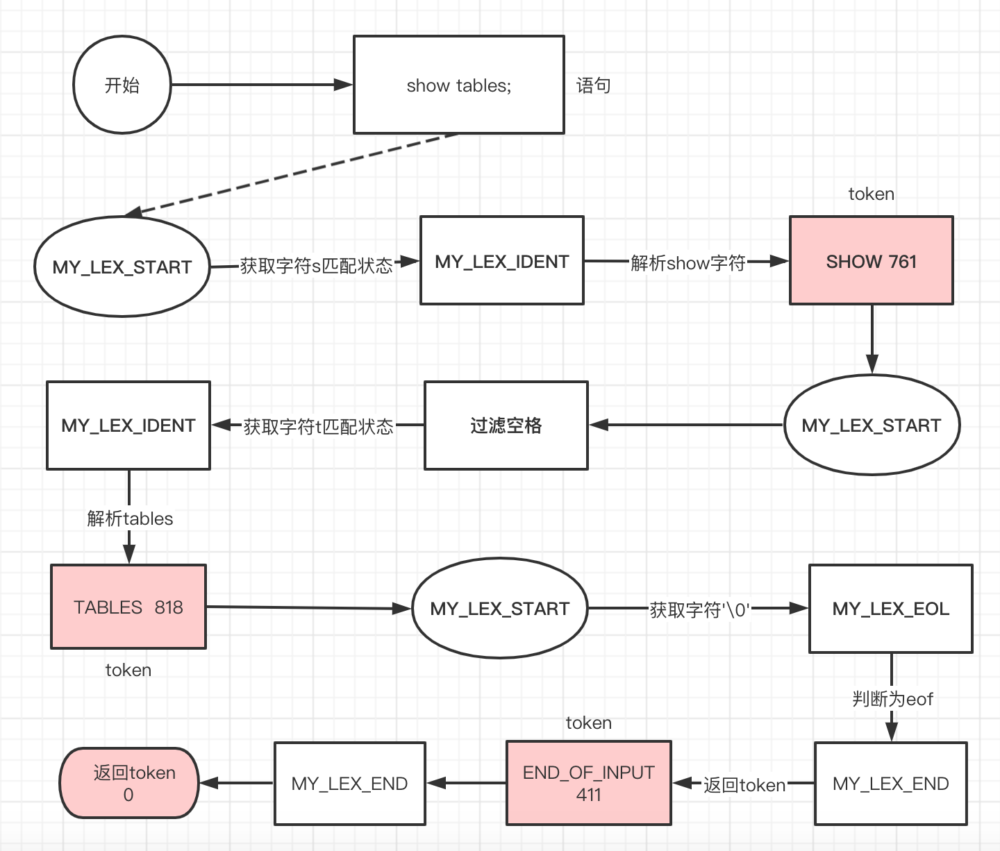
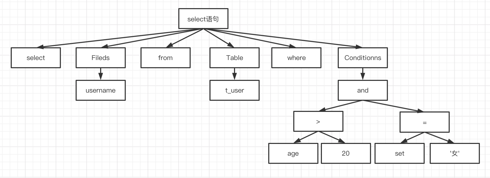
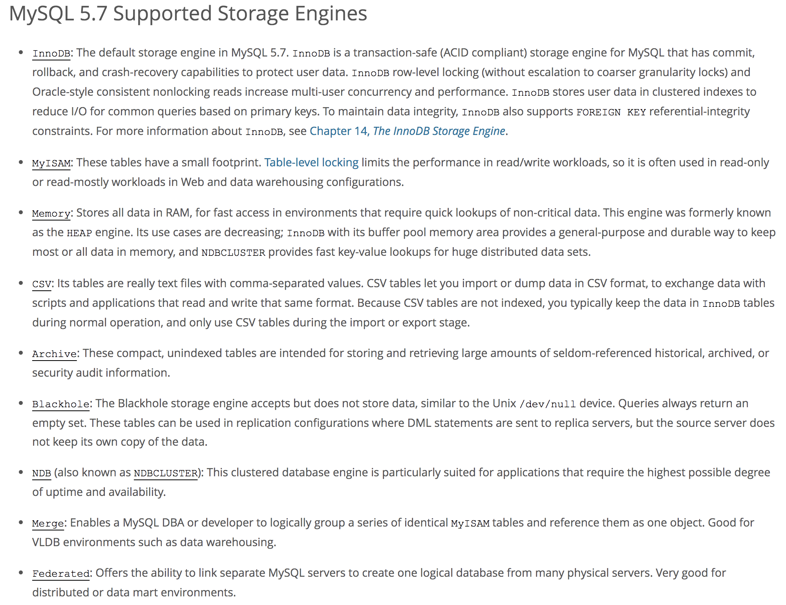
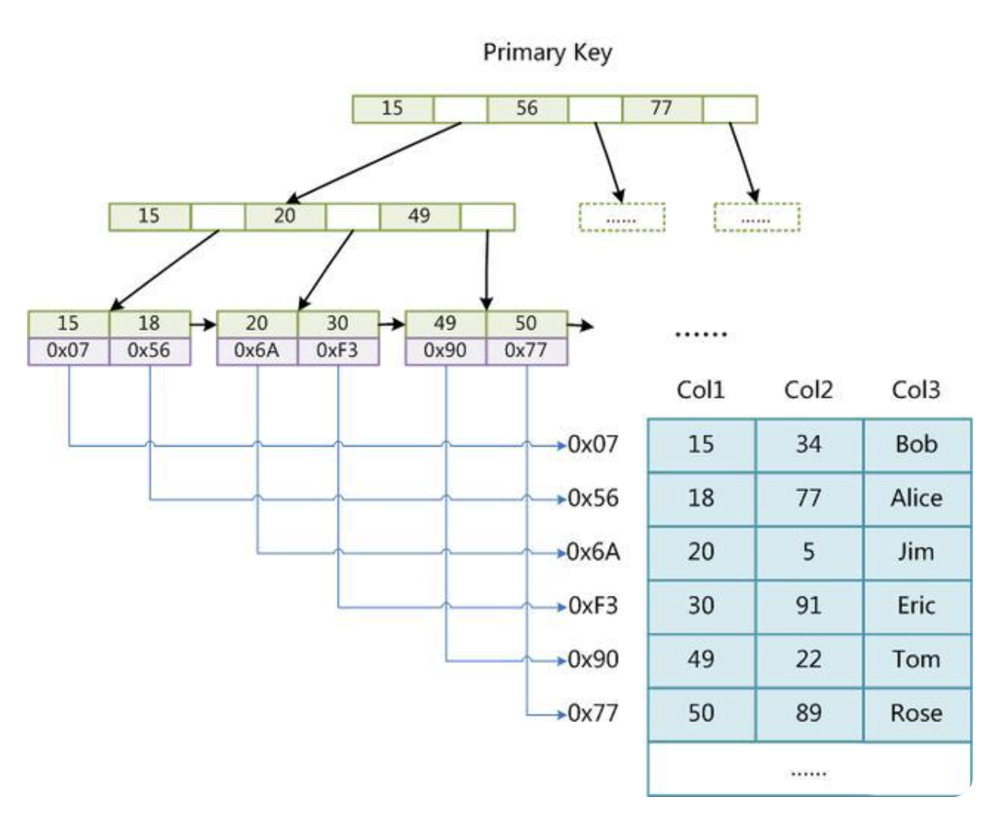
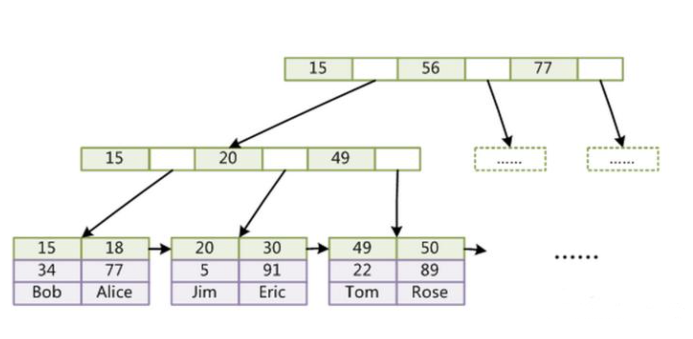
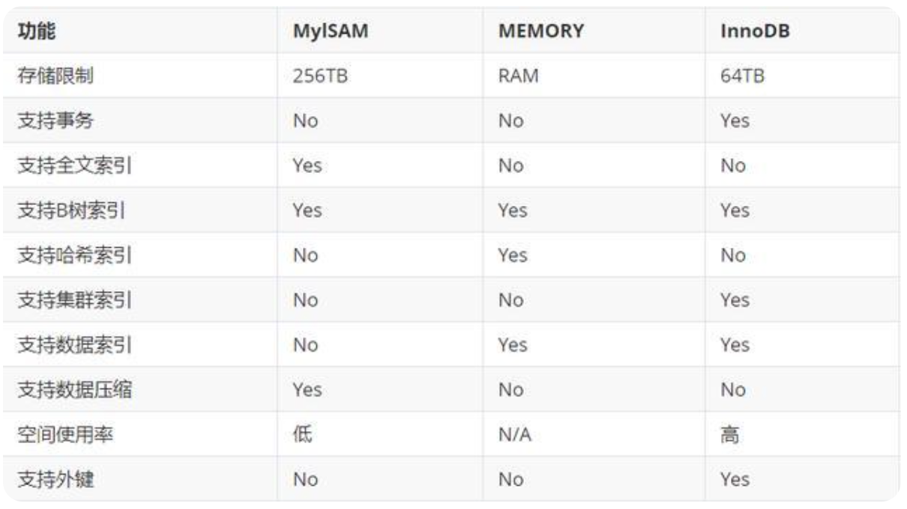

# MySQL查询流程篇

[TOC]

昨天我们一起学习了MySQL的背景以及整个架构。今天我们就通过一个SQL执行的过程具体分析一下具体的原理。

### 1、MySQL执行流程


上图描述了整个MySQL的执行流程。

我们的程序或者工具要操作数据库，第一步要做什么？就是跟数据库建立连接。

#### 1、连接

客户端和服务端的连接有多种多样，可以是同步的也可以是一步的，可以是长连接也可以是短连接。MySQL有专门的处理连接的模块，连接的时候需要验证权限。

我们如何查看MySQL有多少连接呢？可以用show status命令：

```shell
show global status like 'Thread%'
```

为什么连接数是查看线程呢？客户端的连接与服务端的线程有什么关系呢？

客户端每产生一个连接，在服务端就会创建一个线程来处理。这就是为什么有时候在处理生产上慢SQL的时候，会把线程kill掉的原因。

既然每个连接要创建一个线程，那肯定不能每个连接来的时候去创建线程，结束的时候去kill掉线程。因为这样会带来频繁的线程开销。所以就有了线程的池化技术。

既然有线程池了，如果线程池一直保持连接肯定会带来服务端资源的消耗。所以MySQL会把不活动的连接自动断开，那如何确定不活动的连接呢？有两个参数：

```shell l
show global variables like 'wait_timeout';//针对程序连接
show global variables like 'interactive_timeout';//针对工具连接
```

默认：28800秒。

既然有连接，那连接数量可以有没有限制呢？当然有，毕竟资源是有限的。在5.7版本中默认是151个，也可以手动设置。

```shell
show variables like 'max_connection';
```

在这里细心的朋友可能会发现，上面的命令都有global，这个为什么没有global呢？

因为`max_connection`这个参数只有全局的(global)，当没有参数的时候默认是`session`级别的。

客户端跟服务端建立连接之后呢？下一步要做什么呢？

#### 2、查询缓存

MySQL查询缓存保存查询返回的完整结果。当查询命中该缓存，MySQL会like返回结果，跳过了解析、优化和执行截断。

我们想象一下我们如何命中缓存呢？一般都是查询的条件作为key，结果作为value。如果key相同，命中缓存。MySQL判断缓存命中的方法很简单：缓存存放在一个引用表中，通过一个哈希值引用，这个哈希值包括了如下因素：

> 查询语句、当前要查询的数据库、客户端协议的版本等一些其他可能会影响返回结果的信息。

真的是这样吗？我们想象一下，如果查询语句中有时间(now)呢？那肯定是不正确的了。所以：当查询语句中有一些不确定的数据时，则不会被缓存。事实上，如果查询中包含任何用户自定义函数、存储函数、用户变量、临时表、mysql库中的系统表，或者任何包含列级别权限的表，都不会被缓存。

真的是这样的吗？等我们全文介绍完之后，再来分析一下。

假如说有缓存，那如果其中一条数据变更了呢？缓存必然要失效，因为这样才能保证数据的一致性。失效哪些缓存呢？是含有这条数据的缓存吗？如果是这样的话，一条数据变更需要检索所有缓存是否包含这条数据，成本太高！MySQL采用将含有这个表的数据的缓存都失效！

除此之外，如果一个大的结果集，可能查询出大量数据集。服务器的内存吃得消吗？

总结一下，命中缓存的要求苛刻，缓存失效的范围扩大，维护缓存的成本高。所以，MySQL的内存默认是不开启的。感兴趣的同学自己可以验证一下。

在MySQL 8.0中，查询缓存已经被移除了！

没有使用缓存的话，就会跳过缓存模块，下一步要做什么呢？

#### 3、语法解析和预处理

```shell
[Err] 1064 - You have an error in your SQL syntax; check the manual that corresponds to your MySQL server version for the right syntax to use near 'itliwei' at line 1
```

这个错误大家并不陌生！

它是怎么知道我们的SQL有错误的呢？这就是MySQL的语法解析和预处理的功能了。它主要包括什么功能呢？

##### 3.1、词法解析

词法分析即将输入的语句进行分词，解析出每个词的意义。分词的本质便是正则表达式的匹配过程，比较流行的分词工具应该是lex，通过简单的规则制定，来实现分词。



这个过程比较复杂，感兴趣的朋友可以仔细研究下。

#### 3.2、语法分析

第二步就是语法分析，语法分析会对SQL做一些语法检查，比如关键字有没有，然后根据MySQL定义的语法规则，根据SQL语句生成一个数据结构。这个数据结构叫做：解析树。



如上图所示，解析后的结构，类似于这样。

词法也解析了，语法也解析了。如果我们写的SQL语法合法，但是表名或者字段名不存呢？这时候能解析出错误吗？

#### 3.3、预处理

所有还有一个预处理的阶段。它会检查表和列名是否存在，检查名字和别名是否正确。这样如果有错误，也会在这个阶段就可以告出来。

得到了解析器之后，是不是就可以执行SQL语句了呢？

### 4、查询优化与执行计划

请问一个问题，数据库执行的SQL，是不是就是我们发送的SQL？

答案是否定的，就像java写的代码执行的顺序是否就是我们代码写的顺序？知道java指令重排的朋友都知道，会有一个优化的过程。SQL也是一样的！

那SQL如何进行优化呢？又如果评价优化的好坏呢？这就是优化器模块要做的事情。

查询优化器的目的就是根据上文得到的解析树生成不同的执行计划，然后选择一种最优的执行计划。

传统关系型数据库里面的优化器分为CBO和RBO两种。

> RBO： Rule_Based Potimizer 基于规则的优化器
>
> CBO—Cost_Based Potimizer 基于成本的优化器

MySQL里面使用的是基于开销(CBO)的优化器，哪种开销最小，就用哪种，这里的开销实际代表了MySQL根据相关统计信息计算出来目标SQL对应的步骤的IO，CPU等消耗。也就是意味着数据库里的成本实际上就是对于执行目标SQL所需要IO,CPU等资源的一个估计值。而成本值是根据索引，表，行的统计信息计算出来的。

如何查看开销呢？

```shell
show status like 'Last_query_cost'
```

MySQL的查询优化器是一个非常复杂的部件，它使用了非常多的优化策略来生成一个最优的执行计划：

- 重新定义表的关联顺序（多张表关联查询时，并不一定按照SQL中指定的顺序进行，但有一些技巧可以指定关联顺序）
- 优化MIN()和MAX()函数（找某列的最小值，如果该列有索引，只需要查找B+Tree索引最左端，反之则可以找到最大值，具体原理见下文）
- 提前终止查询（比如：使用Limit时，查找到满足数量的结果集后会立即终止查询）
- 优化排序（在老版本MySQL会使用两次传输排序，即先读取行指针和需要排序的字段在内存中对其排序，然后再根据排序结果去读取数据行，而新版本采用的是单次传输排序，也就是一次读取所有的数据行，然后根据给定的列排序。对于I/O密集型应用，效率会高很多）

哇塞，优化器做了这么牛逼的功能，是不是我们写SQL的时候就可以肆意写了？当然不是，并不是SQL语句都能被优化器优化，也不是每次都能选择到最优的优化计划。优化器优化后会生成一个**执行计划**。这个名字是不是熟悉了，对没错就是我们使用在我们SQL前面加上`EXPLAINN`查看的那个执行计划。

执行计划中有很多参数：

> 1、**id**： select 的序列号，尤其是有自查询的时候，会有多个SQL；
>
> 2、**select_type**：select_type 表示对应行是是简单还是复杂的查询
>
> 3、**table**：正在访问哪个表
>
> 4、**type**：关联类型或访问类型
>
> ​	index_merge:使用了索引合并
>
> ​	range:范围扫描
>
> ​	index:和ALL一样，不同就是mysql只需扫描索引树
>
> ​	ALL:即全表扫描
>
> 5、**possible_keys**：查询可能使用哪些索引来查找
>
> 6、**key**：采用哪个索引来优化对该表的访问
>
> 7、**key_len**：索引里使用的字节数
>
> 8、**ref**：在key列记录的索引中，表查找值所用到的列或常量
>
> 9、**rows**：mysql估计要读取并检测的行数
>
> 10、**Extra**：额外信息

得到执行计划后，SQL语句是不是可以执行了？

问题又来了，我们的数据放在了哪里？执行计划在哪里执行呢？

### 5、存储引擎

这里有三张表：


表面上看没有任何差别，默认情况下每个数据库都有一个自己的文件。我们看一下文件的目录：


首先任何一个表都有一个frm文件，这个是表结构定义文件。不同的是，不同的存储引擎数据的存放方式是不一样的。memory是没有数据文件，innodb是有一个数据文件，myisam是两个。

**为什么要有那么多的存储引擎呢？**

如果一张表需要很高的访问速度，不需要考虑持久化，是不是可以把数据放在内存里？

如果一张表，是用来做历史数据存档的，不需要修改，也基本不需要查询，是不是可以把数据压缩一下？

如果一张表用在读写并发很多的业务，是不是要支持读写不干扰？

所以MySQL就支持了多个存储引擎，供用户自己选择。

**那如何指定存储引擎呢？**

一张表的存储引擎，是在创建表的时候指定的。如果没有指定就是使用数据库默认的。5.6之后的默认的存储引擎是InnoDB，5.6之前默认的是MyISAM。

```sql
CREATE TABLE `need`.`<table_name>` (
	`id` bigint(20) NOT NULL AUTO_INCREMENT,
	`description` varchar(255) DEFAULT NULL COMMENT '描述',
	`url` varchar(1024) DEFAULT NULL COMMENT 'url地址',
	`type` int(1) DEFAULT 0 COMMENT '0：下架 1：上架',
	`del_flag` int(1) DEFAULT 0 COMMENT '删除状态 0 正常 1删除',
	`create_time` datetime DEFAULT NULL,
	`modify_time` datetime DEFAULT NULL COMMENT '类型',
	PRIMARY KEY (`id`)
) ENGINE=`InnoDB` AUTO_INCREMENT=1 DEFAULT CHARACTER SET utf8 COLLATE utf8_general_ci ROW_FORMAT=COMPACT COMMENT='' CHECKSUM=0 DELAY_KEY_WRITE=0;
```

**那如何选择存储引擎呢？**



从官网上可以看到，MySQL支持很多存储引擎。我们在此就简单介绍几个：

#### MyISAM:

> These tables have a small footprint. [Table-level locking](https://dev.mysql.com/doc/refman/5.7/en/glossary.html#glos_table_lock) limits the performance in read/write workloads, so it is often used in read-only or read-mostly workloads in Web and data warehousing configurations.

应用范围比较小，表级锁定限制了读写的性能，它常用于只读或者读多写少的场景。

使用这个存储引擎，每个MyISAM在磁盘上存储成三个文件。

（1）frm文件：存储表的定义数据

（2）MYD文件：存放表具体记录的数据

（3）MYI文件：存储索引

frm和MYI可以存放在不同的目录下。MYI文件用来存储索引，但仅保存记录所在页的指针，索引的结构是B+树结构。下面这张图就是MYI文件保存的机制：



从这张图可以发现，这个存储引擎通过MYI的B+树结构来查找记录页，再根据记录页查找记录。

有一个重要的特点那就是不支持事务，但是这也意味着他的存储速度更快，如果你的读写操作允许有错误数据的话，只是追求速度，可以选择这个存储引擎。

#### InnoDB

> The default storage engine in MySQL 5.7. `InnoDB` is a transaction-safe (ACID compliant) storage engine for MySQL that has commit, rollback, and crash-recovery capabilities to protect user data. `InnoDB` row-level locking (without escalation to coarser granularity locks) and Oracle-style consistent nonlocking reads increase multi-user concurrency and performance. `InnoDB` stores user data in clustered indexes to reduce I/O for common queries based on primary keys. To maintain data integrity, `InnoDB` also supports `FOREIGN KEY` referential-integrity constraints. 

MySQL 5.7中的默认存储引擎。 InnoDB是MySQL的事务安全（符合ACID）存储引擎，具有提交，回滚和崩溃恢复功能来保护用户数据。 InnoDB行级锁定（无需升级为更粗粒度的锁定）和Oracle风格的一致非锁定读取可提高多用户并发性和性能。 InnoDB将用户数据存储在聚集索引中，以减少基于主键的常见查询的I / O。 为了维护数据完整性，InnoDB还支持FOREIGN KEY引用完整性约束。

InnoDB是默认的数据库存储引擎，他的主要特点有：

（1）可以通过自动增长列，方法是auto_increment。

（2）支持事务。默认的事务隔离级别为可重复度，通过MVCC（并发版本控制）来实现的。

（3）使用的锁粒度为行级锁，可以支持更高的并发；

（4）支持外键约束；外键约束其实降低了表的查询速度，但是增加了表之间的耦合度。

（5）配合一些热备工具可以支持在线热备份；

（6）在InnoDB中存在着缓冲管理，通过缓冲池，将索引和数据全部缓存起来，加快查询的速度；

（7）对于InnoDB类型的表，其数据的物理组织形式是聚簇表。所有的数据按照主键来组织。数据和索引放在一块，都位于B+数的叶子节点上。



对于InnoDB来说，最大的特点在于支持事务。但是这是以损失效率来换取的。

#### Memory

> Stores all data in RAM, for fast access in environments that require quick lookups of non-critical data. This engine was formerly known as the `HEAP` engine. Its use cases are decreasing; `InnoDB` with its buffer pool memory area provides a general-purpose and durable way to keep most or all data in memory, and `NDBCLUSTER` provides fast key-value lookups for huge distributed data sets.

将所有数据存储在RAM中，以便在需要快速查找非关键数据的环境中进行快速访问。 该引擎以前称为HEAP引擎。 它的用例正在减少； InnoDB及其缓冲池存储区提供了一种通用且持久的方式来将大多数或所有数据保留在内存中，而NDBCLUSTER提供了针对大型分布式数据集的快速键值查找。

将数据存在内存，为了提高数据的访问速度，每一个表实际上和一个磁盘文件关联。文件是frm。

（1）支持的数据类型有限制，比如：不支持TEXT和BLOB类型，对于字符串类型的数据，只支持固定长度的行，VARCHAR会被自动存储为CHAR类型；

（2）支持的锁粒度为表级锁。所以，在访问量比较大时，表级锁会成为MEMORY存储引擎的瓶颈；

（3）由于数据是存放在内存中，一旦服务器出现故障，数据都会丢失；

（4）查询的时候，如果有用到临时表，而且临时表中有BLOB，TEXT类型的字段，那么这个临时表就会转化为MyISAM类型的表，性能会急剧降低；

（5）默认使用hash索引。

（6）如果一个内部表很大，会转化为磁盘表。

在这里只是给出3个常见的存储引擎。使用哪一种引擎需要灵活选择，一个数据库中多个表可以使用不同引擎以满足各种性能和实际需求，使用合适的存储引擎，将会提高整个数据库的性能。



MySQL同时支持这么多引擎，它是如何做到的呢？这是因为所有的存储引擎都遵循了一定的规范，提供了相同操作的接口，这些接口被称为handler API。这在我们设计模式中叫做策略模式！

存储引擎分析完了，他是用来存储数据的，那执行计划去操作哪个存储引擎呢？这个是有谁来管控呢？这就到了我们的执行引擎了。

### 6、执行引擎

查询过程中的每一张表由一个上文提到的API的handler实例表示。实际上，MySQL在查询优化阶段就为每一张表创建了一个handler实例，优化器可以根据这些实例的接口来获取表的相关信息，包括表的所有列名、索引统计信息等。这样它就知道使用哪个存储引擎去执行执行计划了。

到这里总算执行了，执行之后呢？

### 7、返回结果

查询执行的最后一个阶段就是将结果返回给客户端。即使查询不到数据，MySQL仍然会返回这个查询的相关信息，比如该查询影响到的行数以及执行时间等。

如果查询缓存被打开且这个查询可以被缓存，MySQL也会将结果存放到缓存中。

我们来想一下，如果结果集的数据很大，比如说100W，我们如何返回给客户端呢？等所有数据都准备好了，一块返回？

结果集返回客户端是一个增量且逐步返回的过程。有可能MySQL在生成第一条结果时，就开始向客户端逐步返回结果集了。这样服务端就无须存储太多结果而消耗过多内存，也可以让客户端第一时间获得返回结果。

到这里MySQL的执行流程已经介绍得差不多了，我们总结一下整个过程：

- 客户端和MySQL服务器建立连接，发送一条查询请求
- 服务器首先检查查询缓存，如果命中缓存，则立刻返回存储在缓存中的结果。否则进入下一阶段
- 服务器进行SQL解析、预处理、再由优化器生成对应的执行计划
- MySQL根据执行计划，调用存储引擎的API来执行查询
- 将结果返回给客户端，同时缓存查询结果

再回头看一下整个执行流程图：


是不是非常清晰了！

### 2、MySQL优化思路

介绍了上面的执行流程，我们如果要做数据库优化的话，可以从哪几个方面优化呢？

#### 连接池优化

我们可以根据数据库的使用状况，优化数据库的最大连接数，可线程存活时间。

#### 存储引擎优化

我们可以根据具体的数据的使用场景，选择不同的存储引擎，以便提升读和写的性能。

#### 表Scheme优化

选择数据类型只要遵循小而简单的原则就好，越小的数据类型通常会更快，占用更少的磁盘、内存，处理时需要的CPU周期也更少。

#### 索引优化

通过执行计划，看看数据库的查询有没有使用到相关索引，减少数据检索范围。这个具体的原则我们后面会介绍其原理的时候再详细说明。

#### 表设计优化

表设计的时候，适当字段冗余，减少数据的关联查询。

通过上文我们暂时就提到这几点优化，如果您有更多的优化思路，欢迎留言！

