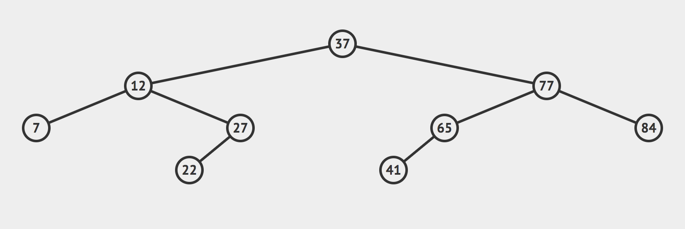
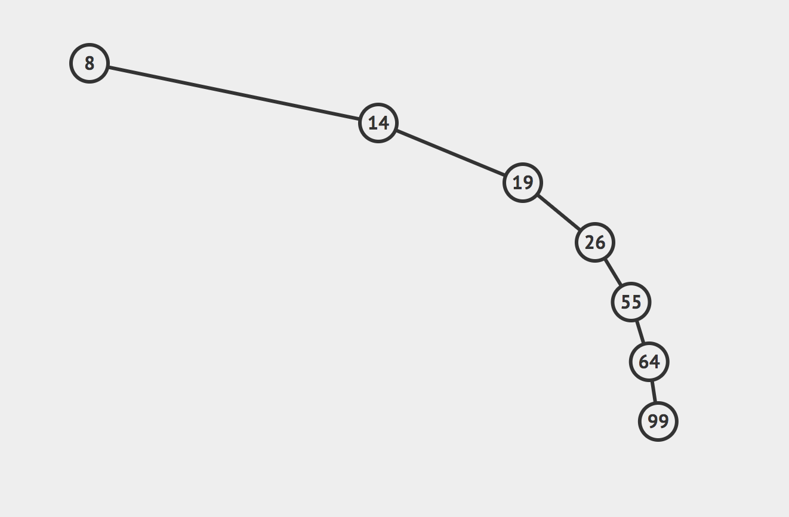
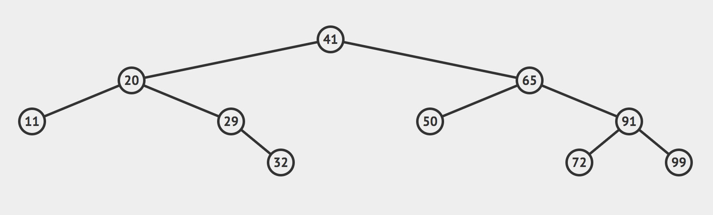
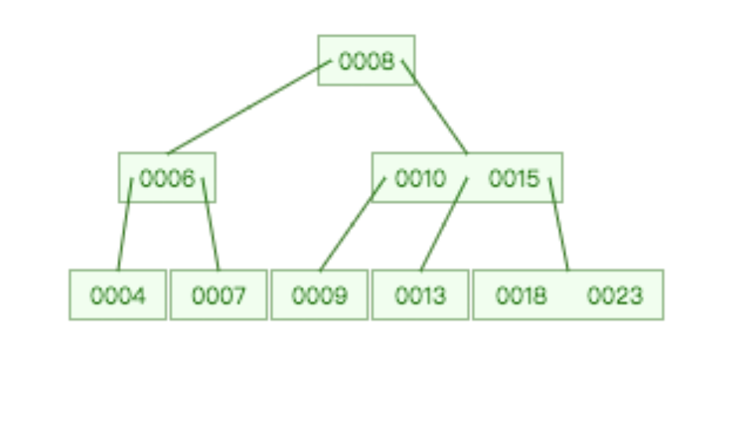
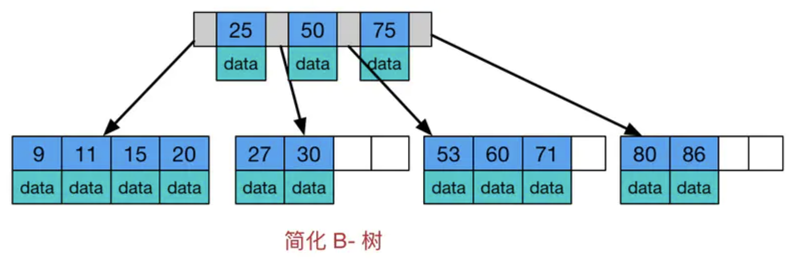
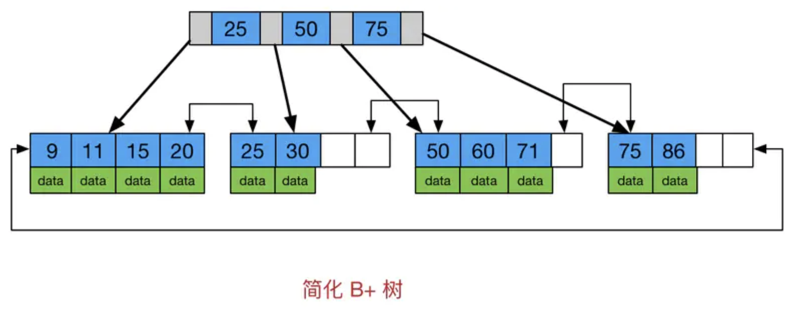
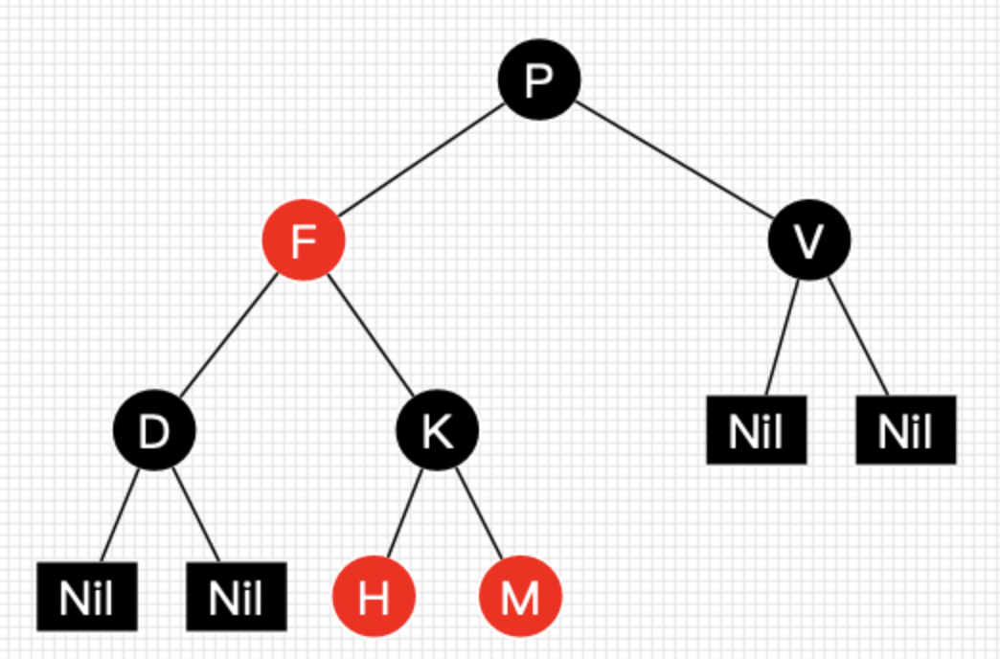
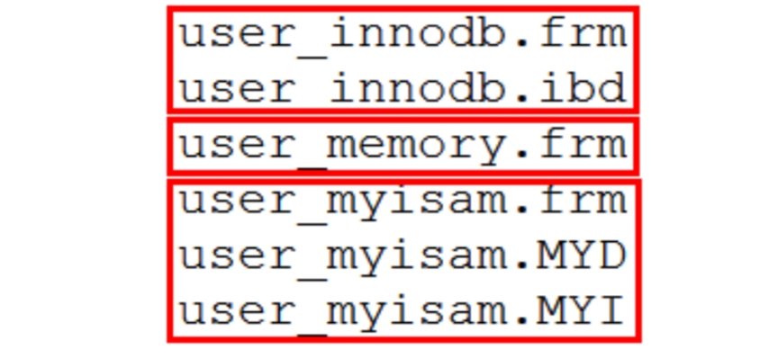
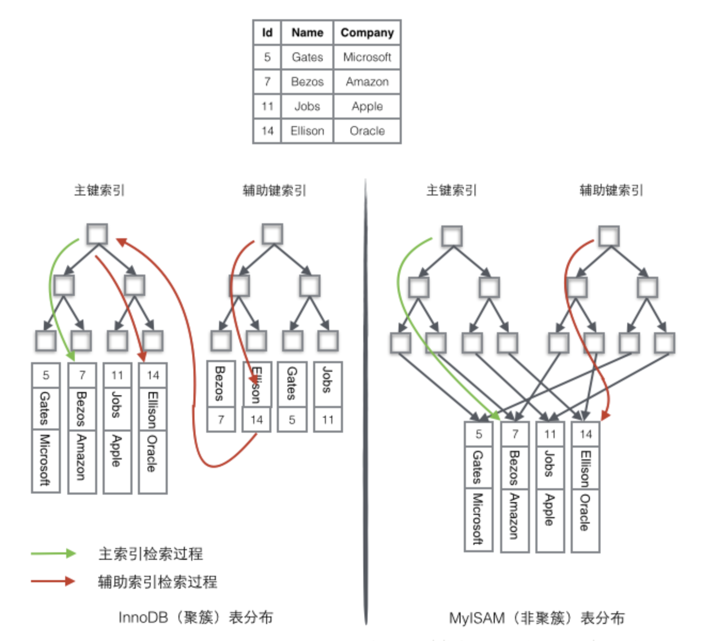
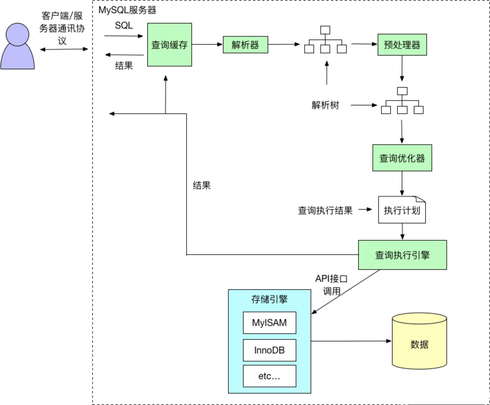

# MySQL索引篇

[TOC]

上一篇我们完整的介绍了事务，我们知道事务的锁本质上锁的是索引。这一篇我们就介绍一下什么是索引。谈起索引大家可能并不陌生，但是是索引呢？

维基百科的定义是：

> **索引**（英语：Index），又称**引得**，**通检**，**备检**，是一本书籍的重要组成部分，它把书中的重要名词罗列出来，并给出它们相应的页码，方便读者快速查找该名词的定义和含义。

可以看出其目标是快速查找！那接下来就讨论下怎么实现快速查找呢？

### 1.索引存储模型

#### 1.1 常用的查找算法

##### 1.1.1 顺序查找

​	对于任意一个序列以及一个给定的元素，将给定元素与序列中元素依次比较，直到找出与给定关键字相同的元素，或者将序列中的元素与其都比较完为止。

如果不幸，查到最后一个才查找到，就要遍历所有的数据。这就太坑爹了。在算法上有个可以衡量一个算法是否高校的指标，叫算法复杂度。以后讲数据结构的时候，再同大家详细介绍。顺序查找的算法复杂度为O(n)。

##### 1.1.2 二分查找

​	假设表中元素是按升序排列，将表中间位置记录的关键字与查找关键字比较，如果两者相等，则查找成功；否则利用中间位置记录将表分成前、后两个子表，如果中间位置记录的关键字大于查找关键字，则进一步查找前一子表，否则进一步查找后一子表。重复以上过程，直到找到满足条件的记录，使查找成功，或直到子表不存在为止，此时查找不成功。

不难看出，二分查找的算法更优越一些。其算法复杂度为O(log n)。

所以我们可以让有序数组作为索引的数据结构。

#### 1.2 常用数据结构

##### 1.2.1 有序数组

有序数据查询效率比较高，但是更新一个数据的时候，需要挪动大量的数据，而数据的更新操作会很频繁，所以有序数据不太合适，这时候我们可能会想到令一种数据结构——链表。链表可以有效解决数据修改带来的效率问题。但是查找的效率还不够高。

那有没有支持二分查找的链表呢？

所以有了另一种数据结构——二叉查找树！

##### 1.2.2 二叉查找树(BST)

二叉查找树(搜索)(Binary Search Tree)又称二叉排序树(Binary Sort Tree)。

二叉查找树有什么特点呢？

1.若它的左子树非空，则左子树上所有结点的值均小于根结点的值；

2.二叉排序树中，各结点关键字是惟一的。



如图，二叉查找树可以实现二分查找，同时也可以实现快速插入。

我们可以想象一下，一个极端的情况：



如图所示，二叉搜索树可能退化成链表，相应的，二叉搜索树的查找操作是和这棵树的高度相关的，而此时这颗树的高度就是这颗树的节点数n，同时二叉搜索树相应的算法全部退化成 O(n) 级别。

所以，我们有没有左右子树深度相差不大，更加平衡的树呢？

##### 1.2.3 平衡二叉树(AVL)

**AVL树**（Adelson-Velsky and Landis Tree）是计算机科学最早被发明的自平衡二叉查找树。在AVL树中，任一节点对应的两棵子树的最大高度差为1，因此它也被称为**高度平衡树**。查找、插入和删除在平均和最坏情况下的时间复杂度都是O(log {n})增加和删除元素的操作则可能需要借由一次或多次树旋转，以实现树的重新平衡。

至于它是如何平衡的在此就不做过多介绍了，以后会做详细介绍。



如图所示，它通过旋转可以达到树的平衡，这样树的深度基本一致，顶多会错一层。

不平衡的问题我们解决了，但是如果数据量特别大(比如上百万、千万条数据)，树的深度依然会很大。进而会造成查询的性能依然会很低。

那该如何解决呢？这时候我们的树就不能只是二叉了，而应该变成多叉，从而减少树的深度。

##### 1.2.4 多路平衡查找树(B-Tree)

多路平衡查找树(B-Tree) 可以拥有2个以上的节点，如图所示：

这样就有效降低了树的深度，从而保障了检索性能。

B-Tree适用于读写相对大的数据块的存储系统，例如磁盘。B-Tree减少定位记录时所经历的中间过程，从而加快存取速度。B-Tree这种数据结构可以用来描述外部存储。这种数据结构常被应用在数据库和文件系统的实现上。

到这里似乎一切都完美了！

我们想象一下，这是我们索引的数据结构，每个索引要指向具体的数据，所以在MySQL里的B-Tree的数据存储应该是这样的：



在B-Tree结构中每个节点不仅存储数据的key值，还存储数据的data值。而我们知道操作系统的每一个页的存储空间是有限的，如果data数据较大时将会导致每个节点（即一个页）能存储的key的数量很小，当存储的数据量很大时同样会导致B-Tree的深度较大，增大查询时的磁盘I/O次数，进而还是会影响查询效率。

其次，这时候我们可以看到，如上图如果查询的是17，直接在第一层就查到了，如果查询的是3，要检索到第3层才可以查到。同样的一个查询，但是查询的效率可能相差数倍，会为我们带来很大的困扰。

那如何解决呢？

##### 1.2.5 加强版平衡多叉树(B+Tree)

B+Tree是B-Tree的加强版，其主要特点包括：

> 1.所有关键字存储在叶子节点，非叶子节点不存储真正的data；
>
> 2.为所有叶子节点增加了一个链指针。



这样B+Tree里由于不存放数据，操作系统的每页就能存放更多的数据，从而提高检索效率，其次只有叶子节点才存放数据，每次检索都会检索到叶子节点，检索的性能更平稳。除此之外，叶子节点之间有一个下一个数据区的指针，从而形成链表，排序能力更强。

这就是为什么索引选用B+Tree的原因了。

##### 1.2.6 树的深度

细心的小伙伴可能会问，数的深度怎么解决的呢？

我们一起来计算一下：

在计算机中磁盘存储数据最小单元是扇区，一个扇区的大小是512字节，而文件系统（例如XFS/EXT4）他的最小单元是块，一个块的大小是4k，而对于我们的InnoDB存储引擎也有自己的最小储存单元——页（Page），一个页的大小是16K。在MySQL中我们的InnoDB页的大小默认是16k，当然也可以通过参数设置。

这里我们先假设B+树高为2，即存在一个根节点和若干个叶子节点，那么这棵B+树的存放总记录数为：根节点指针数*单个叶子节点记录行数。

上文我们已经说明单个叶子节点（页）中的记录数=16K/1K=16。（这里假设一行记录的数据大小为1k，实际上现在很多互联网业务数据记录大小通常就是1K左右）。

那么现在我们需要计算出非叶子节点能存放多少指针，其实这也很好算，我们假设主键ID为bigint类型，长度为8字节，而指针大小在InnoDB源码中设置为6字节，这样一共14字节，我们一个页中能存放多少这样的单元，其实就代表有多少指针，即`16384(16K)/14=1170`。那么可以算出一棵高度为2的B+树，能存放`1170*16=18720`条这样的数据记录。

根据同样的原理我们可以算出一个高度为3的B+树可以存放：`1170*1170*16=21902400`条这样的记录(一条数据1k的话，高为3的B+数就可以存放20G的数据)。所以在InnoDB中B+树高度一般为1-3层，它就能满足千万级的数据存储。在查找数据时 **一次页的查找代表一次IO**， 所以通过主键索引查询通常 **只需要1-3次IO操作** 即可查找到数据。

##### 1.2.7 为什么不适用红黑树

红黑树是一种特化的AVL树（平衡二叉树），都是在进行插入和删除操作时通过特定操作保持二叉查找树的平衡，从而获得较高的查找性能。

红黑树的特点：

1. 结点是红色或黑色；

2. 根结点是黑色；

3. 所有叶子都是黑色（叶子是NIL结点） ；

4. 每个红色结点的两个子结点都是黑色（从每个叶子到根的所有路径上不能有两个连续的红色结点）；

5. 从任一节结点其每个叶子的所有路径都包含相同数目的黑色结点。



基于以上特性，我们可以看到红黑树只有两叉，数据量大的情况检索效率低，其次是不够平衡，性能不够稳定。

红黑树一般只放在内存里，比如java中的HashMap的实现。

### 2.MySQL的存储结构

这里有三张表：


表面上看没有任何差别，默认情况下每个数据库都有一个自己的文件。我们看一下文件的目录：



首先任何一个表都有一个frm文件，这个是表结构定义文件。不同的是，不同的存储引擎数据的存放方式是不一样的。memory是没有数据文件，innodb是有一个数据文件，myisam是两个。

#### 2.1 MyISAM

MyISAM索引文件和数据文件是分离的，索引文件仅保存记录所在页的指针（物理位置），通过这些地址来读取页，进而读取被索引的行。


上图很好地说明了树中叶子保存的是对应行的物理位置。通过该值，存储引擎能顺利地进行回表查询，得到一行完整记录。同时，每个叶子页也保存了指向下一个叶子页的指针。从而方便叶子节点的范围遍历。

而对于二级索引，在 MyISAM存储引擎中以与主键索引的实现一样，可以看出MyISAM的索引文件仅仅保存数据记录的地址。

#### 2.2 InnoDB

InnoDB 存储引擎采用聚集索引的数据存储方式实现B-Tree索引，所谓“聚集”，就是指数据行和相邻的键值紧凑地存储在一起，注意 InnoDB 只能聚集一个叶子页（16K）的记录（即聚集索引满足一定的范围的记录），因此包含相邻键值的记录可能会相距甚远。InnoDB的数据文件本身要按主键聚集，所以InnoDB要求表必须有主键。


而InnoDB的二级索引，是通过索引到主键索引上之后，在检索到数据。

这里大家可能会迷惑，聚集索引和非聚集索引的区别是什么？

 为了更形象说明这两种索引的区别，我们假想一个表如下图存储了4行数据。其中Id作为主索引，Name作为辅助索引。如下图：



看上去聚簇索引的效率明显要低于非聚簇索引，因为每次使用辅助索引检索都要经过两次B+树查找，这不是多此一举吗？

我们不要忘了，InnoDB中索引和数据是一体的，我们在加载索引的时候，就加载了数据。所以一旦找到叶子节点就可以立即返回数据。

其次，辅助索引使用主键作为"指针" 而不是使用地址值作为指针呢？因为地址是会变的。InnoDB在数据位置变动时无须更新辅助索引中的这个"指针"，辅助索引树都不受影响。

有的小伙伴可能会问了，如果一张表没有**主键**怎能办呢？

1、如果我们定义了主键，那么InnoDB会使用主键作为聚集索引；

2、如果我们没有定义主键，InnoDB会选择一个不包含NULL的唯一索引作为主键；

3、如果也没有这样的索引，InnoDB会选择内置的6个字节的ROWID作为隐藏的聚集索引。

### 3.MySQL其他索引

#### 3.1 联合索引

联合索引是指对表上的多个列进行索引，联合索引也是一棵B+树，不同的是联合索引的键值数量不是1，而是大于等于2。

为什么要使用联合索引呢？

- **减少开销**。建一个联合索引(col1,col2,col3)，实际相当于建了(col1),(col1,col2),(col1,col2,col3)三个索引。每多一个索引，都会增加写操作的开销和磁盘空间的开销。对于大量数据的表，使用联合索引会大大的减少开销！
- **效率高**。索引列越多，通过索引筛选出的数据越少。有1000W条数据的表，有如下sql:select *from table where col1=1 and col2=2 and col3=3,假设假设每个条件可以筛选出10%的数据，如果只有单值索引，那么通过该索引能筛选出1000W*10%=100w条数据，然后再回表从100w条数据中找到符合col2=2 and col3= 3的数据，然后再排序，再分页；如果是联合索引，通过索引筛选出1000w*10%* 10% *10%=1w，效率提升可想而知！
- **覆盖索引**。对联合索引(col1,col2,col3)，如果有如下的sql: select col1,col2,col3 from test where col1=1 and col2=2。那么MySQL可以直接通过遍历索引取得数据，而无需回表，这减少了很多的随机io操作。减少io操作，特别的随机io其实是dba主要的优化策略。所以，在真正的实际应用中，覆盖索引是主要的提升性能的优化手段之一。

但是它也有缺点的：

每多一个索引，都会增加写操作的开销和磁盘空间的开销。联合索引越多，索引列越多，则创建的索引越多，索引都是存储在磁盘里的，增删改的同时，需要更新索引，同样是需要花时间的，并且索引所占的磁盘空间也不小。

##### 3.1.1 最左匹配原则

所谓最左原则指的就是如果你的 SQL 语句中用到了联合索引中的最左边的索引，那么这条 SQL 语句就可以利用这个联合索引去进行匹配，值得注意的是，当遇到范围查询(>、<、between、like)就会停止匹配。

注意：sql语句中字段的顺序不需要和联合索引中定义的字段顺序一致，查询优化器会自己调整顺序。

对于联合索引(col1,col2,col3)，

问题一：查询语句`SELECT * FROM student WHERE col2 = 1 ;`是否能够触发索引？答案是一定的。因为联合索引相当于多个字段都有索引，如果查找单个字段是经过索引的。

问题二：查询语句`SELECT * FROM student WHERE col2 = 2 and col1 = 1 ;`是否能过触发索引？答案是不一定。根据最左匹配原则，很多人会说不会使用索引，但是别忘了SQL解析器会对SQL进行解析。它可能会使用索引。

##### 3.1.2 覆盖索引

上文中提到了覆盖索引，那究竟什么是覆盖索引呢？

如果一个查询语句只需要从辅助索引中就可以得到查询记录，而不需要查询聚集索引中的记录，我们称之为**覆盖索引**。就是说查询可以直接从索引中取得相应的值，不需要再通过主键索引去查询，这样的好处是显而易见的，由于减少了一次索引过渡，所以可以极大的增快查询速度。

除此之外，对于select count(*) from users这个查询表记录数的sql，通过遍历聚集索引和辅助索引都可以得到结果，但优化器会选择辅助索引，因为辅助索引需要的IO操作少于聚集索引。

举个例子：我们给name、age属性建立了联合索引

```sql
select name,age from t_user where name='itliwei';
```

这样就不会再回到聚集索引查找具体数据内容了。

##### 3.1.3 索引下推

索引下推（index condition pushdown ）简称ICP，在Mysql5.6的版本上推出，用于优化查询。

说到ICP，我们还是要先看一下MySQL的执行流程图：



我们可以将存储引擎和上面的查询逻辑层(服务器层)分为两层，所谓的ICP，就是将查询逻辑层(服务器层)的逻辑处理交给存储引擎去处理。

在不使用ICP的情况下，在使用辅助索引进行查询时，存储引擎通过索引检索到数据，然后返回给服务器层，服务器然后判断数据是否符合条件 。

在使用ICP的情况下，如果存在某些被索引的列的判断条件时，服务器层将这一部分判断条件传递给存储引擎，然后由存储引擎通过判断索引是否符合服务器层传递的条件，只有当索引符合条件时才会将数据检索出来返回给MySQL服务器 。

这样就可以减少存储引擎查询的次数，也可以减少MySQL服务器从存储引擎接收数据的次数。

举个例子：我们给name、age属性建立了联合索引

```sql
select * from t_user where name like'李%' and age = 18;
```

不适用ICP的情况下，服务器会调用存储引擎查询name姓李的，然后查出所有数据之后返回给服务器，服务器需要再将检索条件age=18再次调用存储引擎去查询，从而得到结果。

如果使用ICP的情况下，服务器会将查询条件name姓李的和age=18都传给存储引擎，存储引擎会根据传过来的条件自己去查询name姓李的，然后存储引擎将结果过滤，从而得到最终结果。就样就有效减少了查询次数，从而提升了检索效率。

#### 3.2 Hash索引

顾名思义，这不是一个B+Tree数据结构的索引，而是一个hash表。

哈希索引基于hash表实现，类似于Java中的HashMap，通过计算key的hash值映射对应的value，在不发生hash冲突的情况下时间复杂度为常数级别，MySQL的hash索引会对所有的索引列计算一个hash码，由于hash的索引的特点，它的缺点也显而易见，只有精确匹配索引所有列的查询才有效，hash索引数据也并不是按照索引值顺序存储的，所以也无无法用于排序，只支持等值查询，不支持范围查询。它是Memory引擎的默认索引类型，也是Memory引擎速度快的原因之一。

#### 3.3 Full Text索引

这是一种特殊类型的索引，它查找的是文本中的关键词，而不是直接比较索引中的值。全文索引可以在CHAR、VARCHAR或者TEXT类型的列上创建。MySQL 5.7.xx之前只有MyISAM存储引擎支持全文索引。

全文索引更类似于搜索引擎做的事情，实际生产中我们一般不会使用MySQL来做类似搜索引擎的工作。要做搜索的话一般都是使用专业的搜索相关开源工具，从最早的solr到现在的Elasticsearch（主要通过倒排索引，分词等来实现），它们的性能更好，功能也更加强大。

#### 3.4 空间索引

空间索引是对空间数据类型的字段建立的索引，MySQL中的空间数据类型有4中，分别是：
geometry、point、linstring和polygon 。MySQL使用SPATIAL关键字进行扩展，使得能够用于创建空间索引的列，必须将其声明为NOT NULL，同样，在MySQL 5.7.xx之前，空间索引只能在存储引擎为MyISAM的表中创建。

### 4.如何创建索引

##### 4.1 创建索引原则

索引可以提高检索效率，是不是索引越多越好呢？肯定不是！

原因有几点：

- 创建索引和维护索引要耗费时间，并且随着数据量的增加所耗费的时间也会增加。
- 索引需要占磁盘空间，除了数据表占数据空间之外，每一个索引还要占一定的物理空间，如果有大量的索引，索引文件可能比数据文件更快达到最大文件尺寸。
- 当对表中的数据进行增加、删除和修改的时候，索引也要动态地维护，这样就降低了数据的维护速度。

那么什么情况下适合创建索引，以及如何创建索引呢？

- 经常用于查询的字段应该创建索引；
- 在条件表达式中经常用到的且散列度高的列创建索引；

- 在频繁进行排序或分组的列上建立索引，如果排序的列有多个，可以创建组合索引；
- 数据量小得表最好不要创建索引，由于数据较少，查询花费的时间可能比遍历索引的时间还要长；
- 避免对经常更新的数据创建索引，因为变更后需要重新维护索引。

那如何创建索引呢？

##### 4.2 如何创建索引

1、创建普通索引

```sql
mysql> create index bknameidex on book1(bookname); 
```

2、创建单列索引

```sql
mysql> create index bkcmtidex on book1(comment(50));
```

3、创建组合索引

```sql
mysql> create index bkauthandinfoidex on book1(authors,info);
```

4、创建全文索引

```sql
mysql> create fulltext index fullidx on book(info);
```

5、创建唯一性索引

```sql
mysql> create unique index uniqidx on book1(bookid);
```