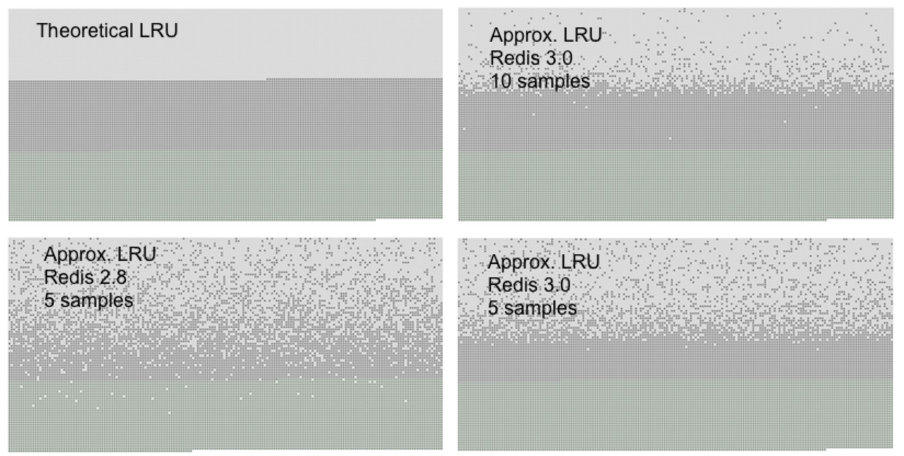

# Redis原理篇

[TOC]

### 一、Redis的线程模型

Redis作为一个高效的KV数据库。它的高效除了在内存存储、巧妙的数据结构外，还有就是它的线程模型。

大家都知道Redis是单线程的。这里说的单线程其实是指处理客户端的请求是单线程的，可以把它叫做主线程。从4.0的版本之后，还引入了一些线程处理其他的事情，比如处理脏数据、bigkey的删除等等。然而把处理请求设置成单线程有什么好处呢？这样岂不是不能很好的利用CPU的多核的优势了？那是因为Redis中单线程已经够用了， CPU不是Redis的瓶颈，它的瓶颈是在内存或者网络带宽。

哦，那单线程有哪些优点呢？

1、没有创建线程、销毁线程带来的开销

2、避免了CPU上下文切换造成的开销

3、避免了线程之间带来的竞争

这里需要注意一下，正因为请求处理是单线程的，所以就有一些耗时的操作禁止在生产环境使用，比如keys，flushall，flushdb等，会造成请求被阻塞。

我们现在想象一下，每个请求的整个过程：

1. 等待请求数据数据从客户端发送过来
2. 将请求数据从内核复制到用户进程的缓冲区（buffer）
3. 对请求数据进行处理（对于 redis 而言，一般就是简单的 get/set）

由于第2、3步在内存中简单操作，很快，主要的耗时在第1步整个网络I/O。如果每个请求都要经历这三步，那么如果请求量很大呢，由于是单线程处理就会造成阻塞。所以Redis选择了将第1步统一打包给第三方(操作系统)，让操作系统帮忙完成第1步，等到这些请求里的一个或多个走完了第1步，就将一个集合交给这个线程，并说，我这里收集到了几个走完第一步的请求，你去走2、3步吧，于是线程拿着这个集合去遍历，等遍历结束之后。又去检查操作系统那儿有没有走完第1步的请求，如此循环往复。

这样是不是就很高效了。这种模式就叫做：**I/O多路复用**！

> I/O指的是网络I/O。
>
> 多路指的是多个TCP连接(socket)
>
> 复用指的是复用一个线程

如下图所示：


客户端在操作的时候，会产生具有不同事件类型的socket。在服务端I/O多路复用会把消息放入到队列中，通过文件分派器转发到不同的事件处理器中。

内核会监听多路复用器负责的所有socket，当任何一个socket的数据处理结束了，多路复用器就返回。这时候用户进程再执行其他步骤(上文中的2，3)。

对于不同操作系统的 I/O 多路复用实现方式是不同呢，比如 epoll，select，kqueue 等，redis 有各自的版本，但接口统一。


他们的实现方式各有不同，以后有机会再做介绍。

接下来看下源码感受一下：

首先看一下redis的主干部分：

```c
int main(int argc, char **argv) {
    ......

    // 初始化服务器配置，主要是填充 redisServer 结构体中的各种参数
    initServerConfig();

    ......

    // 初始化服务器
    initServer();

    ......

    // 进入事件循环
    aeMain(server.el);
}
```

aeMain()：

```c
void aeMain(aeEventLoop *eventLoop) {
    eventLoop->stop = 0;
    while (!eventLoop->stop) {
        // 进入事件循环可能会进入睡眠状态。在睡眠之前，执行预设置
        // 的函数 aeSetBeforeSleepProc()。
        if (eventLoop->beforesleep != NULL)
            eventLoop->beforesleep(eventLoop);
        // AE_ALL_EVENTS 表示处理所有的事件
        aeProcessEvents(eventLoop, AE_ALL_EVENTS);
    }
}
```

可以看到这里有个eventLoop的while循环用来监听不同的事件。继续跟进源码，截取部分processEvents()代码:

```c
static int aeApiPoll(aeEventLoop *eventLoop, struct timeval *tvp) {
    aeApiState *state = eventLoop->apidata;
    int retval, j, numevents = 0;

    /*
    真有意思，在 aeApiState 结构中：
    typedef struct aeApiState {
        fd_set rfds, wfds;
        fd_set _rfds, _wfds;
    } aeApiState;
    在调用 select() 的时候传入的是 _rfds 和 _wfds，所有监听的数据
    在 rfds 和 wfds 中。
    在下次需要调用 selec() 的时候，会将 rfds 和 wfds 中的数据拷贝
    进 _rfds 和 _wfds 中。*/
    memcpy(&state->_rfds,&state->rfds,sizeof(fd_set));
    memcpy(&state->_wfds,&state->wfds,sizeof(fd_set));
	/* 时间单位是毫秒 */
    retval = select(eventLoop->maxfd+1,
                &state->_rfds,&state->_wfds,NULL,tvp);
    /* 有事件被激活 */
    if (retval > 0) {
                /* 保存所有激活的事件，将其文件描述符和激活原因保存在fired数组中 */
        for (j = 0; j <= eventLoop->maxfd; j++) {
            int mask = 0;
            aeFileEvent *fe = &eventLoop->events[j];

            if (fe->mask == AE_NONE) continue;
            if (fe->mask & AE_READABLE && FD_ISSET(j,&state->_rfds))
                mask |= AE_READABLE;
            if (fe->mask & AE_WRITABLE && FD_ISSET(j,&state->_wfds))
                mask |= AE_WRITABLE;

            // 添加到触发事件表中
            eventLoop->fired[numevents].fd = j;
            eventLoop->fired[numevents].mask = mask;
            numevents++;
        }
    }
    /* 返回激活事件的个数 */
    return numevents;
}
```

可以看到，aeApiPoll 即是 IO 多路复用调用的地方，当有请求到来的时候，进程会觉醒以处理到来的请求。

到这里总结一下：

Redis抽象了一套事件模型，将IO事件和时间事件融入一起，同时借助多路复用机制的回调特性，使得IO读写都是非阻塞的，实现高性能的网络处理能力。

那么问题来了，Redis6.0之后，Redis新版本支持了多线程到底是怎么回事呢？

前面也提到了，Redis的瓶颈在网络I/O。如何提高网络I/O呢？

1. 提高网络 IO 性能，典型的实现像使用 DPDK 来替代内核网络栈的方式
2. 使用多线程充分利用多核，典型的实现像 Memcached

严格意义上讲Redis 4.0 之后就引入了多线程来处理一些耗时的工作和后台工作，比如清除无效key，清除bigkey等。而6.0所说的多线程，确切地说是叫做多线程I/O，而不是说接收客户端请求变成多线程了。

我们上文提到了服务端的数据返回给客户端，需要从内核空间copy到用户线程，然后写到socket，这个过程是可以使用多线程的。处理请求依然是单线程的，所以也不存在线程安全问题。

到这里Redis的线程模型基本介绍完毕了，但是还有很多概念以及思考需要更深入的研究和学习。

接下来就是Redis数据的存储的问题了。Redis作为一个内存的KV数据库，不可能无限制的使用内存。如果内存满了会怎么办呢？我们一起来看一下Redis的内存回收原理。

### 二、Redis内存回收

首先我们知道Redis的key是可以设置过期时间的，如果让你实现key过期有哪几种思路呢？

#### 过期策略

Redis中有三种过期策略。

##### 1、立即过期

每个设置过期时间的key都会创建一个定时器，到期后立即清除。这个方案的问题是会有太多的定时器，比较消耗CPU。

##### 2、惰性过期

只有当访问一个key的时候，才会判断这个key是否已经过期，过期则删除。这个方案的问题是如果有大量的过期key没有被访问，岂不是一直占用着内存空间。

##### 3 定期过期

每隔一段时间扫描数据库中的expires字典中的key，清除掉已经过期的。可以看到这是一个折中方案，是在CPU和内存中取得了一个平衡。

Redis中同时使用了惰性过期和定期过期的两种策略，并不是实时清除过期的key的。

那么问题来了，如果有的过期的key没有删除，这时候Redis的内存满了，怎么办？

#### 淘汰策略

于是就有了内存淘汰机制，用来在Redis内存达到了极限的时候决定清除掉哪些数据。这个内存的最大值通过`maxmemory`参数配置。如果不设置或设置为0，32位的操作系统最多为3G，64位的操作系统不限制。

LRU: Least Recently Used 最近最少使用。判断最近被使用的时间最远优先淘汰；

LFU：Least Frequently Used 最不常用。按照使用频率删除。

random：随机删除

这三种淘汰策略，再加上2种数据类型 volatile(设置了ttl)和allkeys(所有key)。进行一下排列组合，共得到6种淘汰策略：

> 1. allkeys-lru：加入键的时候，如果过限，首先通过LRU算法驱逐最久没有使用的键
>
> 2. volatile-lru：加入键的时候如果过限，首先从设置了过期时间的键集合中驱逐最久没有使用的键
>
> 3. allkeys-random：加入键的时候如果过限，从所有key随机删除
>
> 4. volatile-random：加入键的时候如果过限，从过期键的集合中随机驱逐
>
> 5. volatile-lfu：从所有配置了过期时间的键中驱逐使用频率最少的键
>
> 6. allkeys-lfu：从所有键中驱逐使用频率最少的键

除此之外，也可以不淘汰任何key：

> 7. noeviction：当内存使用超过配置的时候会返回错误，不会驱逐任何键

也可以从设置ttl的将要过期的删除：

> 8. volatile-ttl：从配置了过期时间的键中驱逐马上就要过期的键

到这里淘汰策略介绍完了，总结一下：建议使用`volatile-lfu`删除最近最少使用的来保证正常服务。

接下来就看一下淘汰策略的具体是怎么实现的。

#### LRU淘汰原理

传统的LRU：链表+HashMap实现。

设置链表长度，如果新增或者被访问就移动到头节点。超过链表长度，末尾的节点被删除。

Redis中的LRU与传统的LRU实现并不相同，传统LRU会准确的淘汰掉队头的元素，但是Redis的LRU并不维护队列，只是根据配置的策略要么从所有的key中随机选择N个（N可以配置）要么从所有的设置了过期时间的key中选出N个键，然后再从这N个键中选出最久没有使用的一个key进行淘汰。所以准确度不高，但是执行效率高！



这是官网上提供的一个测试图，在sample为10的时候，准确度已经接近传统LRU算法了。

那如何找到热度最低的数据呢？

从源码出发：

```c
typedef struct redisObject {
    unsigned type:4;  
    unsigned encoding:4;
    unsigned lru:LRU_BITS; //对象最后一次被访问的时间
    int refcount;    //引用计数  
    void *ptr;            
} robj;
```

增额lru的值，不是获取的当前时间的时间戳，而是设置的为全局的server.lruclock的值。而server.lruclock的值又是怎么来的呢？是由一个定式处理函数serverCron来定时更新的。

```c
robj *lookupKey(redisDb *db, robj *key, int flags) {
    dictEntry *de = dictFind(db->dict,key->ptr);
    if (de) {
        robj *val = dictGetVal(de);
        if (!hasActiveChildProcess() && !(flags & LOOKUP_NOTOUCH)){
            if (server.maxmemory_policy & MAXMEMORY_FLAG_LFU) {
                updateLFU(val);
            } else {
                val->lru = LRU_CLOCK();  // 这里更新LRU时间戳  
            }
        }
        return val;
    } else {
        return NULL;
    }
}
```

那么问题来了，为什么不获取准确的时间呢？答案是为了提高执行效率，一段时间内(100ms)，就不用调用系统time函数获取时间了。是不是也很巧妙？

有了lru字段之后，就可以评估key的热度了。

```c
unsigned long long estimateObjectIdleTime(robj *o) {
    unsigned long long lruclock = LRU_CLOCK();
    if (lruclock >= o->lru) {
		// 记录时间戳在o->lru中的呢在每次客户端查询，更新或许插入数据时会更新这个时间戳
        return (lruclock - o->lru) * LRU_CLOCK_RESOLUTION;
    } else {
        return (lruclock + (LRU_CLOCK_MAX - o->lru)) *
                    LRU_CLOCK_RESOLUTION;
    }
}
```

可以看到时server.lruclock-lru的值的差值越大，对象热度越低。

这里值得注意的是全局时钟只有24位，按秒为单位来表示才能存储194天，所以可能会出现key的时钟大于全局时钟的情况，如果这种情况出现那么就两个相加而不是相减来求最久的key。

到此LRU的实现原理介绍完了，是不是设计的也很巧妙？

#### LFU淘汰原理

```c
void updateLFU(robj *val) {
    unsigned long counter = LFUDecrAndReturn(val);
    counter = LFULogIncr(counter);
    val->lru = (LFUGetTimeInMinutes()<<8) | counter;
}
```

可以看到调用LFULogIncr来计数。

```c
uint8_t LFULogIncr(uint8_t counter) {
    if (counter == 255) return 255;
    double r = (double)rand()/RAND_MAX;
	// 小于5
    double baseval = counter - LFU_INIT_VAL;
    if (baseval < 0) baseval = 0;
	// lfu_log_factor决定
    double p = 1.0/(baseval*server.lfu_log_factor+1);
    if (r < p) counter++;
    return counter;
}
```

LFU使用次数的纪录最大为255，创建的时候附上5。在查询或者更新修改之前进行热点数据的更新，看到有个`lfu_log_factor`参数决定增速。

到这里可以看到一个key的访问频率的计算了。但是如果增长上去之后，一段时间没有访问呢，它还能保持这个热度吗？当然不能！

所以还需要一个计数器递减。

```c
unsigned long LFUDecrAndReturn(robj *o) {
    unsigned long ldt = o->lru >> 8;
	// lru最后8位为访问的次数
    unsigned long counter = o->lru & 255;
	// 秒为单位 减去次数得到num_periods
    unsigned long num_periods = server.lfu_decay_time ? LFUTimeElapsed(ldt) / server.lfu_decay_time : 0;
    if (num_periods)
        counter = (num_periods > counter) ? 0 : counter - num_periods;
    return counter;
}
```

这里可以看到有个`lfu_decay_time`参数决定降速。

到这里LFU的淘汰原理也介绍的差不多了。这样也基本能保证Redis的内存不会爆满导致服务不可用。那么极端情况下，Redis确实不可用了，那有没有什么办法恢复呢？

这就要涉及到了Redis的数据的持久化了。

###三、Redis持久化

一直再说Redis是一个内存数据库，那么在断电、宕机的情况下如何能保证数据不丢失呢？Redis为此提供了持久化的方案。一种是RDB(Redis DataBase)快照,另一种是AOF(Apend Only File)。

#### RDB

RDB，顾名思义是一个数据库，作为一个数据库所有数据都要落地到磁盘。所以RDB会在满足一定条件的时候，把内存中的数据写入磁盘生成一个快照文件。Redis重启后会加载这个文件进行恢复数据。

那么什么时候写入rdb文件呢？

##### 1、自动触发

- redis.conf中配置**save m n**，即在m秒内有n次修改时，自动触发bgsave生成rdb文件；
- 主从复制时，从节点要从主节点进行全量复制时也会触发bgsave操作，生成当时的快照发送到从节点；
- 执行**debug reload**命令重新加载redis时也会触发bgsave操作；
- 默认情况下执行**shutdown**命令时，如果没有开启aof持久化，那么也会触发bgsave操作

##### 2、手动触发

redis客户端执行**save**命令和**bgsave**命令都可以触发rdb持久化。

- 使用save命令时是使用redis的主进程进行持久化，此时会阻塞redis服务，造成服务不可用直到持久化完成，线上环境不建议使用；
- bgsave命令是fork一个**子进程**，使用子进程去进行持久化，主进程只有在fork子进程时会短暂阻塞，fork操作完成后就不再阻塞，主进程可以正常进行其他操作。

##### RDB执行流程


#### 优缺点分析

##### 优点

- RDB文件是某个时间节点的快照，默认使用LZF算法进行压缩，压缩后的文件体积远远小于内存大小，适用于备份、全量复制等场景；
- Redis加载RDB文件恢复数据要远远快于AOF方式；

##### 缺点

- RDB方式实时性不够，无法做到秒级的持久化；
- 每次调用bgsave都需要fork子进程，fork子进程属于重量级操作，频繁执行成本较高；
- 在一定间隔时间做一次备份，极端情况下会出现数据丢失。

#### AOF 

Append Only File :Redis 默认不开启。

AOF采用日志的形式记录每一条写操作，并追加到文件中，开启后执行写入Redis命令时就会写入到AOF文件中。Redis重启时会根据日志文件里记录的命令从前到后执行一遍来完成数据的恢复。

AOF方式主要解决了数据实时性持久化的问题，AOF方式对于兼顾数据安全性和性能非常有帮助。

由于操作系统的缓存机制，AOF首先写入磁盘缓冲区，然后再写入AOF文件。Redis提供三种策略以供选择，由参数**appendfsync**控制，三种策略分别是：

- always：表示命令append到缓冲区以后调用系统fsync操作同步到aof文件中，fsync操作完成后主线程返回；
- no：表示命令写入aof缓冲区后调用操作系统write操作，不对aof文件做fsync同步，同步到硬盘操作由操作系统负责，通常同步周期最长30秒；
- everysec：表示命令写入aof缓冲区后调用操作系统write操作，write操作完成后主线程返回，由专门的线程每秒去进行fsync同步文件操作

由于每一条写操作都要记录一条日志，必然会导致AOF文件越来越大。那该如何处理呢？

大家可以想一下，如果是一个计数器，增加了100次，但结果只有1个，有必要记录100条日志吗？

为了解决这个问题，Redis增加了重写机制，当AOF文件大小超过所设定的阈值后，就会启动AOF文件的内容压缩，只保留可以恢复数据的最小指令集。

##### 重写规则

- 进程内已经过期的数据不再写入文件；
- 只保存最终数据的写入命令，如set a 1, set a 2, set a 3，此时只保留最终的set a 3;
- 多条写命令合并为一条命令，如lpush list 1, lpush list 2, lpush list 3合并为lpush list 1,2,3，同时为了防止单条命令过大，对于list、set、zset、hash等以64个元素为界限拆分为多条命令；

##### 触发条件

- 手动触发
  手动执行`bgrewriteaof`命令即可触发aof重写
- 自动触发
  自动触发与redis.conf中的`auto-aof-rewrite-min-size`和`auto-aof-rewrite-percentage`配置有关。

**AOF重写流程：**


#### 优缺点分析

##### 优点

- 数据安全性较高，每隔1秒同步一次数据到AOF文件，最多丢失1秒数据；
- AOF文件相比RDB文件可读性较高，便于灾难恢复；

##### 缺点

- 虽然经过文件重写，但是AOF文件的体积仍然比RDB文件体积大了很多，不便于传输且数据恢复速度也较慢
- AOF的恢复速度要比RDB的恢复速度慢

到这里RDB和AOF的持久化方案就介绍差不多了。那么我们该如何选择呢？如果可以容忍一定时间内的数据丢失，无疑RDB是最合适的方案。如果对数据准确性要求很高，那就使用AOF。一般情况还是建议两种方案一起使用。整个加载机制是这样的：


