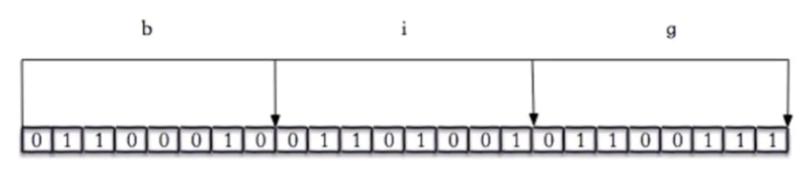

#Redis基础篇

[TOC]

### 一、从常用数据结构说起

上文说到Redis提供了丰富的数据结构，包括STRING（字符串）、LIST（列表）、SET（集合）、HASH（散列）和ZSET（有序集合）基本数据类型。

先来一波操作感受一下：


基本的数据类型的大概使用就到这里，接下来就分析一下它的内部结构是怎么实现的。

### 二、底层实现

Redis是KV类型的数据库，Key-Value我们一般会用什么数据结构存储？

哈希表！没错Redis的最外层确实也是通过hashtable实现的。在Redis里面每个键值对都是一个dictEntry，通过指针指向key的存储结构和value的存储结构，此外还有一个next存储里指向下一个键值对的指针。

```c
typedef struct dictEntry {
    void *key; //key void*表示任意类型指针

    union {                   
       void      *val;//value定义
       uint64_t  u64;
       int64_t   s64;
       double   d;
    } v;
    struct dictEntry *next;   //next指针
} dictEntry;
```

看到这里大家会有疑惑，那过期时间放在哪里？

对，实际上在dicEntry的外面还有一层redisDB。

```c
/* Redis数据库结构体 */
typedef struct redisDb {
    // 数据库键空间，存放着所有的键值对（键为key，值为相应的类型对象）
    dict *dict;                 
    // 键的过期时间
    dict *expires;              
    // 处于阻塞状态的键和相应的client（主要用于List类型的阻塞操作）
    dict *blocking_keys;       
    // 准备好数据可以解除阻塞状态的键和相应的client
    dict *ready_keys;           
    // 被watch命令监控的key和相应client
    dict *watched_keys;         
    // 数据库ID标识
    int id;
    // 数据库内所有键的平均TTL（生存时间）
    long long avg_ttl;         
} redisDb;
```

外层说完了，接下来就以set hello world为例，逐步分析一下。

首先key是字符串，Redis自己实现了一个字符串类型叫SDS，后面我们会细说，所以hello指向一个SDS的存储结构。value是world，也是一个字符串，是不是也用SDS存储呢？

这里就要重点介绍以下了，由前文我们知道Redis的key都是字符串类型，value的类型有多种。那Redis如何是适配这多种类型呢？于是就封装了一层redisObject。而我们所说的Redis数据类型的任何一种，都是通过redisObject存储的。

我们来看一下redisObject的结构：

```c
typedef struct redisObject {
    //对象的数据类型，占4bits，共5种类型
    unsigned type:4;        
    //对象的编码类型，占4bits，共10种类型
    unsigned encoding:4;
    //least recently used
    //实用LRU算法计算相对server.lruclock的LRU时间
    unsigned lru:LRU_BITS; /* lru time (relative to server.lruclock) */
    //引用计数
    int refcount;
    //指向底层数据实现的指针
    void *ptr;
} robj;
```

到这里就能看出一些奇妙的地方了，type是数据类型，encoding是编码类型，且数量不等。有意思了，那我们接下来看看这个encoding究竟是些什么。

> 127.0.0.1:6379> set number 123
> OK
> 127.0.0.1:6379> object encoding number
> "int"
> 127.0.0.1:6379> set story "long long ago,and long long ago,other long long ago"
> OK
> 127.0.0.1:6379> object encoding story
> "raw"
> 127.0.0.1:6379> set msg "hello world"
> OK
> 127.0.0.1:6379> object encoding msg
> "embstr"

到此我们大概看出来一些端倪，Redis的数据类型背后根据存储的数据不通使用的不同的编码存储。为什么要这样做呢？

节约存储空间！

其实远远不止这些，我们后面会详细说到。接下来就看每种数据结构有哪些编码类型。

### 三、数据结构详解

#### 1、String

上文我们已经分析出了，String底层有三种。

> int：存储8个字节的长整形
>
> embstr：代表embsds格式的SDS，存储小于44字节的字符串
>
> raw：存储大于44字节的SDS

接下来问题来了，什么是SDS呢？SDS全称是Simple Dynamic String，即简单动态字符串。

```c
struct __attribute__ ((__packed__)) sdshdr8 {
    uint8_t len; /* 长度 */
    uint8_t alloc; /* 分配的内存大小 */
    unsigned char flags; /* 属性，标志不同种类的sds */
    char buf[];/* 内容 */
};
```

本质上就是一个char数组！

那么既然是一个char数组，为什么要通过SDS实现呢？

#####SDS

很简单，因为C语言中没有字符串类型，只有char数组。但是使用char数组会有一些问题，什么问题呢，大家可以想一下。

> 1、必须分配足够的空间，否则可能会溢出
>
> 2、如果要获取长度，需要遍历数组，时间复杂度是O(n)
>
> 3、如果长度变更，需要重新内存分配
>
> 4、字符串规则是遇到第一个'/0'即为结束，因此不能存放二进制的内容

好了，既然有了这些问题，SDS是如何解决的呢？

> 1、SDS实现了动态扩容，无需担心溢出的问题
>
> 2、定义了len属性，获取长度时间复杂度是O(1)
>
> 3、通过空间预分配和惰性空间释放，放置了重新分配内存
>
> 4、判断结束标志示len属性，避免了二进制不安全

哇，到这里是不是感觉到Redis的编码格式设计的很巧妙。别着急，慢慢来，还有。

embstr和raw，为什么要设计两个编码格式呢？就是为了长度不同吗？SDS也已经满足了呀？

实际原因是embstr的使用，只分配了一次内存，redisObject和SDS是一起分配的，二raw是分配了两次内存


那这三种类型之间是怎么转换的呢？

> 1、int 不在时整形，转成raw
>
> 2、int大小超过long的范围，转成embstr
>
> 3、embstr超过44字节，转成raw

注意：不可回转！！！

到此，String的数据结构就介绍完毕了。最后大家都思考一下String的使用场景有哪些？

1、缓存：热点数据，提升检索效率；

2、数据共享：session共享多个服务器共用；

3、分布式锁：setNx方法，判断是否添加成功；

4、全局唯一ID：INT类型的incrby；

5、计数器：INT类型

6、限流：INT类型

哈哈，是不是感觉String好强大，不需要其他数据类型了？那么问题来了，如果我要存一个对象怎么办？举个例子，存一个学生信息，包括姓名、年龄、学号等信息。大家可能会说，String存储一个json就行了，没错可以实现。但是我如果只想获取学生的年龄呢？

接下来介绍的Hash类型，就是解决这个问题的。

#### 2、Hash

Hash类型是指Redis键值对中的值本身又是一个键值对结构，形如`value=[{field1，value1}，...{fieldN，valueN}]`，hash的value只能是字符串，不能嵌套其他类型。同样是存储字符串，Hash和String有什么区别呢？如下图所示:


从上图可以明显看出：

> 1、把所有相关的值聚集到一个key中，节省内存空间
>
> 2、只使用一个key，可以有效减少key冲突
>
> 3、当需要批量获取值的时候，只需要使用一个命令，减少内存/IO/CPU

那么它的底层编码是如何实现的呢？是不是使用dicEntry实现的呢？我们先来操作一波：

> 127.0.0.1:6379> hset user1 name aaaaaaaaaaaaaaaaaaa
> (integer) 1
> 127.0.0.1:6379> hset user2 name aaaaaaaaaaaaaaaaaaaaaaaaaaaaaaaaaaaaaaaaaaaaaaaaaaaaaaaaaaaaaaaaaaaaaaaaaaaaaaaaaaaaaaaaaaaaaaaaaaaaaaaaaaaaaaaaaaaaaaaaaaaaaaaaaaaaaaaaaaaaaaaaaaa
> (integer) 1
> 127.0.0.1:6379> object encoding user1
> "ziplist"
> 127.0.0.1:6379> object encoding user2
> "hashtable"

可以看到，哈希类型的内部编码有两种：ziplist(压缩列表),hashtable(哈希表)。又有两个陌生的结构，不要慌张，我们下文会逐个分析。

#####ziplist

ziplist是一个经过特殊编码的，由连续的内存块组成的双向链表。它不存储指向上一个节点和下一个节点的指针，而是存储上一个节点的长度和当前节点的长度。这让数据在内存中更为紧凑，所以叫做zip，同时可以轻易的得到前驱后驱数据项的位置。

```
<zlbytes><zltail><zllen><entry>...<entry><zlend>
```


接下来我们具体看下实际元素里，究竟是怎么存储的。

```c
typedef struct zlentry {
    //prevrawlen 前驱节点的长度
    //prevrawlensize 编码前驱节点的长度prevrawlen所需要的字节大小
    unsigned int prevrawlensize, prevrawlen;
    //len 当前节点值长度
    //lensize 编码当前节点长度len所需的字节数
    unsigned int lensize, len;
    //当前节点header的大小 = lensize + prevrawlensize
    unsigned int headersize;
    //当前节点的编码格式
    unsigned char encoding;
    //指向当前节点的指针，以char *类型保存
    unsigned char *p;
} zlentry;                 
```


那么什么时候使用ziplist呢？

> 1. hash对象保存的键值对数量<512
> 2. 所有键值对字符串长度小于54字节

如果任何一个条件不满足，存储结构就会转成hashtable。接下来介绍hashtable

##### hashtable

前面我们知道了，Redis的KV结构是通过dictEntry来实现的。在hashtable中，又对dictEntry进行了多层封装。

```c
typedef struct dictht {
    // 两个哈希表
    dictEntry **table;
    // 哈希表的大小
    unsigned long size;
    // 哈希表大小掩码
    unsigned long sizemask;
    // 哈希表中数据项数量
    unsigned long used;
} dictht;
```

dictEntry放在了dictht(hashtable)里面了

```c
typedef struct dict {
    // 哈希表的类型，包括哈希函数，比较函数，键值的内存释放函数
    dictType *type;
    // 存储一些额外的数据
    void *privdata;
    // 两个哈希表
    dictht ht[2];
    // 哈希表重置下标，指定的是哈希数组的数组下标
    int rehashidx; /* rehashing not in progress if rehashidx == -1 */
    // 绑定到哈希表的迭代器个数
    int iterators; /* number of iterators currently running */
} dict;
```

dictht放在了dict里面了。

从源码可以看出，它是一个数组+链表的结构。如图：


我们发现dictht后面是个null，说明第二个hashtable没有数据。那么为什么要定义两个hashtable，其中一个不用呢？

答案是为了扩展哈希表！ht默认使用ht[0],ht[1]不初始化。hash表有一个普遍存在的问题就是hash冲突，如果冲突过多都会放置在上图的dicEntry数组里。这样hash的读性能就退化称数组的遍历，效率降低。解决hash冲突的有效手段就是对hash进行扩容，让数据足够分散。这个过程会进行一次rehash，这个过程中就会使用到ht[1]。首先是初始化ht[1]的大小为ht[0]的最小n次幂。然后将ht[0]的数据写入ht[1]，然后再将ht[0]释放。怎么样这个设计过程是不是很巧妙？

使用场景：

1、和String一样！毕竟hash存储的也是String。

2、存储对象类型的数据：比string节省key。

3、购物车：key：用户id，filed：商品id，value：数量。增加、减少、删除等都可以操作。

#### 3. List

List主要用来存储有序数据，数据可重复。

先来操作一波：

> 127.0.0.1:6379> lpush queue a
> (integer) 1
> 127.0.0.1:6379> lpush queue b c
> (integer) 3
> 127.0.0.1:6379> object encoding queue
> "quicklist"

可以看到list的底层结构式quicklist来实现的。接下来就介绍一下quicklist。

##### quicklist

quicklist 实际上是 ziplist 和 linkedlist 的混合体，它将 linkedList 按段切分，每一段使用 ziplist 来紧凑存储，多个 ziplist 之间使用双向指针串接起来。

```c
typedef struct quicklist {
    quicklistNode *head;//指向第一个quicklistNode
    quicklistNode *tail;//指向最后一个quicklistNode
    unsigned long count; //在所有ziplist中entry的个数总和
    unsigned int len;//quicklistNode的个数
    int fill : 16; //ziplist大小限定，由server.list_max_ziplist_size给定
    unsigned int compress : 16; //节点压缩深度设置，由server.list-compress-depth给定，0表示关闭压缩
} quicklist;
```

看到里面用到了一个quicklistNode存储数据。

```c
typedef struct quicklistNode {
    struct quicklistNode *prev; //上一个node节点
    struct quicklistNode *next; //下一个node
    unsigned char *zl;            //保存的数据 压缩前ziplist 压缩后压缩的数据
    unsigned int sz;             /* ziplist size in bytes */
    unsigned int count : 16;     /* count of items in ziplist */
    unsigned int encoding : 2;   /* RAW==1 or LZF==2 */
    unsigned int container : 2;  /* NONE==1 or ZIPLIST==2 */
    unsigned int recompress : 1; /* was this node previous compressed? */
    unsigned int attempted_compress : 1; /* node can't compress; too small */
    unsigned int extra : 10; /* more bits to steal for future usage */
} quicklistNode;
```


ziplist上文已经介绍了，就不多说了。总的来说，quicklist就是ziplist 和 linkedlist 的混合体。

应用场景：

1、列表：文章列表、热门排行榜之类的

2、队列／栈：list有两个阻塞操作：BLPOP/BRPOP

####4、set

set存储String类型的无序集合，最大存储2^32-1。

先操作一波：

> ziplist 和 linkedlist 的混合体
> 127.0.0.1:6379> sadd myset a b c
> (integer) 3
> 127.0.0.1:6379> object encoding myset
> "hashtable"
> 127.0.0.1:6379> sadd newset 1 2 3
> (integer) 3
> 127.0.0.1:6379> object encoding newset
> "intset"
> 127.0.0.1:6379> 

可以看到set的编码格式有两种intset和hashtable。如果第一个原始是一个整数，就会初始化为intset，如果intset保存的值的数量大于512(set_max_intset_entries默认值)个，会转化称hashtable。

```c
typedef struct intset {
    uint32_t encoding;//数组中的值的编码方式
    uint32_t length;//数组长度
    int8_t contents[];//数组，记录每个值
} intset;
```

使用场景：

1、抽奖：spop

2、点赞、打卡：数据集无序，sadd添加，srem取消，sismember是否操作，smembers所有，scard总数

3、标签：sadd添加 sinter筛选

#### 5、zset

sorted set存储的是有序的集合元素。它是为每个元素添加了一个score，按照score的大小排序。

操作一波：

> 127.0.0.1:6379> zadd myzset 1 java 2 redis 3 mysql
> (integer) 3
> 127.0.0.1:6379> object encoding myzset
> "ziplist"
> 127.0.0.1:6379> zadd myzsetnew 4 aaaaaaaaaaaaaaaaaaaaaaaaaaaaaaaaaaaaaaaaaaaaaaaaaaaaaaaaaaaaaaaaaaaaaaaaaaaaaaaaaaaaaaaaaaaaaaaaaaaaaaaaaaaaaaaa
> (integer) 1
> 127.0.0.1:6379> object encoding myzsetnew
> "skiplist"

可以看到，有序集合是由 ziplist (压缩列表) 或 skiplist (跳跃表)组成的。

当数据比较少时(<128)，且所有元素长度都小于64字节，有序集合使用的是 ziplist 存储的，否则使用skiplist结构存储。

ziplist我们已经很熟悉了，那么问题来了，什么是skiplist？

##### skiplist

skiplist是一个特殊的链表，相比一般的链表，有更高的查找效率，其效率可比拟于二叉查找树。

```c
typedef struct zskiplist {
    struct zskiplistNode *header, *tail; // 头尾指针 
    unsigned long length;   // skiplist的长度  
    int level;  // 最高多少级链表 
} zskiplist;
```

zskiplist的定义，没啥内容，就头尾指针、长度和级数，重点还是在zskiplistNode中。

```c
typedef struct zskiplistNode {
    sds ele;   // 节点存储的具体值 
    double score;   // 节点对应的分值 
    struct zskiplistNode *backward; // 前向指针
    struct zskiplistLevel {
    	struct zskiplistNode *forward; // 每一层的后向指针 
    	unsigned long span;  // 到下一个节点的跨度 
    } level[];
} zskiplistNode;
```

通过上面的源码，我们可以简单画一下大概的结构图。


很明显查询我们需要遍历整个链表，效率低。我们想要提高其查找效率，可以考虑在链表上建索引的方式。每两个结点提取一个结点到上一级，我们把抽出来的那一级叫作索引。这就是skiplist的实现方式。


在图中，需要寻找 68，在给出的查找过程中，利用跳表数据结构优势，只比较了 3次。由此可见，跳表预先间隔地保存了有序链表中的节点，从而在查找过程中能达到类似于二分搜索的效果，而二分搜索思想就是通过比较中点数据放弃另一半的查找，从而节省一半的查找时间。

应用场景：顺序会动态变化的场景。

1、热榜、热搜：incrby进行加1，zrevrange获取排序

到这里常用的数据类型就介绍完毕了，简单总结一下。


#### 其他数据结构

##### bitmap



通过一个bit位来表示某个元素对应的值或者状态,其中的key就是对应元素本身。bitmap本身会极大的节省储存空间。

Redis从2.2.0版本开始新增了`setbit`,`getbit`,`bitcount`等几个bitmap相关命令。虽然是新命令，但是并没有新增新的数据类型，因为`setbit`等命令只不过是在`set`上的扩展。

使用场景：

1、在线用户统计

2、每日用户访问统计

#### hyperloglogs

HyperLogLog是用来做基数统计的算法，它的优点是在输入元素的数量或者体积非常非常大时，计算基数所需的空间总是固定的、并且是很小的。什么是基数呢？举个例子：比如数据集 {1, 3, 5, 7, 5, 7, 8}， 那么这个数据集的基数集为 {1, 3, 5 ,7, 8}, 基数(不重复元素)为5。 基数估计就是在误差可接受的范围内，快速计算基数。

使用场景：统计网站的UV，日活。

#####geo

顾名思义，是用来地理位置计算的。

使用场景：附近的人

##### Stream

5.0之后新出的数据类型，支持广播的可持久化消息队列，类似于kafka。

使用场景：消息队列

