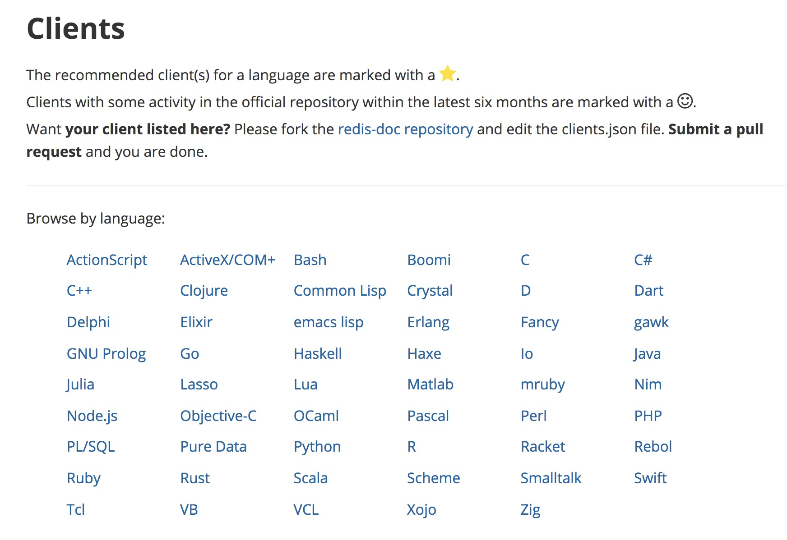
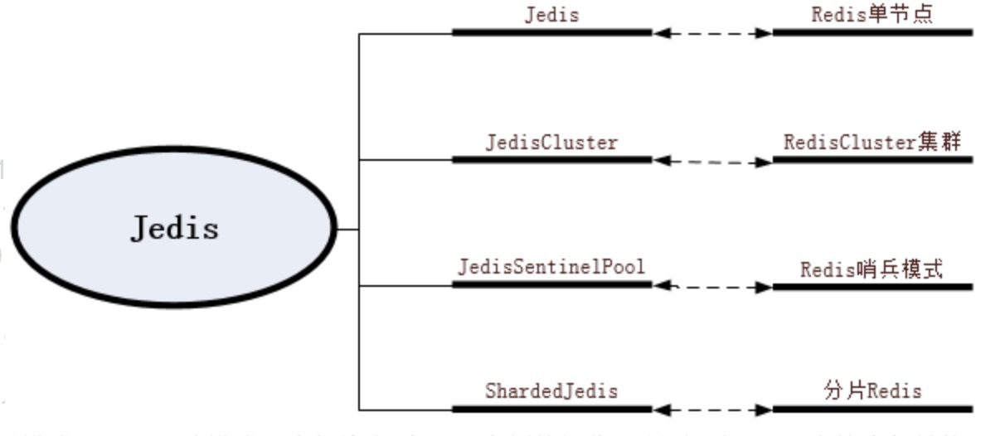
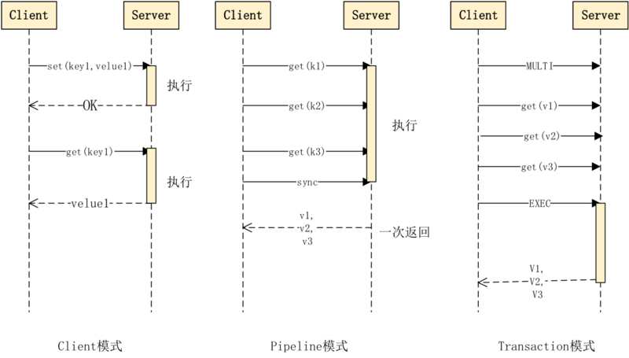
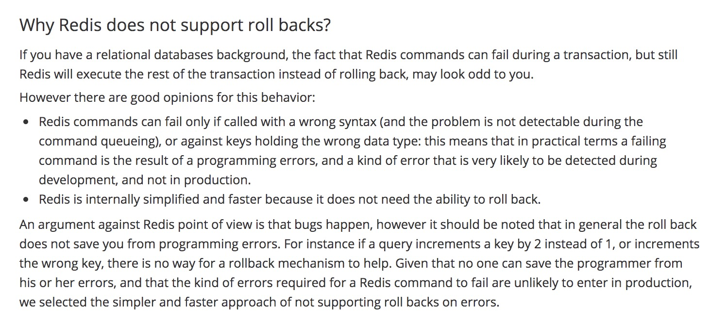
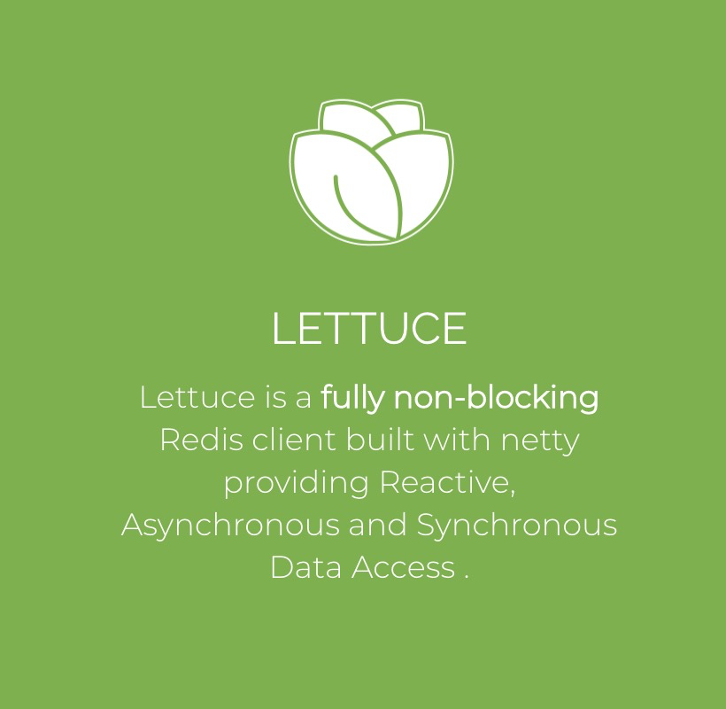
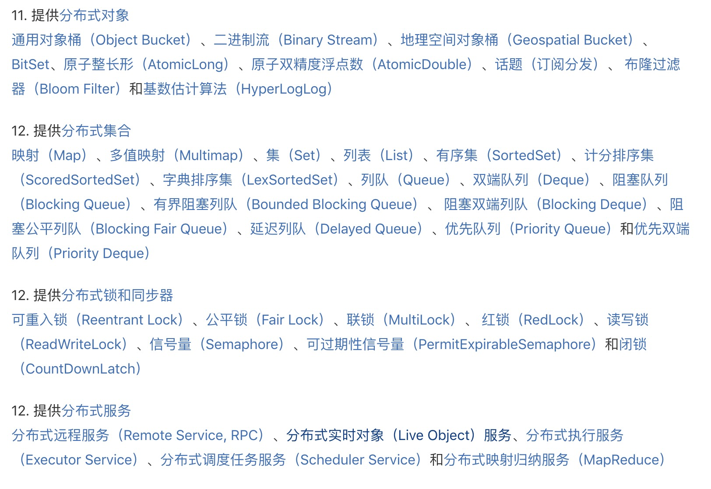
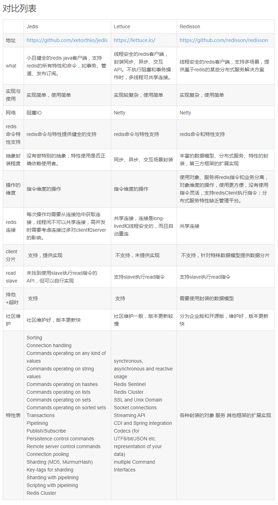

# Redis客户端篇

[TOC]

客户端和服务端通信，必须要有一种通信协议，比如我们经常使用的Rest协议、Http协议，TCP协议等都是一种通信协议。

**Redis** 的客户端和服务端之间采取了一种独立的名为 RESP(REdis Serialization Protocol) 的协议，作者主要考虑了以下几个点：

- 容易实现
- 解析快
- 人类可读

RESP 主要可以序列化以下几种类型：整数，单行回复(简单字符串)，数组，错误信息，多行字符串。Redis 客户端向服务端发送的是一组由执行的命令组成的字符串数组，服务端根据不同的命令回复不同类型的数据，但协议的每部分都是以 “\r\n” (CRLF) 结尾的。另外 RESP 是二进制安全的，不需要处理从一个进程到另一个进程的传输，因为它使用了前缀长度进行传输。

在 RESP 中, 一些数据的类型通过它的第一个字节进行判断：

- 单行回复：回复的第一个字节是 “+”
- 错误信息：回复的第一个字节是 “-“
- 整形数字：回复的第一个字节是 “:”
- 多行字符串：回复的第一个字节是 “$“
- 数组：回复的第一个字节是 “*”

以 “+” 开头，以 “\r\n” 结尾的字符串形式。

具体协议在此就不多介绍了，感兴趣的同学可以私下自己学习研究。

既然有固定的协议，那我们能不能写段代码执行和解析下这个协议呢？当然可以！接下来给大家演示一下：

```java
/**
 * @author liwei
 * @description redis客户端实现
 * @date 2021/03/15
 */
public class RedisClient {
    private Socket socket;
    private OutputStream writer;
    private InputStream reader;
    public RedisClient(String host, int port) throws IOException {
        //与Redis服务端的Socket连接
        socket = new Socket(host, port);
        writer = socket.getOutputStream();
        reader = socket.getInputStream();
    }
    //set命令
    public String set(String key, String value) throws IOException {
        StringBuffer conmmand = new StringBuffer();
        conmmand.append("*3").append("\r\n");
        conmmand.append("$3").append("\r\n");
        conmmand.append("SET").append("\r\n");
        conmmand.append("$").append(key.getBytes().length).append("\r\n");
        conmmand.append(key).append("\r\n");
        conmmand.append("$").append(value.getBytes().length).append("\r\n");
        conmmand.append(value).append("\r\n");
        return exceConmmand(conmmand);
    }
    //get key
    public String get(String key) throws IOException {
        StringBuffer conmmand = new StringBuffer();
        conmmand.append("*2").append("\r\n");
        conmmand.append("$3").append("\r\n");
        conmmand.append("get").append("\r\n");
        conmmand.append("$").append(key.getBytes().length).append("\r\n");
        conmmand.append(key).append("\r\n");
        return exceConmmand(conmmand);

    }
    //执行命令
    public String exceConmmand(StringBuffer conmmand) throws IOException {
        writer.write(conmmand.toString().getBytes());
        byte[] result = new byte[1024];
        reader.read(result);
        return new String(result);
    }
}
```

客户端执行程序：

```java
public class ClientTest {
    public static void main(String[] args) {
        try {
            RedisClient client = new RedisClient("49.233.195.72", 6379);
            String set = client.set("redis", "test");
            System.out.println("set:"+set);
            String get = client.get("redis");
            System.out.println("get:"+get);
        } catch (IOException e) {
            e.printStackTrace();
        }
    }
}
```

执行结果：

```
set:OK
get:test
```

大家感兴趣的可以私下自己体验一下。很爽的！

根据这个协议我们就可以自己实现Redis客户端了。然而，这些繁琐的工作，早已有好事之人为我们做好了。



可以在官网上看到，非常丰富！我们看一下java的：


发现也多种多样，丰富多彩。我们看到有3个标星的项目，也就是官网推荐的：Jedis、Redisson和Luttuce。接下来为大家介绍一下这3个客户端的实现原理和使用方式。

### 一、Jedis客户端

Jedis是我们非常常用和熟悉的客户端工具。在SpringBoot 2.X 版本之前，RedisTemplate默认使用的就是Jedis。



Jedis的主要模块，Jedis,JedisCluster,JedisSentinel和ShardedJedis对应了Redis的四种工作模式：Redis Standalone（单节点模式）,Redis Cluster（集群模式）,Redis Sentinel（哨兵模式）和Redis Sharding（分片模式）可以看到Jedis的功能还是很丰富的。

每个Jedis实例对应一个Redis节点，我们对Jedis实例的每个操作，都相当于使用redis-cli启动客户端的直接操作。无论是集群模式，哨兵模式，还是分片模式，内部均为对Jedis实例的操作。 Jedis实例有3种请求模式，Pipeline，Transaction和Client。



#### Client模式:

client模式就是常用的“所见即所得”，客户端发一个命令，阻塞等待服务端执行，然后读取返回结果。优点是确保每次处理都有结果，一旦发现返回结果中有Error,就可以立即处理。

#### Pipeline模式

 Pipeline模式则是一次性发送多个命令，最后一次取回所有的返回结果，这种模式通过减少网络的往返时间和IO的读写次数，大幅度提高通信性能，但Pipeline不支持原子性，如果想保证原子性，可同时开启事务模式。

#### Transaction模式

Transaction模式即开启Redis的事务管理，Pipeline可以在事务中，也可以不在事务中。事务模式开启后，所有的命令（除了 **EXEC** 、 **DISCARD** 、 **MULTI** 和 **WATCH** ）到达服务端以后，不会立即执行，会进入一个等待队列。

看到这里我们简单总结一下，Jedis可以实现哪些功能？

#### 1、事务

##### Redis事务介绍

所谓事务(Transaction) ，是指作为单个逻辑工作单元执行的一系列操作。事务必须满足ACID原则(原子性、一致性、隔离性和持久性)。简单来说事务其实就是打包一组操作（或者命令）作为一个整体，在事务处理时将顺序执行这些操作，并返回结果，如果其中任何一个环节出错，所有的操作将被回滚。

Redis如果涉及到执行多个命令的时候，需要把多个命令作为一个事务执行。那么怎么执行呢？由以下几个步骤：

> 1.事务开始
>
> 2.命令入队
>
> 3.事务执行

Redis的事物涉及到四个命令：MULTI、EXEC、WATCH、DISCARD。

Redis中使用MULTI命令标记事务的开始，可以理解为在传统关系型数据库中的BEGIN TRANCATION语句。在打开事务标识的客户端里，这些命令都会被暂存到一个命令队列里，不会因为用户会的输入而立即执行。

如果提交事务就用EXEC命令，这个命令可被视为等同于关系型数据库中的COMMIT。

如果中途不想执行事务了怎么？使用DISCARD命令是回滚事务，会清空事务里的队列，这个命令可被视为等同于关系型数据库中的ROLLBACK。

那如果在事务过程中，有其他的客户端修改了事务中需要的值呢？所以有了WATCH命令，Redis会监听当前key的值，只有在没有被修改的情况下，才可以更新成新的值。如果被修改了，这个事务是无法执行了，可以用UNWATCH取消监视。这个事务EXEC的时候会返回nil。

到此似乎一致性、原子性、隔离性、持久性都能满足了，事务就圆满解决了。其实，还没有。我们想象一下事务执行的出错的时候分两种：

> EXEC之前发生错误：语法错误（编译阶段错误）
>
> EXEC之后发生错误：执行错误（运行阶段错误）

第一种错误，我们直接不再执行就OK了。第二种错误呢？SET多个key，到中间或者最后一个出问题了呢？

举个例子：

```java
127.0.0.1:6379> multi
OK
127.0.0.1:6379> set k1 1
QUEUED
127.0.0.1:6379> hset k1 a b
QUEUED
127.0.0.1:6379> exec
1) OK
2) (error) WRONGTYPE Operation against a key holding the wrong kind of value
```

第一个操作成功了，第二个失败了？？？

这明显不符合原子性。我们的期望是第一个操作进行回滚！

为什么没有回滚呢？官网上有相关解释：



翻译一下就是：

Redis命令只会因为错误的语法而失败，如果失败了就是你代码写的不对。

Redis在内部得到了简化和快速，如果回滚就不能简化了，也不能快速了。

总结一句话：程序员的问题。Redis不解决！！！

##### Jedis实现事务

中间插了一段事务，接下来继续看Jedis如何支持事务：

```java
	Jedis jedis=new Jedis("127.0.0.1",6379);
	Transaction multi=jedis.multi();//开启redis事务
	try {
	//设置数据
		multi.set("ka", "va");
		multi.set("kb", "vb");
		int num=1/0;
		multi.set("kc", "vc");
	} catch (Exception e) {
		multi.discard();
		e.printStackTrace();
	}
	//redis事务提交
	multi.exec();		

```

理解了Redis的事物原理之后，再看Jedis的实现是不是小菜一碟？

#### 2、分布式锁

##### 什么是分布式锁

在互联网空前发展的今天，一台计算机是不可能完成所有事情的。所以就有了多台计算机一起完成某项工作，这多台计算机有时候某些事情只能一台来做，那究竟哪一台来做呢？于是就有了分布式锁，获取到锁的那一台去做。

分布式锁的特性：

- 在分布式系统环境下，一个方法在同一时间只能被一个机器的一个线程执行
- 高可用的获取锁与释放锁
- 高性能的获取锁与释放锁
- 具备可重入特性（可理解为重新进入，由多于一个任务并发使用，而不必担心数据错误）
- 具备锁失效机制，防止死锁
- 具备非阻塞锁特性，即没有获取到锁将直接返回获取锁失败

实现分布式锁的方案有很多，今天主要介绍一下Redis是如何实现的。

##### Redis如何实现

Redis可以通过以下几个命令实现分布式锁：

> setnx key value：当且仅当key不存在时，set一个key为val的字符串，返回1；若key存在，则什么都不做，返回0。
>
> expire key timeout：为key设置一个超时时间，单位为second，超过这个时间锁会自动释放，避免死锁。	
>
> delete key：删除key

整体思想是这样的：

1. 获取锁的时候，使用setnx加锁，并使用expire命令为锁添加一个超时时间，超过该时间则自动释放锁，锁的value值为一个随机生成的UUID，通过此在释放锁的时候进行判断。

2. 获取锁的时候还设置一个获取的超时时间，若超过这个时间则放弃获取锁。

3. 释放锁的时候，通过UUID判断是不是该锁，若是该锁，则执行delete进行锁释放。

##### Jedis如何支持的

那么Jedis是如何实现分布式锁的呢？

```java
/**
     * 获得 lock.
     * 实现思路: 主要是使用了redis 的setnx命令,缓存了锁.
     * reids缓存的key是锁的key,所有的共享, value是锁的到期时间(注意:这里把过期时间放在value了,没有时间上设置其超时时间)
     * 执行过程:
     * 1.通过setnx尝试设置某个key的值,成功(当前没有这个锁)则返回,成功获得锁
     * 2.锁已经存在则获取锁的到期时间,和当前时间比较,超时的话,则设置新的值
     *
     * @return true if lock is acquired, false acquire timeouted
     * @throws InterruptedException in case of thread interruption
     */
    public synchronized boolean lock() throws InterruptedException {
        int timeout = timeoutMsecs;
        while (timeout >= 0) {
            long expires = System.currentTimeMillis() + expireMsecs + 1;
            String expiresStr = String.valueOf(expires); //锁到期时间
            if (this.setNX(lockKey, expiresStr)) {
                // lock acquired
                locked = true;
                return true;
            }

            String currentValueStr = this.get(lockKey); //redis里的时间
            if (currentValueStr != null && Long.parseLong(currentValueStr) < System.currentTimeMillis()) {
                //判断是否为空，不为空的情况下，如果被其他线程设置了值，则第二个条件判断是过不去的
                // lock is expired

                String oldValueStr = this.getSet(lockKey, expiresStr);
                //获取上一个锁到期时间，并设置现在的锁到期时间，
                //只有一个线程才能获取上一个线上的设置时间，因为jedis.getSet是同步的
                if (oldValueStr != null && oldValueStr.equals(currentValueStr)) {
                    //防止误删（覆盖，因为key是相同的）了他人的锁——这里达不到效果，这里值会被覆盖，但是因为什么相差了很少的时间，所以可以接受

                    //[分布式的情况下]:如过这个时候，多个线程恰好都到了这里，但是只有一个线程的设置值和当前值相同，他才有权利获取锁
                    // lock acquired
                    locked = true;
                    return true;
                }
            }
            timeout -= DEFAULT_ACQUIRY_RESOLUTION_MILLIS;

            /*
                延迟100 毫秒,  这里使用随机时间可能会好一点,可以防止饥饿进程的出现,即,当同时到达多个进程,
                只会有一个进程获得锁,其他的都用同样的频率进行尝试,后面有来了一些进行,也以同样的频率申请锁,这将可能导致前面来的锁得不到满足.
                使用随机的等待时间可以一定程度上保证公平性
             */
            Thread.sleep(DEFAULT_ACQUIRY_RESOLUTION_MILLIS);

        }
        return false;
    }
```

源码之下没有秘密，理解原理之后再看源码，小菜一碟！

Jedis的使用就比较简单了：

```java
//获取锁
RedisLock lock = new RedisLock(redisTemplate, key, 10000, 20000);
 try {
            if(lock.lock()) {
                   //需要加锁的代码
                }
            }
        } catch (InterruptedException e) {
            e.printStackTrace();
        }finally {
            //为了让分布式锁的算法更稳键些，持有锁的客户端在解锁之前应该再检查一次自己的锁是否已经超时，再去做DEL操作，因为可能客户端因为某个耗时的操作而挂起，            //操作完的时候锁因为超时已经被别人获得，这时就不必解锁了。 ————这里没有做
            lock.unlock();
        }
```

### 二、Lettuce客户端



Lettuce是使用netty构建的完全无阻塞的Redis客户端，可提供反应式，异步和同步数据访问。它可以做到多个线程可以共享一个连接实例，而不用担心多线程并发问题。同时通过异步的方式可以让我们更好的利用系统资源，而不用浪费线程等待网络或磁盘I/O。所以 Lettuce 可以帮助我们充分利用异步的优势。

SpringBoot2.X版本是基于Spring 5，Spring 5最大的亮点就是reactive。而Lettuce又是基于reactive开发的，所以不难理解SpringBoot2.X版本之后的RedisTemplate默认使用的客户端就是Lettuce。

由于SpringBoot 在Lettuce之上做了一层封装，所以我们使用起来更加简便。

```java
//获取锁
Boolean flag = redisTemplate.opsForValue().setIfAbsent("lockKey", clientId, 10, TimeUnit.SECONDS);
//释放锁
String verfiy = (String) redisTemplate.opsForValue().get(lockKey);
//删除锁
redisTemplate.delete(lockKey);
 
```

Lettuce事务又怎么使用呢？

```java
List<Object> txResults = redisTemplate.execute(new SessionCallback<List<Object>>() {
  public List<Object> execute(RedisOperations operations) throws DataAccessException {
    operations.multi();
    operations.opsForSet().add("key", "value1");
    // This will contain the results of all ops in the transaction
    return operations.exec();
  }
});
```

是不是很简单？

### 三、Redisson客户端

Redisson 是一个在Redis基础上实现的Java驻内存数据网络，提供了分布式和可拓展的Java数据结构，比如分布式集合，分布式对象、分布式锁等。



Redisson在基于NIO的Netty框架上，充分的利用了Redis键值数据库提供的一系列优势，在Java实用工具包中常用接口的基础上，为使用者提供了一系列具有分布式特性的常用工具类。使得原本作为协调单机多线程并发程序的工具包获得了协调分布式多机多线程并发系统的能力，大大降低了设计和研发大规模分布式系统的难度。

分布式锁实现方式：

```java
Config config = new Config();
config.useSingleServer().setAddress("redis://127.0.0.1:6379");
RedissonClient client = Redisson.create(config);
RLock lock = client.getLock("abcde");
lock.lock();
try {
    ...
} finally {
    lock.unlock();
}
```

事务的支持：

```java
RTransaction transaction = redisson.createTransaction(TransactionOptions.defaults());
RMap<String,String> map = transaction.getMap("myMap");
map.put("1","2");
String value = map.get("3");
RSet<String> set = transaction.getSet("mySet")
set.add(value);
try{
   transaction.commit();
}catch(TransactionException e){
   transaction.rollback();
}
```

### 总结一下

**Jedis**：使用阻塞的I/O，且其方法调用都是同步的，程序流需要等到sockets处理完I/O才能执行，不支持异步。Jedis客户端实例不是线程安全的，所以需要通过连接池来使用Jedis。

**Lettuce**：基于Netty框架的事件驱动的通信层，其方法调用是异步的。Lettuce的API是线程安全的，所以可以操作单个Lettuce连接来完成各种操作

**Redisson**：基于Netty框架的事件驱动的通信层，其方法调用是异步的。Redisson的API是线程安全的，所以可以操作单个Redisson连接来完成各种操作



那如何选型呢？

优先使用Lettuce，如果需要分布式锁，分布式集合等分布式的高级特性，添加Redisson结合使用。