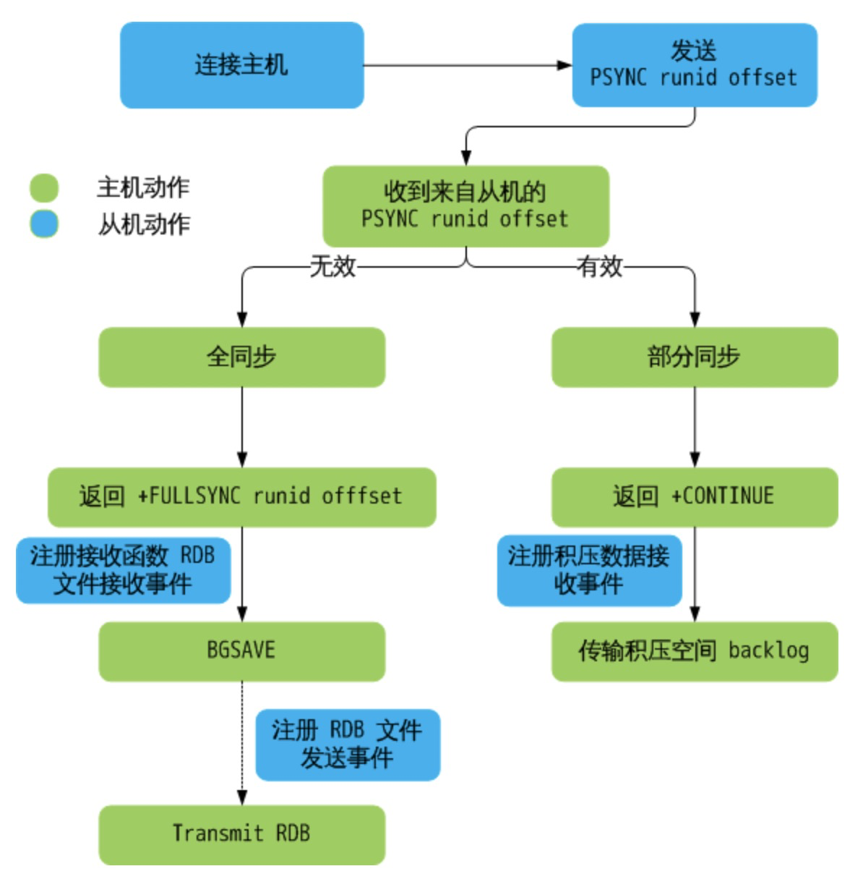

# Redis架构篇

[TOC]

我们上文讲了Redis的线程模型，以及最新的多线程模型以及Redis的持久化机制。那么这样就够了吗？远远不够！

Redis挂了之后如何也能保证系统可用(高可用)呢？

如果多线程依然无法满足系统的吞度量(高性能)要求呢？

Redis所有数据都放在内存，如果数据放不下了(可拓展)呢？

所有要求高性能、高可用和可拓展的系统，都依赖于最基础的两种技术：冗余和分片。

这个很容易理解，如果一个系统，冗余了另一个，当一个出现问题了，直接切换的另一个，就解决了高可用的问题；如果一个系统有性能问题，如果可以灵活的添加一个节点提供同样的支持，从而将性能提升一倍，就解决了高性能的问题；如果一台机器的数据由于硬件原因存储不下了，添加一个节点分担这台机器的存储压力从而可以横向拓展，这就解决了可拓展问题。

总结一下，Redis要解决这三个问题，首先要解决数据如何冗余即主从复制，其次是主节点又问题了从节点如何切换成主节点即主从自动切换，最后是数据如何分片存储。

接下来就围绕这3点来看一下Redis是如何实现的。

### 一、Redis主从复制

上文我们讲到了Redis的持久化，有RDB和AOF两种持久化方式。当服务启动的时候，我们会加载RDB或AOF文件进行数据的恢复。那我们设想一下能不能把RDB或AOF文件copy一份到另一台Redis服务呢？这样是不是就做到了主从复制？没错，Redis的主从复制可以通过这种方式实现。只是简单的同步日志文件还是远远不够的。因为这里面会有很多问题，比如什么时候同步？多久同步一次？下次同步的时候从哪同步？带着这些问题，来一起看一下Redis主从复制究竟是怎么实现的。

Redis主从同步分两种，一种叫全量复制，就是一个节点第一次连接到master节点，需要全部的数据；另一种叫增量复制，比如已经通过过一部分数据来，再次同步只同步增量数据。

##### 1. 连接阶段

1. slave节点启动的时候，会在自己本地保存master节点的信息，包括master节点的ip和port。
2. slave节点内部有定时任务`replicationCron`，每隔1s检查是否有新的master节点要连接。

接下来看下源码感受一下：

```c
// 修改主机
void slaveofCommand(redisClient *c) {
    if (!strcasecmp(c->argv[1]->ptr,"no") &&
        !strcasecmp(c->argv[2]->ptr,"one")) {
        // slaveof no one 断开主机连接
        if (server.masterhost) {
            replicationUnsetMaster();
            redisLog(REDIS_NOTICE,"MASTER MODE enabled (user request)");
        }
    } else {
        long port;
        if ((getLongFromObjectOrReply(c, c->argv[2], &port, NULL) != REDIS_OK))
            return;
        // 可能已经连接需要连接的主机
        /* Check if we are already attached to the specified slave */
        if (server.masterhost && !strcasecmp(server.masterhost,c->argv[1]->ptr)
            && server.masterport == port) {
            redisLog(REDIS_NOTICE,"SLAVE OF would result into synchronization with the master we are already connected with. No operation performed.");
            addReplySds(c,sdsnew("+OK Already connected to specified master\r\n"));
            return;
        }
        // 断开之前连接主机的连接，连接新的。 replicationSetMaster() 并不会真正连接主机，只是修改 struct server 中关于主机的设置。真正的主机连接在 replicationCron() 中完成
        //这里可以看到，设置了主节点的ip和端口
        replicationSetMaster(c->argv[1]->ptr, port);
        redisLog(REDIS_NOTICE,"SLAVE OF %s:%d enabled (user request)",
            server.masterhost, server.masterport);
    }
    addReply(c,shared.ok);
}
```

跟进`replicationSetMaster`这个深入看一下：

```c
// 设置新主机
/* Set replication to the specified master address and port. */
void replicationSetMaster(char *ip, int port) {
    sdsfree(server.masterhost);
    server.masterhost = sdsdup(ip);
    server.masterport = port;
    // 断开之前主机的连接
    if (server.master) freeClient(server.master);
    disconnectSlaves(); /* Force our slaves to resync with us as well. */
    // 取消缓存主机
    replicationDiscardCachedMaster(); /* Don't try a PSYNC. */
    // 释放积压空间
    freeReplicationBacklog(); /* Don't allow our chained slaves to PSYNC. */
    // cancelReplicationHandshake() 尝试断开数据传输和主机连接
    cancelReplicationHandshake();
    server.repl_state = REDIS_REPL_CONNECT;
    server.master_repl_offset = 0;
}
```

接下来看一下定时任务`replicationCron`:

```c
void replicationCron(void) {
    ......
    // 如果需要（EDIS_REPL_CONNECT），尝试连接主机，真正连接主机的操作在这里
    /* Check if we should connect to a MASTER */
    if (server.repl_state == REDIS_REPL_CONNECT) {
        redisLog(REDIS_NOTICE,"Connecting to MASTER %s:%d",
            server.masterhost, server.masterport);
        if (connectWithMaster() == REDIS_OK) {
            redisLog(REDIS_NOTICE,"MASTER <-> SLAVE sync started");
        }
    }
    ......
}
```

这里看到最核心的是`connectWithMaster`方法：

```c
int connectWithMaster(void) {
    int fd;
    // 连接 master，获得 fd
    fd = anetTcpNonBlockBestEffortBindConnect(NULL, server.masterhost,server.masterport,NET_FIRST_BIND_ADDR);
    if (fd == -1) {
        serverLog(LL_WARNING,"Unable to connect to MASTER: %s",
            strerror(errno));
        return C_ERR;
    }
    // 为 fd 设置读写事件回调 syncWithMaster
    if (aeCreateFileEvent(server.el,fd,AE_READABLE|AE_WRITABLE,syncWithMaster,NULL) == AE_ERR)
    {
        close(fd);
        serverLog(LL_WARNING,"Can't create readable event for SYNC");
        return C_ERR;
    }
    server.repl_transfer_lastio = server.unixtime;
    server.repl_transfer_s = fd;
    // 状态机更新
    server.repl_state = REPL_STATE_CONNECTING;
    return C_OK;
}
```

##### 2. 同步阶段

Redis 首先会尝试部分同步，如果失败才尝试全同步。而刚刚建立连接的主从关系 需要全同步。

slave连接master后，会主动发起 PSYNC 命令，从节点会提供 master_runid 和 offset，master验证 master_runid 和 offset 是否有效？master_runid 相当于master身份验证码，用来验证salve上一次连接的master，offset 是全局积压空间数据的偏移量。

如果验证通过则进行**增量同步**：master返回 +CONTINUE（slave接收后会注册积压数据接收事件），master接着发送积压空间数据。

如果验证未通过则，则进行**全量同步**：master返回 +FULLRESYNC master_runid和offset（save接收到后并记录 master_runid 和 offset）接着启动 BGSAVE 生成 RDB 文件，BGSAVE 结束后，向从机传输，从而完成全同步。

增量同步流程图：


全量同步流程图：


看下源码感受一下：

```c
// 连接主机 connectWithMaster() 的时候，会被注册为回调函数
void syncWithMaster(aeEventLoop *el, int fd, void *privdata, int mask) {
    char tmpfile[256], *err;
    int dfd, maxtries = 5;
    int sockerr = 0, psync_result;
    socklen_t errlen = sizeof(sockerr);

    ......
    // 尝试部分同步，主机允许进行部分同步会返回 +CONTINUE，从机接收后注册相应的事件
    /* Try a partial resynchonization. If we don't have a cached master
     * slaveTryPartialResynchronization() will at least try to use PSYNC
     * to start a full resynchronization so that we get the master run id
     * and the global offset, to try a partial resync at the next
     * reconnection attempt. */

    // 函数返回三种状态：
    // PSYNC_CONTINUE：表示会进行部分同步，在 slaveTryPartialResynchronization()
                     // 中已经设置回调函数 readQueryFromClient()
    // PSYNC_FULLRESYNC：全同步，会下载 RDB 文件
    // PSYNC_NOT_SUPPORTED：未知
    psync_result = slaveTryPartialResynchronization(fd);
    if (psync_result == PSYNC_CONTINUE) {
        redisLog(REDIS_NOTICE, "MASTER <-> SLAVE sync: Master accepted a "
            "Partial Resynchronization.");
        return;
    }
    // 执行全同步
    ......
    // 注册读事件，回调函数 readSyncBulkPayload()， 准备读 RDB 文件
    /* Setup the non blocking download of the bulk file. */
    if (aeCreateFileEvent(server.el,fd, AE_READABLE,readSyncBulkPayload,NULL)
            == AE_ERR)
    {
        redisLog(REDIS_WARNING,
            "Can't create readable event for SYNC: %s (fd=%d)",
            strerror(errno),fd);
        goto error;
    }
    // 设置传输 RDB 文件数据的选项
    // 状态
    server.repl_state = REDIS_REPL_TRANSFER;
    // RDB 文件大小
    server.repl_transfer_size = -1;
    // 已经传输的大小
    server.repl_transfer_read = 0;
    // 上一次同步的偏移，为的是定时写入磁盘
    server.repl_transfer_last_fsync_off = 0;
    // 本地 RDB 文件套接字
    server.repl_transfer_fd = dfd;
    // 上一次同步 IO 时间
    server.repl_transfer_lastio = server.unixtime;
    // 临时文件名
    server.repl_transfer_tmpfile = zstrdup(tmpfile);
    return;
    ......
}
```

master节点的验证逻辑，以及触发bgsave在这里就不带大家看了。

##### 3.命令传播阶段

当master数据库状态被修改后，导致主从服务器数据库状态不一致，此时需要让主从数据同步到一致状态，同步的动作称为命令传播。master将接收到的数据变更命令发送给slave，slave接收命令后执行命令。

命令传播过程中依赖网络传输，难免会出现网络中断的情况。如果是短时间的连接中断依赖第二步的部分同步就可以解决，如果长时间的连接中断就需要进行全量同步。

总结一下Redis主从同步的整个过程：



 Redis6.0之后，出了一个新特性：`reply-diskless-sync`无盘复制，就是master生成的RDB文件不保存在磁盘而直接通过网络发送给slave节点。

经过主从复制后，我们Redis的集群模式可能是这样的：


master可负责读写服务，slave只负责读。提高了Redis的吞吐量。一切似乎看起来很美好，数据有了备份更安全，也提升了性能。

然而，如果master节点挂了呢？高可用问题依然没有得到解决。

#### 二、高可用之Sentinel

所谓高可用的实现方案，无外乎两种：

> 1. 集群，非单点
> 2. 如果是单点，可以做到动态切换，来保证最大程度的高可用。

Sentinel 是 Redis 的高可用实现方案，多个 Sentinel 进程协同工作，组成了一套分布式的架构，它负责持续监控主从节点的健康状况，当主节点挂掉时，自动选择一个最优的从节点切换为主节点。客户端来连接集群时，会首先连接 Sentinel，通过 sentinel 来查询主节点的地址，然后再去连接主节点进行数据交互。当主节点发生故障时，客户端会重新向 Sentinel 要地址，Sentinel 会将最新的主节点地址告诉客户端。如此应用程序将无需重启即可自动完成节点切换。

如下图所示：


Sentinel集群是怎么实现自动发现的呢？

1. 通过redis的pub/sub系统实现的，每个哨兵都会往_sentinel__:hello这个channel里发送一个消息。
2. 其他哨兵可以消费到这个消息，且可以感知到其他哨兵的存在。
3. 每隔两秒钟，每个哨兵都会向自己监控的某个master+slaves对应的_sentinel__:hello channel里发送一个消息（包括自己的host、ip和runid还有对这个master的监控配置）。
4. 每个哨兵也会去监听自己监控的每个master+slaves对应的_sentinel__:hello channel，然后去感知到同样在监听这个master+slaves的其他哨兵的存在。

Sentinel集群的通信知道了，那Sentinel是如何知道master节点下线了呢？

1. 哨兵在ping一个master的时候，如果超过了is-master-down-after-milliseconds指定的毫秒数之后，就是达到了sdown(主观下线)，就主观认为master宕机了。

   主观下线并不意味着真的下线了。

2. 如果一个哨兵在指定时间内，收到了quorum指定数量的其他哨兵也认为那个master是sdown了，那么就认为是odown(客观下线)了，客观认为master宕机，就完成了sdown到odown的转换。

确定master下线了之后，就需要重新选举master。那Sentinel是如何选举新的master的呢？

Sentinel内部实现了一套Raft算法，来做到选举的一致性的。关于Raft一致性算法的原理我们以后在架构篇的时候，再给大家详细介绍。

Raft的本质：先到先得，少数服从多数！

而Redis还参考了其他一些信息：

1. 跟master断开连接的时长：时间越长数据丢失越多，越不适合做master
2. slave优先级：slave priority越低，优先级就越高
3. 复制offset：replica offset越靠后说明数据越全，优先级越高
4. run id：如果以上都一样，那就看run id即进程ID最小

到这里Sentinel选出了新的master。那如何让新的master成为master呢？

1. 由Sentinel Leader向新的master节点发送 slaveof no one命令
2. 然后master向其他节点发送： slaveof x.x.x.x xxxx(本机IP端口)。

到这里Sentinel的整个原理也就介绍的差不多了，总结一下Sentinel的核心功能：

- 监控：Sentinel不断的检查master和slave是否正常的运行。
- 通知：如果发现某个redis节点运行出现问题，可以通过API通知系统管理员和其他的应用程序。
- 自动故障转移：能够进行自动切换。当一个master节点不可用时，能够选举出master的多个slave中的一个来作为新的master,其它的slave节点会将它所追随的master的地址改为被提升为master的slave的新地址。
- 配置提供者：哨兵作为Redis客户端发现的权威来源：客户端连接到哨兵请求当前可靠的master的地址。如果发生故障，哨兵将报告新地址。

这样Redis就实现了高可用。一切看起来这么美好。到这里真的结束了吗？如果数据量大到一个机器放不下了呢？所以，Sentinel没有解决可拓展的问题。

#### 三、高拓展之Redis分布式方案

在使用mysql的时候，我们数据库的数据量大到存储不下的时候，我们一般会怎么处理？数据源动态选择？分库分表？

对，Redis的分布式方案，也是类似的实现。可以分为以下三种方案：

1. 在客户端实现分片逻辑，例如对key进行hash运算再取模计算来进行分片，然后选择对应的服务端查询或写入；(ShardingJDBC)
2. 把分片逻辑抽离出来单独做一个服务，客户端通过这个服务由这个服务去代理分片；(Cat)
3. 基于服务端的实现。

##### 1. 客户端实现案例：ShardedJedis

数据源：

```java
    /**
     * 这是<服务器节点/shard分片,该服务器节点对应的物理连接信息>
     */
    private final Map<ShardInfo<R>, R> resources;
    private final Hashing algo;
    /**
     * 这是<虚拟节点,服务器节点/shard分片>
     */
    private TreeMap<Long, S> nodes;

  private void initialize(List<S> shards) {
        this.nodes = new TreeMap();
        for(int i = 0; i != shards.size(); ++i) {
             S shardInfo = (ShardInfo)shards.get(i);
 
            int n;
            /**
             * 每台服务器节点采用hash算法划分为160个虚拟节点(可以配置划分权重)
             */
            if (shardInfo.getName() == null) {
                for(n = 0; n < 160 * shardInfo.getWeight(); ++n) {
                    this.nodes.put(this.algo.hash("SHARD-" + i + "-NODE-" + n), shardInfo);
                }
            } else {
                for(n = 0; n < 160 * shardInfo.getWeight(); ++n) {
                    this.nodes.put(this.algo.hash(shardInfo.getName() + "*" + shardInfo.getWeight() + n), shardInfo);
                }
            }
            /**
             *   shardInfo对应是一台redis分片服务器节点；shardInfo.createResource()是该redis的分片的物理连接信息
             */
         //   this.resources.put(shardInfo, shardInfo.createResource());
        }
}

```

获取分片：

```java
 public R getShard(String key) {
       return this.resources.get(this.getShardInfo(key));
    }
    
    public S getShardInfo(byte[] key) {
        //tailMap() : 获取一个子集。其所有对象的 key 的值大于等于 fromKey
        SortedMap<Long, S> tail = this.nodes.tailMap(this.algo.hash(key));
        //获取第一个（排在最低的）对象的 Key
        return tail.isEmpty() ? (ShardInfo)this.nodes.get(this.nodes.firstKey()) : (ShardInfo)tail.get(tail.firstKey());
    }

```

获取大于等于键hash值得节点。若key的hash值大于虚拟节点hash值得最大值时（也就是tail为空），取第一个虚拟节点；否则取邻近节点。

这里就想多说一下，关于分片的实现方案。

##### hash取模

我们一般会对一个key进行hash运算达到相对分散，然后再除以当前的节点个数，来计算分配在哪个节点。这种方式比较简单，易于理解和实现。那么如果节点有变化，新增或者删除。取模的指会有变化，需要需要重新分配，影响比较大。

为了解决这个问题就有了一致性hash算法。从刚才的源码中也可以看到ShardedJedis就是使用的这个算法。

##### 一致性hash算法

把所有的hash值空间组成一个虚拟的圆环，整个空间按照顺时针方向组织。


接下来，把服务器按照IP或主机名作为关键字进行哈希，这样就能确定其在哈希环的位置。


我们有A、B、C、D四个数据对象，经过哈希计算后，在环空间上的位置如下：


这时候，假如RedisService2宕机了


数据B对应的节点保存到RedisService3中，而其他节点的数据还是不用变更的。

同样的，如果我们添加了一个新的节点：


原本数据C是保存到Redis3中，但由于增加了Redis4，数据C被保存到Redis4中。干扰的也只有Redis3而已，其他数据不会受到影响。

这个过程是不是很巧妙？

然而这就结束了吗？当然没有，想象一种极端情况下，Redis节点的hash值分布不均衡，导致大部分都存储在一个节点，如下图：


为了解决这种数据存储不平衡的问题，一致性哈希算法引入了**虚拟节点机制**，即对每个节点计算多个哈希值，每个计算结果位置都放置在对应节点中，这些节点**称为虚拟节点**。如图所示：


对于数据定位的hash算法仍然不变，只是增加了虚拟节点到实际节点的映射。例如，数据C保存到虚拟节点Redis1#2，实际上数据保存到Redis1中。这样，就能解决服务节点少时数据不平均的问题。在实际应用中，通常将虚拟节点数设置为**32甚至更大**，因此即使**很少的服务节点**也能做到相对**均匀的数据分布**。这样就解决了不均衡的问题。

##### 2. 代理Proxy案例：Codis

Codis是豌豆荚开源的一个分布式代理解决工具。

先看一下Codis的架构图：


codis-proxy 是客户端连接的 Redis 代理服务, codis-proxy 本身实现了 Redis协议, 表现得和一个原生的 Redis 没什么区别, 对于一个业务来说, 可以部署多个 codis-proxy, codis-proxy 本身是无状态的。

接下来就介绍一下codis分片算法：

在Codis里面，它把所有的key分为1024个槽，每一个槽位都对应了一个分组，具体槽位的分配，可以进行自定义，现在如果有一个key进来，首先要根据CRC32算法，针对key算出32位的哈希值，然后除以1024取余，然后就能算出这个KEY属于哪个槽，然后根据槽与分组的映射关系，就能去对应的分组当中处理数据了。


槽位和分组的映射关系就保存在codis proxy当中，但是codis proxy它本身也存在单点问题，所以需要对proxy做一个集群。Codis 依赖 ZooKeeper 来存放数据路由表和 codis-proxy 节点的元信息, codis-config 发起的命令都会通过 ZooKeeper 同步到各个存活的 codis-proxy。

现在还有一个问题，就是codis proxy如果出现异常怎么处理？

所以还需要有一个工具保证codis proxy的高可用，类似于sentinel。codis中有一个codis-ha实时监测proxy的运行状态，如果有异常就会干掉，它包含了哨兵的功能，所以豌豆荚直接把哨兵去掉了。

但是codis-ha在Codis整个架构中是没有办法直接操作代理和服务，因为所有的代理和服务的操作都要经过dashboard处理。

所以codis的整个分布式架构是这样的：


##### 3. 服务端案例：Redis Cluster

Redis Cluster是在Redis 3.0版本之后官方推出的用来解决分布式的需求，同时也可以实现高可用。它和Codis不太一样，Codis它是通过代理分片的，但是Redis Cluster是去中心化的没有代理，所以只能通过客户端分片，它分片的槽数跟Codis不太一样，Codis是1024个，而Redis cluster有16384个，槽跟节点的映射关系保存在每个节点上，每个节点每秒钟会ping十次其他几个最久没通信的节点，其他节点也是一样的原理互相PING ，PING的时候一个是判断其他节点有没有问题，另一个是顺便交换一下当前集群的节点信息、包括槽与节点映射的关系等。客户端操作key的时候先通过分片算法算出所属的槽，然后随机找一个服务端请求。

接下来就来看一下Redis Cluster的整个架构：


Redis Cluster采用的是类一致性哈希算法，对2^14（也就是16384）取模。Redis Cluster将自己分成了16384个**Slot**（槽位），然后每个Redis节点都会负责处理一部分的槽位。


那当新的节点加入进来的时候，它是如何获取对应的slot的呢？

答案是通过**reshard**（重新分片）来实现。reshard可以将已经分配给某个节点的任意数量的slot迁移给另一个节点，在Redis内部是由redis-trib负责执行的。

Redis的每个master节点都维护了自己负责的slot，通过一个bit序列来实现。只需要一个自己就可以存下所有的slot。

那么Redis Cluster是如何实现高可用的呢？master节点挂了，slave是如何变为master的呢？

Redis Cluster各个节点之间交换数据、通信所采用的一种协议，叫做**gossip**，关于gossip的之后会做更多介绍。

一句话理解gossip：流言、八卦，说的人多了(超过一半)也就信了。


每个节点每隔一段时间都会往另外几个节点发送ping消息，同时其他几个节点接收到ping之后返回pong。

好了，到这里Redis Cluster也基本介绍完毕了。接下来总结一下：

Redis Cluster相当于是把Redis的**主从架构**和**Sentinel**集成到了一起。较之于Codis又无中心化，便于运维。

