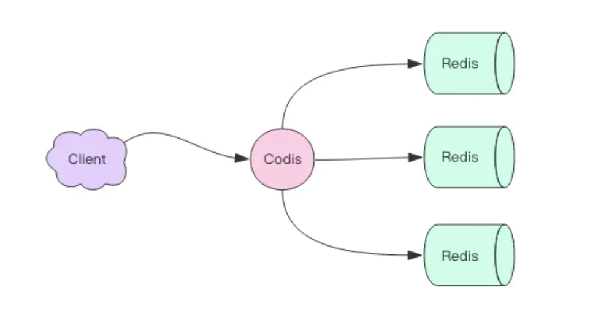
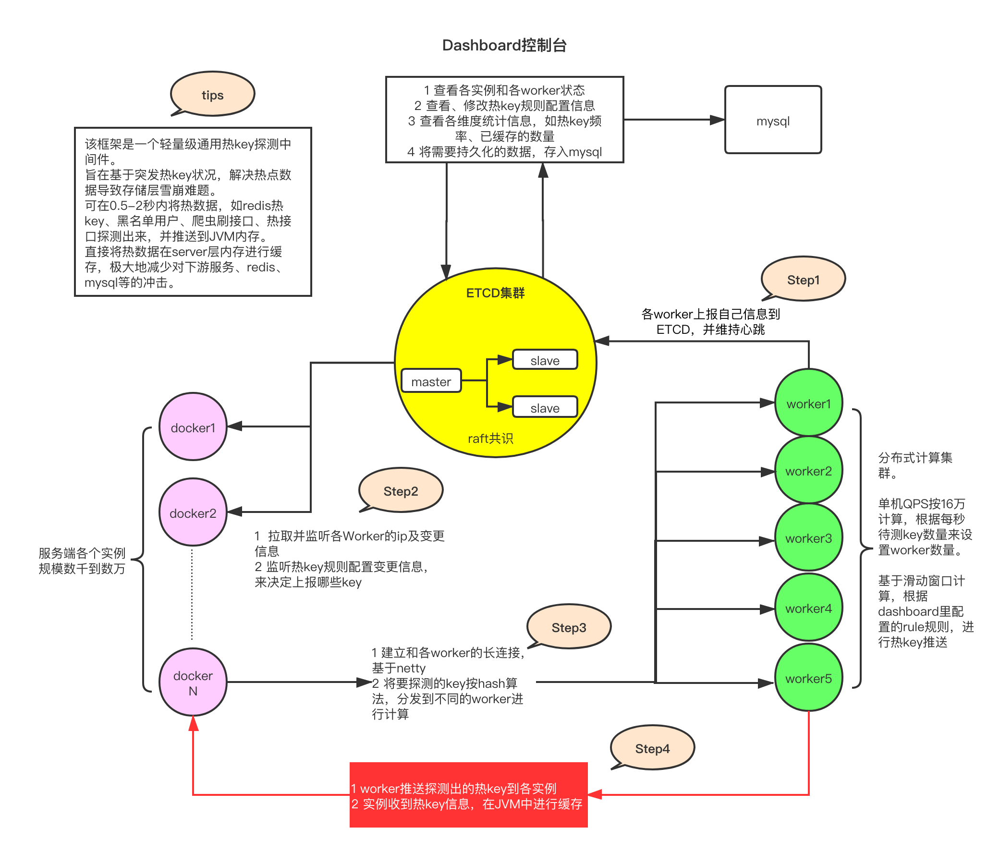
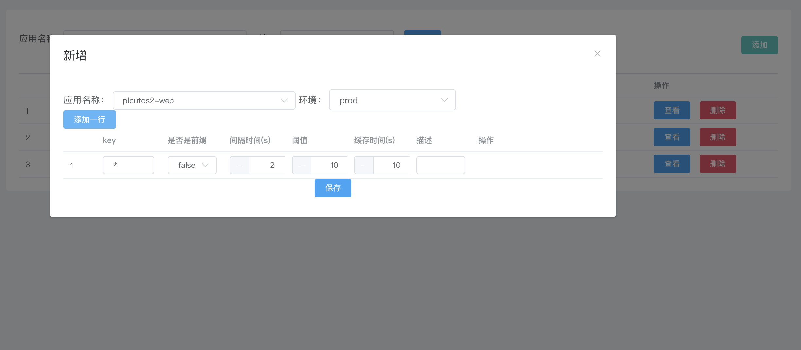
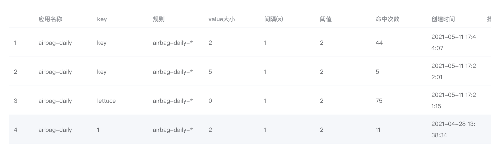

# Redis架构篇

[TOC]

### 为什么要监控热Key？

如果一个Redis的QPS过高，我可以做个主从或者分片，以此来分摊单个节点压力。如果只是某个Key的QPS过高我们该如何处理呢？

这种情况其实非常普遍，比如新闻网站的热门新闻事件或电商网站热门商品等。这个时候某个Key会成为一个热Key，而这个热Key可能会打垮Redis节点，造成系统故障。

### 如何处理热Key

目前业内的方案主要有两种：

#### 1.利用二级缓存

比如利用ehcache，或者一个HashMap都可以。在你发现热key以后，把热Key加载到本地内存中。 针对这种热Key请求，会直接从本地内存中取，而不会走到Redis服务层。

假设此时有10W个针对同一个key的请求过来,如果没有本地缓存，这十万个请求就直接发到同一台Redis上了。 现在假设，你的应用层有50台机器，OK，你也有本地缓存了。这10W个请求平均分散开来，每个机器有2000个请求，会从本地内存中取到value值，然后返回数据。避免了所有请求打到同一台Redis上的情形，以此来避免服务压力过大的问题。

#### 2.备份热Key，分摊压力

这个方案也很简单。不要让Key打到同一台Redis上不就行了。我们把这个Key，在多个redis上都存一份。接下来，有热key请求进来的时候，我们就在有备份Redis节点上随机选取一台，进行访问取值，返回数据。以此来减少单节点的OPS过高问题。

### 如何监控热Key？

我们就要从Redis的使用和原理上去逐层分析。

#### 1、客户端

客户端是用户距离key最近的地方，我们可以在客户端设置全局计数器(比如一个Map)，每次调用Redis命令时，使用这个计数器对Key进行记录和计数。

使用客户端进行热点Key的统计非常容易实现，大家可以想象一下会有哪些问题？

> 1、我们不知道Key的数量，所以不知道Map的大小，所以可能会大量占用服务器内存；
>
> 2、我们需要修改客户端的代码，对代码有一定的侵入性；
>
> 3、我们知道知道当前客户端的热Key，而目前微服务盛行的今天，无法知道整个集群的热Key。

面对这些问题，我们应该如何解决？通过其他存储方式取代本地计数器存储，进而可以解决1和3的问题，但是2的问题依然无法解决。

#### 2、代理端

通过一层中间代理，所有客户端的请求都是通过代理端完成的，以此来进行Redis的操作的统计。比如大家熟悉的Codis。如下图所示：

可以看出所有的操作都是通过Codis来路由转发的。这会有什么问题呢？

> 1、Codis需要保证高可用，一旦Codis出现了问题，会导致整个Redis都将不可用。
>
> 2、多了一层Proxy，多了一层网络交互，性能会有所下降。

#### 3、服务端

使用monitor命令统计热点key是很多开发和运维人员首先想到，monitor命令可以监控到Redis执行的所有命令，下面为一次monitor命令执行后部分结果。这个方案是完美的吗？当然不是，有以下缺点：

> 1、monitor命令在高并发条件下，会存在内存暴增和影响Redis性能的隐患，所以此种方法适合在短时间内使用。
>
> 2、只能统计一个Redis节点的热点key，对于Redis集群需要进行汇总统计。

#### 4、机器层面

Redis客户端使用TCP协议与服务端进行交互，通信协议采用的是Redis协议，可以通过对机器上所有Redis端口的TCP数据包进行抓取完成热点key的统计。这种方法对于Redis客户端和服务端来说毫无侵入，但是依然存在两个问题：

> 1、开发成本高，难以维护
>
> 2、也是单点采集，对于Redis集群需要进行汇总统计。

### 我们如何实现的？

经过上文的详细分析，我们可以总结到发现hotkey，需要以下几个特点：

1、实时性：尽量能够实时统计到

2、高性能：尽量不要对性能有损耗

3、低耦合：不要对用户有侵入

4、支持集群统计

结合上述特点，我们参考了京东开源的产品hotkey来实现我们hotkey的监控系统。整体架构如图：

#### 组件介绍

##### 1、etcd集群

etcd作为一个高性能的配置中心，可以以极小的资源占用，提供高效的监听订阅服务。主要用于存放规则配置，各worker的ip地址，以及探测出的热key、手工添加的热key等。

##### 2、agent代理

就是在服务中添加的引用jar，引入后，就可以以便捷的方式去判断某key是否热key。同时，该jar完成了key上报、监听etcd里的rule变化、worker信息变化、热key变化，对热key进行本地caffeine缓存等。

##### 3、worker端集群

worker端是一个独立部署的Java程序，启动后会连接etcd，并定期上报自己的ip信息，供client端获取地址并进行长连接。之后，主要就是对各个client发来的待测key进行累加计算，当达到etcd里设定的rule阈值后，将热key推送到各个client。

##### 4、dashboard控制台

控制台是一个带可视化界面的Java程序，也是连接到etcd，之后在控制台设置各个APP的key规则，譬如2秒出现20次算热key。然后当worker探测出来热key后，会将key发往etcd，dashboard也会监听热key信息，进行入库保存记录。同时，dashboard也可以手工添加、删除热key，供各个client端监听。

#### 工作原理

##### 1 首先搭建etcd集群

   etcd作为全局共用的配置中心，将让所有的client能读取到完全一致的worker信息和rule信息。

##### 2 启动dashboard可视化界面

​    在界面上添加各个APP的待测规则，如app1它包含两个规则，一个是userId_开头的key，如userId_abc，每2秒出现20次则算热key，第二个是skuId_开头的每1秒出现超过100次则算热key。只有命中规则的key才会被发送到worker进行计算。

##### 3 启动worker集群

​    worker集群可以配置APP级别的隔离，也可以不隔离，做了隔离后，这个app就只能使用这几个worker，以避免其他APP在性能资源上产生竞争。worker启动后，会从etcd读取之前配置好的规则，并持续监听规则的变化。

​    然后，worker会定时上报自己的ip信息到etcd，如果一段时间没有上报，etcd会将该worker信息删掉。worker上报的ip供client进行长连接，各client以etcd里该app能用的worker信息为准进行长连接，并且会根据worker的数量将待测的key进行hash后平均分配到各个worker。

​    之后，worker就开始接收并计算各个client发来的key，当某key达到规则里设定的阈值后，将其推送到该APP全部客户端jar，之后推送到etcd一份，供dashboard监听记录。

##### 4 agent代理

​    client端启动后会连接etcd，获取规则、获取专属的worker ip信息，之后持续监听该信息。获取到ip信息后，会通过netty建立和worker的长连接。

​    client会启动一个定时任务，每500ms（可设置）就批量发送一次待测key到对应的worker机器，发送规则是key的hashcode 对worker数量取余，所以固定的key肯定会发送到同一个worker。这500ms内，就是本地搜集累加待测key及其数量，到期就批量发出去即可。注意，已经热了的key不会再次发送，除非本地该key缓存已过期。

​    当worker探测出来热key后，会推送过来，框架采用caffeine进行本地缓存，会根据当初设置的rule里的过期时间进行本地过期设置。当然，如果在控制台手工新增、删除了热key，client也会监听到，并对本地caffeine进行增删。这样，各个热key在整个client集群内是保持一致性的。

#### 示例

### 总结一下

我们分析了常用监控hotkey的方法后，得出hotkey监控需要的基本特点。然后基于这些特点来进行hotkey方案的实现。

