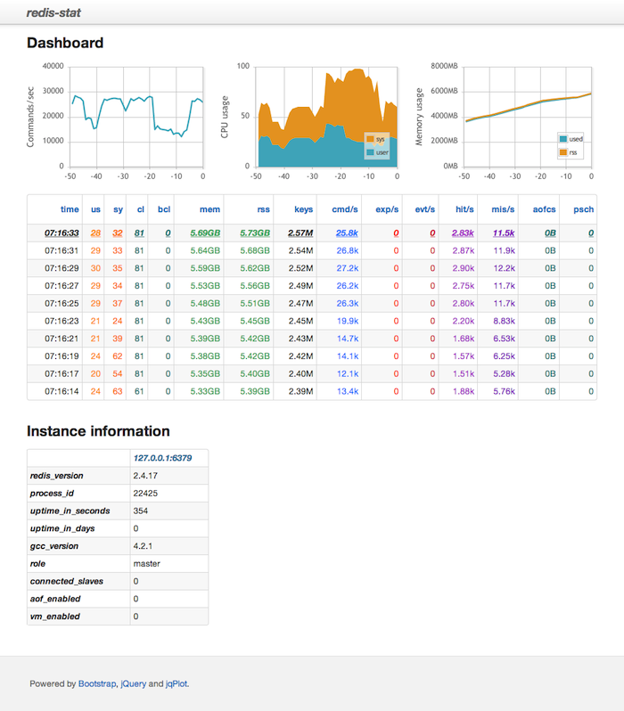
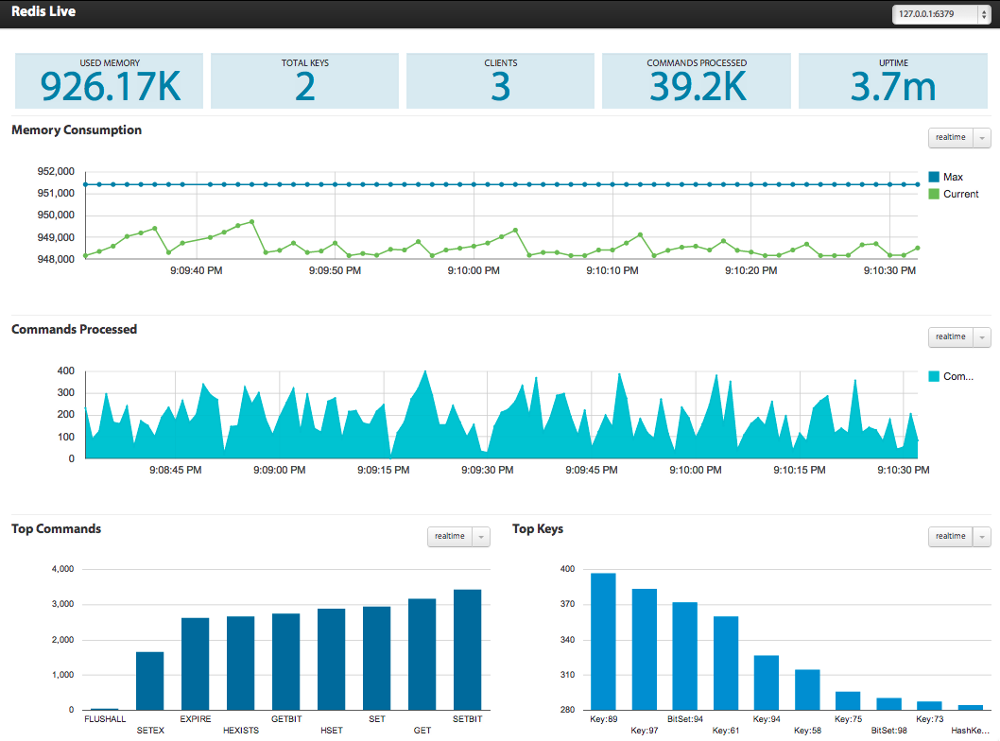
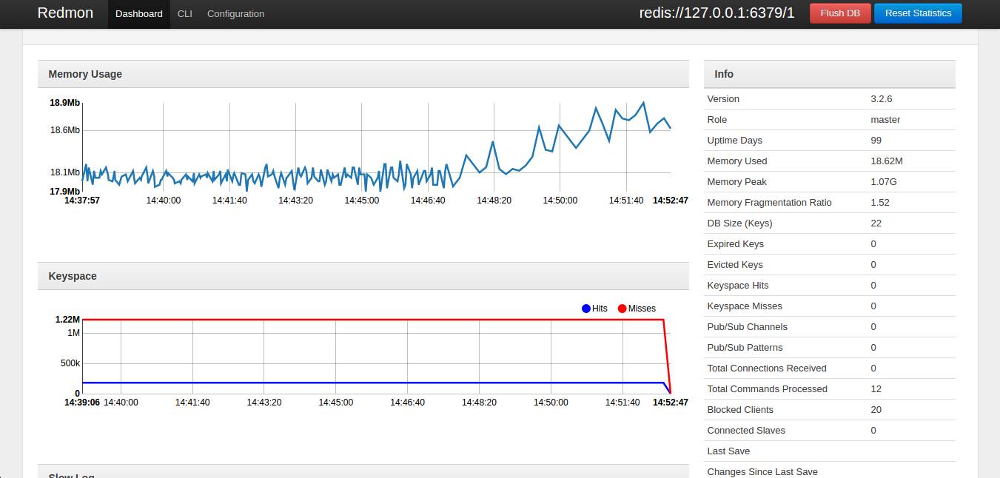
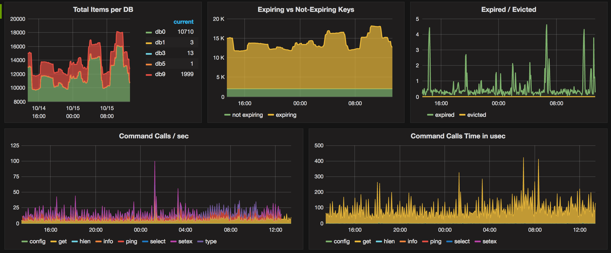

# Redis监控篇

[TOC]

### 监控的背景

任何没有监控的系统，都是裸奔！任何软件系统或是知识，会用只是开始。了如指掌才是目标！

#### 监控的目标

这不单单对 Redis 的监控生效，对其他系统或者数据库的监控依然生效。

- 确保服务正在按照预期正常运行(Required processes are running as expected)
- 使用的系统资源限制在一定范围内(System resources usage is within limits)
- 业务正常执行(Queries are executed successfully)
- 服务的性能没有问题(Service is performing properly)
- 监控容易出故障点(Typical failure points)

#### 监控的内容

这也不单单对 Redis 的监控生效，对其他系统或者数据库的监控依然生效。

- 进程的状态(端口探活)
- 性能指标
- 可用性指标
- 异常监控
- 系统监控(硬件监控)

有了以上监控内容，那么Redis有哪些具体的监控指标呢？

### Redis监控指标

对于Redis我们需要监控哪些指标呢？

#### 进程指标

| 指标       | 内容                         | 建议警告值        |
| ---------- | ---------------------------- | ----------------- |
| Redis 进程 | Redis的进程是否正在运行      | 没有运行即报警    |
| 启动时间   | 确保服务没有一直或者经常重启 | 启动时间小于 300s |

#### 性能指标

|                    |                                                              |                                                              |
| ------------------ | ------------------------------------------------------------ | ------------------------------------------------------------ |
| 指标               | 内容                                                         | 建议告警值                                                   |
| 延迟               | 响应查询的平均时间                                           | > 200 ms                                                     |
| 使用的内存数       | 尽量确保 Redis 使用是的物理内部，没有使用交换分区            |                                                              |
| 内存碎片比例       | 将Redis内存使用情况与Linux虚拟内存页面（映射到物理内存块）进行比较。 高比率将导致交换和性能下降。 | > 1.5                                                        |
| 被删除的Key 的数量 | 由于达到最大内存而删除（移出）的键数。 删除Key太多意味着新请求需要等待一个空白的空间才能存储在内存中。 发生这种情况时，延迟会增加。 | 0， 如果key 有过期时间，但是你不希望出现删除key 的现象，可以设置 evicted_keys > 0 |
| 被阻塞的客户端数   | 阻塞操作中（BLPOP, BRPOP, BRPOPLPUSH），被阻塞的客户端的数量 |                                                              |

#### 可用性指标

| 指标                 | 内容                                                         | 建议告警值                          |
| -------------------- | ------------------------------------------------------------ | ----------------------------------- |
| 客户端数             | Redis 默认的10000，这个值可以反映出你服务的状态，并且和你的应用设置有关。确保这个值在合理的范围内。 |                                     |
| key 的数量(keyspace) | 数据库中 key 数量的总和，可以帮助算出命中率。                |                                     |
| 每秒处理的命令数     |                                                              |                                     |
| 命中率               | 命中量/key总和。如果命中率过低，考虑服务是否正常，当然这不是绝对的。 |                                     |
| rdb 最后一次存储时间 | 开启持久性时，最后保存到磁盘的Unix时间戳。如果时间过长，服务异常终止可能会导致数据丢失。 | > 3600 seconds (或根据你的业务决定) |
| rdb 存储后记录修改数 | 最后一次转储以来，对数据库的更改数。重启后这些数据会丢失。   | 根据你的业务决定                    |
| 从节点数             |                                                              | 数量不对则报警                      |
| 主从最后同步时间     | 从节点与主节点之间最后一次交互后的时间，时间太长说明的主从同步有问题 | >30s(或根据你的业务决定)            |

#### 错误指标： Error

| 指标                     | 内容                                                         | 建议告警值 |
| ------------------------ | ------------------------------------------------------------ | ---------- |
| 被拒绝的客户端数量       | 超过最大连接数后被拒绝的客户端数（最大连接数还和系统的最大描述符有关） | 有则告警   |
| 失败的键查找次数         | 这边指的是Redis 执行查询操作失败的次数，而不是查询不存在 key 的次数 | 有则告警   |
| 主站之间的链路断开的时间 | 当发生新的重新连接时，从站将发送SYNC命令，这将影响主站的性能。 | > 60s      |

#### 系统监控指标

|                |                                                              |            |
| -------------- | ------------------------------------------------------------ | ---------- |
| 指标           | 内容                                                         | 建议警告值 |
| 负载           | 系统的综合指标，指标值过高以为这服务的性能可能出现问题。     |            |
| CUP 使用率     |                                                              |            |
| 内存使用率     |                                                              |            |
| 交换分区使用率 | 交换分区只有在紧急情况下才使用。正常情况下不要使用交换分区. 对于Redis，有人建议直接关掉 Swap，这是有道理的，如果交换分区增加，表明系统的性能在下降。 | > 128M     |
| 网络带宽       | 流量与连接数和请求的大小有关。 网络带宽主要用于故障排除，但不用于警告。 |            |
| 磁盘使用率     | 确保磁盘的空间足够大。                                       | > 85%      |

### Redis监控工具介绍

#### 1、Redis自带客户端

##### 慢日志

```shell
# 超过多少微秒算延迟
CONFIG GET slowlog-log-slower-than
CONFIG SET slowlog-log-slower-than 1000

# 慢查询日志记录条数， 生产环境建议调大
CONFIG GET slowlog-max-len
CONFIG SET slowlog-max-len 250

# 查询最新的 10 条慢查询日志， 时间单位是微秒。从慢查询日志中可以大致算出最差情况下，Redis 的 OPS。
SLOWLOG GET 10
```

##### Redis延时

```shell
redis-cli -h 127.0.0.1 -p 6379 -a 123456 --latency

min: 11, max: 227, avg: 15.79 (82 samples)
```

##### 查看系统状态

功能丰富而强大的redis-cli info，有丰富的监控指标：

```shell
redis-cli info

# Server
redis_version:2.8.8                     # Redis 的版本
redis_git_sha1:00000000
redis_git_dirty:0
redis_build_id:bf5d1747be5380f
redis_mode:standalone
os:Linux 2.6.32-220.7.1.el6.x86_64 x86_64
arch_bits:64
multiplexing_api:epoll
gcc_version:4.4.7                       #gcc版本
process_id:49324                        # 当前 Redis 服务器进程id
run_id:bbd7b17efcf108fdde285d8987e50392f6a38f48
tcp_port:6379                           # 端口
uptime_in_seconds:1739082               # 运行时间(秒)
uptime_in_days:20                       # 运行时间(天)
hz:10
lru_clock:1734729
config_file:/home/s/apps/RedisMulti_video_so/conf/zzz.conf

# Clients
connected_clients:1                     #连接的客户端数量
client_longest_output_list:0            #当前客户端连接中最长的输出列表
client_biggest_input_buf:0              #当前客户端连接中最大的输入缓冲区
blocked_clients:0                       #阻塞操作中（BLPOP, BRPOP, BRPOPLPUSH），被阻塞的客户端的数量

# Memory
used_memory:821848                       #Redis分配的内存总量             
used_memory_human:802.59K
used_memory_rss:85532672                 #Redis分配的内存总量(包括内存碎片)
used_memory_peak:178987632               #Redis消耗的峰值内存（以字节为单位）
used_memory_peak_human:170.70M           #Redis所用内存的高峰值（更容易读的形式）
used_memory_peak_perc:97.65%             #内存峰值/已使用内存数
used_memory_overhead:79244816            #服务器分配用于管理其内部数据结构的所有开销的总字节数
used_memory_startup:524192               #Redis启动时消耗的初始内存量（以字节为单位）
used_memory_dataset:201780960
used_memory_dataset_perc:71.94%
mem_fragmentation_ratio:104.07           #内存碎片比率
mem_allocator:tcmalloc-2.0

# Persistence
loading:0
rdb_changes_since_last_save:0            #上次保存数据库之后，执行命令的次数
rdb_bgsave_in_progress:0                 #后台进行中的 save 操作的数量
rdb_last_save_time:1410848505            #最后一次成功保存的时间点，以 UNIX 时间戳格式显示
rdb_last_bgsave_status:ok
rdb_last_bgsave_time_sec:0
rdb_current_bgsave_time_sec:-1
aof_enabled:0                            #redis是否开启了aof
aof_rewrite_in_progress:0
aof_rewrite_scheduled:0
aof_last_rewrite_time_sec:-1
aof_current_rewrite_time_sec:-1
aof_last_bgrewrite_status:ok
aof_last_write_status:ok

# Stats
total_connections_received:5705          #运行以来连接过的客户端的总数量
total_commands_processed:204013          # 运行以来执行过的命令的总数量
instantaneous_ops_per_sec:0
rejected_connections:0
sync_full:0
sync_partial_ok:0
sync_partial_err:0
expired_keys:34401                       #运行以来过期的 key 的数量
evicted_keys:0                           #运行以来删除过的key的数量
keyspace_hits:2129                       #命中key 的次数
keyspace_misses:3148                     #没命中key 的次数
pubsub_channels:0                        #当前使用中的频道数量
pubsub_patterns:0                        #当前使用中的模式数量
latest_fork_usec:4391                    #最后一次fork操作的持续时间

# Replication
role:master                              #当前实例的角色master还是slave
connected_slaves:0
master_repl_offset:0
repl_backlog_active:0
repl_backlog_size:1048576
repl_backlog_first_byte_offset:0
repl_backlog_histlen:0

# CPU
used_cpu_sys:1551.61
used_cpu_user:1083.37
used_cpu_sys_children:2.52
used_cpu_user_children:16.79

# Keyspace
db0:keys=3,expires=0,avg_ttl=0             #各个数据库的 key 的数量，以及带有生存期的 key 的数量
```

更多详情查看：https://redis.io/commands/info

#### 2、redis-stat

[redis-stat](https://github.com/junegunn/redis-stat)是一个比较有名的redis指标可视化的监控工具，采用ruby开发，基于redis的info命令来统计，通常来说，不会像基于MONITOR命令的监控工具一样，对Redis本身有性能上的影响。一方面可以像vmstat一样，把状态信息从终端输出，另一方面也可以通过基于嵌入式的web server使用dashboard页面查看状态信息。

运行方式：

```shell
docker run --name redis-stat -p 8080:63790 -d insready/redis-stat --server 127.0.0.1
```



##### 3、RedisLive

[RedisLive](https://github.com/snakeliwei/RedisLive)是采用python开发的redis的可视化及查询分析工具。RedisLive的原理很简单，就是通过监控脚本来利用Redis提供的MONITOR命令从被监控Redis实例中获取数据并存储到Redis的监控实例中来做数据分析。

运行方式：

```shell
docker run --name redis-live -p 8888:8888 -d snakeliwei/redislive
```



##### 4、redmon

[redmon](https://github.com/steelThread/redmon)Ruby编写的Redis管理工具，提供了cli、admin的web界面，同时也能够实时监控redis。

运行方式：

```shell
docker run -p 4567:4567 -d  vieux/redmon -r redis://127.0.0.1:6379
```



##### 5、redis_exporter

[redis_exporter](https://github.com/oliver006/redis_exporter)为Prometheus提供了redis指标的exporter，支持Redis 2.x, 3.x and 4.x，配合Prometheus以及grafana的[Prometheus Redis](https://grafana.net/dashboards/763)插件，可以在grafana进行可视化及监控。




##### 总结一下

所有的监控都是基于redis-cli做的，redis-stat基于redis client info对性能无影响、RedisLive 是基于monitor对性能有一定的影响，建议抽样使用；redmon都是现成的redis监控工具，只能可视化指标不能监控。

而基于redis_exporter以及grafana可以做到指标可视化以及监控报警，可以考虑在生产应用上。