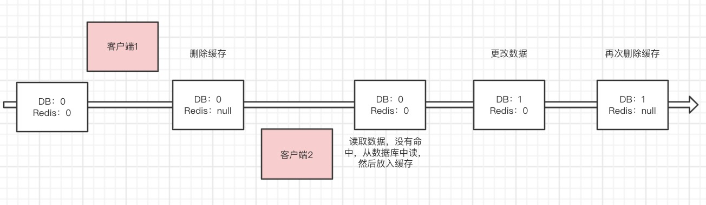

# Redis缓存篇

[TOC]

上面讲了那么多关于Redis的来源、原理、架构以及客户端。今天终于上道主菜。Redis目前我们绝大多数是用于一种场景——缓存！

### 缓存

#### 1、什么是缓存？

缓存就是数据交换的缓冲区（称作Cache），是存储数据（使用频繁的数据）的**临时地方**。当需要查询数据，首先在缓存中寻找，如果找到了则直接执行。如果找不到，则去数据库中查找。

#### 2、为什么需要缓存？

缓存的本质就是用空间换时间，牺牲数据的实时性，以服务器内存中的数据暂时代替从数据库读取最新的数据，**减少数据库IO**，**减轻服务器压力**，**减少网络延迟**，**提高响应速度**，**提高吞吐量**！

缓存这么多优点，是不是任何地方都可以加缓存？答案是不见得！

#### 3、缓存的使用场景有哪些？

**读多写少**：如果你的数据频繁操作修改，频繁更新缓存，以至于读取数据命中缓存率低或准确率低，就没有必要使用缓存了；

**低频访问**：首先缓存是存储在内存里的，放进去之后一直不用，岂不是很浪费？其次是低频访问服务器没有任何压力还要维护一套缓存，这个缓存如果还需要第三方中间件反而增加了维护和网络延迟成本，以至于得不偿失；

**一致性要求不高**：如果一致性要求很高的话，缓存的数据是没有意义的。如果有意义会在缓存和数据库之间的数据一致性方案要求特别高，非常考验技术功底。所以也没有必要添加缓存。

#### 4、缓存有什么问题？

上文也提到了就是缓存与数据库不一致的问题。

高并发问题以及缓存时效的问题，下文根据Redis的使用案例一一介绍。

###  问题1：数据一致性问题

当我们使用Redis作为缓存的时候，一般流程是这样的：

缓存命中：


缓存未命中：


似乎一切看起来很美好，然而事实上比这复杂得多。


如果有两个客户端，客户端1读一个key的数据，客户端2修改一个key的数据。首先客户端2应该先修改缓存呢，还是先修改数据库呢？

现在我们有两种选择：

> 1、先操作Redis缓存的数据再更新数据库的数据
>
> 2、先更新数据库的数据再操作Redis缓存的数据

到底应该选哪一种呢？

无论选择哪一个都可能会有问题，我们只能根据**具体的场景**和所**需要的成本**来采用具体的技术方案。这就是那句著名的话的来源：**任何脱离场景的架构，都是耍流氓。**这里的场景不只是业务场景，还有现状所能投入的资源和成本！

接下来我们具体讨论一下具体的方案选型。首先操作Redis我们也有两种方案：**更新**和**删除**。

这个我们应该怎么选择呢？当然也离不开场景和成本。比如在更新缓存之前，是不是要经过其他表的查询、其他服务的调用、大量的计算才能得到最新的数据？还是直接从数据库就可以拿到最新的值？如果是前者的话，建议直接删除缓存，能够极大程度避免数据库和缓存数据不一致的情况。如果是后者呢？也建议直接删除，道理是一样的，虽然更新造成的不一致的概率更低，但是仍然存在不一致的情况。

OK，关于更新和删除。我们基本能达成一致：删除！

那接下来的问题就是：

> 1、先删除Redis缓存的数据再更新数据库的数据
>
> 2、先更新数据库的数据再删除Redis缓存的数据

#### 先更新数据库，再删除缓存

我们可以想象一下，正常情况是这样的：更新数据库成功，删除缓存成功。

异常情况：

> 1、更新数据库失败，程序阻断，数据一致
>
> 2、更新数据库成功，删除缓存失败，出现了不一致

场景一，我们不用考虑。场景二，我们这么处理呢？

方案一：添加事务，当删除缓存失败了，我们抛出异常，事务回滚，更新数据库回滚。这种在某些程度上解决了不一致性问题，也做到了强一致性。但是很多场景比如用户下单了，支付了，但是商品的物流信息出错了，就让用户下单失败了，再退钱，有些太得不偿失了。

方案二：重试！如果删除缓存失败了，我们捕获这个异常，把删除的key放在一个队列中，然后有一个消费者消费这个队列里的消息，尝试再次删除这个key。达到最终一致性！同时，增加了业务代码的复杂度，都需要增加一个异常的处理流程。

所以针对于方案二，我们可以可以做个**异步更新缓存**。比如通过阿里的canal，监听数据库的数据变更(mysql的binlog)，然后在客户端完成删除key。这样业务代码解耦了，但是系统架构的复杂度也提升了。是不是很纠结。这也正是架构的魅力所在！

#### 先删除缓存，再更新数据库

我们可以想象一下，正常情况是这样的：删除缓存成功，更新数据库成功。

异常情况：

> 1、删除缓存异常，程序阻断，数据一致
>
> 2、删除缓存成功，更新数据库失败。当下次请求缓存不存的时候，从数据库加载，数据一致。

一切看起来这么美好。然而现实往往并非如此！


这时候发现，Redis是旧的值，数据库是新的值，数据发生了不一致。

这该如何处理呢？一直这样不一致下去肯定不行。所以我们可以设置**延时双删**，在数据库写入成功之后，再删除一下缓存。



缓存中常见的一致性问题再次也介绍的差不多了，具体方案一定要考虑场景和成本！

### 问题2、高并发问题

Redis中的数据，有一部分是被频繁访问的，我们常称为热点数据。如何能避免热点数据造成Redis服务的不可用，就是我们这一节要讨论的。比如用户集中访问，抢购商品、明星八卦等。

那如何找到这些热点数据呢？

首先我们在介绍Redis缓存淘汰的时候，介绍到不管是LRU还是LFU，Redis中会存储key相关的操作次数和操作时间。出了使用Redis的淘汰机制外，还有没有其他办法获取到热点数据呢？

##### 1.客户端

客户端其实是距离key”最近”的地方，因为Redis命令就是从客户端发出的。我们可以在命令发出的地方做一个计数，而我们前面介绍的Jedis就是通过这种方式实现的。

例如在客户端设置全局字典(key和调用次数)，每次调用Redis命令时，使用这个字典进行记录，如下所示，Jedis的Connection类中的sendCommand方法是所有命令执行的枢纽。

```java
public Connection sendCommand(final ProtocolCommand cmd, final byte[]... args) {
    //从参数中获取key
    String key = analysis(args);
    //计数
    counterKey(key);
    //ignore
}
public static final AtomicLongMap<String> ATOMIC_LONG_MAP = AtomicLongMap.create(); 

void counterKey(String key) {
    ATOMIC_LONG_MAP.incrementAndGet(key);
}
```

同时为了防止ATOMIC_LONG_MAP过大，可以对其进行定期清理。

使用客户端进行热点key的统计非常容易实现，但是同时问题也非常多：

1. 无法预知key的个数，存在内存泄露的危险。

2. 对于客户端代码有侵入，各个语言的客户端都需要维护此逻辑，维护成本较高。

3. 只能了解当前客户端的热点key，无法实现规模化运维统计。

##### 2.代理端

像Codis这些基于代理的Redis分布式架构，所有客户端的请求都是通过代理端完成的。此架构是最适合做热点key统计的，因为代理是所有Redis客户端和服务端的桥梁。但并不是所有Redis都是采用此种架构。

此种方法会有一个问题：

1.架构的复杂度提升，需要有个专门的团队维护这个代理，代理一旦出了问题，这个那个Redis就不可用了。

##### 3.Redis服务端

Redis Monitor 命令用于实时打印出 Redis 服务器接收到的命令，使用monitor命令统计热点key是很多开发和运维人员首先想到。

```shell
redis 127.0.0.1:6379> MONITOR 
OK
1410855382.370791 [0 127.0.0.1:60581] "info"
1410855404.062722 [0 127.0.0.1:60581] "get" "a"
```

Facebook开源的redis-faina 正是利用上述原理使用Python语言实现的。

此种方法会有两个问题：

 1.monitor命令在高并发条件下，会存在内存暴增和影响Redis性能的隐患，所以此种方法适合在短时间内使用。

 2.只能统计一个Redis节点的热点key，对于Redis集群需要进行汇总统计。

##### 4.机器层面

上一篇我们介绍了，Redis客户端使用TCP协议与服务端进行交互，通信协议采用的是RESP。如果站在机器的角度，可以通过对机器上所有Redis端口的TCP数据包进行抓取完成热点key的统计。

此种方法对于Redis客户端和服务端来说毫无侵入，是比较完美的方案，但是依然存在两个问题：

1.需要一定的开发成本，但是一些开源方案实现了该功能，例如ELK(ElasticSearch Logstash Kibana)体系下的packetbeat[2] 插件，可以实现对Redis、MySQL等众多主流服务的数据包抓取、分析、报表展示。

2.由于是以机器为单位进行统计，要想了解一个集群的热点key，需要进行后期汇总。

总结一下：

| 方案        | 优点                                         | 缺点                                                         |
| ----------- | -------------------------------------------- | ------------------------------------------------------------ |
| 客户端      | 实现简单                                     | 内存泄露隐患 维护成本高 只能统计单个客户端                   |
| 代理        | 代理是客户端和服务端的桥梁，实现最方便最系统 | 增加代理端的开发部署成本                                     |
| 服务端      | 实现简单                                     | monitor本身的使用成本和危害，只能短时间使用 只能统计单个Redis节点 |
| 机器TCP流量 | 对于客户端和服务端无侵入和影响               | 需要专业的运维团队开发，并且增加了机器的部署成本             |

除此之外，还有没有办法解决热点key呢？

我们之前的Redis基础篇中，介绍Redis数据结构的时候介绍了一种数据结构：hash。如果key的类型是一个hash类型的二级数据结构，该哈希元素个数较多的情况下，可以考虑将当前hash进行**拆分**，这样该热点key可以拆分为若干个新的key分布到不同Redis节点上，从而减轻压力。

除此之外，还可以添加**本地缓存**，可以将热点key放在业务端的本地缓存中，减少redis的IO操作，从而解决类似问题。

热点数据，会造成什么问题呢？

### 问题3. 热点数据问题

#### 1、缓存雪崩

缓存雪崩就是Redis的大量的热点数据**同时过期**，刚好这时候Redis请求的**并发量又很大**，就会导致**所有的请求打到数据库**，从而肯能造成服务宕机。

如何解决呢？我们看到有几个关键词：同时过期、并发量很大、所有请求打到数据库，只要能避免这几个关键词就OK了。

1. 缓存数据的过期时间设置随机，防止同一时间大量数据过期现象发生；
2. 设置热点数据永远不过期；
3. 缓存定时预先更新，避免同时失效；
4. 加互斥锁或者使用队列，针对同一个key只允许一个线程到数据库查询。

#### 2、缓存击穿

缓存击穿是指缓存中没有但数据库中有的数据（一般是缓存时间到期），这时由于并发用户特别多，同时读缓存没读到数据，又同时去数据库去取数据，引起数据库压力瞬间增大，造成过大压力。针对与1个key，而雪崩是针对多个key。

如何解决呢？也和缓存雪崩很像：

1. 设置热点数据永远不过期；
2. 缓存定时预先更新，避免失效；
3. 加互斥锁或者使用队列，针对同一个key只允许一个线程到数据库查询。

#### 3、缓存穿透

我们知道用户请求过来之后，首先从缓存获取，获取不到会从数据库获取，获取后写入缓存，返回给用户。那如果数据库也获取不到数据呢？


那这种问题如何解决呢？

1. 业务逻辑判断，非法参数，不做处理；
2. 对非法字符缓存上特殊字符，比如null。

这样似乎解决了问题，其实仔细思考一下，还有问题！

如果非法字符随机生成的呢？业务上区分不开。那依然会导致每次查询都会到达数据库。这样我们该如何解决呢？

这就衍生出了一个经典面试题：**如何在海量元素(10亿条数据)中，快速判断一个元素是否存在？**

缓存穿透的这个问题，我们要避免到数据库查询不存在的数据，首先我们要判断参数是否在我们的数据里。为了加快检索参数是否在我们的数据里，我们应该将数据放在内存里。那10亿条数据我们怎么放呢？放在map里？肯定是不现实的。

所以，首先我们肯定的是这10亿元素，不能直接存值。我们需要找到一个更节省空间的数据结构。这种数据结构在前面的章节中提到过，就是**位图(bitmap)**。它是一个有序的数组，只有0或1。0代表存在，1代表不存在。

在这个数组里面，可以存储 N * sizeof(int) * 8个数据，但是最大的数只能是N * sizeof(int)  * 8 - 1。假如，我们要存储的数据范围为0-15，则我们只需要使得N=1，这样就可以把数据存进去。如下图：


数据为【5，1，7，15，0，4，6，10】，则存入这个结构中的情况为


可以看到，1个bit位就可以代表一个数字。假设一个int类型4个字节，10亿条int类型数据大概4G的内存。而使用位图4G/(4*8) = 125M左右。是不是很满意？

那接下来就是怎么能够将数据映射到具体的bit为上。

1、因为我们的元素的长度是不固定的，我们希望不同长度的输入，可以得到固定长度的输出；

2、转换成小标的时候，我们能希望它是分布均匀的，不然的话也失去了意义。

分布均匀、固定长度，我们不难想到例如MD5、SHA-1等常用的hash算法。如下图所示，经过hash运算之后，进行位运算，找到自己的位置。


然而，现实可能并不是这么美好，将每个元素映射到不同的bit上。现实可能如上图的C#和python，映射到了一个上。这就是所谓的**hash冲突**。

很容易看出如果hash冲突了，会影响bit的数据的准确性。那如何减少hash冲突呢？

1、扩大位图的容量，容量越大，冲突的概率越小。这就是我们常说的扩容，但是位图太大又会造成存储空间成本增加，所以不可能无限制的扩大。

2、hash均匀，如何能够做到hash均匀呢？多次hash，这样的结构就会更均匀。但是可以无限制的多次hash运算吗？当然不能，因为计算是需要CPU成本的！

所以，总的来说我们既要节省空间，又要提高计算效率，必须需要在bitmap空间和hash次数之间取得一个平衡。怎么样衡量一个平衡呢？

不用着急，早已有好事之人为我们做好了理论支持。就是我们所说的**布隆过滤器(Bloom Fliter)**。

#####布隆过滤器

**布隆过滤器**是由布隆（Burton Howard Bloom）在1970年提出的。它实际上是由一个很长的二进制向量和一系列随机映射函数组成，布隆过滤器可以用于检索一个元素是否在一个集合中。它的优点是空间效率和查询时间都远远超过一般的算法，缺点是有一定的误识别率（假正例False positives，即Bloom Filter报告某一元素存在于某集合中，但是实际上该元素并不在集合中）和删除困难，但是没有识别错误的情形（即假反例False negatives，如果某个元素确实没有在该集合中，那么Bloom Filter 是不会报告该元素存在于集合中的，所以不会漏报）。


以上图为例，具体的操作流程：假设集合里面有3个元素{x, y, z}，哈希函数的个数为3。首先将位数组进行初始化，将里面每个位都设置位0。对于集合里面的每一个元素，将元素依次通过3个哈希函数进行映射，每次映射都会产生一个哈希值，这个值对应位数组上面的一个点，然后将位数组对应的位置标记为1。查询W元素是否存在集合中的时候，同样的方法将W通过哈希映射到位数组上的3个点。如果3个点的其中有一个点不为1，则可以判断该元素一定不存在集合中。反之，如果3个点都为1，则该元素可能存在集合中。注意：此处不能判断该元素是否一定存在集合中，可能存在一定的误判率。可以从图中可以看到：假设某个元素通过映射对应下标为4，5，6这3个点。虽然这3个点都为1，但是很明显这3个点是不同元素经过哈希得到的位置，因此这种情况说明元素虽然不在集合中，也可能对应的都是1，这是误判率存在的原因。

添加元素

- 将要添加的元素给k个哈希函数
- 得到对应于位数组上的k个位置
- 将这k个位置设为1

查询元素

- 将要查询的元素给k个哈希函数
- 得到对应于位数组上的k个位置
- 如果k个位置有一个为0，则肯定不在集合中
- 如果k个位置全部为1，则可能在集合中

##### 实现方式

```java
        //创建字符串布隆过滤器，使用编码UTF-8
        //创建时需要传入四个参数，但我们只要关心前三个就行
        //Funnel，这是Guava中定义的一个接口，它和PrimitiveSink配套使用，主要是把任意类型的数据转化成Java基本数据类型（primitive value，如char，byte，int……），默认用java.nio.ByteBuffer实现，最终均转化为byte数组
        //expectedInsertions 期望插入数据数，int或long
        //fpp期望误判率，比如1E-7（千万分之一）
        //Strategy 策略，默认选取64位哈希映射函数，BloomFilterStrategies.MURMUR128_MITZ_64
        BloomFilter<CharSequence> bloomFilter = BloomFilter.create(Funnels.stringFunnel(Charsets.UTF_8), 200000, 1E-7);
        //置入元素，其实也有boolean类型返回，但是尊重注解，就不返回值了
        bloomFilter.put("测试测试");
        //判断元素是否存在，true存在，false不存在。
        boolean isContain=bloomFilter.mightContain("测试测试");
```

https://hur.st/bloomfilter可以做一下测试：


100万数据，5个hash函数，存储空间只需要890K。

##### 业务应用场景

先通过Bloom Filter验证一下参数是否存在，如果不存在则直接返回。如果存在则再进行缓存查询和数据查询。


