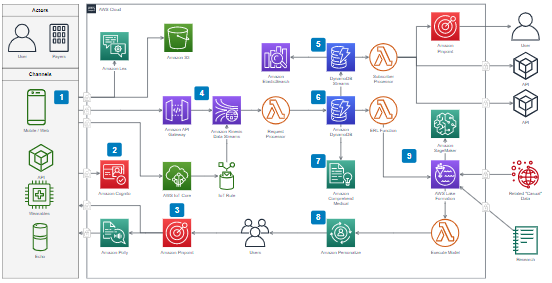
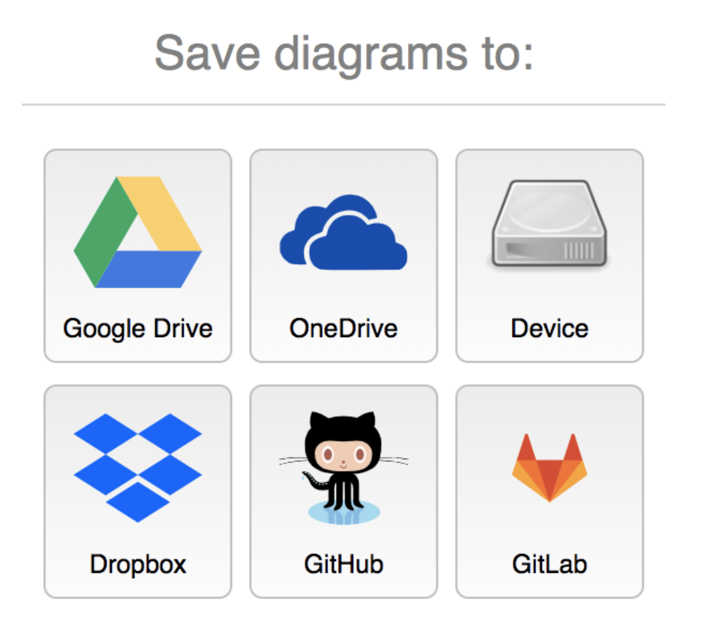
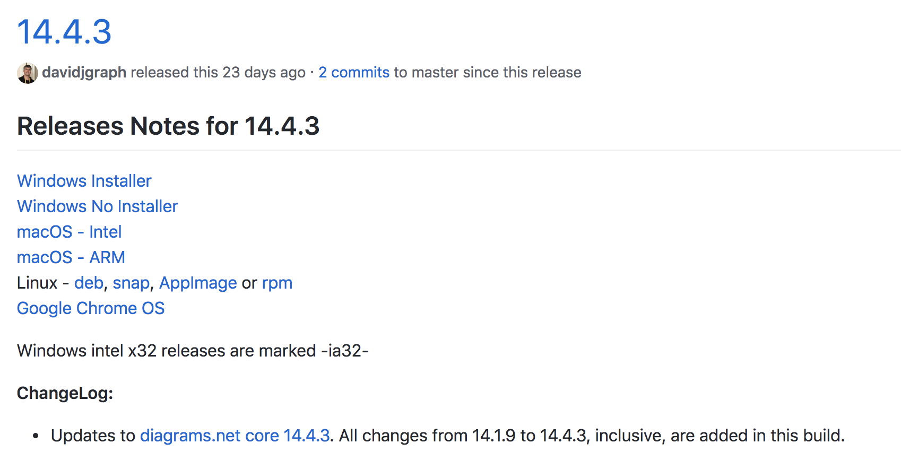
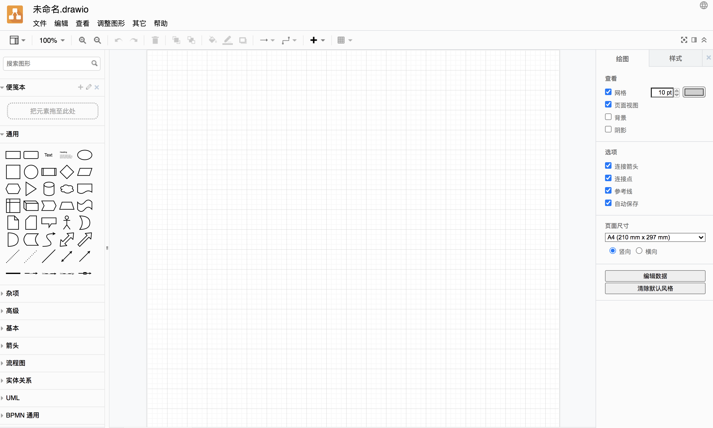

# Drawio在线图表

### 软件介绍

[draw.io](https://app.diagrams.net/) 是在线图表网站 diagrams.net 的代码实现。diagrams.net 是一个用于构建图表应用程序的开源技术栈，也是世界上使用最广泛的基于浏览器的终端用户图表软件。



支持将文件上传到各个平台存储：



### 构建

draw.io 由两部分组成。主要部分是客户端的 JavaScript 代码。用户可以使用 Ant build.xml 文件中默认的 "all" 任务来创建 minified JavaScript，该任务通过在仓库的 etc/build 文件夹中运行 ant 来执行。

注意，如果只使用客户端代码，会导致缺少 Gliffy 和 .vsdx 导入器、嵌入支持、图标搜索和发布到 Imgur。如果用户想用 Java 服务器端代码和客户端 JavaScript 构建完整的项目，请调用 Ant build.xml 文件中的 "war" 任务，并将生成的 .war 文件部署到 servlet 引擎中。

### 运行

1. 运行 diagrams.net 的一种方法是 fork 该项目，将主分支发布到 [GitHub](https://github.com/jgraph/drawio) 页面上，页面站点将拥有完整的编辑器功能（不建议部署源码）。

2. 另一种方法是使用推荐的 [Docker 项目](https://github.com/jgraph/docker-drawio)(建议方式)或下载 [draw.io Desktop](https://get.diagrams.net/)。

3. ```shell
   docker run -it --rm --name="draw" -p 8080:8080 -p 8443:8443 jgraph/drawio
   ```

4. 客户端和 servlets 的完整 packaged.war 可以在[release 页面](https://github.com/jgraph/draw.io/releases)获得。



支持各种操作系统下的客户端，同时支持Chrome插件！

### 支持的浏览器

diagrams.net 目前支持 IE 11、Chrome 70+、Firefox 70+、Safari 11+、Opera 50+、原生安卓浏览器7x+、当前及以前主要 iO S版本的默认浏览器（如11.2.x和10.3.x）和 Edge 79+。



### 开源但并非开放贡献

与SQLite相似，diagrams.net是开源的，但不提供贡献。

该项目的复杂程度意味着即使简单的更改也可能破坏许多其他活动部件。所需的测试量远远超过了最初的样子。如果我们要获得PR，则必须将其基本丢弃并写成我们希望其实现的方式。

我们感谢社区的参与，错误报告和功能要求。除了欢迎之外，我们不希望退出，但是，我们已决定保持该项目的长期可行性，以确保项目不受捐助。

