## 分布式事务

[TOC]

### 分布式事务概念

事务，我们在介绍MySQL的时候都已经介绍过了，在这就不过多介绍。用一句话总结：

> 事务是数据库管理系统执行过程中的一个逻辑单位，由一个有限的数据库操作序列构成。

上文说道MySQL分库分表之后，会将之前单机下一个逻辑单位拆分成多个单位，而这多个单位也要作为一个逻辑单位执行，这就会有分布式事务的问题。那什么是分布式事务呢？我们看一下wiki上的解释：

> A distributed transaction is a database transaction in which two or more network hosts are involved.

分布式事务顾名思义就是要在分布式系统中实现事务，它其实是由多个本地事务组合而成。不过事务一词含义随着SOA架构逐渐扩大，根据上下文不同，可分为两类：

- System transaction；
- Business transaction。

前者多指数据库事务，后者则多对应一个业务交易。

然而，如何实现分布式事务呢？

### 分布式事务协议

#### XA协议

在介绍实现方式之前，先介绍一个基础的协议XA协议。

最早的分布式事务模型是由 X/Open 国际联盟提出的 X/Open Distributed Transaction Processing（DTP）模型，也称为XA协议。

XA协议通过一个全局事务管理器与多个资源管理器进行交互。全局事务管理器负责管理全局事务状态和参与事务的资源，资源管理器则负责具体的资源操作，XA协议与应用程序的关系如图所示：

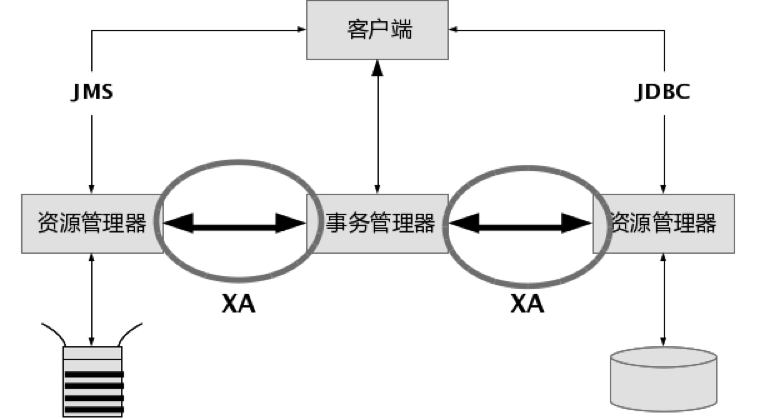

DTP模型定义如下角色 ：

- **AP(Application Program)** : 既应用程序，可以理解为使用DTP分布式事务的程序。
- **RM(Resource Manager) **: 即资源管理器，可以理解为事务的参与者，一般情况下是指一个数据库实例，通过资源管理器对该数据库进行控制，资源管理器控制着分支事务。
- **TM(Transaction Manager)** : 事务管理器，负责协调和管理事务，事务管理器控制着全局事务，管理事务生命周期，并协调各个RM。全局事务是指分布式事务处理环境中，需要操作多个数据库共同完成一个工作，这个工作即是一个全局事务。

DTP模型定义TM和RM之间通讯的接口规范叫**XA**。

以上三个角色之间的交互方式如下 ：

​	1. TM向AP提供应用程序编程接口，AP通过TM提交及回滚事务。

	2. TM交易中间件通过XA接口来通知RM数据库事务的开始、结束以及提交、回滚等。

**二阶提交协议**和**三阶提交协议**就是根据这一思想衍生出来的。可以说二阶段提交其实就是实现**XA分布式事务**的关键。

##### 2PC

两阶段提交（Two-phase Commit，2PC）是 XA 用于在全局事务中协调多个资源的机制。通过引入协调者（Coordinator）来协调参与者的行为，并最终决定这些参与者是否要真正执行事务。

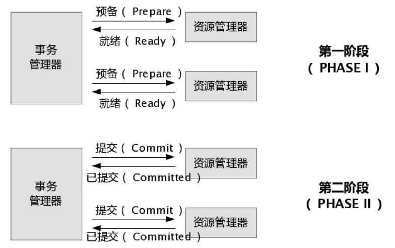

**1.准备阶段**

协调者询问参与者事务是否执行成功，参与者发回事务执行结果。

准备阶段分为以下三个步骤：

> 1. 协调者向所有的参与者发送事务执行请求，并等待参与者反馈事务执行结果；
> 2. 事务参与者收到请求之后，执行事务但不提交，并记录事务日志；
> 3. 参与者将自己事务执行情况反馈给协调者，同时阻塞等待协调者的后续指令。

**2.提交阶段**

在经过第一阶段协调者的询盘之后，各个参与者会回复自己事务的执行情况，这时候存在 3 种可能性：

1. 所有的参与者都回复能够正常执行事务。
2. 一个或多个参与者回复事务执行失败。
3. 协调者等待超时。

对于第 1 种情况，协调者将向所有的参与者发出提交事务的通知，具体步骤如下：

1. 协调者向各个参与者发送 commit 通知，请求提交事务；
2. 参与者收到事务提交通知之后执行 commit 操作，然后释放占有的资源；
3. 参与者向协调者返回事务 commit 结果信息。

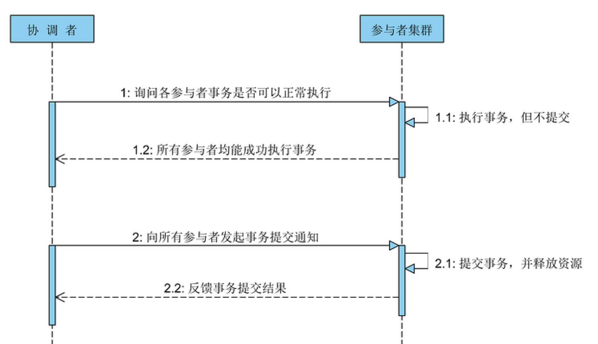

对于第 2 和第 3 种情况，协调者均认为参与者无法成功执行事务，为了整个集群数据的一致性，所以要向各个参与者发送事务回滚通知，具体步骤如下：

1. 协调者向各个参与者发送事务 rollback 通知，请求回滚事务；
2. 参与者收到事务回滚通知之后执行 rollback 操作，然后释放占有的资源；
3. 参与者向协调者返回事务 rollback 结果信息。

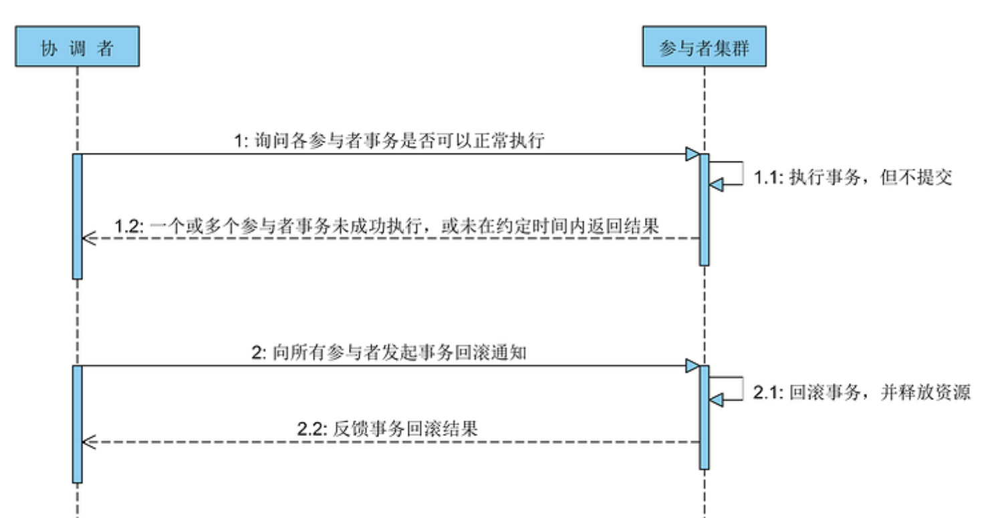

两阶段提交协议原理简单、易于实现，但是缺点也是显而易见的，包含：

- **单点问题**

协调者在整个两阶段提交过程中扮演着举足轻重的作用，一旦协调者所在服务器宕机，就会影响整个数据库集群的正常运行。比如在第二阶段中，如果协调者因为故障不能正常发送事务提交或回滚通知，那么参与者们将一直处于阻塞状态，整个数据库集群将无法提供服务。

- **同步阻塞**

两阶段提交执行过程中，所有的参与者都需要听从协调者的统一调度，期间处于阻塞状态而不能从事其他操作，这样效率极其低下。

- **数据不一致性**

两阶段提交协议虽然是分布式数据强一致性所设计，但仍然存在数据不一致性的可能性。比如在第二阶段中，假设协调者发出了事务 commit 通知，但是因为网络问题该通知仅被一部分参与者所收到并执行了commit 操作，其余的参与者则因为没有收到通知一直处于阻塞状态，这时候就产生了数据的不一致性。

由于二阶段提交存在着诸如同步阻塞、单点问题、脑裂等缺陷，所以，研究者们在二阶段提交的基础上做了改进，提出了**三阶段提交**。

##### 3PC

3PC是2PC的改进版，其将二阶段提交协议的“准备阶段”一份为二，形成了cancommit，precommit，docommit三个阶段。

 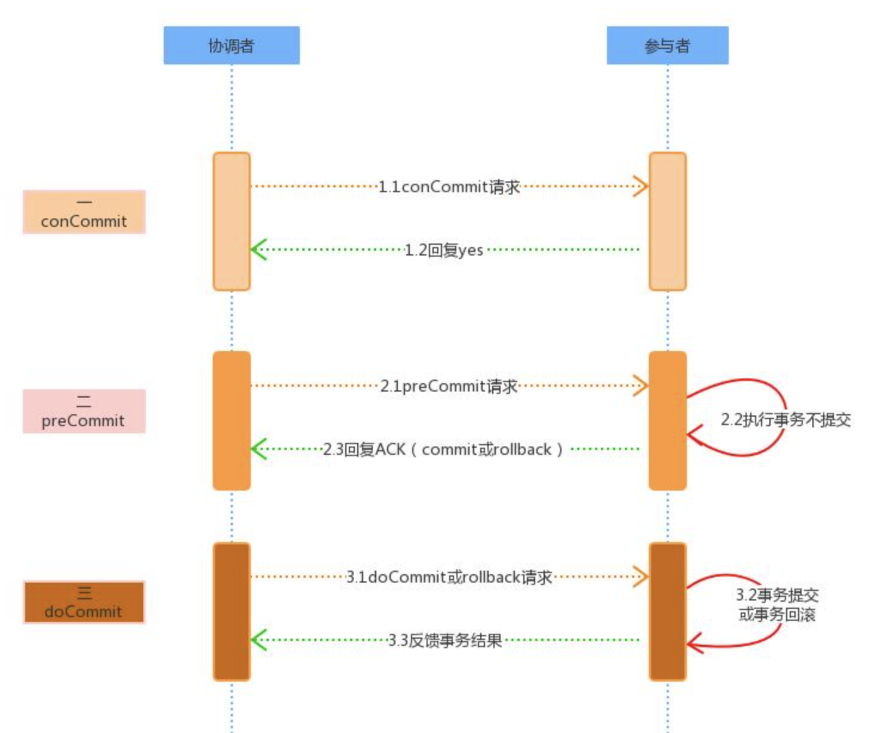

**CanCommit阶段**

该阶段协调者会去询问各个参与者是否能够正常执行事务，参与者根据自身情况回复一个预估值，相对于真正的执行事务，这个过程是轻量的，具体步骤如下：

> 1. 协调者向各个参与者发送事务询问通知，询问是否可以执行事务操作，并等待回复；
> 2. 各个参与者依据自身状况回复一个预估值，如果预估自己能够正常执行事务就返回确定信息，并进入预备状态，否则返回否定信息。

**PreCommit阶段**

本阶段协调者会根据第一阶段的询盘结果采取相应操作，询盘结果主要有 3 种：

1. 所有的参与者都返回确定信息。
2. 一个或多个参与者返回否定信息。
3. 协调者等待超时。

针对第 1 种情况，协调者会向所有参与者发送事务执行请求，具体步骤如下：

> 1. 协调者向所有的事务参与者发送事务执行通知；
> 2. 参与者收到通知后执行事务但不提交；
> 3. 参与者将事务执行情况返回给客户端。

在上述步骤中，如果参与者等待超时，则会中断事务。

针对第 2 和第 3 种情况，协调者认为事务无法正常执行，于是向各个参与者发出 abort 通知，请求退出预备状态，具体步骤如下：

> 1. 协调者向所有事务参与者发送 abort 通知；
> 2. 参与者收到通知后中断事务。

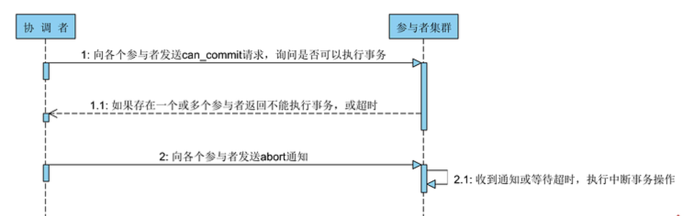

**doCommit阶段**

如果第二阶段事务未中断，那么本阶段协调者将会依据事务执行返回的结果来决定提交或回滚事务，分为 3 种情况：

1. 所有的参与者都能正常执行事务。
2. 一个或多个参与者执行事务失败。
3. 协调者等待超时。

针对第 1 种情况，协调者向各个参与者发起事务提交请求，具体步骤如下：

> 1. 协调者向所有参与者发送事务 commit 通知；
> 2. 所有参与者在收到通知之后执行 commit 操作，并释放占有的资源；
> 3. 参与者向协调者反馈事务提交结果。

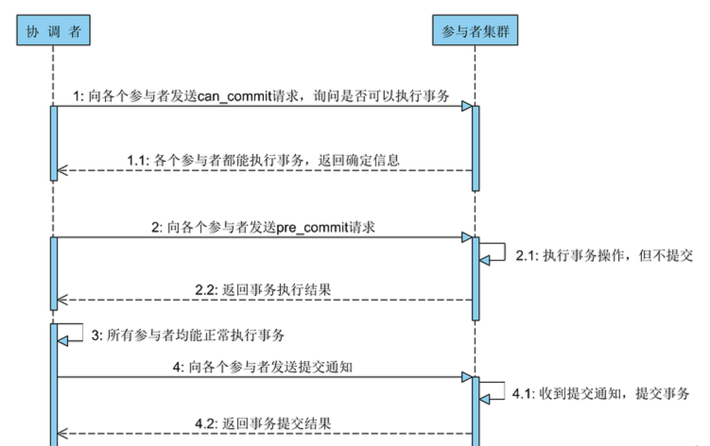

针对第 2 和第 3 种情况，协调者认为事务无法成功执行，于是向各个参与者发送事务回滚请求，具体步骤如下：

> 1. 协调者向所有参与者发送事务 rollback 通知；
> 2. 所有参与者在收到通知之后执行 rollback 操作，并释放占有的资源；
> 3. 参与者向协调者反馈事务回滚结果。

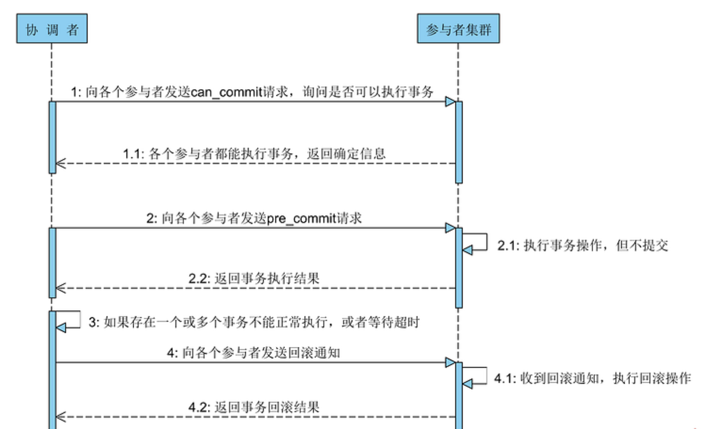

两阶段提交协议中所存在的长时间阻塞状态发生的几率还是非常低的，所以虽然三阶段提交协议相对于两阶段提交协议对于数据强一致性更有保障，但是因为效率问题，两阶段提交协议在实际系统中反而用的更多。

##### 总计一下

相对于2PC，3PC主要解决的单点故障问题，并减少阻塞，因为一旦参与者无法及时收到来自协调者的信息之后，他会默认执行commit。而不会一直持有事务资源并处于阻塞状态。

但是这种机制也会导致数据一致性问题，因为，由于网络原因，协调者发送的abort响应没有及时被参与者接收到，那么参与者在等待超时之后执行了commit操作。这样就和其他接到abort命令并执行回滚的参与者之间存在数据不一致的情况。

我们可以发现，无论是二阶段提交还是三阶段提交都无法彻底解决分布式的一致性问题。

#### TCC模式

TCC（Try-Confirm-Cancel）分布式事务模型通过对业务逻辑进行分解来实现分布式事务。顾名思义，TCC事务模型需要业务系统提供以下三种业务逻辑。

- Try：完成业务检查，预留业务所需的资源。Try操作是整个TCC的精髓，可以灵活选择业务资源锁的粒度。
- Confirm：执行业务逻辑，直接使用Try阶段预留的业务资源，无须再次进行业务检查。
- Cancel：释放Try阶段预留的业务资源。

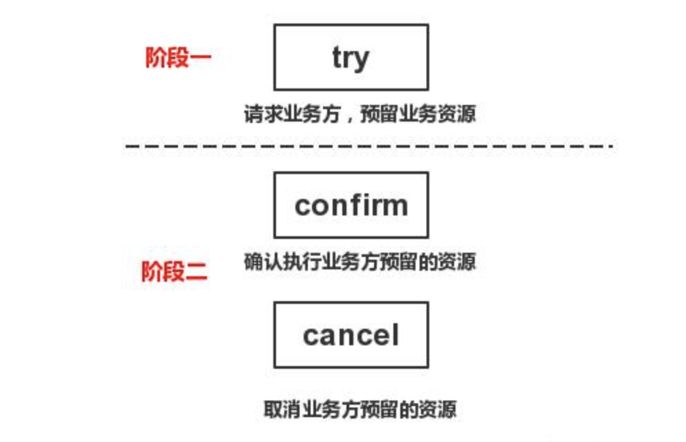

TCC模型仅提供两阶段原子提交协议，保证分布式事务的原子性。事务的隔离交给业务逻辑来实现。TCC 模型的隔离性思想是，通过对业务的改造将对数据库资源层面加锁上移至对业务层面加锁，从而释放底层数据库锁资源，拓宽分布式事务锁协议，提高系统的并发性。

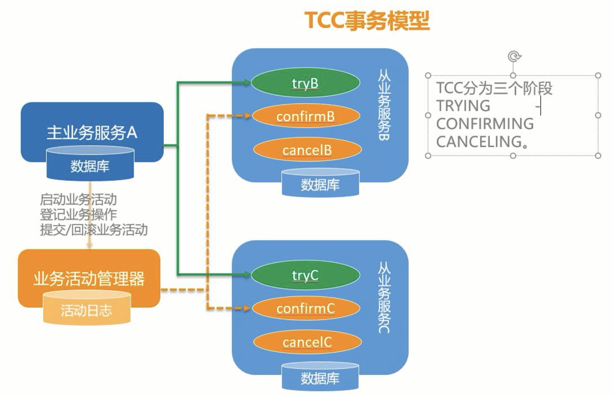

TCC需要应用方负责提供实现Try、Confirm和Cancel操作的三个接口，供事务管理器调用，因此业务方改造的成本较高，**对业务的侵入较大和业务紧耦合**。还有一点要注意，撤销和确认操作的执行可能需要重试，因此还需要保证**操作的幂等**。

#### Saga模式

1987年普林斯顿大学的Hector Garcia-Molina和Kenneth Salem发表了一篇Paper Sagas，讲述的是如何处理long lived transaction（长活事务）。Saga是一个长活事务可被分解成可以交错运行的子事务集合。其中每个子事务都是一个保持数据库一致性的真实事务。

现在有两种不同的方式来实现saga事务，最流行的两种方式是：

1. 事件/编排Choreography：没有中央协调器（没有单点风险）时，每个服务产生并聆听其他服务的事件，并决定是否应采取行动。
2. 命令/协调orchestrator：中央协调器负责集中处理事件的决策和业务逻辑排序。

让我们对这两个实现进行更深入的了解，以了解它们的工作方式。

##### 事件/编排Events/Choreography

在Events/Choreography方法中，第一个服务执行一个事务，然后发布一个事件。该事件被一个或多个服务进行监听，这些服务再执行本地事务并发布（或不发布）新的事件。

当最后一个服务执行本地事务并且不发布任何事件时，意味着分布式事务结束，或者它发布的事件没有被任何Saga参与者听到都意味着事务结束。

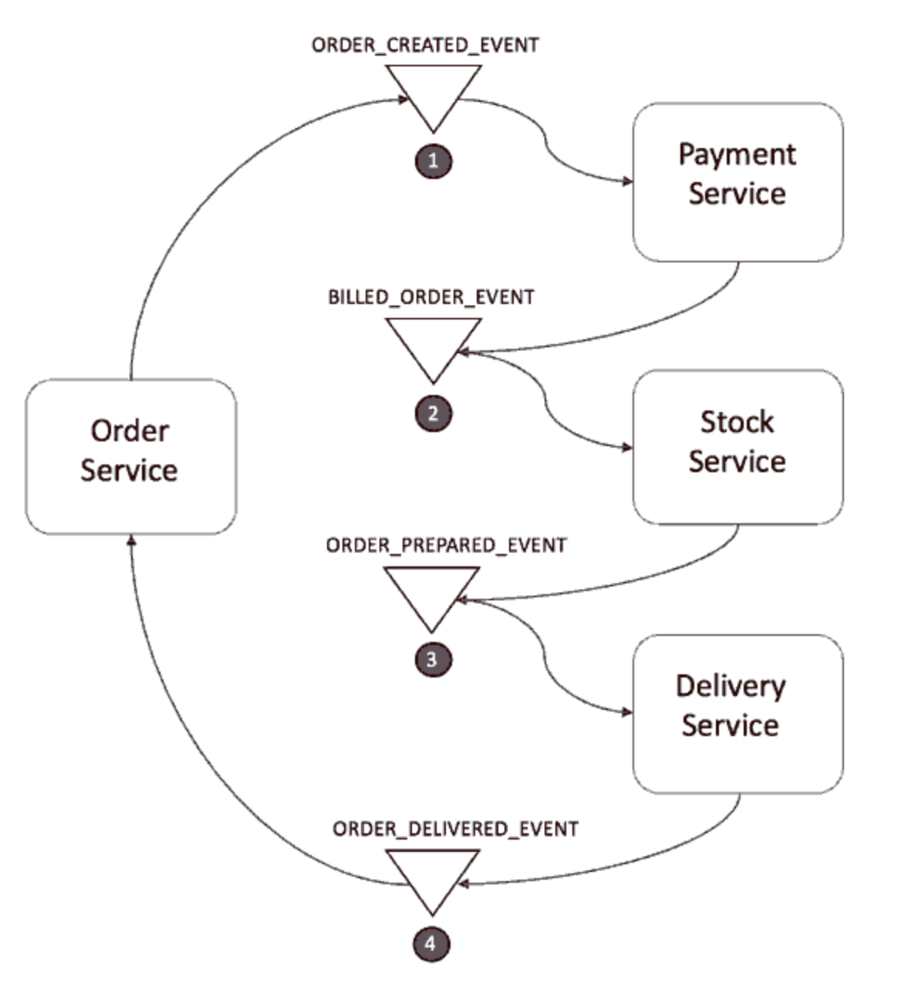

事件/编排是实现Saga模式的自然方式; 它很简单，容易理解，不需要太多的努力来构建，所有参与者都是松散耦合的，因为他们彼此之间没有直接的耦合。但是，如果您在事务中不断添加额外步骤，则此方法可能会很快变得混乱，因为很难跟踪哪些服务监听哪些事件。此外，它还可能在服务之间添加循环依赖，因为它们必须订阅彼此的事件。

##### Saga的命令/协调模式

我们定义了一项新服务，全权负责告诉每个参与者该做什么以及什么时候该做什么。saga协调器orchestrator以命令/回复的方式与每项服务进行通信，告诉他们应该执行哪些操作。

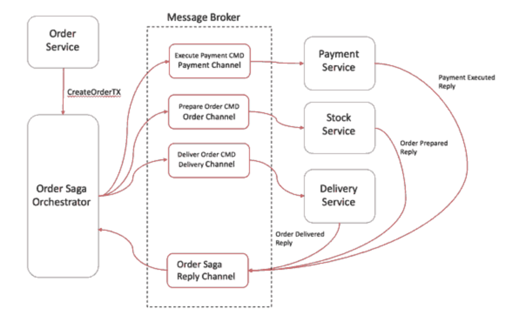

基于协调器的Saga有很多好处：

> 1.避免服务之间的循环依赖关系，因为saga协调器会调用saga参与者，但参与者不会调用协调器
>
> 2.集中分布式事务的编排
>
> 3.只需要执行命令/回复(其实回复消息也是一种事件消息)，降低参与者的复杂性。
>
> 4.更容易实施和测试
>
> 5.在添加新步骤时，事务复杂性保持线性，回滚更容易管理
>
> 6.如果在第一笔交易还没有执行完，想改变有第二笔事务的目标对象，则可以轻松地将其暂停在协调器上，直到第一笔交易结束。

然而，这种方法仍然有一些缺点，其中之一是有在协调器中集中太多逻辑的风险，并最终导致智能协调器会告诉愚蠢的服务该做什么的架构，这不符合Martinfowler定义微服务应该是聪明的服务+哑巴或愚蠢的管道。

Saga协调器的另一个缺点是它会稍微增加基础设施的复杂性，因为您需要管理额外的服务。同时增加单点风险，协调器一旦出问题，全局影响。

##### 总结一下

Saga 是一种补偿协议，在 Saga 模式下，分布式事务内有多个参与者，每一个参与者都是一个冲正补偿服务，需要用户根据业务场景实现其正向操作和逆向回滚操作。

分布式事务执行过程中，依次执行各参与者的正向操作，如果所有正向操作均执行成功，那么分布式事务提交。如果任何一个正向操作执行失败，那么分布式事务会退回去执行前面各参与者的逆向回滚操作，回滚已提交的参与者，使分布式事务回到初始状态。

### 分布式事务实现方案

#### Seata方案

Seata 是 Simple Extensible Autonomous Transaction Architecture 的简写，由 feascar 改名而来。是一款开源的分布式事务解决方案，致力于提供高性能和简单易用的分布式事务服务。Seata 将为用户提供了 AT、TCC、SAGA 和 XA 事务模式，为用户打造一站式的分布式解决方案。

Seata整体架构为两阶段提交协议的演变：

- 一阶段：
  - 业务数据和回滚日志记录在同一个本地事务中提交，释放本地锁和连接资源。
- 二阶段：
  - 提交异步化，非常快速地完成。
  - 回滚通过一阶段的回滚日志进行反向补偿。

Seata 中有三大模块，分别是 TM、RM 和 TC，具体如下：

- **Transaction Coordinator (TC)： 事务协调器，维护全局事务的运行状态，负责协调并驱动全局事务的提交或回滚。**
- **Transaction Manager (TM)： 控制全局事务的边界，负责开启一个全局事务，并最终发起全局提交或全局回滚的决议。**
- **Resource Manager (RM)： 控制分支事务，负责分支注册、状态汇报，并接收事务协调器的指令，驱动分支（本地）事务的提交和回滚。**

其中，TM是一个分布式事务的发起者和终结者，TC负责维护分布式事务的运行状态，而RM则负责本地事务的运行。如下图所示：

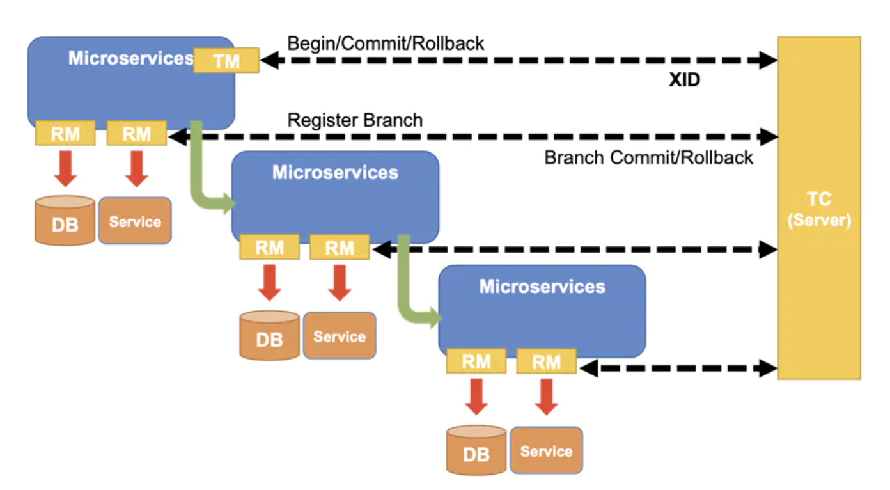

在 Seata 中，分布式事务的执行流程：

1. TM 开启分布式事务（TM 向 TC 注册全局事务记录）；
2. 按业务场景，编排数据库、服务等事务内资源（RM 向 TC 汇报资源准备状态 ）；
3. TM 结束分布式事务，事务一阶段结束（TM 通知 TC 提交/回滚分布式事务）；
4. TC 汇总事务信息，决定分布式事务是提交还是回滚；
5. TC 通知所有 RM 提交/回滚 资源，事务二阶段结束。

##### AT模式

上文中我们提到的Seata流程只是Seata支持的一种分布式事务模式，称为AT模式。它依赖于RM拥有本地数据库事务的能力，对于客户业务无侵入性。如图所示：

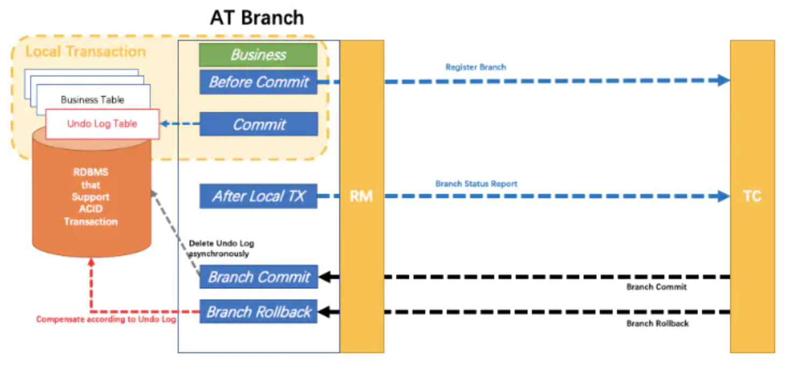

AT模式中业务逻辑不需要关注事务机制，分支与全局事务的交互过程自动进行。用户只需关注自己的“业务 SQL”，用户的 “业务 SQL” 作为一阶段，Seata 框架会自动生成事务的二阶段提交和回滚操作。

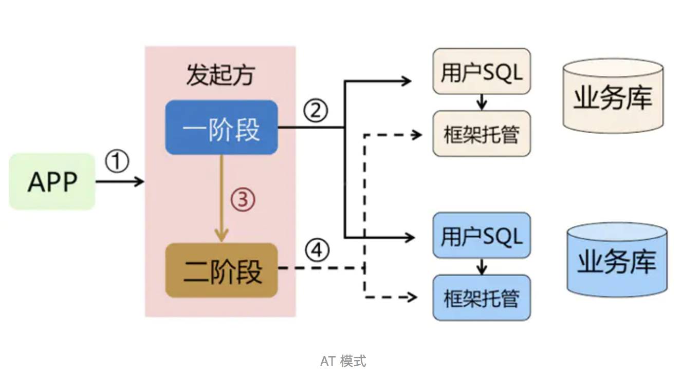

##### TCC模式

TCC 模式需要用户根据自己的业务场景实现 Try、Confirm 和 Cancel 三个操作；事务发起方在一阶段 执行 Try 方式，在二阶段提交执行 Confirm 方法，二阶段回滚执行 Cancel 方法。

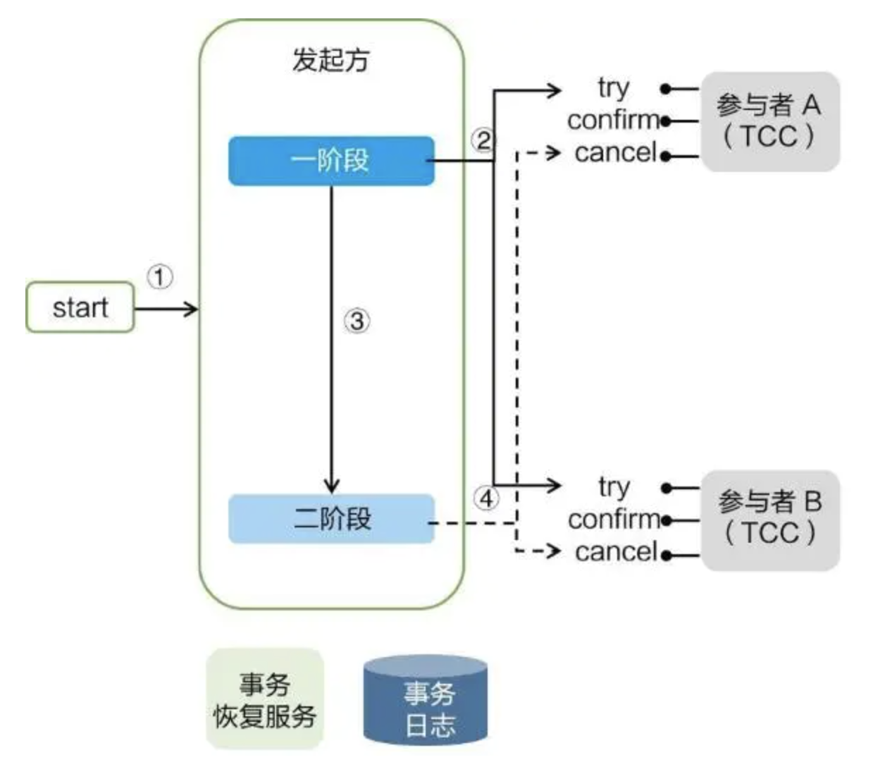

TCC 三个方法描述：

> Try：资源的检测和预留；
>
> Confirm：执行的业务操作提交；要求 Try 成功 Confirm 一定要能成功；
>
> Cancel：预留资源释放。

业务模型分 2 阶段设计：用户接入 TCC ，最重要的是考虑如何将自己的业务模型拆成两阶段来实现。

##### Saga模式

Saga模式是SEATA提供的长事务解决方案，在Saga模式中，业务流程中每个参与者都提交本地事务，当出现某一个参与者失败则补偿前面已经成功的参与者，一阶段正向服务和二阶段补偿服务都由业务开发实现。

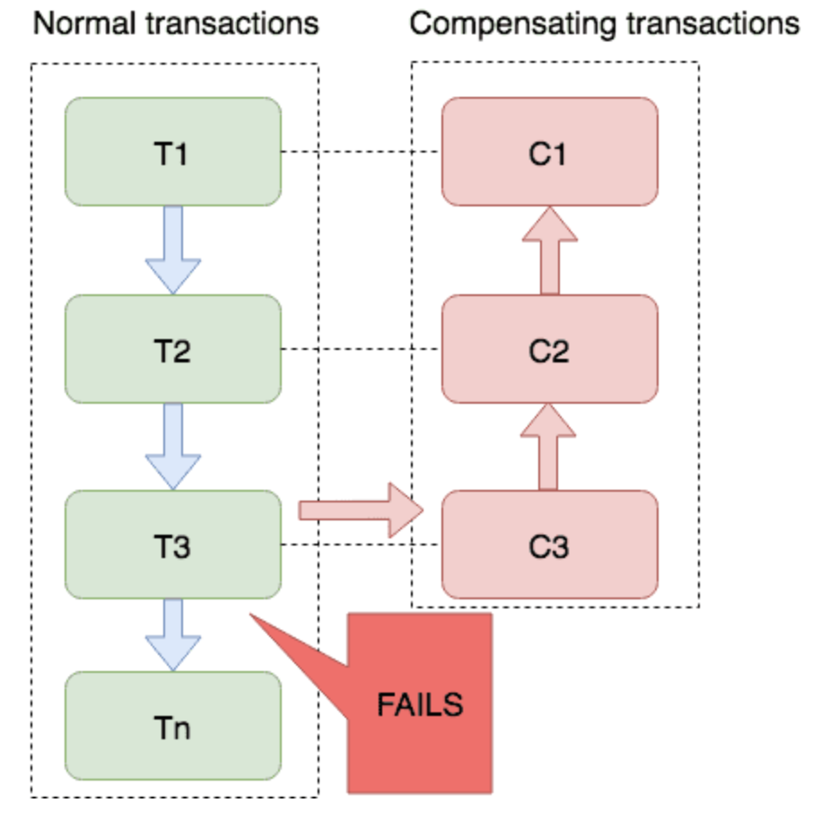

Saga 模式下分布式事务通常是由事件驱动的，各个参与者之间是异步执行的，Saga 模式是一种长事务解决方案。

##### XA模式

XA 模式是 Seata 将会开源的另一种无侵入的分布式事务解决方案，任何实现了 XA 协议的数据库都可以作为资源参与到分布式事务中。

在 XA 模式下，每一个 XA 事务都是一个事务参与者。分布式事务开启之后，首先在一阶段执行“xa start”、“业务 SQL”、“xa end”和 “xa prepare” 完成 XA 事务的执行和预提交；二阶段如果提交的话就执行 “xa commit”，如果是回滚则执行“xa rollback”。这样便能保证所有 XA 事务都提交或者都回滚。

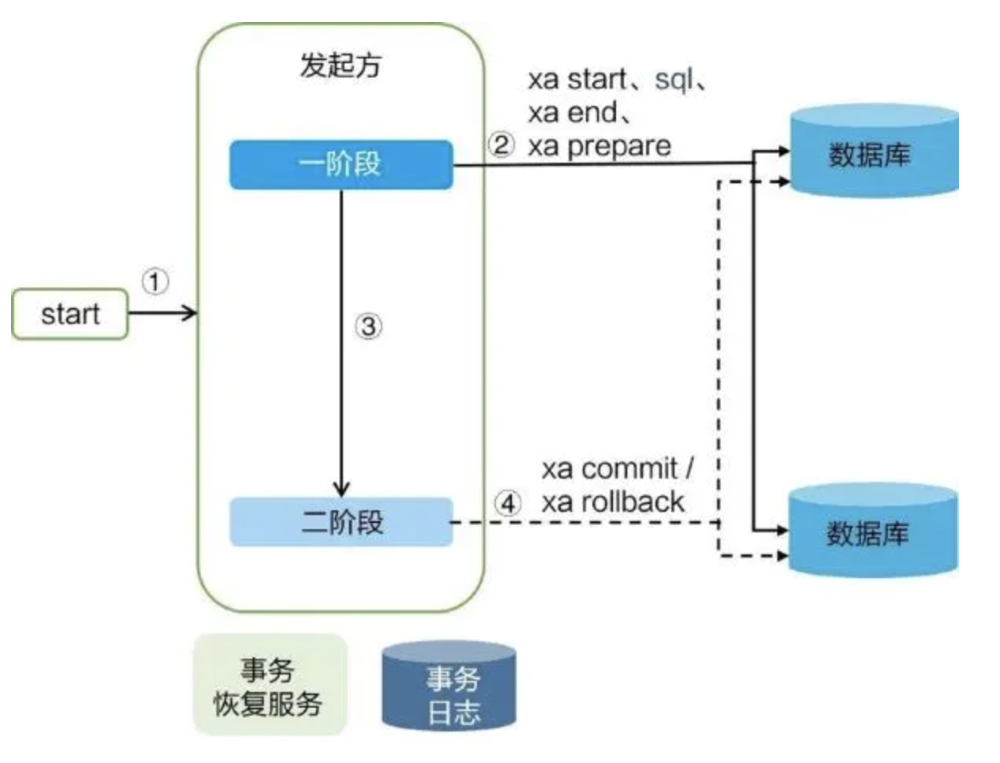

XA 模式下，用户只需关注自己的“业务 SQL”，Seata 框架会自动生成一阶段、二阶段操作；XA 模式的实现如下：

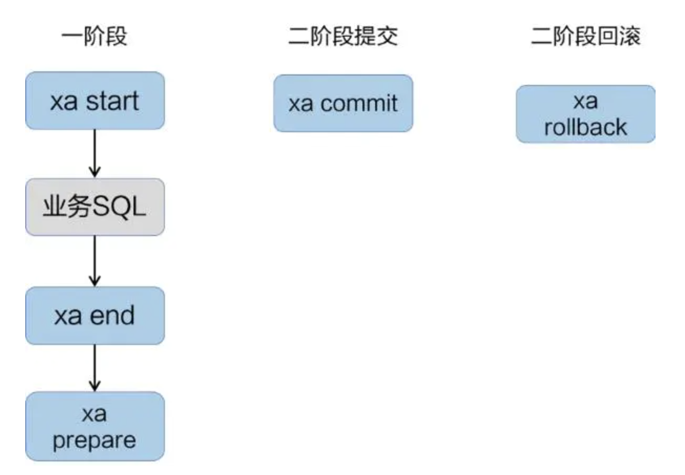

#### 本地消息表方案

本地消息表其实就是利用了 **各系统本地的事务**来实现分布式事务。

本地消息表顾名思义就是会有一张存放本地消息的表，一般都是放在数据库中，然后在执行业务的时候 **将业务的执行和将消息放入消息表中的操作放在同一个事务中**，这样就能保证消息放入本地表中业务肯定是执行成功的。

然后再去调用下一个操作，如果下一个操作调用成功了好说，消息表的消息状态可以直接改成已成功。

如果调用失败也没事，会有 **后台任务定时去读取本地消息表**，筛选出还未成功的消息再调用对应的服务，服务更新成功了再变更消息的状态。

这时候有可能消息对应的操作不成功，因此也需要重试，重试就得保证对应服务的方法是幂等的，而且一般重试会有最大次数，超过最大次数可以记录下报警让人工处理。

可以看到本地消息表其实实现的是**最终一致性**，容忍了数据暂时不一致的情况。

优点： 一种非常经典的实现，避免了分布式事务，实现了最终一致性。

缺点： 消息表会耦合到业务系统中，如果没有封装好的解决方案，会有很多杂活需要处理。

#### 消息事务方案

RocketMQ 就很好的支持了消息事务，让我们来看一下如何通过消息实现事务。

第一步先给 Broker 发送事务消息即半消息，**半消息不是说一半消息，而是这个消息对消费者来说不可见**，然后**发送成功后发送方再执行本地事务**。

再根据**本地事务的结果向 Broker 发送 Commit 或者 RollBack 命令**。

并且 RocketMQ 的发送方会提供一个**反查事务状态接口**，如果一段时间内半消息没有收到任何操作请求，那么 Broker 会通过反查接口得知发送方事务是否执行成功，然后执行 Commit 或者 RollBack 命令。

如果是 Commit 那么订阅方就能收到这条消息，然后再做对应的操作，做完了之后再消费这条消息即可。

如果是 RollBack 那么订阅方收不到这条消息，等于事务就没执行过。

可以看到通过 RocketMQ 还是比较容易实现的，RocketMQ 提供了事务消息的功能，我们只需要定义好事务反查接口即可。

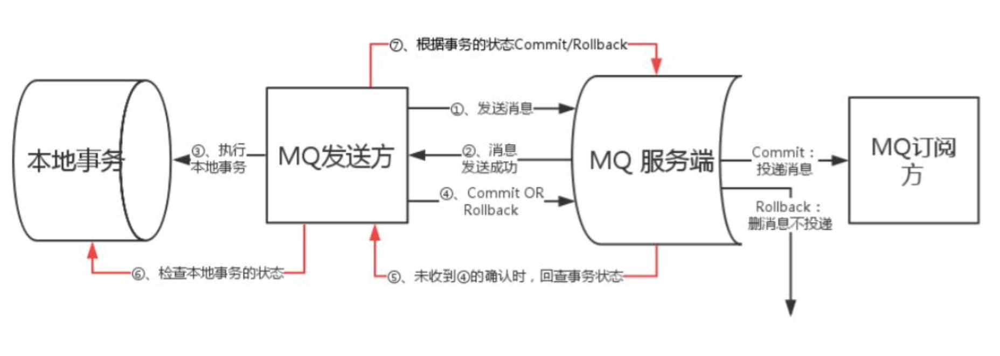

可以看到消息事务实现的也是最终一致性。

优点： 实现了最终一致性，不需要依赖本地数据库事务。

缺点： 实现难度大，主流MQ不支持，RocketMQ事务消息部分代码也未开源。

