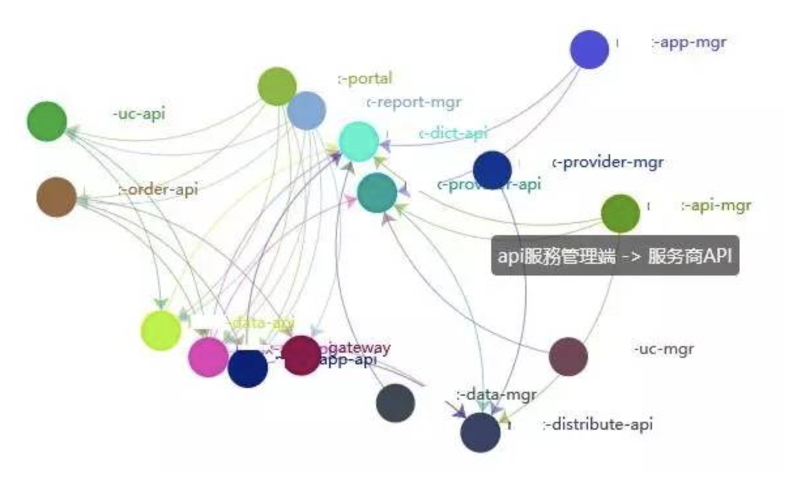
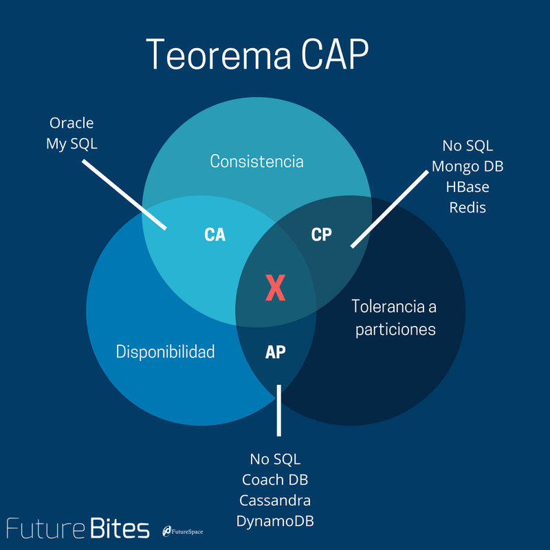
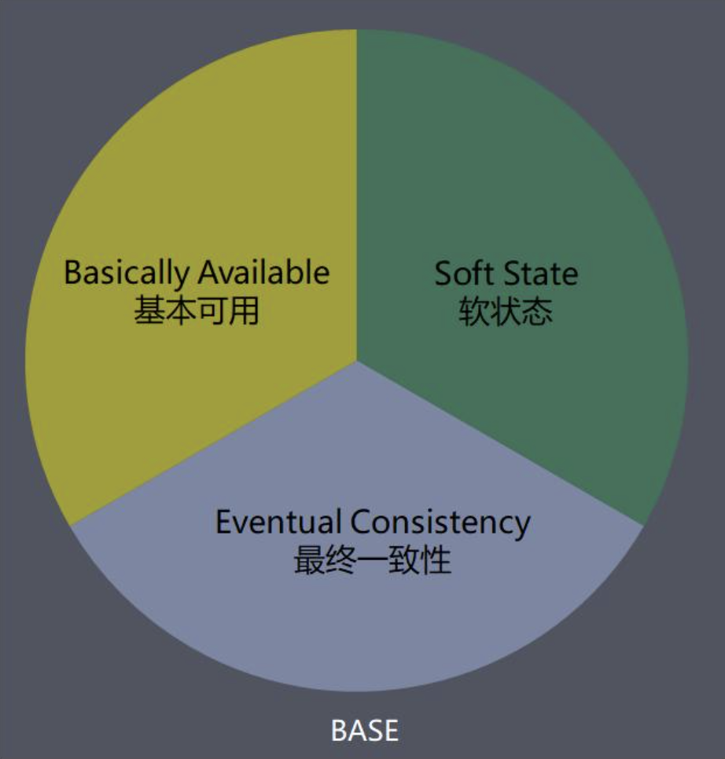

## 分布式-基础理论

[TOC]

### 两军问题

### 分布式系统介绍

上文我们讲到了分库分表，这是数据库层面的分布式。我们经常说的微服务，这是服务层面的分布式。那什么是分布式系统呢？

> 分布式系统是一个硬件或软件组件分布在不同的网络计算机上，彼此之间仅仅通过消息传递进行通信和协调的系统

简单来说就是一群独立计算机集合共同对外提供服务，但是对于系统的用户来说，就像是一台计算机在提供服务一样。分布式意味着可以采用更多的普通计算机（相对于昂贵的大型机）组成分布式集群对外提供服务。计算机越多，CPU、内存、存储资源等也就越多，能够处理的并发访问量也就越大。

#### 分布式的种类

##### 1、分布式应用和服务(微服务)

将应用和服务进行分层和分割，然后将应用和服务模块进行分布式部署。这样做不仅可以提高并发访问能力、减少数据库连接和资源消耗，还能使不同应用复用共同的服务，使业务易于扩展。

##### 2、分布式数据和存储(分库分表)

大型网站常常需要处理海量数据，单台计算机往往无法提供足够的内存空间，可以对这些数据进行分布式存储。

##### 3、分布式计算(云计算)

随着计算技术的发展，有些应用需要非常巨大的计算能力才能完成，如果采用集中式计算，需要耗费相当长的时间来完成。分布式计算将该应用分解成许多小的部分，分配给多台计算机进行处理。这样可以节约整体计算时间，大大提高计算效率。

#### 分布式的优点

分布式无疑带来了很多好处，比如：

**1、可拓展性**

又叫可伸缩性，主要强调“伸”；偶尔也强调“缩”。

在资源和用户数较大增长的情况下，系统性能仍能维持甚至提高。

通常表现为：

- 利用硬件环境可以为更多的用户服务、而且响应更快
- 通常通过增加更多/更快的处理器，能实现更可靠、更完善的服务

**2、高性能**

分布系统中的各个组成部分可以在并发的过程中被执行。这样一个复杂的问题可以拆解成多个简单的小问题，从而提升系统的吞吐量。

通常表现在：

- 多个用户同时访问（和更新）资源
- 多个服务进程同时运行，相互协作

**3、高可用**

一台服务器的系统崩溃不会影响到其他的服务器。从而可以保障系统的高可用。

通常表现在：

- 服务模块化，订单系统、商品系统互不影响

#### 分布式的缺点

分布式带来的并非全是好处，同时也带来了一些问题。

**1、复杂度高**

由于分布在多台服务器上，出现故障的时候排除和诊断问题难度较高。

**2、成本高**

在运维和硬件成本上成本增高，服务器之间需要通过网络通信，网络基础设置问题，包括传输、高负载、信息丢失问题。

**3、服务的可用性要求高**

由于是分布式，不在同一台机器上，我们需要实现分布式数据一致性和服务的可用性。而这个过程是通过网络传输的，而网络存在很复杂的状态，尤其是弱网或断网的情况。这样就导致了这个难度非常大，往往需要在数据一致性和可用性上做一个平衡。

这就是下面我们要讨论的如何保证服务的高可用。首先我们先从一些理论基础开始。

### CAP理论

#### CAP介绍

2000年7月，加州大学伯克利分校的Eric Brewer教授在ACM PODC会议上提出CAP猜想。2年后，麻省理工学院的Seth Gilbert和Nancy Lynch从理论上证明了CAP。之后，CAP理论正式成为分布式计算领域的公认定理。

CAP理论为：一个分布式系统最多只能同时满足一致性（Consistency）、可用性（Availability）和分区容错性（Partition tolerance）这三项中的两项。

##### 一致性（Consistency）

一致性指“all nodes see the same data at the same time”，即更新操作成功并返回客户端完成后，所有节点在同一时间的数据完全一致。

##### 可用性（Availability）

可用性指“Reads and writes always succeed”，即服务一直可用，而且是正常响应时间。

##### 分区容错性（Partition tolerance）

分区容错性指“the system continues to operate despite arbitrary message loss or failure of part of the system”，即分布式系统在遇到某节点或网络分区故障的时候，仍然能够对外提供满足一致性和可用性的服务。

#### CAP权衡

##### CA

这种情况在分布式系统中几乎是不存在的。首先在分布式环境下，网络分区是一个自然的事实。因为分区是必然的，所以如果舍弃P，意味着要舍弃分布式系统。那也就没有必要再讨论CAP理论了。

所以，对于一个分布式系统来说。P是一个基本要求，CAP三者中，只能在CA两者之间做权衡，并且要想尽办法提升P。

##### CP

一旦发生网络故障或者消息丢失等情况，在不能保证数据一致性的情况下，系统就不可用。就要牺牲用户的体验，等待所有数据全部一致了之后再让用户访问系统。

那么什么情况下会使用CP模型呢？大家可以想象一下，不难想象一些数据库系统以及一些金融系统对数据的准确性要求很高。如Redis、HBase等，还有分布式系统中常用的Zookeeper也是在CAP三者之中选择优先保证CP的。

##### AP

一旦网络问题发生，节点之间可能会失去联系。为了保证高可用，需要在用户访问时可以马上得到返回，则每个节点只能用本地数据提供服务，而这样会导致全局数据的出现不一致性的情况。

那么什么情况下会选择这种模型呢？其实很多系统在可用性方面会做很多事情来保证系统的全年可用性可以达到N个9，所以，对于很多业务系统来说，比如淘宝的购物，12306的买票等。都是在可用性和一致性之间舍弃了一致性而选择可用性。

#### 总结一下

无论你是一个架构师，还是一个普通开发，在设计或开发分布式系统的时候，不可避免的要在CAP中做权衡。它是架构设计的基石。

至于CP与AP如何如何选择，根据场景定夺，适合的才是最好的。一般来说基础数据、涉及到钱财这样不能有一丝让步的场景，C必须保证。对于其他场景，比较普遍的做法是选择可用性和分区容错性，舍弃强一致性，退而求其次使用最终一致性来保证数据的安全。

### BASE理论

#### BASE介绍

eBay的架构师Dan Pritchett源于对大规模分布式系统的实践总结，在ACM上发表文章提出BASE理论，BASE理论是对CAP理论的延伸，核心思想是即使无法做到强一致性（Strong Consistency，[CAP](http://www.hollischuang.com/archives/666)的一致性就是强一致性），但应用可以采用适合的方式达到最终一致性（Eventual Consitency）。

BASE定理是对CAP定理的延伸：即使无法做到强一致性（Strong Consistency），但应用可以采用适合的方式达到最终一致性（Eventual Consitency）。CAP中提到的一致性是强一致性，所谓“牺牲一致性”指牺牲强一致性保证弱一致性。

BASE是指基本可用（Basically Available）、软状态（ Soft State）、最终一致性（ Eventual Consistency）。

##### 基本可用（Basically Available）

基本可用是指分布式系统在出现故障的时候，允许损失部分可用性，即：保证核心可用。

如双11大促时，为了应对核心应用访问量激增，部分用户可能会被引导到降级页面，部分服务层也可能只提供降级服务，这就是损失部分可用性的体现。

##### 软状态（ Soft State）

软状态是指允许系统存在中间状态，而该中间状态不会影响系统整体可用性。

软状态本质上是一种弱一致性，允许的软状态不能违背“基本可用”的要求。如分布式存储中一般一份数据至少会有三个副本，允许不同节点间副本同步的延时（某些时刻副本数低于3的中间状态）这就叫软状态。

##### 最终一致性（ Eventual Consistency）

系统中的所有数据副本经过一定时间后，最终能够达到一致的状态。

通过上面软状态的终极目标是最终一致性。如，分布式存储的副本数最终会达到稳定状态。 DNS是一个典型的最终一致性系统。

在实际工程实践中，最终一致性存在以下五类主要变种。

#### 最终一致表现形式

##### 因果一致性：

因果一致性是指，如果进程A在更新完某个数据项后通知了进程B，那么进程B之后对该数据项的访问都应该能够获取到进程A更新后的最新值，并且如果进程B要对该数据项进行更新操作的话，务必基于进程A更新后的最新值，即不能发生丢失更新情况。与此同时，与进程A无因果关系的进程C的数据访问则没有这样的限制。

##### 读己之所写：

读己之所写是指，进程A更新一个数据项之后，它自己总是能够访问到更新过的最新值，而不会看到旧值。也就是说，对于单个数据获取者而言，其读取到的数据一定不会比自己上次写入的值旧。因此，读己之所写也可以看作是一种特殊的因果一致性。

##### 会话一致性：

会话一致性将对系统数据的访问过程框定在了一个会话当中：系统能保证在同一个有效的会话中实现“读己之所写”的一致性，也就是说，执行更新操作之后，客户端能够在同一个会话中始终读取到该数据项的最新值。

##### 单调读一致性：

单调读一致性是指如果一个进程从系统中读取出一个数据项的某个值后，那么系统对于该进程后续的任何数据访问都不应该返回更旧的值。

##### 单调写一致性：

单调写一致性是指，一个系统需要能够保证来自同一个进程的写操作被顺序地执行。

在实际系统实践中，可以将其中的若干个变种互相结合起来，以构建一个具有最终一致性的分布式系统。事实上，可以将其中的若干个变种相互结合起来，以构建一个具有最终一致性特性的分布式系统。

为了解决分布式的一致性问题，在长期的研究探索过程中，涌现出了一大批经典的一致性协议和算法，其中比较著名的有我们上文提到的2PC(二阶段提交协议)，3PC(三阶段提交协议)、Paxos算法、ZAB协议、RAFT协议、Gossip协议等。我们后文会详细介绍。

#### 总结一下

总的来说，BASE理论面向的是大型高可用可扩展的分布式系统，和传统事务的ACID特性使相反的，它完全不同于ACID的强一致性模型，而是提出通过牺牲强一致性来获得可用性，并允许数据在一段时间内是不一致的，但最终达到一致状态。但同时，在实际的分布式场景中，不同业务单元和组件对数据一致性的要求是不同的，因此在具体的分布式系统架构设计过程中，ACID特性与BASE理论往往又会结合在一起使用。

