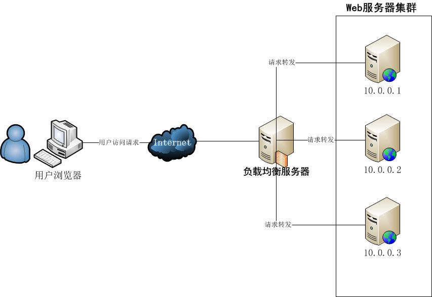
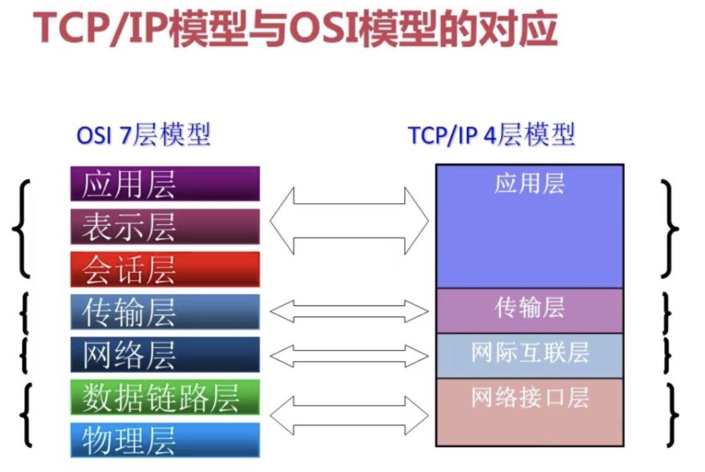
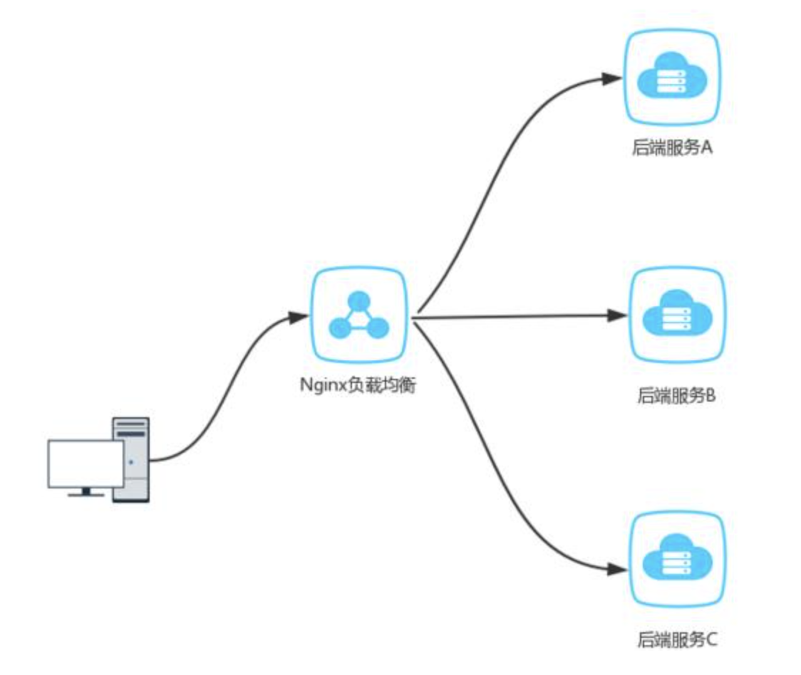

## 分布式-负载均衡算法

[TOC]

在互联网发展呢的今天，我们一般会把多台机器组成一个集群对外提供服务。然而，我们的网站对外提供的访问入口都是一个的，比如 www.baidu.com 那么当用户在浏览器输入 www.baidu.com 的时候如何将用户的请求分发到集群中不同的机器上呢，这就是负载均衡在做的事情。

### 负载均衡的分类

负载均衡就是一种计算机网络技术，用来在多个计算机（计算机集群）、网络连接、CPU、磁碟驱动器或其他资源中分配负载，以达到最佳化资源使用、最大化吞吐率、最小化响应时间、同时避免过载的目的。那么，这种计算机技术的实现方式有多种。大致可以分为以下几种，其中最常用的是四层和七层负载均衡：

- 四层负载均衡

  四层负载均衡工作在OSI模型的传输层，由于在传输层，只有TCP/UDP协议，这两种协议中除了包含源IP、目标IP以外，还包含源端口号及目的端口号。四层负载均衡服务器在接受到客户端请求后，以后通过修改数据包的地址信息（IP+端口号）将流量转发到应用服务器。

- 七层负载均衡

  七层负载均衡工作在OSI模型的应用层，应用层协议较多，常用http、radius、dns等。七层负载就可以基于这些协议来负载。这些应用层协议中会包含很多有意义的内容。比如同一个Web服务器的负载均衡，除了根据IP加端口进行负载外，还可根据七层的URL、浏览器类别、语言来决定是否要进行负载均衡。

### 常见负载均衡算法

#### 轮询(Round Robin)

请求到达后，将客户端发送到负载均衡器的请求依次轮流地转发给服务集群的某个节点。

优点：实现简单，每个集群节点平均分担所有的请求。

缺点：当集群中服务器硬件配置不同、性能差别大时，无法区别对待。引出下面的算法。

#### 随机(Random)

随机选取集群中的某个节点来处理该请求，由概率论的知识可知，随着请求量的变大，随机算法会逐渐演变为轮询算法，即集群各个节点会处理差不多数量的请求。

优点：简单使用，不需要额外的配置和算法。

缺点：随机数的特点是在数据量大到一定量时才能保证均衡，所以如果请求量有限的话，可能会达不到均衡负载的要求。

#### 加权

加权算法主要是根据集群的节点对应机器的性能的差异，给每个节点设置一个权重值，其中性能好的机器节点设置一个较大的权重值，而性能差的机器节点则设置一个较小的权重值。权重大的节点能够被更多的选中。

优点：可以根据机器的具体情况，分配不同的负载，达到能者多劳。

缺点：需要额外管理加权系数。

#### 最小连接数

主要是根据集群的每个节点的当前连接数来决定将请求转发给哪个节点，即每次都将请求转发给当前存在最少并发连接的节点。

优点：可以根据集群节点的负载情况来进行请求的动态分发，即机器性能好，处理请求快，积压请求少的节点分配更多的请求。避免某个节点因为处理超过自身所能承受的请求量而导致宕机或者响应过慢。

#### hash

将对请求的IP地址或者URL计算一个哈希值，然后与集群节点的数量进行取模来决定将请求分发给哪个集群节点。

优点：实现简单

缺点：如果某个节点挂了，会使得一部分流量不可用。

### 负载均衡分类

#### 1. 硬件负载均衡

常见的硬件有比较昂贵的F5和Array等商用的负载均衡器，它的优点**简单**，有专业的人负责；缺点就是 **贵** ，所以对于规模较小的网络服务来说暂时还没有需要使用。
#### 2. 软件负载均衡

目前使用最广泛的三种负载均衡软件Nginx/LVS/HAProxy，他们都是基于Linux的开源免费的负载均衡软件，这些都是通过软件级别来实现，所以费用非常低廉。
#### 3. 成熟的架构

成熟的架构有LVS+Keepalived、Nginx+Keepalived、HAProxy+keepalived。

### 常见负载均衡软件

#### Nginx

Nginx的负载均衡支持：

    rr：轮叫，轮流分配到后端服务器；
    wrr：权重轮叫，根据后端服务器负载情况来分配；
    lc：最小连接，分配已建立连接最少的服务器上；
    wlc：权重最小连接，根据后端服务器处理能力来分配。

Nginx优点：

    1.简单：安装和配置比较简单、测试也简单
    2.稳定：单机一般能支撑几万次的并发量
    3.轻量：能ping通就就能进行负载功能
    4.易用：明确的错误码、超时提醒
    5.强大：负载均衡、反向代理、WEB容器等功能

Nginx缺点：

    1.仅能支持http、https和Email协议
    2.对后端服务器的健康检查， 只支持通过端口来检测，不支持通过url来检测

#### LVS

LVS的负载均衡支持：

    roundrobin：轮询，轮流分配到后端服务器；
    static-rr：根据后端服务器性能分配；
    leastconn：最小连接者优先处理；
    source：根据请求源IP，与Nginx的IP_Hash类似。

LVS优点：

    1.高效：工作在网络4层之上 仅作分发之用，没有流量的产生，这个特点也决定了它在负载均衡软件里的性能最强的 ，对内存和cpu资源消耗比较低
    2.易用：配置性比较低，简化操作成本
    3.稳定：本身抗负载能力很强，自身有完整的双机热备方案
    4.应用范围广：因为LVS工作在4层，所以它几乎可以对所有应用做负载均衡，包括http、tcp、数据库、在线聊天室等

LVS缺点：
    1.不能做动静分离
    2.大型网站LVS+Keepalived实施起来就比较复杂，配置成本高

#### HAProxy

HAProxy负载均衡策略非常多，包括：
    roundrobin，表示简单的轮询，这个不多说，这个是负载均衡基本都具备的；
    static-rr，表示根据权重，建议关注；
    leastconn，表示最少连接者先处理，建议关注；
    source，表示根据请求源IP，这个跟Nginx的IP_hash机制类似，我们用其作为解决session问题的一种方法，建议关注；
    ri，表示根据请求的URI；
    rl_param，表示根据请求的URl参数’balance url_param’ requires an URL parameter name；
    hdr(name)，表示根据HTTP请求头来锁定每一次HTTP请求；
    rdp-cookie(name)，表示根据据cookie(name)来锁定并哈希每一次TCP请求。

HAProxy的优点能够补充Nginx的一些缺点， 比如支持Session的保持，Cookie的引导；同时支持通过获取指定的url来检测后端服务器的状态。
HAProxy跟LVS类似，本身就只是一款负载均衡软件；单纯从效率上来讲HAProxy会比Nginx有更出色的负载均衡速度，在并发处理上也是优于Nginx的。
支持TCP协议的负载均衡转发，可以对MySQL读进行负载均衡，对后端的MySQL节点进行检测和负载均衡。

### 常见微服务框架的负载均衡

#### Dubbo

支持4种算法（随机、轮询、活跃度、Hash一致性），而且算法里面引入权重的概念。

#### SpringCloud Feign

支持很多中算法，包括：轮询、随机、最小连接、区域加权、重试以及ResponseTime加权。也可以自己实现负载均衡算法