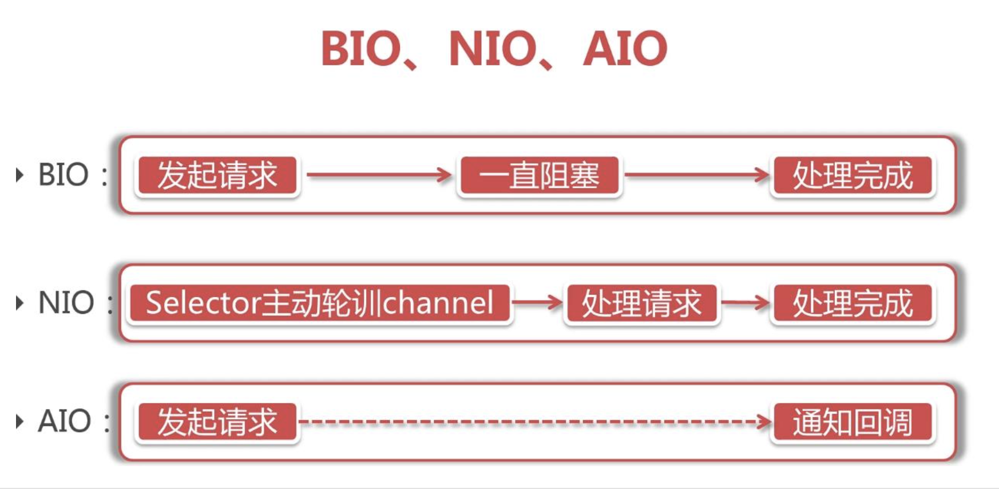
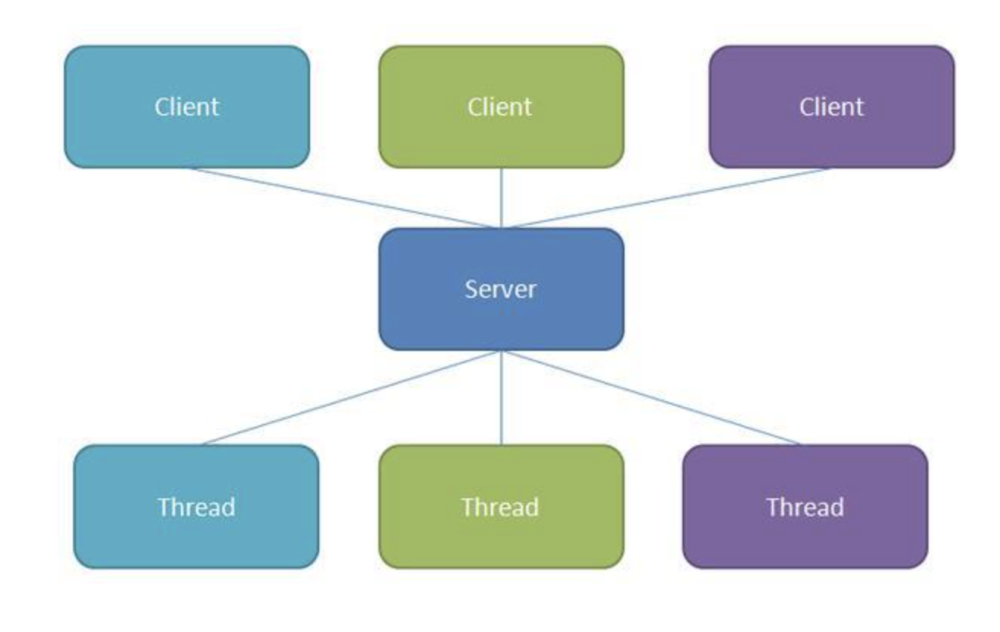
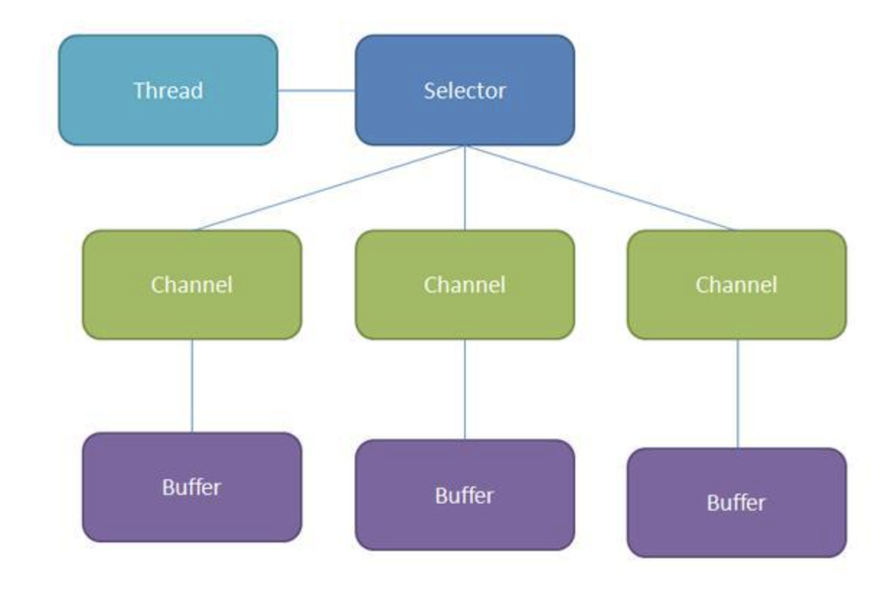

## 通信基础

[TOC]

在计算机世界里，有太多太多的对立的词。这些词都是一代代科学家智慧的结晶。比如

> 读&写、输入&输出、顺序&随机、持久&临时、单体&集群、时间&空间、精确&模糊、精确&全量、强一致&弱一致、强引用&弱引用、单线程&多线程、高吞吐&低延时、可用性&一致性、新生代&老年代……

如果感兴趣的话，还可以继续列下去。

还有今天要聊的IO方式里的阻塞&非阻塞，同步&异步

### 阻塞、非阻塞、异步、同步

#### 阻塞与非阻塞

阻塞和非阻塞关注的是**程序在等待调用结果（消息，返回值）时的状态**。

你去理发店理发，理发店需要排队，你在那排着，这叫**阻塞**。你要个号之后，去旁边的网吧打会游戏，一会在回来看看排到了没有，这叫**非阻塞**。

#### 同步与异步

同步和异步关注的是**消息通信机制**，其本质区别就是调用者要不要主动等待结果。

你去理发店理发，理发师在和其他人理发，你在那排着，等到自己理发这叫**同步**。你如果跟老板说一声我先去隔壁网吧打游戏，轮到我了叫我啊，这叫**异步**。

你可能会感觉这两个概念很绕。你只需要记住一点：阻塞与非阻塞是一种**状态**，而同步与异步是一种**机制**。在计算机中他们两种是互相组合使用的。

再举个例子总结一下：

1.你去烧水，就一直守在水壶旁盯着等待水开。这叫**同步阻塞**，是不是有点“笨”？

2.你去烧水，放上烧水壶后，去打游戏，时不时过来看看水开了没。这叫**同步非阻塞**，是不是滋润了一些。

3.你去烧水，买了个智能热水壶，水开后会自动关闭，你放上之后一直站在水壶旁等着水开。这叫**异步阻塞**。你不用关心水有没有开，但是你还一直守着。你是急着喝水吗？在这傻等着岂不是白白浪费了这么好的热水壶！

4.你去烧水，用这个智能热水壶，水开后会自动关闭，你放上之后就可以去开心的肆无忌惮的玩耍了。这叫**异步非阻塞**。是不是有一种上天的感觉？

理解了这些基本概念后，基于这些概念，我们一起来看一下计算机中IO的模型有哪些？

### IO方式

根据上面的基本概念，我们可以把IO的方式分为这么几种：

> 同步阻塞：我们称为BIO。它的优点就是简单、直观；缺点就是效率低
>
> 同步非阻塞：我们称为NIO。它可以构建多路复用的、同步非阻塞 IO 程序，同时提供了更接近操作系统底层高性能的数据操作方式。
>
> 异步非阻塞：我们称为AIO。它是基于事件和回调机制实现，不会堵塞在那里，当后台处理完成，操作系统会通知相应的线程进行后续的操作。

你可能会问异步阻塞呢？我们通过上面的例子也可以看出，异步阻塞太“傻”了，完全是对资源的浪费。所以就没有这一种IO方式。

### IO的实现

#### BIO的实现

数据的读取写入必须阻塞在一个线程内等待其完成。

BIO这么“笨”，这么低效，还有用吗？存在即合理！

上文我们也提到了，BIO实现起来比较简单直观，所以BIO使用场景依然很多，比如：

> InputStream、OutputStream 基于字节操作的 IO
>
> Writer、Reader 基于字符操作的 IO
>
> File 基于磁盘操作的 IO
>
> Socket 基于网络操作的 IO

[java.net](http://java.net/) 下提供的 Scoket 也把它归为同步阻塞 IO ，是因为网络通讯也是一种IO操作。

使用场景：连接数目比较小且固定的架构。

#### NIO的实现

NIO，又叫做New I/O，即新的IO，因为它是相对于老的I/O类库新增的。

多路复用器Selector是Java  NIO 编程的核心。

Selector提供选择已经就绪的任务的能力：Selector会不断轮询注册在其上的Channel，如果某个Channel上面发生读写事件，这个Channel就处于就绪状态，会被Selector轮询出来，然后通过SelectionKey可以获取就绪Channel的集合，进行后续的I/O操作。一个Selector可以轮询多个Channel，由于JDK使用了epoll()代替传统的select实现，所以没有最大连接句柄的限制。所以，只需要一个线程负责Selector的轮询，就可以接入成千上万的客户端。这样大大提升了服务器的效率。

使用场景：适用于连接数目多且连接比较短的架构，比如IM服务器，中间件通信工具等。

使用NIO做网络编程并不容易，因此推荐大家使用成熟的NIO框架，如Netty，MINA等。这些框架解决了很多NIO使用的陷阱，屏蔽了操作系统的差异，且有较好的性能。

#### AIO的实现

NIO 2.0引入了新的异步通道的概念，异步 IO 是基于事件和回调机制实现，也就是应用调用系统IO后会直接返回，当系统IO处理完成，会通知相应的线程进行后续的操作。这样就不需要过多的Selector对注册的通道进行轮询就可以实现异步读写，从而简化了NIO的编程模型。在JDK1.7中，这部分内容被称作NIO.2，主要在java.nio.channels包下增加了下面四个异步通道：

- AsynchronousSocketChannel
- AsynchronousServerSocketChannel
- AsynchronousFileChannel
- AsynchronousDatagramChannel

AIO的实施需充分调用OS参与，所以AIO深度依赖于操作系统，所以性能方面不同操作系统差异会比较明显。因此在实际中AIO使用不是很广泛。

使用场景：AIO方式使用于连接数多且连接比较长的架构，比如文件服务器等。

AIO目前使用得比较少，市面上也缺少成熟的框架可以用。使用成本还是比较高的。

