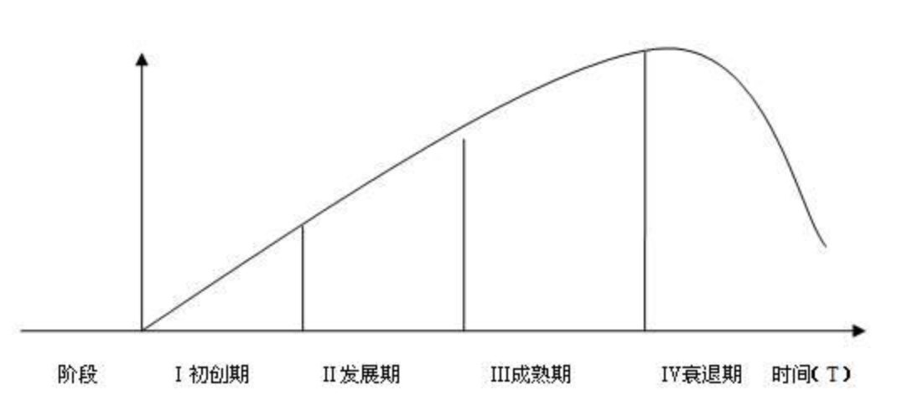
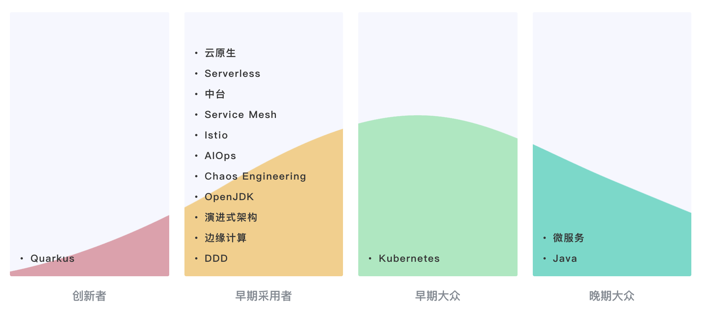
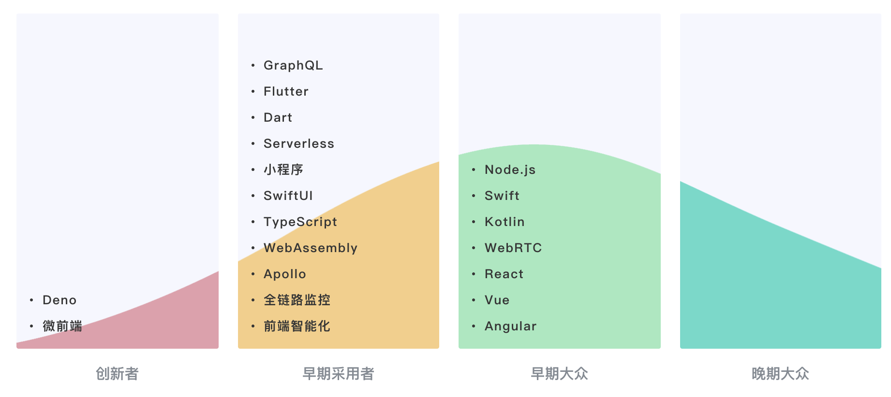
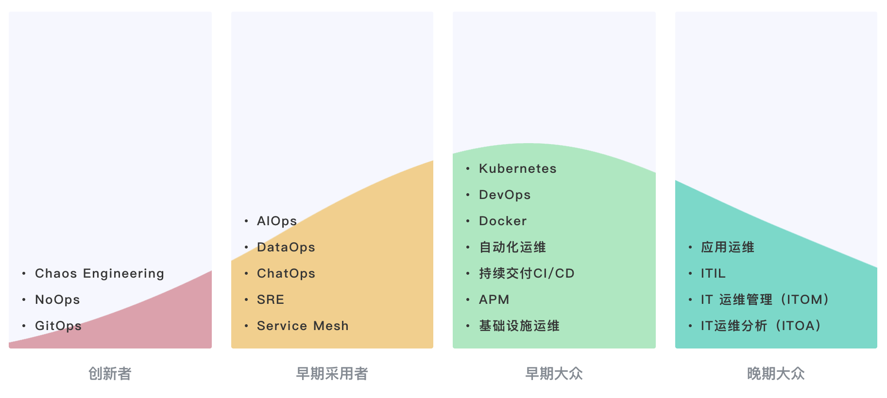
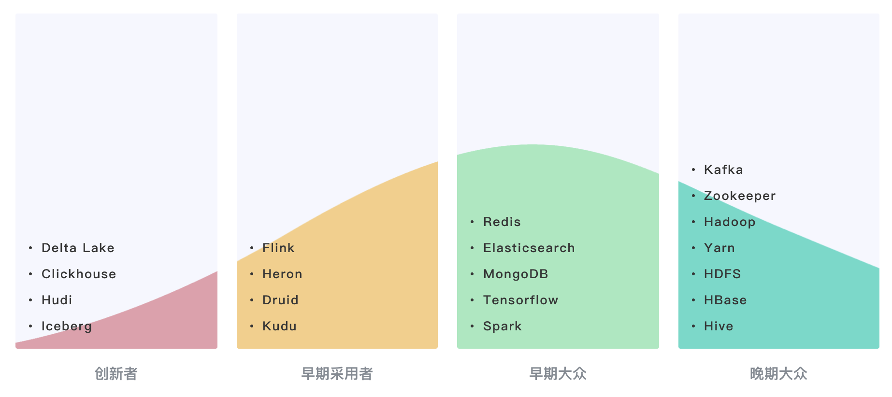
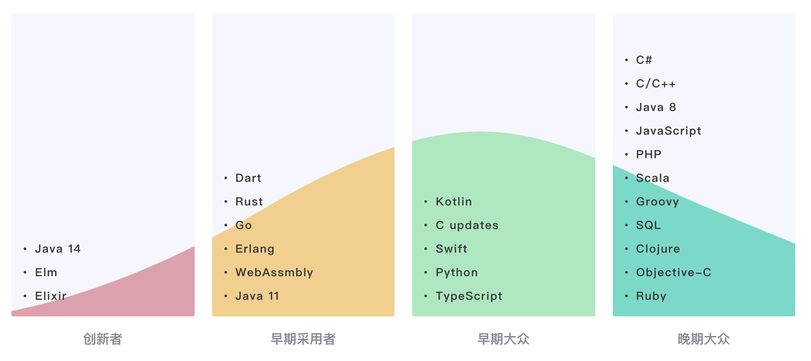

## IT技术生命周期篇

[TOC]

### 产品生命周期

美国经济学者弗农·史密斯（Vernon Lomax Smith）认为：产品生命是指市上的营销生命，产品和人的生命一样，要经历形成、成长、成熟、衰退这样的周期。

#### 新创期

引入期是指产品从设计产出直到投入市场进入测试阶段。新产品投入市场，便进入介绍期。此时产品品种少，顾客对产品还不了解，除少数追求新奇的顾客外，几乎无人实际购买该产品。生产者为了扩大销路，不得不投入大量的促销费用，对产品进行宣传推广。该阶段由于生产技术方面的限制，产品生产批量小，制造成本高，广告费用大，产品销售价格偏高，销售量极为有限，企业通常不能获利，反而可能亏损。

#### 成长期

当产品进入引入期，销售取得成功之后，便进入成长期。成长期是指产品通过试销效果良好，购买者逐渐接受该产品，产品在市场上站住脚并且打开销路。这是需求增长阶段，需求量和销售额迅速上升。生产成本大幅度下降，利润迅速增长。与此同时，竞争者看到有利可图，将纷纷进入市场参与竞争，使同类产品供给量增加，价格随之下属，企业利润增长速度逐步减慢，最后达到生命周期利润的最高点。

### 成熟期

指产品走入大批量生产并稳定地进入市场销售，经过成长期之后，随着购买产品的人数增多，市场需求趋于饱和。此时，产品普及并日趋标准化，成本低而产量大。销售增长速度缓慢直至转而下降，由于竞争的加剧，导致同类产品生产企之间不得不加大在产品质量、花色、规格、包装服务等方面加大投入，在一定程度上增加成本。

### 衰退期

指产品进入淘汰阶段。随着科技的发展以及消费习惯的改变等原因，产品的销售量和利润持续下降，产品在市场上已经老化，不能适应市场需求，市场上已经有其它性能更好、价格更低的新产品，足以满足消费者的需求。此时成本较高的企业就会由于无利可图而陆续停止生产，该类产品的生命周期也就陆续结束，以至最后完全撤出市场。

整个生命周期，会有如下图的一个生命周期曲线。

基于这个理论我们总结了技术生命周期，基于现在业界的趋势，来帮大家参考未来的方向。

### 技术生命周期

#### 架构

从图可以看出，微服务体系已经成为晚期大众，毕竟这么多年了，各个体系都已完善。k8s业界正火。边沿计算、AIOps目前还在发展期，如果有新入行的朋友，建议入手这些。

个人认为中台的概念应该也属于晚期大众了，云原生、Serverless、Service Mesh、Istio和DDD等应该属于早期大众了，毕竟很多公司都已经在运用了。

#### 大前端

首先大前端是目前的热门，Vue、Angular、React、Node以及Swift等也已早在业界广泛应用了，但是目前还没有到晚期的程度。GraphQL、Flutter、TypeScript等无疑正在如火如荼的发展。

至于Apollo、小程序、全链路监控等，也早已在业界普及，不知道为什么作者会列在早期采用者。

#### 运维

这几年由于云计算的成熟，云原生的普及，运维这些年迅猛发展。传统运维自然已是晚期大众。DevOps的普及，让韵味更多的接触到容器、K8S、CI/CD等自动化运维，这些已经很成熟！Service Mesh据了解目前也只是在大厂有常识，还未普及。

至于Chaos和GitOps我个人认为，随着云原生的成熟也逐步进入早起采用者里了。

#### 大数据

大数据方向，Hadoop生态群在业界早已作为入门体系自然已成晚期大众，Tensorflow作为AI的常用算法也已成熟，Spark作为流计算框架也已普及，个人认为甚至可以放在晚期大众里了。而Flink已经出到了1.12版本了，也已成早期大众了，Druid和Kudu，我虽用的不多，但在大数据领域也算成熟，可以放在早期大众体系了。Iceberg、Hudi据我所知也只是在大厂有用，中小企业暂未听说有用。Clickhouse作为一个列数据库，应该属于早期采用者。

#### 语言

这张图整体偏后，Go、Erlang、Java11已属于成熟期，早已广泛使用。Java14目前属于早期采用者。

### 结语

好了，今天的技术生命周期介绍到这里。

以上内容，或许不对，但或多或少都会给做技术的你有一些思考。也许你也有不同的想法，欢迎**留言区评论**，一起讨论，一起探讨的方向，人生一大美事。

