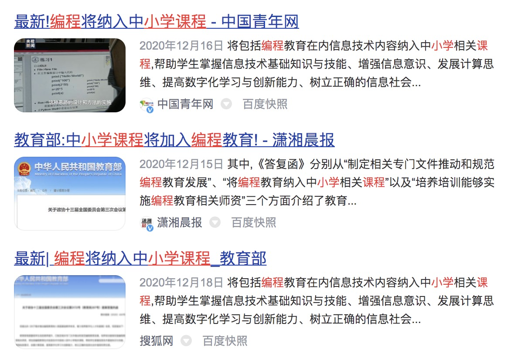
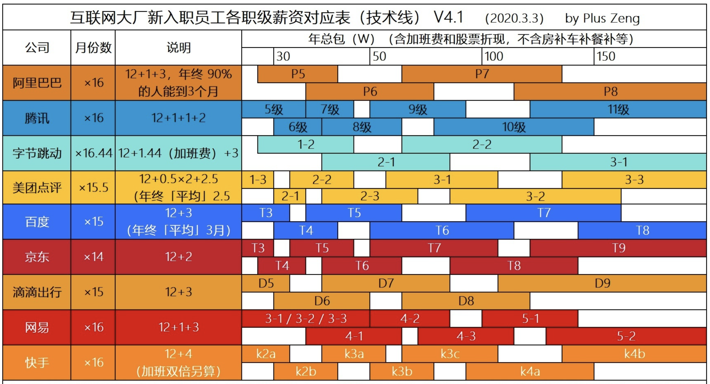
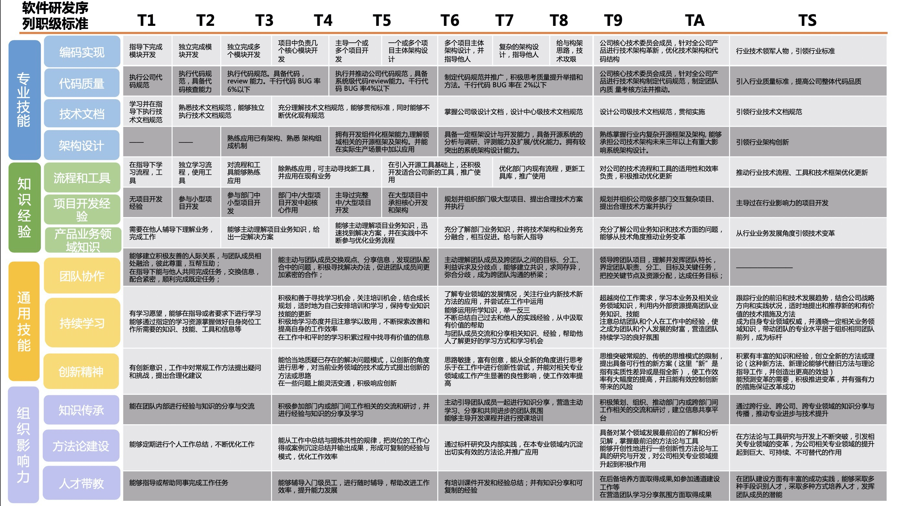
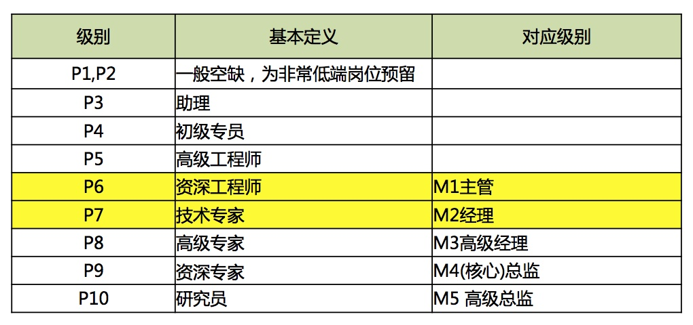
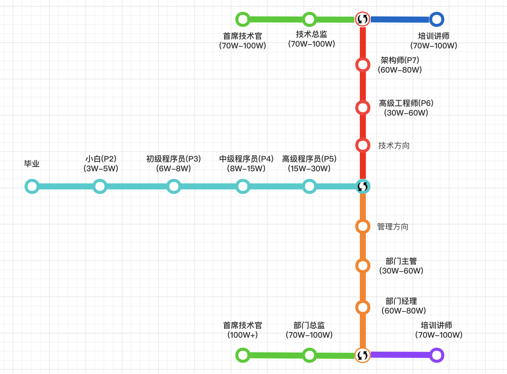

### IT职业发展篇

[TOC]

IT技术是一条长且宽的大道！

相信上图的新闻作为IT从业者来说并不陌生，作为IT从业者我相信也会倍感欣慰与骄傲，IT技术不只是码农、程序员的专业，而应该成为每一个人的基本能能力。

毕竟曾经的自己接触IT较晚，以至于如今需要付出更多的努力去填补一些知识和经验。作为一个资深IT从业人士就在这不讨论基础教育，在这与大家主要讨论的是IT职业的发展一些想法和意见。

### 各互联网公司薪资等级对照图

可以看到各大厂的互联网薪资体系大同小异，每个等级之间都会有少许重叠。

### IT工程师能力图谱分水岭

从上图来看可以划分几个阶段：

1. T1-T4：标准基本上是可以工作
2. T4-T5：能独立完成工作
3. T6-T8：有一定的决策能力和影响力
4. T9以上：基本属于科学家水平

### 阿里工程师等级详解

这里以目前大家都熟知的阿里的级别体系示例：

首先这个图片大概应该不陌生。可以看出P1-P4都是比较基础的岗位，目前已不进行社招。如果读者中有在校学生，我之后也可以专门写一篇应届生的实习要求，在此就不再赘述。在此我只总结罗列一些业界常见的几个职级。

#### P5高级工程师：独立完成工作能力

- 在专业领域中，对公司职位的标准要求、政策、流程等从业所必需了解的知识基本了解，对于本岗位的任务和产出很了解，能独立完成复杂任务，能够发现并解决问题;
- 在项目当中可以作为独立的项目组成员；
- 能在跨部门协作中沟通清楚。

P5到P6有一个本质的区别就是：能不能独立利用已有的知识和资源去解决问题？我们都知道互联网行业最难的不是技术，而是工程。因为一个工程涉及到很多技术、很多人，会遇到很多软件工程、项目管理、产品运营以及后期运维等内容。

#### P6资深工程师：独立解决问题能力

- 在专业领域中，对公司职位的标准要求、政策、流程等从业所必需了解的知识理解深刻，能够和经理一起探讨本岗位的产出和任务，并对经理具备一定的影响力；
- 对于复杂问题的解决有自己的见解，对于问题的识别、优先级分配有见解，善于寻求资源解决问题；也常常因为对于工作的熟练而有创新的办法，表现出解决复杂问题的能力;
- 可独立领导跨部门的项目；在专业方面能够培训和教导新进员工。

P6到P7是一个坎，这个坎很多人过不去，一个最本质的区别就是：能否在一个领域能否创新。这个不是每个人都能达到的，需要一定的悟性，也需要一个人的运气，还需要个人的不懈努力。

#### P7技术专家：有一定的见解和深度

- 在专业领域，对自己所从事的职业具备一定的前瞻性的了解，在某个方面独到，对公司关于此方面的技术或管理产生影响；
- 对于复杂问题的解决有自己的见解，对于问题的识别、优先级分配见解尤其有影响力，善于寻求资源解决问题；也常常因为对于工作的熟练而有创新的办法，表现出解决问题的能力;
- 可独立领导跨部门的项目；能够培训和教导新进员工；
- 是专业领域的资深人士；
- 行业外或公司内培养周期较长。

P7到P8是另一个坎，这个坎过去的人更多。这个最本质的区别就是：能否自我驱动。这时候要做的不是完成，而是创造；不是面向团队和公司，而是面向行业和社会。用自己的专业能力以及自己的自驱能力和使命感，做成推动公司和业界发展的事情。

#### P8高级专家：管理决策能力与影响力

- 在某一专业领域中，对于公司内外及业界的相关资源及水平比较了解；
- 开始参与部门相关策略的制定；对部门管理层的在某个领域的判断力产生影响；
- 对事物和复杂问题的分析更有影响力。

### 工程师发展路径

从上图可以看出，在P5之后有一个分水岭，就是继续做技术还是转向做管理。在P7之后同样有一个分水量，是做管理还是转行做培训。

**新人期(0-3年)**

硬技能：理论转化实践软素质，养成基本的职业观

**成熟期(3-5年)**

硬技能：积累业务知识和领域，积累技术知识软素质，固化自己职业观

**发展期(5-8年)**

硬技能：明确细化的职业发展方向，深入研究「可能技术， 可能管理， 可能两者兼具」软素质：逐步总结并形成自己的方法论

**事业期(8年+)**

硬技能：释放自己，创造价值软素质，输出方法论，影响其他人

以上年限段为业界基本情况反应，不排除有特殊情况的存在。如果，如果你在相应时间段达到了相当水平，恭喜您，你的职业发展比较顺利。如果不幸您错失了某个时间段没有完成，那么首先请您仔细思考一下你究竟想要的是什么？如果是高薪工资，那就请你继续努力，最起码35岁之前应该还能保证平稳的薪资发展。而如果您想要的是事业的发展，那就要仔细思考一下，是不是趁早准备转行了。
