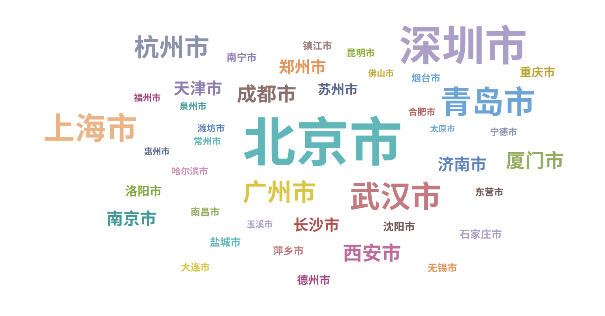
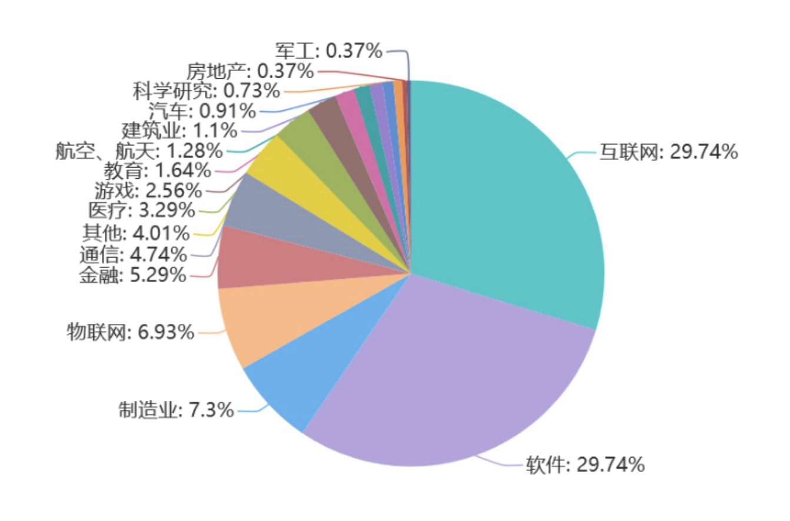
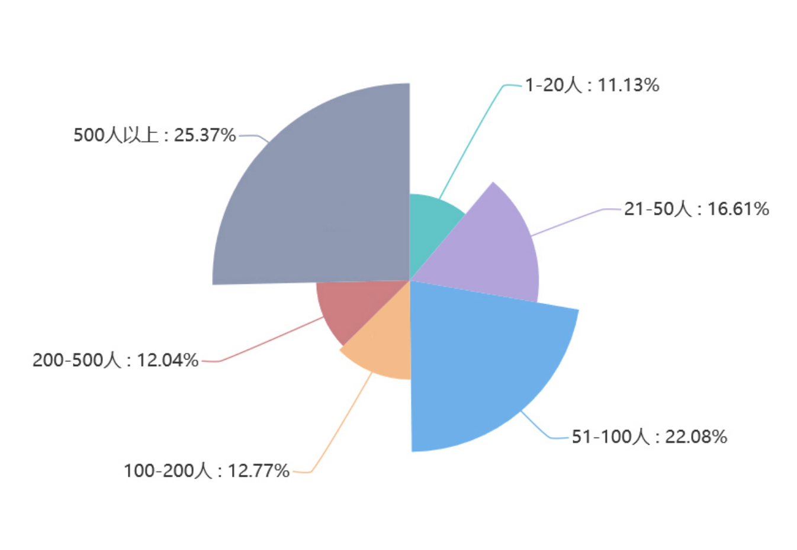
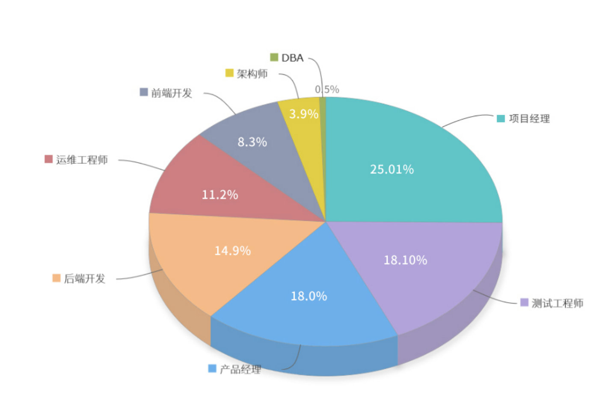
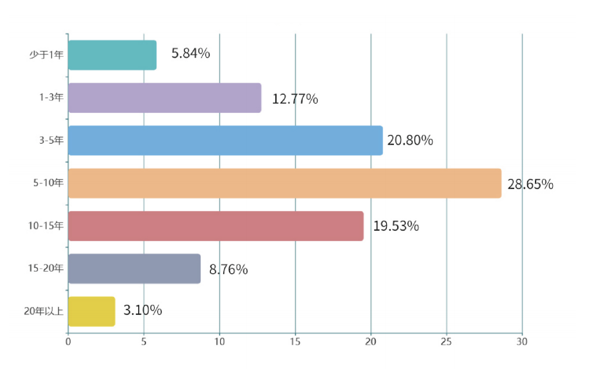
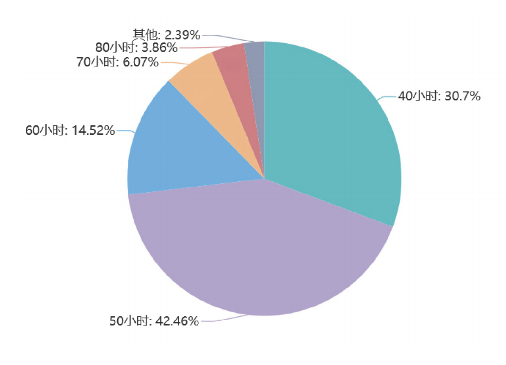
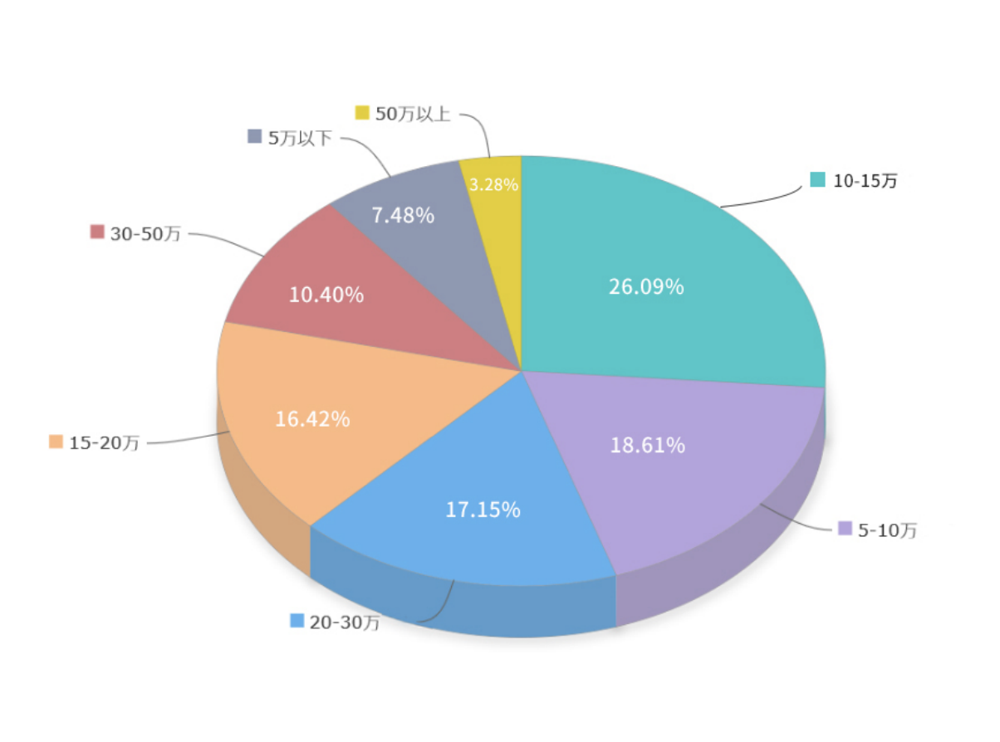

## IT行业调查报告篇

[TOC]

近年来，IT行业迅速发展，物联网、敏捷、DevOps等已成为行业的热门话题。为更好地了解行业现状，禅道项目管理软件于2021年1月开展了针对IT行业的问卷调查，并	撰写《2020年IT行业项目管理调查报告》。

本报告从地域、行业、公司规模、岗位等入手，在项目团队、项目管理、使用工具、薪资待遇等方面展开分析，希望能有助于读者更好地理解当前IT行业现状与趋势，以期为相关参与者的决策提供参考。

### 整体概况

#### 城市分布

本次2020年IT行业项目管理调查问卷共收集 545份，受访者分布于 67个城市。

这67个城市中，一线城市占比为36%，集中分布于长三角、珠三角，北方则是较为分散，但以北京为代表的华北地区稍密集，其余城市多为新一线城市、省会城市。

#### 行业分布

在受访者行业分布这一项中，互联网和软件行业以近六成的比例占据大壁江山，其余行业根据比例由高到低依次是分别是制造业、物联网、金融、通信。

从受访者公司规模来看，有四分之一的公司规模在500人以上，占据了最高比例，结合上条行业分布，可见常说的“互联网大厂”以极高比例吸纳了IT行业人才；受访者任职于51-100人规模的中小企业的比例也不低，为22%；其余公司规模的比例则较均匀分布。

545位受访者中，项目经理、测试工程师、产品经理、后端开发、运维工程师这五个岗位以近九成的比例占据了前五名。

大多数受访者工作经验在5-10年，即年龄约在30到35岁之间，这个年龄在技术岗位算骨干型中流砥柱，想转管理岗的也差不多已转型成功。以这个年限为中心，往两端呈现递减模式，总体来说更偏向年轻阶层。刚参与工作的应届生也不在少数，占比约6%。

从每周工作时长上来说，仅有30.7%的公司每周工作时长在四十小时以内，也就是法定工作日的八小时及双休的工作制度。极高比例的公司并没有遵循实践极限编程的每周四十小时工作制，总会有部分加班，但大多数每周加班控制在十小时内。996工作制严格换算到每周应为72小时，本报告以70小时为界，70小时以上的占约10%。整体来看，IT行业不同程度的加班现象占了七成。

税前年薪大多数居于10-15万这个区间，其余根据占比高低依次为5-10万、20-30万、15-20万和30-50万，薪资根据城市、行业、工作年限、每周工作时长有一定的差异。

具体表现为：

- 在北上广深这样的一线城市，年薪超15万的人数及比例高于其他城市。
- 房地产、医疗、通信、航空航天行业的超15万的高薪比例处于前四名，但这几个行业人数都较少，报告数据所限，并不具有绝对参考价值。
- 值得一提的是，996/997等较长工作时间的工作模式在薪资上也有所体现，随着每周工作时长增加，年薪也呈阶梯式递增。程序员们牺牲了生活和健康的时候，收获到了金钱上的回报。
- 工作年限较久的资深人员薪资高于新人也是正常职场现象，工作年限较短的新人也可以通过精进技术、转向管理等途径获得更高的薪资。

### 报告小结

本次调查问卷可以得出以下显著结论：

- IT行业的地域分布具有显著特征，一线城市、长三角、珠三角集中程度较高。
- IT行业税前年薪的众数为10-15万，薪资根据城市、行业、工作时长、工作经验而变化。
- 整体来看，IT行业不同程度的加班现象占了七成。
- 采用敏捷、DevOps等实践方法和禅道项目管理软件工具的团队项目按期交付比例及质量都较高。
- 团队人数为3-10人时，能够按期交付的项目和项目质量符合预期的比例最高。
- 时长为一周的项目质量符合预期的比例最高，随着时长加长，符合预期的项目质量比例降低。

更多内容，请访问：https://dl.cnezsoft.com/survey/zentaoitreport2020.pdf 查看

