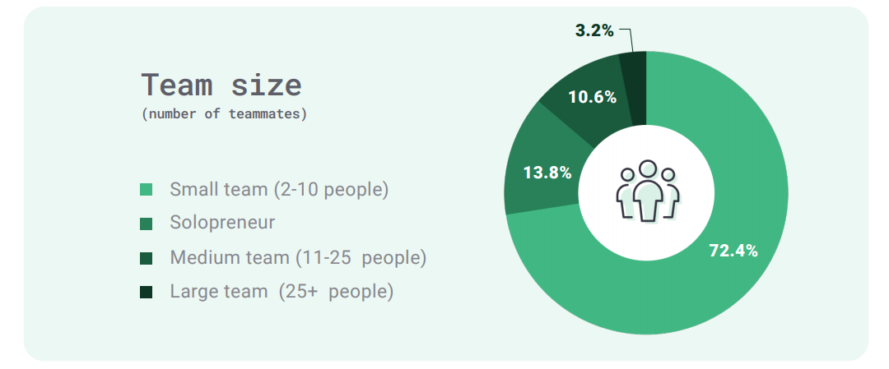

## IT职业发展篇

[TOC]

Monterail [发布](https://www.oschina.net/action/GoToLink?url=https%3A%2F%2Fwww.monterail.com%2Fstate-of-vue-2021-report)了第三版 Vue.js 报告，并声称是迄今为止关于 Vue.js 最全面的报告。这份报告包含了统计数据、专家访谈、调查以及新发布的和 Vue.js 3 有关的信息。

- Vue.js 3 新功能
- GitLab、Wikimedia 或 Storyblok 等公司如何使用 Vue.js
- 开发者在实践中如何使用 Vue.js
- 精通 Vue.js 的人对于这个框架最看重什么，希望下一步能改变什么
- 与其他技术相比，Vue.js 的人气趋势如何，在技术方面是否有自己的定位

> Monterail 是 Vue.js 的官方合作伙伴，也是一家软件开发机构，开发了 30 多个基于 Vue.js 的项目。他们是第一批 VueConf 组织者，Vue 布道者，简而言之就是 Vue 的忠实爱好者。

下面看看报告中值得关注的内容。

### 数据

先介绍由 Statista 统计出来的数据，Statista 是全球领先的数据统计互联网公司，帮助用户研究定量数据、统计资料和相关信息，提供创新和直观的工具。

2020年2月，Statista 询问了 42279 名开发者关于 Web 框架选择的问题，下图是最终的统计结果。Vue 排在第 7 位，17.3% 的受访者选择了它。

HackerRank 也在2020年做了和 Statista 一样的统计调查，并将结果与往年进行了比较。Vue 排在第 8 位，排名在稳步上升。

Stack Overflow 年度的用户调查结果显示，在被问及最喜爱和最不喜爱欢的框架时，Vue 的受欢迎程度呈上升趋势，AngularJS 则呈现了下降趋势。

不过另外一个组织——JetBrains 的调查报告则给出了相反的结果。2020年，JetBrains 根据来自18个国家的 19696 名开发者的回答发布了一份新报告。这是唯一一个显示 Vue 受欢迎程度出现下降的消息源。对此，Monterail 认为原因可能是受访者的背景 (demo-graphic) 与此前有所出入。JetBrains 的报告还显示，自2017年以来，他们中的大多数受访者在 51-500人 的公司全职工作，而所在的团队规模为 2-7 人。由此可见，React 在比较大型的企业中使用得最多。

Google Trends 统计的数据对于衡量受欢迎程度来说，是值得信赖的来源之一。此处显示 Vue 和 React 的人气逐渐上升。

根据上面的数据，Monterail 认为 Vue 正在被越来越广泛地使用、得到更多开发者青睐。虽然背后没有大公司提供支持，但它拥有极高的社区参与度，此外再加上在中国的流行，相信未来会被更广泛使用。

### 关于开发者如何使用 Vue 的调查

Monterail 通过在线调查从 1635 名受访者拿到了结果，并对结果进行研究以获得对以下方面的分析：

- Vue.js 在受访者组织中的受欢迎程度
- 选择 Vue.js 作为技术栈的原因，以及伴随这个决定而产生的疑惑
- 开发 Vue.js 项目时选择的解决方案
- 在前端和后端开发中使用的其他库/框架和语言
- 对 Vue.js 未来的预测和期望

主要数据：

- 90% 的受访者称他们在下一个项目继续使用 Vue.js 的可能性非常大
- 93% 的受访者使用官方文档来了解 Vue，76% 的受访者指出此框架最大的优势是拥有优秀的文档
- 60% 的人决定将 Vue.js 加入到他们的技术栈，因为这是一个非常容易上手的框架
- 56% 的受访者认为 Vue.js 将在未来12个月内在他们的组织中变得更加流行

### 使用者数据统计

这部分 Monterail 主要是调查熟悉 Vue 的开发者，共收到来自 114 个国家的 1635 名开发者的反馈。

估计是统计样本的问题，没看到中国出现在上面。

其余的统计数据显示，使用 Vue.js 的多为小型公司/组织（＜100 人）中的小规模团队（2-10 人），受访者角色大多数也是软件开发者。

### 与其他框架的对比

大型互联网公司选择的框架

### 性能对比

以下测试结果来自一致的测试环境。

### 使用场景

上图显示，Vue.js 大多数被用于需要快速解决问题的场景；React 通常被用于解决复杂的问题或创建 SPA；Angular 被用于构建高度可扩展的应用。

